# Getting Started Guide for UKCloud for Microsoft Azure

## Overview

UKCloud for Microsoft Azure provides you with new options to harness Microsoft Azure alongside other cloud platforms, including Oracle, VMware and OpenStack. This gives you the flexibility to accommodate diverse workloads within a low latency, accredited platform with native connectivity to non-cloud workloads in Crown Hosting and the networks that are vital to the public sector: from PSN Protected to HSCN and RLI.

This Getting Started Guide provides you with the information you need to get up and running with UKCloud for Microsoft Azure.

### Intended audience

To complete the steps in this guide you must have access to the UKCloud Azure Stack Hub portal.

## Introduction to UKCloud for Microsoft Azure

At UKCloud, we understand that there is no "one cloud fits all" solution. There are usually many factors to consider when looking to move your applications to the cloud, including existing technology investment and skills. Additionally, while some applications can easily move to the public cloud, there are others that for various reasons (latency, connectivity, security, regulation) must run on-premises.

Microsoft Azure Stack Hub is an extension of Azure that provides on-premises Infrastructure-as-a-Service (IaaS) and Platform-as-a-Service (PaaS), enabling you to leverage the benefits of cloud in an on-premises environment. UKCloud for Microsoft Azure brings the advantages of the Microsoft Cloud platform to our assured UK-sovereign platform, helping you realise the benefits that a true hybrid cloud environment has to offer, while balancing the right amount of flexibility and control.

With UKCloud for Microsoft Azure you can:

- Leverage existing Azure investment, knowledge and skills

- Use Azure Stack Hub alongside other technologies, for example, VMware, OpenStack or Oracle

- Connect to government community networks, including PSN, HSCN, Janet and RLI

- Meet specific compliance directives, such as data sovereignty or security

The two main delivery models provided by UKCloud for Microsoft Azure are:

- A multi-tenant IaaS and PaaS platform available in both UKCloud security domains (Assured OFFICIAL and Elevated OFFICIAL), connected to government community networks with UKCloud's award-winning support

- Private cloud deployment of UKCloud for Microsoft Azure dedicated to a single customer

### What is Azure Active Directory and why is it required for UKCloud for Microsoft Azure?

Azure Active Directory is Microsoft's cloud-based Directory and Identity Access Management Service. It provides Single Sign-On and core directory services via a high availability service with automated failover. <abbr title="Azure Active Directory"> AAD</abbr> provides the identity store for UKCloud for Microsoft Azure, supporting features such as two-factor authentication and role based access control.

> [!Note]
> If you do not have an existing Azure Active Directory, provide a preferred domain name and administrator email address, and UKCloud will create an Azure Active Directory Domain (subject to availability), free of charge.

## How can I get started with UKCloud for Microsoft Azure?

> [!Important]
> By providing the information below, you agree to enter into a direct Microsoft Cloud Solution Provider Customer Agreement (for more information see [here](https://docs.microsoft.com/en-us/partner-center/agreements) (Europe/United Kingdom)). If you accept the terms of the agreement, when you provide the information below we are obliged to report your name, email address and date of acceptance to Microsoft.

# [I have an existing Azure Active Directory Domain](#tab/tabid-1)

If you've decided that UKCloud for Microsoft Azure is the right environment for you, contact your CSM with the following information:

- Contact email address, for example, onboardingukcloud3@ukcloud.com

- Azure Active Directory Domain, for example, onboardingukcloud3csp.onmicrosoft.com

- AAD administrator email address, for example, admin@onboardingukcloud3csp.onmicrosoft.com

Once you've provided this information, UKCloud will set up your new UKCloud for Microsoft Azure environment.

After submitting your details, you will receive an email asking for permission for UKCloud to be your Microsoft Cloud Solution Provider (see example below).

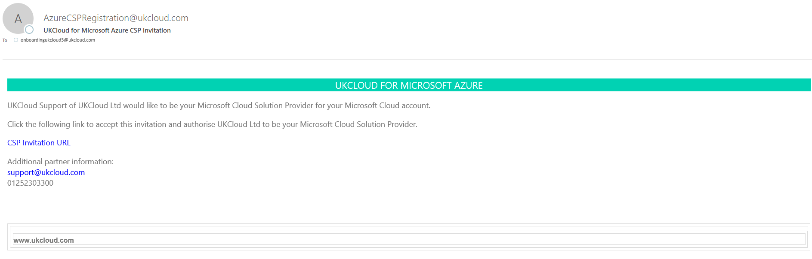

Once you have received this, click the **CSP Invitation URL** link and enter your details to sign in.

Accept the **Microsoft Store for Business and your data** agreement.

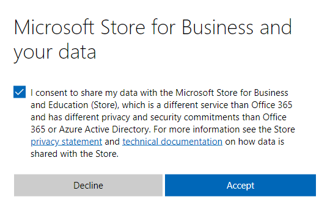

After accepting the agreement you will be greeted with the following page. Tick the checkbox and click **Accept**, then contact your CSM so UKCloud can complete your onboarding process.

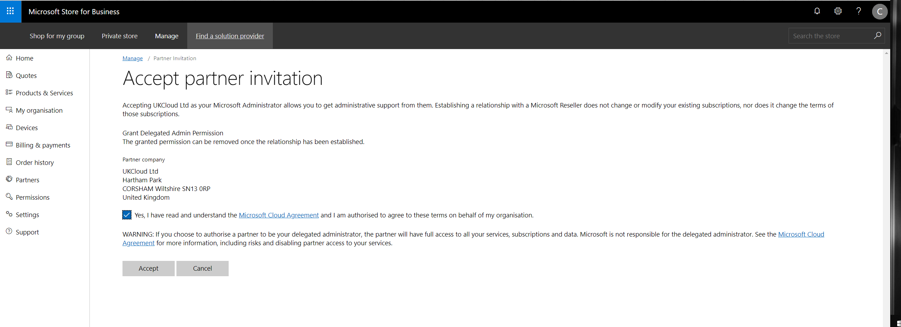

Next, you should receive a welcome email from your CSM containing the details of your new UKCloud for Microsoft Azure environment.

> [!IMPORTANT]
> If you have conditional access policies enabled for your Azure Active Directory, follow the instructions from the invitation email to allow us access to your AAD.
>
> You can find more information about conditional access policies [here](https://docs.microsoft.com/en-us/azure/active-directory/conditional-access/location-condition#trusted-ips).

# [I do not have an existing Azure Active Directory](#tab/tabid-2)

If you've decided that UKCloud for Microsoft Azure is the right environment for you, contact your CSM with the following information:

- Contact name, for example, John Doe

- Contact email address, for example, onboardingukcloud3@ukcloud.com

- Contact phone number, 01252 303300

- Billing address, for example, Hartham Park, Corsham, Wiltshire, SN13 0RP

- Preferred Azure Active Directory Domain, for example, onboardingukcloud3csp.onmicrosoft.com

Once you've provided this information, UKCloud will set up your new UKCloud for Microsoft Azure environment.

After providing the above details, you should receive a welcome email shortly from your CSM containing the details of your new UKCloud for Microsoft Azure environment.

***

## Logging in to the UKCloud Azure Stack Hub portal

To manage UKCloud for Microsoft Azure, you need to log in to the Azure Stack Hub portal. The portal provides access to all your Azure resources.

To log in to the Azure Stack Hub portal:

1. In your browser, go to the [Azure Stack Hub portal](https://portal.frn00006.azure.ukcloud.com).

2. In the login dialog box, enter the email address for your account and click **Next**, or pick your account.

3. Enter your password and click **Sign in**.

4. After you log in, you'll see the main Azure Stack Hub portal home page.

    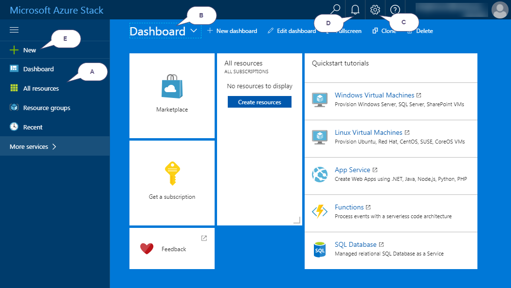

    On this page, you'll see:

    A.  **Favourites** - quickly access your most used resources (see [Customising your favourites](#customising-your-favourites))

    B.  **Dashboard** - access information about your Azure resources (see [Customising and adding dashboards](#customising-and-adding-dashboards))

    C.  **Settings** - change your portal settings, for example, theme and language

    D.  **Notifications** - view useful alerts about your Azure environment

    E.  **New** - create new resources, such as virtual machines (see [*How to create a virtual machine from the Azure Marketplace*](azs-how-create-vm-portal.md))

## Understanding subscriptions, offers and plans

Your UKCloud for Microsoft Azure environment is provisioned with a subscription that determines the services you have access to, and your quotas for those services.

- A **subscription** is a mechanism for signing up to an *offer*.

- An **offer** is a collection of one or more *plans*.

- A **plan** is a collection of one or more *services*, with associated *quotas*.

## Customising your favourites

In the Azure Stack Hub portal, down the left-hand side, you can see a list of your favourite resources. You can customise this list to include the resources that you access most frequently.

1. In the favourites list, click the **More services** link.

    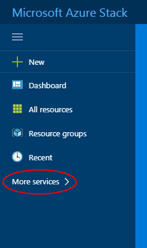

2. In the list of resources available to your subscription, resources that are included in your favourites list are indicated by a yellow star icon.

    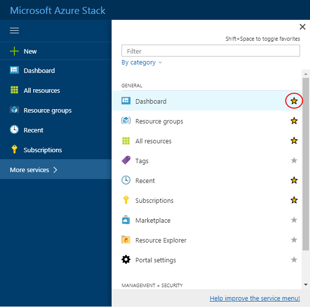

    > [!TIP]
    > You can use the **Filter** field to filter the list of resources. You can order the list **By category** or **By name**.

3. Click the grey star icon next to the resource that you want to add to your list of favourites.

    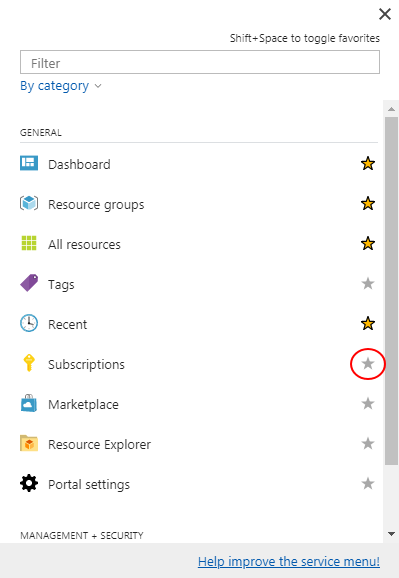

    > [!TIP]
    > To remove a resource from your favourites list, click the yellow star icon next to the service.

4. When you're done close the list of resources.

    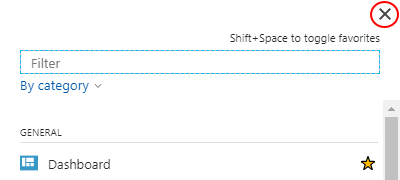

5. You can now see the newly added resource in your favourites list.

    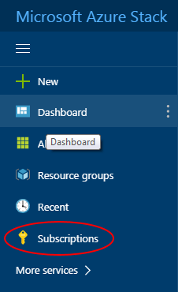

6. You can reorder the resources in your favourites list by dragging and dropping them.

    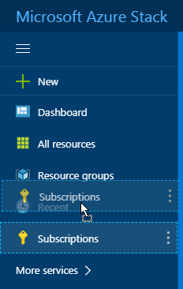

## Customising and adding dashboards

An Azure Stack Hub dashboard consists of tiles that provide access to the resources available to your subscription. You can create multiple dashboards to provide different views of your resources.

To customise a dashboard:

1. In the Azure Stack Hub portal, select the dashboard that you want to customise.

    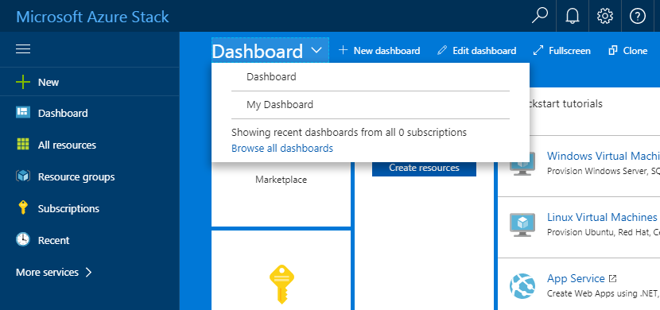

2. Click the **Edit dashboard** option.

    

3. Drag the tiles you want to add to the dashboard from the *Tile Gallery* onto the dashboard.

    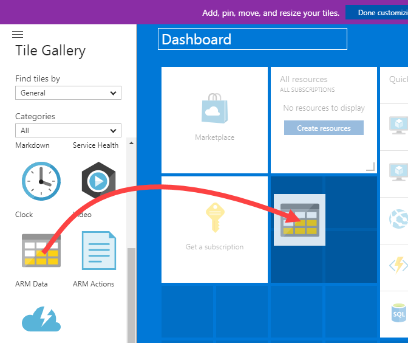

4. To change the layout of a tile on the dashboard, hover your mouse over the tile, click the **Context menu** icon and select the new layout.

    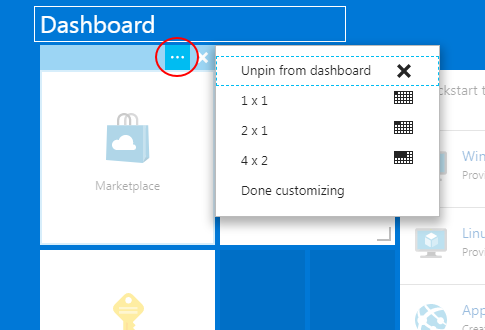

5. Drag tiles to rearrange them on the dashboard.

6. To delete a tile from the dashboard, hover your mouse over the tile and click the **Unpin** icon.

    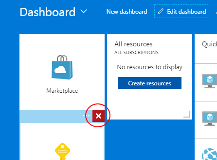

7. When you're done, click **Done customizing**.

    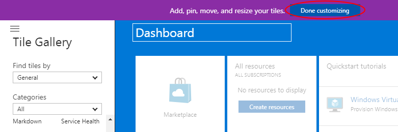

8. To create a new dashboard, click the **New dashboard** option.

    

9. Enter a name for the dashboard.

    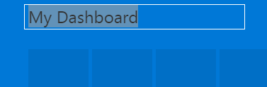

10. Add and arrange tiles as described above and when you're done, click **Done customizing**.

## Granting users access to UKCloud for Microsoft Azure

To work with UKCloud for Microsoft Azure, users must have the appropriate Azure Stack Hub permissions. We provide the following three groups to get you started:

- **AzureStackOperators** - Members of this group have Owner permissions and have full access to all resources and can manage access to resources

- **AzureStackUsers** - Members of this group have Contributor permissions and can create and manage all resources but cannot manage access to resources

- **AzureStackReadOnly** - Members of this group have Reader permissions and can view everything but cannot be any changes

To grant a user access to UKCloud for Microsoft Azure:

1. Log in to the Azure portal as a global administrator:

    <https://portal.azure.com>

2. Navigate to the **Azure Active Directory**.

    > [!TIP]
    > You can find the Azure Active Directory by selecting **All services** and scrolling down to the *Security + Identity* section.

3. Select **Groups** and then **All groups**.

4. In the **Name** field, enter `azurestack`.

5. Select the group to which you want to add the user depending on the level of permissions you want the user to have.

6. Select **Members** then click **Add members**.

7. Select the user that you want to add to the group and click **Select**.

## Configuring the Azure CLI

Microsoft provide a cross platform Azure command line interface (CLI) tool which runs on macOS, Linux and Windows that you can use to manage your Azure resources. For example, you can use the Azure CLI to create virtual machines and deploy Azure Resource Manager templates.

For more information, including steps for setting up the Azure CLI with UKCloud for Microsoft Azure, see:

- [Configure AzureCLI Environment](azs-how-configure-cli.md)

## Configuring the Azure Stack Hub PowerShell client

You can use PowerShell to manage your Azure resources. For example, you can create virtual machines and deploy Azure Resource Manager templates.

For more information, including steps and scripts for setting up Azure PowerShell with UKCloud for Microsoft Azure, see:

- [Configure PowerShell Environment](azs-how-configure-powershell-users.md)

## Next steps

In this Getting Started Guide, you've learned the basics about UKCloud for Microsoft Azure and the UKCloud Azure Stack Hub portal. For more information about UKCloud for Microsoft Azure, see the following articles in the Knowledge Centre:

- [*Understanding UKCloud for Microsoft Azure*](azs-ref-overview.md)

- [*UKCloud for Microsoft Azure FAQs*](azs-faq.md)

- [*How to create a virtual machine from the Azure Marketplace*](azs-how-create-vm-portal.md)

- [*How to create an Azure user group*](azs-how-manage-azure-group.md)

- [*How to use the Azure Stack Hub API*](azs-how-use-azure-api.md)

## Related videos

- [*Microsoft Azure Stack Hub Portal overview video*](azs-vid-overview.md)

## Related repositories

- [*UKCloud Azure Stack Hub Repository*](https://github.com/UKCloud/AzureStack)

## Glossary

This section provides a glossary of terms specific to UKCloud for Microsoft Azure.

**Azure Active Directory**&nbsp;&nbsp;The service that provides identify management within UKCloud for Microsoft Azure.

**Cloud operator**&nbsp;&nbsp;An entity that provides services, via subscriptions, on Azure Stack Hub. UKCloud is a cloud operator.

**Microsoft Azure**&nbsp;&nbsp;Microsoft's public cloud service.

**Microsoft Azure Stack Hub**&nbsp;&nbsp;An extension of Azure that provides cloud computing to an on-premises environment.

**Resource**&nbsp;&nbsp;An object within Azure Stack Hub, such as a virtual machine, network or storage.

**Resource group**&nbsp;&nbsp;A collection of resources, services and applications.

**Subscription**&nbsp;&nbsp;A mechanism for organising resources and services for tenants to consume.

**UKCloud for Microsoft Azure**&nbsp;&nbsp;A UKCloud IaaS and PaaS service that works as an extension of Microsoft's own Azure public cloud, delivered from our assured sovereign data centres.

**Tenant**&nbsp;&nbsp;An entity that consumes services from cloud operators in Azure Stack Hub.

## Feedback

If you find a problem with this article, click **Improve this Doc** to make the change yourself or raise an [issue](https://github.com/UKCloud/documentation/issues) in GitHub. If you have an idea for how we could improve any of our services, send an email to <feedback@ukcloud.com>.
