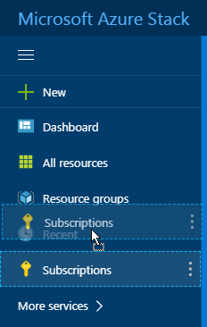
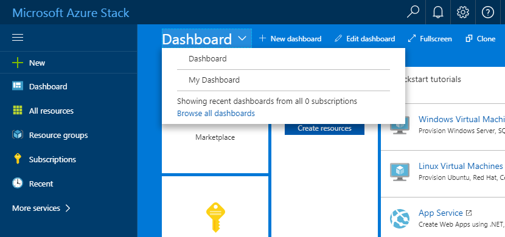
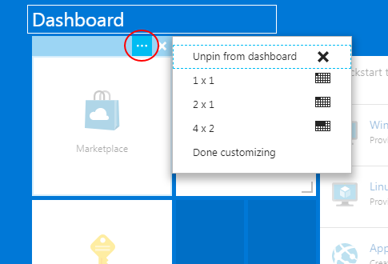

# Getting started guide for Sovereign Azure BETA

## Introduction

UKCloud's Sovereign Azure service provides you with new options to harness Microsoft Azure alongside other cloud platform, including Oracle, VMware and OpenStack. This gives you the flexibility to accommodate diverse workloads within a low-latency, accredited platform with native connectivity to non-cloud workloads in Crown Hosting and the networks that are vital to the Public Sector: from PSN Protected to HSCN and RLI.

This getting started guide provides you with the information you need to get up and running with your Sovereign Azure service.

### Intended audience

To complete the steps in this guide, you must have access to UKCloud's Azure Stack portal.

## Sovereign Azure overview

At UKCloud, we understand that there is no "one size fits all" solution. There are usually many factors to consider when looking to move your applications to the cloud, including existing technology investment and skills. Additionallredffrfjdfjdy, while some applications can easily move to the public cloud, there are others that for various reasons (latency, connectivity, security, regulation) must run on-premises.

Microsoft Azure Stack is an extension of Azure that provides on-premises Infrastructure-as-a-Service (IaaS) and Platform-as-a-Service (PaaS), enabling you to leverage the benefits of cloud in an on-premises environment. The Sovereign Azure service brings the advantages of the Microsoft Cloud platform to our assured UK-sovereign platform, helping you realise the benefits that a true hybrid cloud environment has to offer, while balancing the right amount of flexibility and control.

With Sovereign Azure, you can:

- Leverage existing Azure investment, knowledge and skills
- Use Azure Stack alongside other technologies, for example, VMware, OpenStack or Oracle
- Connect to government community networks, including PSN, HSCN, Janet and RLI
- Meet specific compliance directives, such as data sovereignty or security

The two main delivery models provided by our Sovereign Azure service are:

- A multi-tenant IaaS and PaaS platform available in both UKCloud security domains (Assured OFFICIAL and Elevated OFFICIAL), connected to government community networks with UKCloud's award-winning support
- Private cloud deployment of Sovereign Azure dedicated to a single customer

## Before you begin

You should have received your Sovereign Azure login credentials from your Sovereign Azure administrator. If you're the administrator, your Customer Success Manager (CSM) will have provided you with your credentials.

## Logging in to the Microsoft Azure Stack portal

To manage your Sovereign Azure service, you need to log in to UKCloud's Azure Stack portal. The portal provides access to all your Sovereign Azure resources.

**To log in to the Azure Stack portal:**

1. In your browser, go to the following URL:
 
   http://portal.frn00006.azure.ukcloud.com/

2. In the login dialog box, enter the email address for your Sovereign Azure account and click **Next**, or pick your account.
3. Enter your password and click **Sign in**.
4. After you log in, you'll see the main Azure Stack portal home page.

    

On this page you'll see:

**A**&mdash;**Favourites panel** Quickly access your most used resources (see link)

**B**&mdash;**Dashboard** Access information about your Sovereign Azure resources (see link)

**C**&mdash;**Settings** Change your portal settings, such as theme and language

**D**&mdash;**Notifications** View useful alerts about your Sovereign Azure environment

**E**&mdash;**New** Create new resources
 
## Understanding subscriptions, offers and plans

Your Sovereign Azure environment is provisioned with a subscription that determines the services you have access to, and your quotas for those services.

- A **subscription** is a mechanism for signing up to an *offer*
- An **offer** is a collection of one or more *plans*
- A **plan** is a collection of one or more *services*, with associated *quotas*

## Customising your favourites

In the Azure Stack portal, down the left-hand side, you can see a list of your favourite resources. You can customise this list to include the resources that you access most frequently.

1. In the favourites panel of the Azure Stack portal, click the **More services** link.

    

2. In the list of resources available to your subscription, resources that are included in your favourites panel are indicated by a yellow star icon.

    

> **Tip!** You can use the **Filter** field to filter the list of resources. You can order the list **By category** or **By name**.

3. Click the grey star icon next to the resource that you want to add to your list of favourites.

    

> **Tip!** To remove a resource from the favourites panel, click the yellow star next to the service.

4. When you're done, close the list of resources.

    

5. You can now see the newly added resource in your favourites panel.

    

6. You can reorder the resources in your favourites panel by dragging and dropping them.

    

## Customising and adding dashboards

An Azure Stack dashboard consists of tiles that provide access to the resources available to your subscription. You can create multiple dashboards to provide different views of your resources.

**To customise a dashboard:**

1. In the Azure Stack portal, select the dashboard that you want to customise.

    

2. Click the **Edit dashboard** option.

    

3. Drag the tiles you want to add to the dashboard from the *Tile Gallery* onto the dashboard.

    

4. To change the layout of a tile on the dashboard, hover your mouse over the tile, click the **Context menu** icon and select the new layout.

    

5. Drag tiles to rearrange them on the dashboard.
6. To delete a tile from the dashboard, hover your mouse over the tile and click the **Unpin** icon.

    

7. When you're done, click **Done customizing**.

    

8. To create a new dashboard, click the **New dashboard** option.

    

9. Enter a name for the dashboard.

    

10. Add and arrange tiles as described above and, when you're done, click **Done customizing**.

## Configuring the Azure CLI

Azure provides a command line interface (CLI) that you can use to manage your Sovereign Azure resources. For example, you can use the Azure CLI to create virtual machines and deploy Azure Resource Manager templates.

For more information, including steps for setting up the Azure CLI with Sovereign Azure and a list of known issues, see:

https://github.com/UKCloud/AzureStack/tree/master/AzureCLI/Tenants

## Configuring the Azure Stack PowerShell client

You can use PowerShell to manage your Sovereign Azure resources. For example, you can create virtual machines and deploy Azure Resource Manager templates.

For more information, including steps and scripts for setting up Azure PowerShell with Sovereign Azure and a list of known issues, see:

https://github.com/UKCloud/AzureStack/tree/master/PowerShell/Tenants

## Next steps

Congratulations! In this getting started guide, you've learned the basics about Sovereign Azure and the Azure Stack portal. For more information about Sovereign Azure, see the following articles in the UKCloud Knowledge Centre:

- [Sovereign Azure BETA](https://portal.ukcloud.com/support/knowledge_centre/0d8e3486-3190-458e-8166-98697c2a7161)
- [Sovereign Azure BETA FAQs](https://portal.ukcloud.com/support/knowledge_centre/de19b410-f844-419b-afd0-bb3dbab0a217)
- [How to grant users access to Sovereign Azure](https://portal.ukcloud.com/support/knowledge_centre/18899044-5dcd-41fa-ba64-d467d1b43605)
- [How to use the Azure Stack API](https://portal.ukcloud.com/support/knowledge_centre/65699e21-ac82-4bca-b777-229035cbe28b)

## Glossary

This section provides a glossary of terms specific to Sovereign Azure.

**Azure Active Directory** The service that provides identity management within Sovereign Azure.

**cloud operator** An entity that provides services, via subscriptions, on Azure Stack. UKCloud is a cloud operator.

**Microsoft Azure** Microsoft's public cloud service.

**Microsoft Azure Stack** An extension of Azure that provides cloud computing to an on-premises environment.

**resource** An object within Azure Stack, such as a virtual machine, network or storage.

**resource group** A collection of resources, services and applications.

**subscription** A mechanism for organising resources and services for tenants to consume.

**Sovereign Azure** A UKCloud IaaS and PaaS service that works as an extension of Microsoft's own Azure Public Cloud, delivered from our assured sovereign data centres.

**tenant** An entity that consumes services from cloud operators in Sovereign Azure.

## Feedback

If you have any comments on this document, or any other aspect of your UKCloud experience, send them to feedback@ukcloud.com.

(c) UKCloud Ltd, 2018. All Rights Reserved.