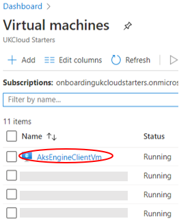
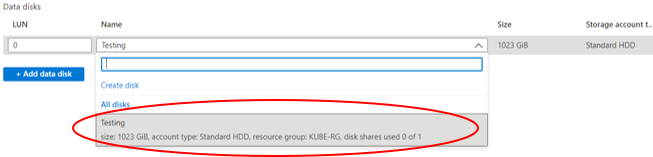
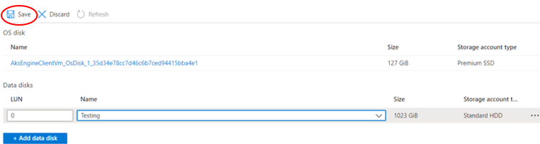
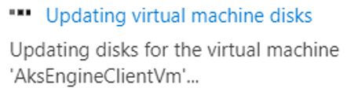
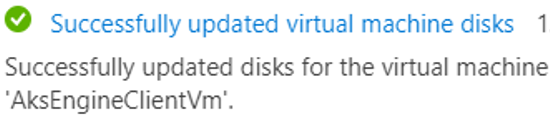
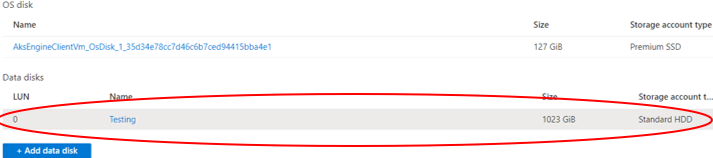

# How to add a managed disk to a virtual machine using UKCloud Azure Stack portal

## Overview

UKCloud for Azure Stack supports the use of managed disks on virtual machines. Managed disks can be used as both OS disks and a data disk.
For more information, see [Introduction to Azure managed disks](https://docs.microsoft.com/en-us/azure/virtual-machines/windows/managed-disks-overview).

The following process shows you how to add a managed disk to a virtual machine using the UKCloud for Azure Stack Portal.

## Intended audience

To complete the steps in this guide, you must have appropriate access to a subscription in the Azure Stack portal.

## Adding a disks to an existing virtual machine in azure stack

1. Log in to the Azure Stack portal.

    For more detailed instructions, see the [*Getting Started Guide for UKCloud for Microsoft Azure*](azs-gs.md).

2. In the *favourites* panel, select **Virtual machines**.

    

3. In the *virtual machines* blade select the virtual machine you would like to add the disk to and then select **Disks** in the *settings* section.

    

4. In the *Disks* blade select **+Add data disk**.

    

# [Pre-existing disk](#tab/tabid-a)

1. Enter the LUN (Logical unit number).

    

2. Select the disk that you desire to add to the virtual machine.

    

3. Select **Save**.

    

4. You can monitor the progress of your deployment by clicking the **Notifications** icon.

    

5. When the deployment is finished, the notification will change to *Successfully updated virtual machine disks*.

    

6. You can view the disk by navigating to the Virtual machine that the disk was added to and then then selecting **Disks** from the *settings* section.

    

# [New disk](#tab/tabid-b)

1. Enter the Logical unit number (LUN).

    

2. In the name field select **Create disk** and enter the following information:

    - Name - The name of the disk.

    - Resource group - Select an existing resource group, or create a new one by typing a name for your new resource group.

    - Location - This will be frn00006, which is the location of the Azure Stack.

    - Account type - Standard disks (HDD) are backed by magnetic drives and are preferable for applications where data is accessed infrequently.

        > [!Note]
        > Currently only standard (HDD) disks are available in UKCloud for Azure Stack.

    - Source type - Create a disk from a snapshot of another disk, a blob in a storage account, or create an empty disk.

    - Size - The size of the disk in GB.

3. You can monitor the progress of your deployment by clicking the **Notifications** icon.

    

4. When the deployment is finished, the notification will change to *Successfully updated virtual machine disks*.

    

5. You can view the disk by navigating to the virtual machine that the disk was added to and then selecting **Disks** from the *settings* section.

    

***

## Feedback

If you find an issue with this article, click **Improve this Doc** to suggest a change. If you have an idea for how we could improve any of our services, visit [UKCloud Ideas](https://ideas.ukcloud.com). Alternatively, you can contact us at <products@ukcloud.com>.