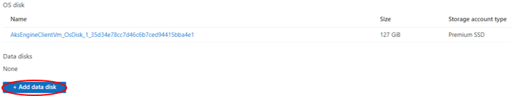
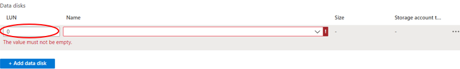
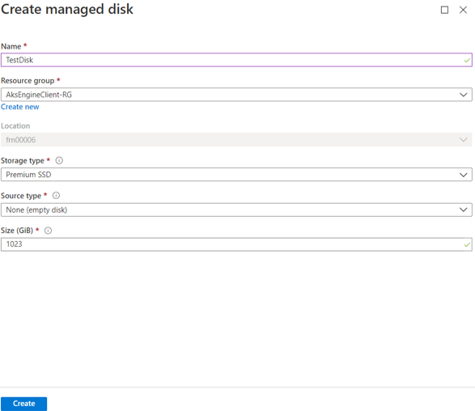

# How to add a managed disk to a virtual machine using the UKCloud Azure Stack portal

## Overview

UKCloud for Microsoft Azure supports the use of managed disks on virtual machines (VMs). You can use managed disks as both OS disks and data disks.

For more information, see [Introduction to Azure managed disks](https://docs.microsoft.com/en-us/azure/virtual-machines/windows/managed-disks-overview).

The following article shows you how to add a managed disk to a VM using the UKCloud Azure Stack portal.

## Intended audience

To complete the steps in this article, you must have appropriate access to a subscription in the Azure Stack portal.

## Adding a disk to an existing virtual machine using the Azure Stack portal

1. Log in to the Azure Stack portal.

    For more detailed instructions, see the [*Getting Started Guide for UKCloud for Microsoft Azure*](azs-gs.md).

2. In the *favourites* panel, select **Virtual machines**.

    

3. In the *Virtual machines* blade, select the VM that you want to add the disk to.

    

4. Under *Settings*, select **Disks**.

    

5. In the *Disks* blade, select **+Add data disk**.

    

# [Pre-existing disk:](#tab/tabid-a)

If you're adding a pre-existing disk:

1. Enter the LUN (logical unit number).

    

2. Select the disk that you want to add to the virtual machine.

    

3. Click **Save**.

    

4. You can monitor the progress of your deployment by clicking the **Notifications** icon.

    

5. When the deployment is finished, the notification will change to *Successfully updated virtual machine disks*.

    

6. You can view the disk by navigating to the VM that the disk was added to, then select **Disks**.

    

# [New disk:](#tab/tabid-b)

If you're adding a new disk:

1. Enter the LUN (logical unit number).

    

2. In the **Name** field select **Create disk** and enter the following information:

    - **Name** - The name of the disk.

    - **Resource group** - Select an existing resource group, or create a new one by typing a name for your new resource group.

    - **Location** - This will be frn00006, which is the location of the Azure Stack.

    - **Account type** - Standard disks (HDD) are backed by magnetic drives and are preferable for applications where data is accessed infrequently.

        > [!Note]
        > Currently, only standard disks (HDD) are available in UKCloud for Microsoft Azure.

    - **Source type** - Create a disk from a snapshot of another disk, a blob in a storage account, or create an empty disk.

    - **Size** - The size of the disk in GiB.

    

3. You can monitor the progress of your deployment by clicking the **Notifications** icon.

    

4. When the deployment is finished, the notification will change to *Successfully updated virtual machine disks*.

    

5. You can view the disk by navigating to the VM that the disk was added to, then select **Disks**.

    

***

## Feedback

If you find an issue with this article, click **Improve this Doc** to suggest a change. If you have an idea for how we could improve any of our services, visit [UKCloud Ideas](https://ideas.ukcloud.com). Alternatively, you can contact us at <products@ukcloud.com>.
