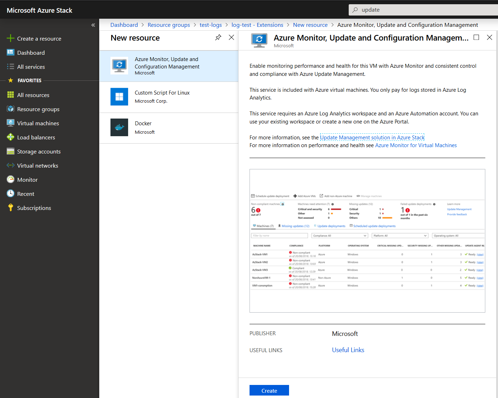

# How to configure VM update and management on Azure Stack | UKCloud Ltd

## Overview

Azure Monitor is the platform service that provides a single source for monitoring Azure resources. With Azure Monitor, you can visualize, query, route, archive, and otherwise take action on the metrics and logs coming from resources in Azure.

This guide will enable the following solutions for Azure Stack VMs:

1. [Azure Monitor for VMs](https://docs.microsoft.com/en-us/azure/azure-monitor/insights/vminsights-overview)
2. [Inventory](https://docs.microsoft.com/en-us/azure/automation/automation-vm-inventory)
3. [Change Tracking](https://docs.microsoft.com/en-us/azure/automation/change-tracking)
4. [Update Management](https://docs.microsoft.com/en-us/azure/automation/automation-update-management)

## Prerequisites

To complete the steps in this guide, you must have appropriate access to a subscription in the **Azure** & **Azure Stack** portal.

## Enabling VM Update & Management

> [!WARNING]
> Before proceeding, check **[here](https://docs.microsoft.com/en-gb/azure/azure-monitor/insights/vminsights-enable-overview#supported-operating-systems)** that your VMs OS version is supported.

1. Login to the Azure portal:

    <https://portal.azure.com>

2. Create a *LogAnalytics Workspace* in your Azure subscription:

    - Click **All Services** and search `log analytics`.

        

    - Select **Log Analytics Workspaces**.

    - Click **Add** and in the *new* blade, select choices for the following items:

        - *Name* for the **Log Analytics workspace**. Example: `DefaultLAWorkspace`

        - *Subscription* to link to the workspace.

        - *Resource Group* to link to the workspace. Can be an existing resource group or choose to create a new one.

        - *Location* available to host the workspace on.

        > [!NOTE]
        > The currently supported locations include: *West Central US*, *East US*, *Canada Central*, *UK South*, *West Europe* and *Southeast Asia*.

        - *Pricing Tier* to use.

        Here is an example of the blade and all items filled out:

        

    - Press **OK** once finished. The **Log Analytics workspace** will now begin deployment. A notification will appear on the top right of the portal.

    - Once deployment is complete, navigate to the *resource group* you placed the **Log Analytics workspace** within.

    - Click the newly create workspace. On the *new* blade, under settings, select *Advanced settings*, then select *Windows* or *Linux* servers depending on the *VMType* you wish to add analytics too. 
    Note down the **Workspace ID** and **Primary Key** values.

        

    - Within *Advanced settings*, Select the **Data** blade, and click *`VMType` Performance Counters.*

    - Ensure all *counters* are selected and click **Add the selected performance counters**.

    - Click **Save**.

        

        > [!NOTE]
        > For Linux Performance Counters, ensure **Apply below configuration to my machines** is selected.

3. Create and configure an *Automation Account*:

    - Click *+ Create a resource*.

    - Search `automation` and click **Create**.

        

    - Choose a *Name*, *Subscription*, *Resource Group*, *Location* and ensure *Create Azure Run As Account* is set to **Yes**.

    - Click **Create**.

        

        > [!NOTE]
        > The error "Azure Classic Run As account creation error" may occur. This **DOES NOT** effect the process.

    - Once deployed, navigate to the *Automation Account*. In the *new* blade, Under *Configuration Management*, select the solution to enable (Inventory & Change Tracking or Update management).

    - Select the *Log Analytics workspace* to link the automation account too.

    - Click **Enable**.

    - Wait for the deployment to complete.

    - Repeat the two previous steps for all two solutions (Inventory & Change Tracking and Update management).

        > [!TIP]
        > Leave the public azure portal open; it is still needed for later.

4. Login to the Azure Stack portal:

    <https://portal.frn00006.azure.ukcloud.com>

5. Navigate to the VM which you wish to enable **Update & Management** on and under settings, select the *extensions* blade.

    > [!WARNING]
    > For any monitoring to work correctly. The VM **must** have HTTPS (Port 443) enabled in the **Network Security Group** rules.

6. Click **Add** at the top and select the resource `Azure Monitor, Update and Configuration Management`; click **Create**.

    

    - Provide the extension with the **Workspace ID** and **Primary Key** values (noted down previously).

    - Repeat this step for the `Azure Monitor Dependency Agent`.

7. Once the deployment is finished. Head back to the public Azure portal, navigate to the *Log Analytics workspace* -> *Advanced settings* -> *`VMType` Servers*.

    - You will see `x` number of `[VMType]` COMPUTERS CONNECTED. Depending on how many VMs you linked to the workspace.

        

    - Click on *`x vmtype` COMPUTERS CONNECTED*. This will bring up logs for the *Log Analytics workspace*.

    - Alter the time range to **Last 30 minutes**.

8. Execute the following log query passing in your `VMTYPE`:

    - `Heartbeat | where OSType == "VMTYPE" | summarize arg_max(TimeGenerated, *) by SourceComputerId | top 500000 by Computer asc | render table`

    - Example for Linux VM: 

        `Heartbeat | where OSType == "Linux" | summarize arg_max(TimeGenerated, *) by SourceComputerId | top 500000 by Computer asc | render table`

    - If your VM shows in the results, you have successfully linked your VM from Azure Stack to your *Log Analytics workspace*.

        - [See here for more information; if required.](https://docs.microsoft.com/en-us/azure/automation/automation-update-management#confirm-that-non-azure-machines-are-onboarded)

9. Navigate to the *Automation Account*. In the *new* blade, Under *Configuration Management*, select **Update Management**.

    - You will see the following prompt:

        

    - Select **Click to manage machines**.

    - Select **Enable on all available and future machines**.

        

    - Click **Enable**.

    - Repeat the above steps for **Inventory & Change Tracking**.

    - Everything is now enabled. The API is called every 15 minutes to query for the last update time to determine whether the status has changed. If the status has changed, a compliance scan is initiated.

        > [!NOTE]
        > It can take between 30 minutes and 6 hours for the dashboard to display updated data from managed VMs.

Within the *Automation Account*, the blades **Inventory**, **Change Tracking** and **Update Management** will provide useful analytics.

On public Azure, click **Monitor**, in the *new* blade, under *Insights*, click **Virtual Machines (preview)**. You will see a variety of usage analytics in the tabs **Health**, **Performance** and **Map** for the VMs you have enabled **VM Update & Management** on.

## Feedback

If you find an issue with this article, click **Improve this Doc** to suggest a change. If you have an idea for how we could improve any of our services, visit [UKCloud Ideas](https://ideas.ukcloud.com). Alternatively, you can contact us at <products@ukcloud.com>.