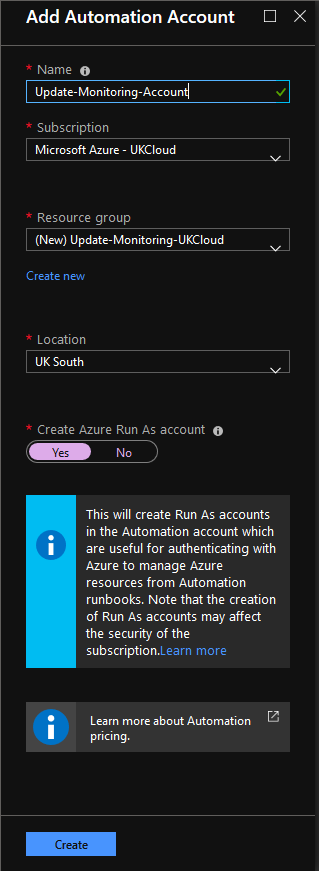
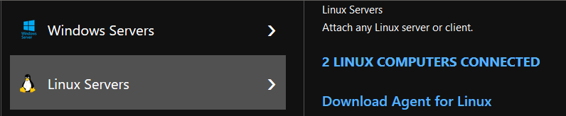
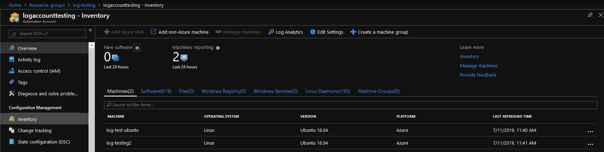
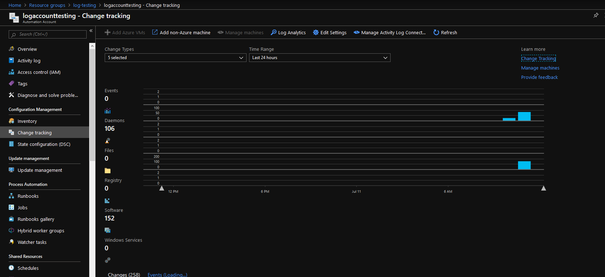
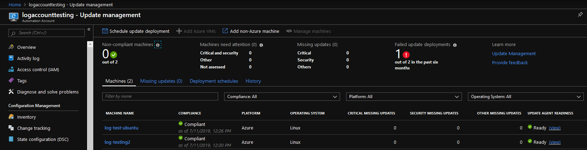

# How to configure VM updates and management on Azure Stack | UKCloud Ltd

## Overview

Azure Monitor is the platform service that provides a single source for monitoring Azure resources. With Azure Monitor, you can visualise, query, route, archive, and otherwise take action on the metrics and logs coming from resources in Azure.

This article will enable the following solutions for Azure Stack VMs:

- [Azure Monitor for VMs](https://docs.microsoft.com/en-us/azure/azure-monitor/insights/vminsights-overview)

- [Inventory](https://docs.microsoft.com/en-us/azure/automation/automation-vm-inventory)

- [Change Tracking](https://docs.microsoft.com/en-us/azure/automation/change-tracking)

- [Update Management](https://docs.microsoft.com/en-us/azure/automation/automation-update-management)

## Prerequisites

To complete the steps in this article, you must have appropriate access to a subscription in the Azure and Azure Stack portal.

## Enabling VM Update & Management

> [!WARNING]
> Before proceeding, check [here](https://docs.microsoft.com/en-gb/azure/azure-monitor/insights/vminsights-enable-overview#supported-operating-systems) that your VMs' OS version is supported.

1. Log in to the [public Azure portal](https://portal.azure.com).

2. Create a *Log Analytics workspace* in your Azure subscription:

    - Click **Create a resource**.

    - In the search bar, search for `log analytics`.

        

    - Click **Log Analytics**.

    - Click **Create**.

    - Provide the following:

        - A **Name** for the Log Analytics workspace. Example: `DefaultLAWorkspace`

        - A **Subscription** to link the workspace to.

        - A **Resource Group** to host the workspace in.

        - A **Location** to host the workspace in.

        > [!NOTE]
        > The currently supported locations are: *West Central US*, *East US*, *Canada Central*, *UK South*, *West Europe* and *Southeast Asia*.

        - A *Pricing Tier* to use.

        The following example shows the blade with all items filled out:

        

    - Click **OK** once finished. The **Log Analytics workspace** will now begin deploying. A notification will appear in the top right of the portal.

    - Once deployment is complete, navigate to the resource group you placed the **Log Analytics workspace** in.

    - Select the newly created workspace. On the new blade, under *Settings*, select *Advanced settings*, then select *Windows* or *Linux* servers depending on the *VM Type* you want to add analytics to.
    Note down the **Workspace ID** and **Primary Key** values.

       

    - Within *Advanced settings*, select the *Data* blade, and click **VM Type Performance Counters**.

    - Ensure all counters are selected and click **Add the selected performance counters**.

    - Click **Save**.

        

        > [!NOTE]
        > For Linux performance counters, ensure **Apply below configuration to my machines** is selected.

3. Create and configure an *Automation Account*:

    - Click *Create a resource*.

    - Search for `automation`.

    - Select **Automation** and click **Create**.

        

    - Choose a **Name**, **Subscription**, **Resource Group**, **Location** and ensure *Create Azure Run As Account* is set to **Yes**.

    - Click **Create**.

        

        > [!NOTE]
        > The error "Azure Classic Run As account creation error" may occur. This **DOES NOT** affect the process.

4. Once deployed, navigate to the *Automation Account*. In the new blade, under *Configuration Management*, select the solution to enable (Inventory & Change Tracking or Update Management).

    - Select the *Log Analytics workspace* to link the automation account to.

    - Click **Enable**.

    - Wait for the deployment to complete.

    - Repeat step 4 for both Inventory & Change Tracking and Update Management.

        > [!TIP]
        > Leave the public Azure portal open; you'll need to use it again later.

5. Log in to the [Azure Stack portal](https://portal.frn00006.azure.ukcloud.com).

6. Navigate to the VM that you want to enable **Update & Management** on and under *Settings*, select the *Extensions* blade.

    > [!WARNING]
    > For any monitoring to work correctly, the VM **must** have HTTPS (Port 443) enabled in its **Network Security Group** rules.

7. Click **Add** at the top, select the extension **Azure Monitor, Update and Configuration Management** and then click **Create**.

    

    - Provide the extension with the **Workspace ID** and **Primary Key** values (noted down previously).

    - Repeat step 7 for the **Azure Monitor Dependency Agent**.

8. Once the deployment is finished, head back to the public Azure portal and navigate to the *Log Analytics workspace* -> *Advanced settings* -> *`VM Type` Servers*.

    - You will see `x` number of `VM Type` COMPUTERS CONNECTED, depending on how many VMs you linked to the workspace.

        

    - Click *x VM Type COMPUTERS CONNECTED*. This will bring up the logs for that specific VM type.

    - Change the time range to **Last 30 minutes**.

9. Execute the following log query, passing in your `VM TYPE`:

    - `Heartbeat | where OSType == "VMTYPE" | summarize arg_max(TimeGenerated, *) by SourceComputerId | top 500000 by Computer asc | render table`

    - Example for Linux VM: 

        `Heartbeat | where OSType == "Linux" | summarize arg_max(TimeGenerated, *) by SourceComputerId | top 500000 by Computer asc | render table`

    - If your VM shows in the results, you have successfully linked your VM from Azure Stack to your *Log Analytics workspace* [(see here for more information)](https://docs.microsoft.com/en-us/azure/automation/automation-update-management#confirm-that-non-azure-machines-are-onboarded).

10. Navigate to the *Automation Account*. In the new blade, under *Update Management*, select **Update Management**.

    - You will see the following prompt:

        

    - Select **Click to manage machines**.

    - Select **Enable on all available and future machines**.

        

    - Click **Enable**.

    - Repeat step 10 for **Inventory & Change Tracking**.

    - Everything is now enabled. The API is called every 15 minutes to query for the last update time to determine whether the status has changed. If the status has changed, a compliance scan is initiated.

        > [!NOTE]
        > It can take between 30 minutes and 6 hours for the dashboard to display updated data from managed VMs.

11. Within the *Automation Account*, the blades **Inventory**, **Change Tracking** and **Update Management** will provide useful analytics.

    

    

    

12. On public Azure, click **Monitor**. In the new blade under *Insights*, click **Virtual Machines (preview)**. You will see three usage analytics tabs (**Health**, **Performance** and **Map**) for the VMs you have enabled **VM updates and management** on.

    

    > [!NOTE]
    > It can take between 30 minutes and 6 hours for the dashboard to display updated data from Azure monitor enabled VMs.

## Feedback

If you find an issue with this article, click **Improve this Doc** to suggest a change. If you have an idea for how we could improve any of our services, visit the [Ideas](https://community.ukcloud.com/ideas) section of the [UKCloud Community](https://community.ukcloud.com).
