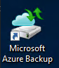
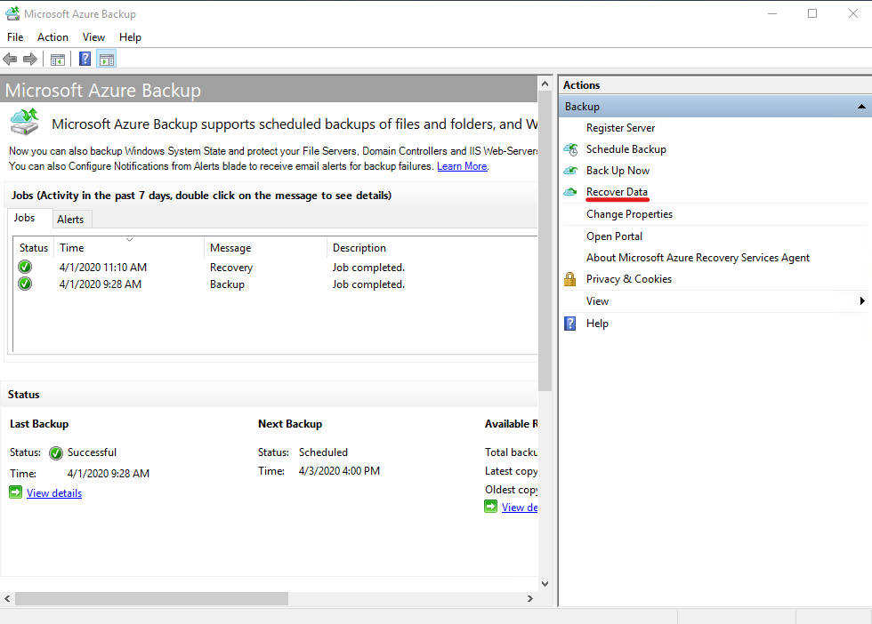
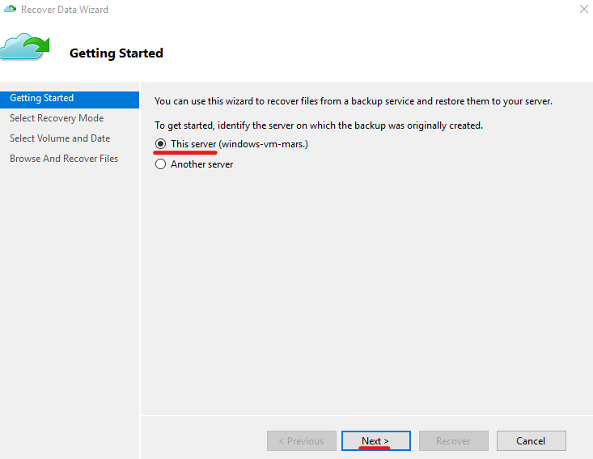
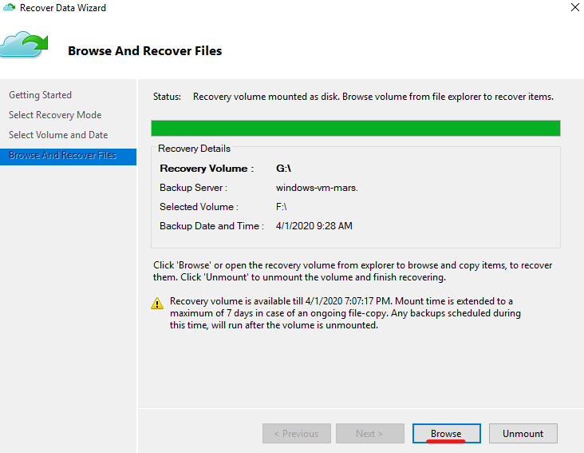
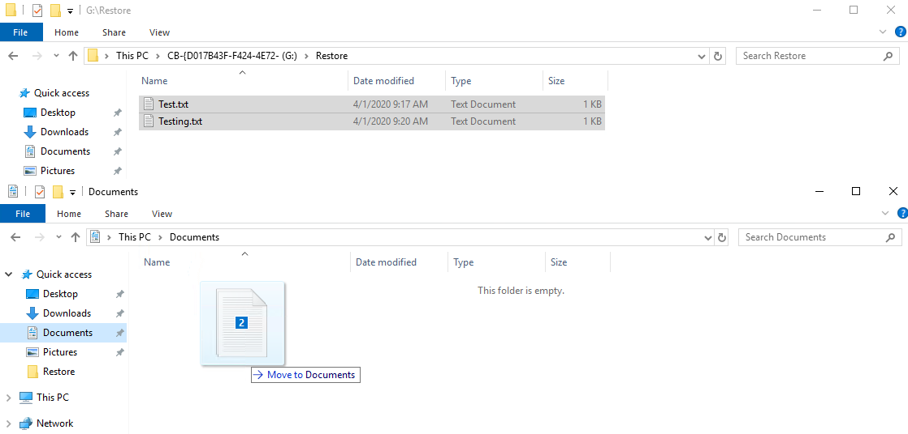
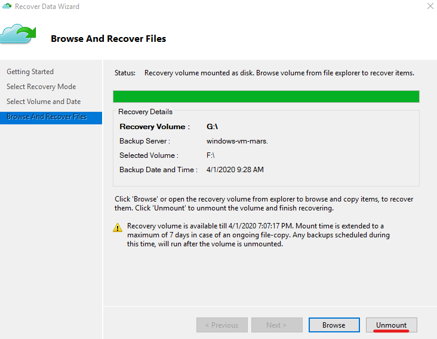
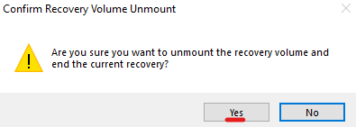

#### UKCloud Limited (“UKC”) and Virtual Infrastructure Group Limited (“VIG”) (together “the Companies”) – in Compulsory Liquidation

On 25 October 2022, the Companies were placed into Liquidation with the Official Receiver appointed as Liquidator and J Robinson and A M Hudson simultaneously appointed as Special Managers to manage the liquidation process on behalf of the Official Receiver.

Further information regarding the Liquidations can be found here: <https://www.gov.uk/government/news/virtual-infrastructure-group-limited-and-ukcloud-limited-information-for-creditors-and-interested-parties>

Contact details:<br>
For any general queries relating to the Liquidations please email <ukcloud@uk.ey.com><br>
For customer related queries please email <ukcloudcustomers@uk.ey.com><br>
For supplier related queries please email <ukcloudsuppliers@uk.ey.com>

# How to automatically backup and restore files and folders on Azure Stack Hub VMs using PowerShell

## Overview

Recovery Services vaults store all backups and recovery points you create over time, and contain the backup policy applied to backed up machines.

This article explains how to set up the Microsoft Azure Recovery Services (MARS) agent to backup and restore files and folders from Azure Stack Hub VMs to Recovery Services vaults.

> [!NOTE]
> By default a new Recovery Services vault will be created by the code below.
> If you do not wish to create one - you can use the ExistingVault switch in the [AzureBackupConfig script]((https://github.com/UKCloud/AzureStack/blob/master/Users/Extensions/Windows/AzureBackupConfig.ps1)).

## Microsoft documentation

[MARS agent support matrix](https://docs.microsoft.com/en-us/azure/backup/backup-support-matrix-mars-agent)

[Backup Windows machines using MARS](https://docs.microsoft.com/en-us/azure/backup/backup-configure-vault)

[MARS agent backup process](https://docs.microsoft.com/en-us/azure/backup/backup-architecture#architecture-direct-backup-of-on-premises-windows-server-machines-or-azure-vm-files-or-folders)

## Prerequisites

To complete the steps in this article, you must have appropriate access to a subscription in both the public Azure and Azure Stack Hub portals.

> [!IMPORTANT]
> The MARS agent is **only** supported on Windows VMs. Linux VMs are **not** supported.

# Backup

## Setup the MARS agent using PowerShell

You can find the script used in this article [here](https://github.com/UKCloud/AzureStack/blob/master/Users/Extensions/Windows/AzureBackupConfig.ps1). It provides docstrings on additional parameters that are not used in this article.

### Declare variables

Enter details below to provide values for the variables in the scripts in this article:

| Variable name   | Variable description                                               | Input            |
|-----------------|--------------------------------------------------------------------|------------------|
| \$ArmEndpoint    | The Azure Resource Manager endpoint for Azure Stack Hub                 | <form oninput="result.value=armendpoint.value" id="armendpoint" style="display: inline;"><input type="text" id="armendpoint" name="armendpoint" style="display: inline;" placeholder="https://management.frn00006.azure.ukcloud.com"/></form> |
| \$RGName        | Name of the resource group in Azure Stack Hub which the VM resides in                           | <form oninput="result.value=resourcegroup.value" id="resourcegroup" style="display: inline;"><input type="text" id="resourcegroup" name="resourcegroup" style="display: inline;" placeholder="MyResourceGroup"/></form> |
| \$VMName        | Name of the virtual machine in Azure Stack Hub                         | <form oninput="result.value=vmname.value" id="vmname" style="display: inline;"><input type="text" id="vmname" name="vmname" style="display: inline;" placeholder="MyVM"/></form> |
| \$CustomScriptFileName        | The name of the custom script file                         | <form oninput="result.value=customscriptfilename.value" id="customscriptfilename" style="display: inline;"><input type="text" id="customscriptfilename" name="customscriptfilename" style="display: inline;" placeholder="AzureBackupConfig.ps1"/></form> |
| \$FileUri        | URL to the custom script                          | <form oninput="result.value=fileuri.value;result2.value=fileuri.value" id="fileuri" style="display: inline;"><input type="text" id="fileuri" name="fileuri" style="display: inline;" placeholder="https://raw.githubusercontent.com/UKCloud/AzureStack/master/Users/Extensions/Windows/AzureBackupConfig.ps1"/></form> |
| \$ClientId    | The application ID of a service principal with contributor permissions in Azure                 | <form oninput="result.value=clientid.value;result2.value=clientid.value" id="clientid" style="display: inline;"><input type="text" id="clientid" name="clientid" style="display: inline;" placeholder="00000000-0000-0000-0000-000000000000"/></form> |
| \$ClientSecret    | The password of the service principal specified in the ClientId parameter                 | <form oninput="result.value=clientsecret.value;result2.value=clientsecret.value" id="clientsecret" style="display: inline;"><input type="text" id="clientsecret" name="clientsecret" style="display: inline;" placeholder="ftE2u]iVLs_J4+i-:q^Ltf4!&{!w3-%=3%4+}F2jk]="/></form> |
| \$TenantId    | The Tenant/Directory ID of your AAD domain                 | <form oninput="result.value=tenantid.value;result2.value=tenantid.value" id="tenantid" style="display: inline;"><input type="text" id="tenantid" name="tenantid" style="display: inline;" placeholder="contoso.onmicrosoft.com"/></form> |
| \$AzureResourceGroup    | The name of the resource group to be created in public Azure, where the Recovery Services vault will reside                 | <form oninput="result.value=azureresourcegroup.value;result2.value=azureresourcegroup.value" id="azureresourcegroup" style="display: inline;"><input type="text" id="azureresourcegroup" name="azureresourcegroup" style="display: inline;" placeholder="AzureStackBackupRG"/></form> |
| \$VaultName    | The name of the Recovery Services vault to be created in public Azure                 | <form oninput="result.value=vaultname.value;result2.value=vaultname.value" id="vaultname" style="display: inline;"><input type="text" id="vaultname" name="vaultname" style="display: inline;" placeholder="AzureStackVault"/></form> |
| \$EncryptionKey    | The encryption key to encrypt the backups with, must be at least 16 characters and no greater than 40 characters in length                 | <form oninput="result.value=encryptionkey.value;result2.value=encryptionkey.value" id="encryptionkey" style="display: inline;"><input type="text" id="encryptionkey" name="encryptionkey" style="display: inline;" placeholder="ExampleEncryptionKey"/></form> |
| \$AzureLocation    | The location in public Azure to deploy the Recovery Services vault                 | <form oninput="result.value=azurelocation.value;result2.value=azurelocation.value" id="azurelocation" style="display: inline;"><input type="text" id="azurelocation" name="azurelocation" style="display: inline;" placeholder="ukwest"/></form> |
| \$BackupDays    | A comma separated list of the days to backup on                 | <form oninput="result.value=Array.apply(null, backupdays.selectedOptions).map(function(option){return option.value;});result2.value=Array.apply(null, backupdays.selectedOptions).map(function(option){return option.value;});" id="backupdays" style="display: inline;"><select id="backupdays" name="backupdays" multiple><option value="Monday">Monday</option><option value="Tuesday">Tuesday</option><option value="Wednesday">Wednesday</option><option value="Thursday">Thursday</option><option value="Friday">Friday</option><option value="Saturday">Saturday</option><option value="Sunday">Sunday</option></select></form> |
| \$BackupTime1    | The first time to backup at on the specified backup days                 | <form oninput="result.value=backuptime1.value;result2.value=backuptime1.value" id="backuptime1" style="display: inline;"><input type="time" id="backuptime1" name="backuptime1" style="display: inline;"/></form> |
| \$BackupTime2    | The second time to backup at on the specified backup days (leave blank if not required)                | <form oninput="result.value=(backuptime2.value)?','+backuptime2.value:'';result2.value=(backuptime2.value)?','+backuptime2.value:'';" id="backuptime2" style="display: inline;"><input type="time" id="backuptime2" name="backuptime2" style="display: inline;"/></form> |
| \$BackupTime3    | The third time to backup at on the specified backup days (leave blank if not required)                | <form oninput="result.value=(backuptime3.value)?','+backuptime3.value:'';result2.value=(backuptime3.value)?','+backuptime3.value:'';" id="backuptime3" style="display: inline;"><input type="time" id="backuptime3" name="backuptime3" style="display: inline;"/></form> |
| \$RetentionLength    | The number of days to keep each backup for                 | <form oninput="result.value=retentionlength.value;result2.value=retentionlength.value" id="retentionlength" style="display: inline;"><input type="text" id="retentionlength" name="retentionlength" style="display: inline;" placeholder="7"/></form> |
| \$FoldersToBackup    | A comma separated list of folders to backup. By default it will backup all drives           | <form oninput="result.value=folderstobackup.value;result2.value=folderstobackup.value" id="folderstobackup" style="display: inline;"><input type="text" id="folderstobackup" name="folderstobackup" style="display: inline;" placeholder="C:\Users,C:\Temp"/></form> |

1. Create a [public Azure and Azure Stack Hub service principal name (SPN)](azs-how-create-spn-powershell.md).

2. From an elevated (administrator) PowerShell console, run either the custom script extension or PowerShell script to download the required module and execute the backup process. The PowerShell script must be run from inside the target VM, whereas the custom script extension can be executed from a local machine.

> [!IMPORTANT]
> As the MARS script will be pulled from GitHub the VM must have internet access.

## [Custom script extension](#tab/tabid-1)

> [!WARNING]
> Spaces are not permitted within the individual script arguments passed to the Set-AzVMCustomScriptExtension cmdlet.
>
> For example, <code>Monday, Thursday</code> should be passed as <code>Monday,Thursday</code>.
>
> This also means that you cannot have any spaces in the folders to backup, e.g. <code>C:\My Folder</code>. If these are required, you must use the alternative PowerShell script and execute the code inside the VM itself.

<pre><code class="language-PowerShell"># Initialise environment and variables

# Declare endpoint
$ArmEndpoint = "<output form="armendpoint" name="result" style="display: inline;">https://management.frn00006.azure.ukcloud.com</output>"

# Add environment
Add-AzEnvironment -Name "AzureStackUser" -ArmEndpoint $ArmEndpoint

# Login
Connect-AzAccount -EnvironmentName "AzureStackUser"

# Get location of Azure Stack Hub
$Location = (Get-AzLocation).Location

# Input variables
$ClientId = "<output form="clientid" name="result" style="display: inline;">00000000-0000-0000-0000-000000000000</output>"
$ClientSecret = '<output form="clientsecret" name="result" style="display: inline;">ftE2u]iVLs_J4+i-:q^Ltf4!&{!w3-%=3%4+}F2jk]=</output>'
$TenantId = "<output form="tenantid" name="result" style="display: inline;">contoso.onmicrosoft.com</output>"
$AzureResourceGroup = "<output form="azureresourcegroup" name="result" style="display: inline;">AzureStackBackupRG</output>"
$VaultName = "<output form="vaultname" name="result" style="display: inline;">AzureStackVault</output>"
$EncryptionKey = "<output form="encryptionkey" name="result" style="display: inline;">ExampleEncryptionKey</output>"
$AzureLocation = "<output form="azurelocation" name="result" style="display: inline;">ukwest</output>"
$BackupDays = "<output form="backupdays" name="result" style="display: inline;">Wednesday,Sunday</output>"
$BackupTimes = "<output form="backuptime1" name="result" style="display: inline;">10:00</output><output form="backuptime2" name="result" style="display: inline;"></output><output form="backuptime3" name="result" style="display: inline;"></output>"
$RetentionLength = "<output form="retentionlength" name="result" style="display: inline;">7</output>"
$FoldersToBackup = "<output form="folderstobackup" name="result" style="display: inline;">C:\Users,C:\Temp</output>"
$RGName = "<output form="resourcegroup" name="result" style="display: inline;">MyResourceGroup</output>"
$VMName = "<output form="vmname" name="result" style="display: inline;">MyVM</output>"
$CustomScriptFileName = "<output form="customscriptfilename" name="result" style="display: inline;">AzureBackupConfig.ps1</output>"
$FileUri = "<output form="fileuri" name="result" style="display: inline;">https://raw.githubusercontent.com/UKCloud/AzureStack/master/Users/Extensions/Windows/AzureBackupConfig.ps1</output>"
$ScriptArguments = "-ClientId $ClientId -ClientSecret $ClientSecret -TenantId $TenantId -AzureResourceGroup $AzureResourceGroup -VaultName $VaultName -EncryptionKey $EncryptionKey -AzureLocation $AzureLocation -BackupDays $BackupDays -BackupTimes $BackupTimes -RetentionLength $RetentionLength -FoldersToBackup $FoldersToBackup -BackupNow</output>"
$CommandToExecute = "$CustomScriptFileName $ScriptArguments"

# Add custom script extension to existing Windows VM
Write-Output -InputObject "Adding custom script extension to VM: $VMName."
Set-AzVMCustomScriptExtension -FileUri $FileUri -VMName $VMName -ResourceGroupName $RGName -Name $CustomScriptFileName -Location $Location -Run $CommandToExecute -SecureExecution
</code></pre>

> [!TIP]
> If the script fails and you need to see detailed error messages, the custom script extension logs can be found in the below folder on the virtual machine:
>
> ```powershell
> C:\Packages\Plugins\Microsoft.Compute.CustomScriptExtension\X.X.X\Status
> ```

## [PowerShell script](#tab/tabid-2)

<pre><code class="language-PowerShell"># Declare variables
$ScriptPath = "C:\Users\$env:USERNAME\Downloads"
$ScriptName = "AzureBackupConfig.ps1"

$ClientId = "<output form="clientid" name="result2" style="display: inline;">00000000-0000-0000-0000-000000000000</output>"
$ClientSecret = '<output form="clientsecret" name="result2" style="display: inline;">ftE2u]iVLs_J4+i-:q^Ltf4!&{!w3-%=3%4+}F2jk]=</output>'
$TenantId = "<output form="tenantid" name="result2" style="display: inline;">contoso.onmicrosoft.com</output>"
$AzureResourceGroup = "<output form="azureresourcegroup" name="result2" style="display: inline;">AzureStackBackupRG</output>"
$VaultName = "<output form="vaultname" name="result2" style="display: inline;">AzureStackVault</output>"
$EncryptionKey = "<output form="encryptionkey" name="result2" style="display: inline;">ExampleEncryptionKey</output>"
$AzureLocation = "<output form="azurelocation" name="result2" style="display: inline;">ukwest</output>"
$BackupDays = "<output form="backupdays" name="result2" style="display: inline;">Wednesday,Sunday</output>"
$BackupTimes = "<output form="backuptime1" name="result2" style="display: inline;">10:00</output><output form="backuptime2" name="result2" style="display: inline;"></output><output form="backuptime3" name="result2" style="display: inline;"></output>"
$RetentionLength = "<output form="retentionlength" name="result2" style="display: inline;">7</output>"
$FoldersToBackup = "<output form="folderstobackup" name="result2" style="display: inline;">C:\Users,C:\Temp</output>"
$FileUri = "<output form="fileuri" name="result2" style="display: inline;">https://raw.githubusercontent.com/UKCloud/AzureStack/master/Users/Extensions/Windows/AzureBackupConfig.ps1</output>"
$ScriptArguments = "-ClientId $ClientId -ClientSecret $ClientSecret -TenantId $TenantId -AzureResourceGroup $AzureResourceGroup -VaultName $VaultName -EncryptionKey $EncryptionKey -AzureLocation $AzureLocation -BackupDays $BackupDays -BackupTimes $BackupTimes -RetentionLength $RetentionLength -FoldersToBackup $FoldersToBackup -BackupNow</output>"

# Download the AzureBackupConfig.ps1 script
Write-Output -InputObject "Downloading AzureBackupConfig.ps1 script..."
$OutPath = Join-Path -Path $ScriptPath -ChildPath $ScriptName
Invoke-WebRequest -Uri $FileUri -OutFile $OutPath

# Run the AzureBackupConfig.ps1 script
Write-Output -InputObject "Running AzureBackupConfig.ps1 with provided parameters."
powershell -Command "$ScriptPath\$ScriptName $ScriptArguments"
</code></pre>

***

# Restore

## Restore files and folders using the MARS agent GUI

1. On your desktop, click the **Microsoft Azure Backup** shortcut.

    

2. In Microsoft Azure Backup, in the right menu under *Actions*, click **Recover Data**.

    

3. On the *Getting Started* page of the *Recover Data Wizard*, select **This server** and click **Next**.

    

4. On the *Select Recovery Mode* page, select **Individual files and folders** and click **Next**.

    

5. On the *Select Volume and Date* page, select the:

    - **Volume** to restore files and folders from using the dropdown menu

    - **Date** of the backup to restore from

    - **Time** of the backup to restore from

        

6. Click **Mount**.

    The Microsoft Azure Recovery Services Agent will begin mounting the volume from the specific backup date and time.

7. On the *Browse and Recover Files* page, click **Browse** to view the contents of the mounted backup volume.

    

    A file explorer window will open showing your backed up files and folders.

    

    

    > [!TIP]
    > You can drag and drop files and folders to restore them to a desired location on the VM.
    >
    > 

8. When you're done, in the *Recover Data Wizard*, click **Unmount** to detach the backup volume from the VM.

    

9. In the *Confirm Recovery Volume Unmount* dialog box, click **Yes**.

    

10. The recovery volume will now detach from the VM. You have successfully restored files and folders using the MARS agent GUI.

## Feedback

If you find a problem with this article, click **Improve this Doc** to make the change yourself or raise an [issue](https://github.com/UKCloud/documentation/issues) in GitHub. If you have an idea for how we could improve any of our services, send an email to <feedback@ukcloud.com>.
