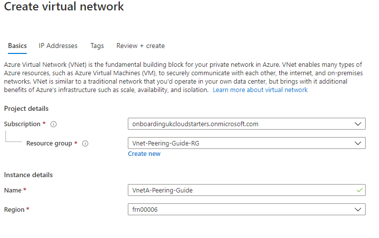
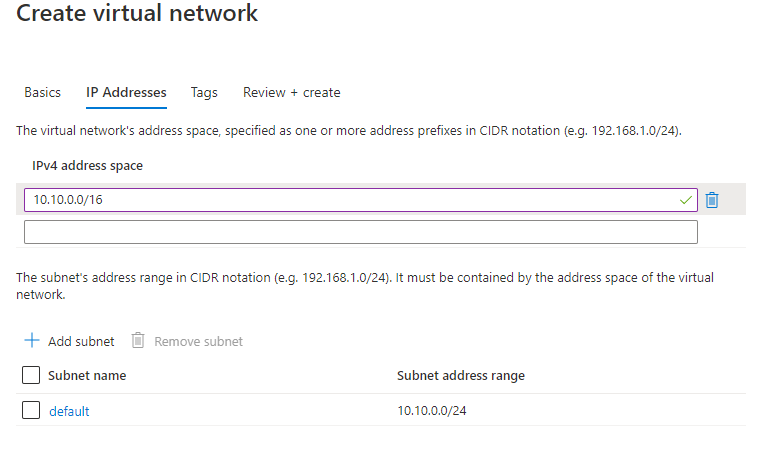
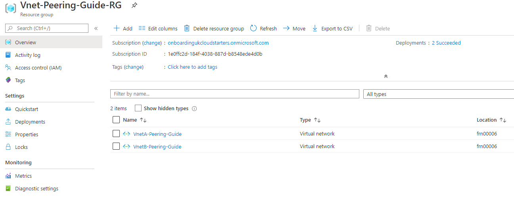
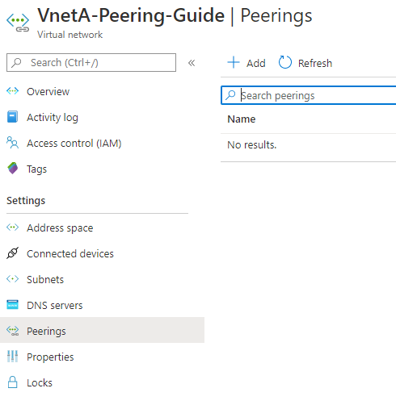
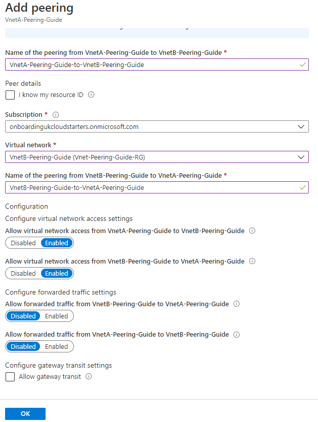
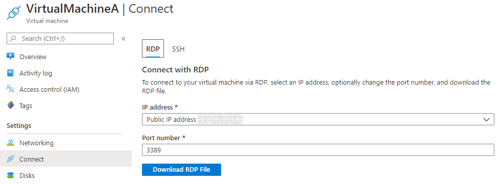
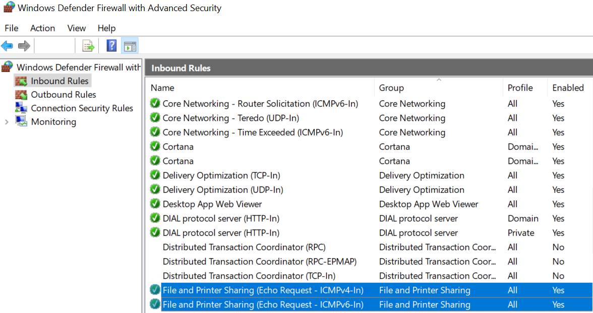
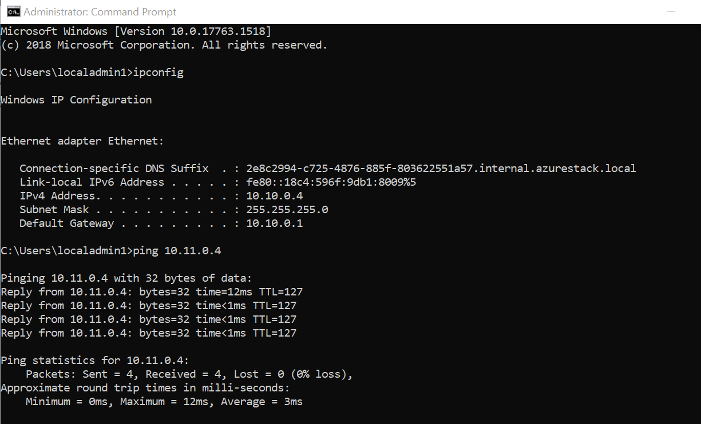

# How to configure virtual network peering between two virtual networks using the UKCloud Azure Stack Hub portal

## Overview

This article shows you how to use the Azure Stack Hub portal to create two virtual networks peered to eachother so they can communicate. 

### Intended audience

To complete the steps in this article, you must have appropriate access to a subscription in Azure Stack Hub.

## Process Overview

In this guide you will need to create two virual networks and two virtual machines. After, they will be peered together, allowing them to communicate and ping eachother.

## Create two virtual networks in Azure Stack Hub

First, create two virtual networks. These virtual networks will be able to communicate with eachother at the end of this guide, demonstrated with a ping in windows. 

1. Log in to the [Azure Stack Hub portal](https://portal.frn00006.azure.ukcloud.com).

2. In the favourites panel, select **Create a resource**.

   

3. In the **New** blade, select **Networking**.

   

4. In the **Featured** section, select **Virtual network**.

   

5. In the **Create virtual network** blade, enter the following information:

   - **Subscription** - This is your UKCloud for Microsoft Azure subscription.

   - **Resource Group** - Select an existing resource group, or create a new one by typing a name for your new resource group.
   
    - **Name** - The name of the virtual network.

   - **Location** - This will be `frn00006`, which is the location of the Azure Stack Hub.

     

    - **Address Space** - The virtual network's address range in CIDR notation.

   - **Subnet** - The subnet's address range in CIDR notation (for example, 10.10.0.0). It must be contained by the address space of the virtual network. The address range of a subnet which is in use can't be edited.

   - **Subnet Name** - The name of the first subnet within the virtual network.

     

> [!NOTE]
> When creating the second virtual network, make sure to use a different address space than the first, otherwise they will not be able to communicate 

6. Click **Create**.

7. Repeat the steps above for the second virtual network, but use different address spaces.

After your virtual network has deployed, you can view it by clicking **All services** in the favourites panel, then selecting **Virtual networks** under the networking section, or it appears inside the resource group.

In the blade for your virtual network, you can view and monitor the virtual network, change its settings and perform diagnostics and troubleshooting.

## Create a Virtual Machine in each Virtual Network

After creating each virtual network, create a virtual machine in each virtual network subnet.

> [!NOTE]
> Make sure that a new Public IP address is created for each virtual machine in the configuration.

For more detailed instructions on how to create a virtal machine, see the [*How to create a virtual machine using the UKCloud Azure Stack Hub portal*](azs-how-create-vm-portal.md).

## Configure virtual network peering

After a virtual machine is created in each virtual network, they can be peered together

1. Click on one of the created virtual netowrks and click **Add**

2. In the Add peering, enter the following information:

    - **Name** - The name of the connection from A-B. (From virtual network 1 to virtual network 2)

    - **Subscription** - This is your UKCloud for Microsoft Azure subscription.

    - **Virtual Network** - The virtual network you want to peer to.

    - **Name** - The name of the connection from B-A. (From virtual network 2 to virtual network 1)

    - **Allow virtual network access** - Allows access between virtual networks.

3. Click **OK**

If done correctly, Azure stack hub will create the peering rule in the other virtual network automatically. To check this, go to the other virtual network and check the peering.

### Testing connection

To test the connection by pinging one of the virtual machines from the other using windows CMD. To do this, some firewall rules needs to be changed in each virtual machine. 

1. Go to the virtual machine and connect to it by downloading the RDP file, Click **Download RDP File**

> [!NOTE]
> The device's IP you are connecting from must be allowed through the virtual machine NSG on port 3389.

2. Launch the RDP file and log in with the correct credentials for the virtual machine that you set up.

3. Access the firewall advanced security (**Settings**>**Update & Security**>**Windows Security**>**Firewall & network protection**>**Advanced settings**) 

4. Click on **Inbound Rules**, scroll down to "*File and Printer Sharing (Echo Request - ICMPv4-in)*" and allow it through the firewall for ICMPv4 and ICMPv6.

5. Repeat for each virtual machine

6. From one of the virtual machines, the connection can be tested by pinging the other. Open windows CMD and type: "ping [*IP Address*]". If done correctly, the ping should be successfull, as shown below. 

## How to configure a Hub and Spoke tapology with virtual network peering using the UKCloud Azure Stack Hub portal

## Hub and Spoke virtual network peering

The hub is a virtual network in Azure that acts as a central point of connectivity to your on-premises network. The spokes are virtual networks that peer with the hub.

### Configuring the Hub

1. create hub vnet

2. create vpn gateway in the vnet with a pub ip

**image of creating vnet gateway**

3. Create spoke vnet

4. add peering to hub

5. add peering to both sides