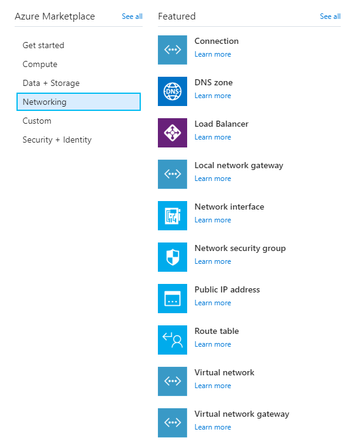
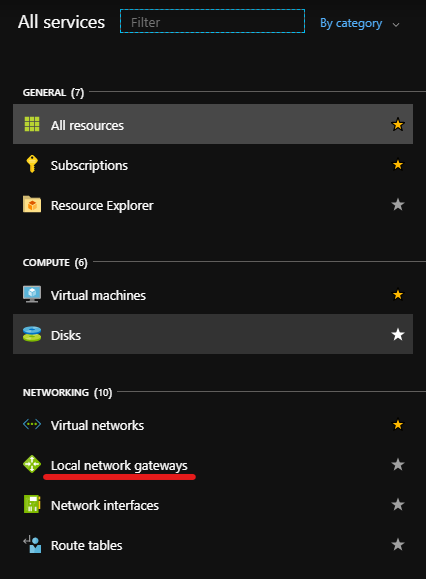
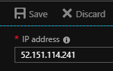

# How to create a site-to-site VPN connection between Azure Stack Hub and Public Azure using the UKCloud Azure Stack Hub portal

## Overview

This article shows you how to use the Azure Stack Hub and Public Azure portals to create a site-to-site VPN between your UKCloud for Microsoft Azure environment and Public Azure environment.

### Intended audience

To complete the steps in this article, you must have appropriate access to a subscription in both the Azure Stack Hub and Public Azure portals.

## Process Overview

To create a site-to-site VPN connection between Azure Stack Hub and Public Azure, you should perform the following steps:

1. [Set up VPN on the Azure Stack Hub side](#set-up-vpn-on-the-azure-stack-hub-side)
2. [Set up VPN on the Public Azure side](#set-up-vpn-on-the-public-azure-side)
3. [Update local gateway IPs](#update-the-local-gateway-ips-in-azure-stack-hub-and-public-azure)
4. [Verify the VPN connection](#verify-the-vpn-connection)

## Set up VPN on the Azure Stack Hub side

### Create a virtual network in Azure Stack Hub

First, you'll need to create a virtual network. This virtual network will be able to send and receive traffic through a virtual network gateway.

> [!NOTE]
> You cannot associate a virtual network with more than one gateway.

1. Log in to the [Azure Stack Hub portal](https://portal.frn00006.azure.ukcloud.com).

2. In the favourites panel, select **Create a resource**.

   

3. In the **New** blade, select **Networking**.

   

4. In the **Featured** section, select **Virtual network**.

   

5. In the **Create virtual network** blade, enter the following information:

   - **Name** - The name of the virtual network.

   - **Address Space** - The virtual network's address range in CIDR notation.

   - **Subscription** - This is your UKCloud for Microsoft Azure subscription.

   - **Resource Group** - Select an existing resource group, or create a new one by typing a name for your new resource group.

   - **Location** - This will be `frn00006`, which is the location of the Azure Stack Hub.

   - **Subnet Name** - The name of the first subnet within the virtual network.

   - **Address Range** - The subnet's address range in CIDR notation (for example, 192.168.1.0). It must be contained by the address space of the virtual network. The address range of a subnet which is in use can't be edited.

     

6. Click **Create**.

7. After your virtual network has deployed, you can view it by clicking **All services** in the favourites panel, then selecting **Virtual networks** under the networking section.

8. Select your virtual network from the list.

9. In the blade for your virtual network, you can view and monitor the virtual network, change its settings and perform diagnostics and troubleshooting.

### Create the gateway subnet in Azure Stack Hub

To associate a virtual network with a gateway, it must first contain a valid gateway subnet. The following steps outline how to create a gateway subnet.

1. In the portal, navigate to the virtual network that you created in the previous section.

2. In the **Settings** section of the virtual network blade, select **Subnets**.

3. On the **Subnets** page, click the **Gateway Subnet** button.

4. Fill in the **Address range** and add a route table if required, then click **OK**. The subnet should now have appeared.

### Create the VPN gateway in Azure Stack Hub

1. In the favourites panel, select **Create a resource**.

   

2. In the **New** blade, select **Networking**.

   

3. In the **Featured** section, select **Virtual network gateway**.

   

4. In the **Create virtual network gateway** blade, enter the following information:

   - **Name** - The name of the virtual network gateway.

   - **SKU** - Route-based VPN gateway types are offered in three SKUs: Basic, Standard, and High performance. You must select Standard or High performance if you are creating the network to coexist with an ExpressRoute gateway. You must select High performance SKU to enable active-active mode. You can find more information about SKUs here: [Azure Stack Hub SKUs](https://docs.microsoft.com/en-gb/azure/vpn-gateway/vpn-gateway-about-skus-legacy).

   - **Virtual Network** - This is the virtual network that you created earlier.

   - **Public IP address** - The public IP address to assign to this virtual network gateway. Only dynamic public IP addresses are supported. To create a new public IP address:

      - Under **Public IP address** on the **Create virtual network gateway** blade, select **Create new** on the **Choose public IP address** blade.

      - Enter a name for the public IP address and click **OK**.

   - **Configure BGP ASN** - BGP is the standard routing protocol commonly used on the internet to exchange routing information between two or more networks. BGP enables the Azure VPN Gateways and your on-premises VPN devices, called BGP peers or neighbours, to exchange "routes" that will inform both gateways on the availability and reachability for those prefixes to go through the gateways or routers involved. You should also make sure your on-premises VPN devices support BGP before you enable this feature.

   - **Subscription** - This is your UKCloud for Microsoft Azure subscription.

   - **Resource Group** - The virtual network gateway will be created in the same resource group as the chosen virtual network.

   - **Location** - This will be `frn00006`, which is the location of the Azure Stack Hub.

     

5. Click **Create**.

### Create the local network gateway in Azure Stack Hub

The local network gateway refers to your on-premises network. The following steps outline how to create a local network gateway:

1. In the favourites panel, select **Create a resource**.

   

2. In the **New** blade, select **Networking**.

   

3. In the **Featured** section, select **Local network gateway**.

   

4. In the **Create local network gateway** blade, enter the following information:

   - **Name** - The name of the local network gateway.

   - **IP address** - This is the public IP address of the VPN device that you want Azure to connect to. Enter a dummy IP address for now as you will generate the public IP later.

   - **Address space** - One or more IP address ranges (in CIDR notation) that define your local network's address space. For example: 192.168.0.0/16. If you plan to use this local network gateway in a BGP-enabled connection, then the minimum prefix you need to declare is the host address of your BGP Peer IP address on your VPN device.

   - **Configure BGP settings (Optional)** - Used only for when configuring BGP.

   - **Subscription** - This is your UKCloud for Microsoft Azure subscription.

   - **Resource group** - Select an existing resource group, or create a new one by typing a name for your new resource group.

   - **Location** - This will be `frn00006`, which is the location of the Azure Stack Hub.

     

### Create the VPN connection in Azure Stack Hub

Create the site-to-site VPN connection between your virtual network gateway and your public Azure VPN:

1. Navigate to your virtual network gateway by clicking **All services** in the favourites panel, then selecting **Virtual network gateways** under the networking section.

2. Select your virtual network gateway from the list.

3. In the blade for your virtual network gateway, under the **Settings** section, select **Connections**.

4. Click the **Add** button.

5. In the **Add connection** blade, enter the following information:

   - **Name** - The name of the connection.

   - **Connection type** - Select **Site-to-site (IPSec)**.

   - **Virtual network gateway** - Select the virtual network gateway you created earlier.

   - **Local network gateway**- Select the local network gateway you created earlier.

   - **Shared Key** - A mixture of letters and numbers, used to establish encryption for the connection. You must use the same shared key in both the virtual network and local network gateways. If your gateway device doesn't provide one, you can make one up here and provide it to your device.

   - **Subscription** - This is your UKCloud for Microsoft Azure subscription.

   - **Resource Group** - The resource group cannot be changed if you are adding a connection for an existing peer.

   - **Location** - This will be `frn00006`, which is the location of the Azure Stack Hub.

     

6. Click **OK**.

## Set up VPN on the Public Azure side

### Create a virtual network in Public Azure

You'll also need to create a virtual network in Public Azure. This virtual network will be able to send and receive traffic through the virtual network gateway. You cannot associate a virtual network with more than one gateway.

1. Log in to the [public Azure portal](https://portal.azure.com).

2. In the favourites panel, select **Create a resource**.

   

3. In the **New** blade, select **Networking**.

   

4. In the **Featured** section, select **Virtual network**.

   

5. In the **Create virtual network** blade, enter the following information:

   - **Name** - The name of the virtual network.

   - **Address Space** - The virtual network's address range in CIDR notation.

   - **Subscription** - This is your Microsoft Azure subscription.

   - **Resource Group** - Select an existing resource group, or create a new one by typing a name for your new resource group.

   - **Location** - Select the location of the Azure resource.

   - **Subnet Name** - The name of the first subnet within the virtual network.

   - **Address Range** - The subnet's address range in CIDR notation (for example, 192.168.1.0). It must be within the address range of the virtual network. It should be noted that the address range of a subnet currently in use cannot be edited.

   - **DDoS protection** - Select the DDoS protection you would like. For more information, see the [Azure DDoS Protection Standard overview](https://docs.microsoft.com/en-gb/azure/virtual-network/ddos-protection-overview).

   - **Service endpoints** - This allows you to enable one or more service endpoints for more information please see [Virtual Network Service Endpoints](https://docs.microsoft.com/en-gb/azure/virtual-network/virtual-network-service-endpoints-overview).

   - **Firewall** - Select this option to enable Azure Firewall, which is a managed cloud-based network security service that protects your Azure Virtual Network resources.

     

6. Click **Create**.

7. After your virtual network has deployed, you can view it by clicking **All services** in the favourites panel, then selecting **Virtual networks** under the networking section.

    

8. Select your virtual network from the list.

9. In the blade for your virtual network, you can view and monitor the virtual network, change its settings and perform diagnostics and troubleshooting.

    

### Create the gateway subnet in Public Azure

To associate a virtual network with a gateway, it must first contain a valid gateway subnet. The following steps outline how to create a gateway subnet.

1. In the portal, navigate to the virtual network that you created in the previous section.

2. In the **Settings** section of the virtual network blade, select **Subnets**.

    

3. On the **Subnets** page, click the **Gateway Subnet** button.

    

4. Fill in the **Address range** and add a route table if required, then click **OK**. The subnet should now have appeared.

    

### Create the VPN gateway in Public Azure

1. In the favourites panel, select **Create a resource**.

   

2. In the **New** blade, select **Networking**.

   

3. In the **Featured** section, select **See all**, then **Virtual network gateway**.

   

4. Click **Create**.

5. In the **Create virtual network gateway** blade, enter the following information:

   - **Subscription** - This is your Microsoft Azure subscription.

   - **Name** - The name of the virtual network gateway.

   - **Region** - The region to place the virtual network gateway in.

   - **Gateway type** - The type of virtual network gateway to create.

       - To connect with an existing ExpressRoute circuit, select **ExpressRoute**.

   - **VPN type** - The type of VPN you can choose depends on the make and model of your VPN device, and the kind of VPN connection you intend to create. Choose a route-based gateway if you intend to use point-to-site, inter-virtual network, or multiple site-to-site connections; if you are creating a VPN type gateway to coexist with an ExpressRoute gateway; or if you need to use IKEv2. Policy-based gateways support only IKEv1.

   - **SKU** - Route-based VPN gateway types are offered in three SKUs: Basic, Standard, and High performance. You must select Standard or High performance if you are creating the network to coexist with an ExpressRoute gateway. You must select High performance SKU to enable active-active mode. You can find more information about SKUs here: [Azure Stack Hub SKUs](https://docs.microsoft.com/en-gb/azure/vpn-gateway/vpn-gateway-about-skus-legacy).

   - **Virtual Network** - This is the virtual network that you created earlier in Public Azure.

   - **Public IP address** - The public IP address to assign to this virtual network gateway. Only dynamic public IP addresses are supported.

       - Click **Create new**.

       - In the **Public IP address name** field, enter a public IP address name.

   - **Enable active-active mode** - If you want to enable active-active mode, the gateway SKU must be one of: **VpnGw1**, **VpnGw2**, **VpnGw3**, **VpnGw1AZ**, **VpnGw2AZ**, **VpnGw3Az** or **HighPerformance** (legacy SKU).

   - **Configure BGP ASN** - BGP is the standard routing protocol commonly used on the internet to exchange routing information between two or more networks. BGP enables the Azure VPN Gateways and your on-premises VPN devices, called BGP peers or neighbours, to exchange "routes" that will inform both gateways on the availability and reachability for those prefixes to go through the gateways or routers involved. You should also make sure your on-premises VPN devices support BGP before you enable this feature.

   > [!NOTE]
   > The virtual network gateway will be created in the same resource group as the chosen virtual network.

   

6. Click **Review + create**.

7. Review the configuration and click **Create**.

### Create the local network gateway in Public Azure

The local network gateway refers to your on-premises network. The following steps outline how to create a local network gateway:

1. In the favourites panel, select **Create a resource**.

   

2. In the **New** blade, search for `Local network gateway`.

   

3. In the **Local network gateway** blade, click **Create**.

    

4. In the **Create local network gateway** blade, enter the following information:

   - **Name** - The name of the local network gateway.

   - **IP address** - This is the public IP address of the VPN device that you want Azure to connect to. Enter a dummy IP address for now as you will generate the public IP later.

   - **Address space** - One or more IP address ranges (in CIDR notation) that define your local network's address space. For example: 192.168.0.0/16. If you plan to use this local network gateway in a BGP-enabled connection, then the minimum prefix you need to declare is the host address of your BGP Peer IP address on your VPN device.

   - **Configure BGP settings** - Use only when configuring BGP.

   - **Subscription** - This is your Microsoft Azure subscription.

   - **Resource group** - Select an existing resource group, or create a new one by typing a name for your new resource group.

   - **Location** - Select the location of the Azure resource.

     

5. Click **Create**.

### Create the VPN connection in Public Azure

Create the site-to-site VPN connection between your virtual network gateway and your Azure Stack Hub VPN:

1. Navigate to your virtual network gateway by clicking **All services**, then select **Virtual network gateways** under the networking section.

    

2. Select your virtual network gateway from the list.

3. In the **virtual network gateway** blade, select **Connections** under the **Settings** section.

    

4. Click **Add**.

5. In the **Add connection** blade, enter the following information:

   - **Name** - The name of the connection.

   - **Connection type** - Select **Site-to-site (IPSec)**.

   - **Virtual network gateway** - Select the virtual network gateway you created earlier.

   - **Local network gateway**- Select the local network gateway you created earlier.

   - **Shared Key** - A mixture of letters and numbers, used to establish encryption for the connection. You must use the same shared key in both the virtual network and local network gateways. If your gateway device doesn't provide one, you can make one up here and provide it to your device.

   - **Subscription** - This is your Public Azure subscription.

   - **Resource Group** - When adding a connection for an existing peer, the resource group can't be changed.

   - **Location** - Select the location of the Azure resource.

     

6. Click **OK**.

## Update the local gateway IPs in Azure Stack Hub and Public Azure

To establish the connection you will need to identify the public IPs that you created in Azure Stack Hub and Public Azure, and then update both local gateways.

### Update the local gateway IPs in Public Azure

1. In the Azure Stack Hub portal, navigate to the *Connections* blade by clicking **All services** in the favourites panel, then selecting **Connections** under the *Networking* section.

    

2. Select the VPN connection you created in [Create the VPN connection in Public Azure](#create-the-vpn-connection-in-public-azure).

    

3. Make a note of the public IP. You can find this in the *Virtual network gateway* section.

    

4. Log in to the [Public Azure portal](https://portal.azure.com).

5. Navigate to the *Local Network Gateway* blade by clicking **All services** in the favourites panel, then selecting **Local network gateways** under the *Networking* section.

    

6. Select the local network gateway that you created in [Create the local network gateway in Public Azure](#create-the-local-network-gateway-in-public-azure).

7. In the local gateway blade, under *Settings*, select **Configuration**.

    

8. Change the **IP address** field to the IP taken from the Azure Stack Hub connection.

    

9. Click **Save**.

### Update the local Gateway IPs in Azure Stack Hub

1. In the Public Azure portal, navigate to the Connections blade by clicking **All services** in the favourites panel, then selecting **Connections** under the *Networking* section.

    

2. Select the VPN connection you created in [Create the VPN connection in Azure Stack Hub](#create-the-vpn-connection-in-azure-stack-hub).

3. Make a note of the public IP. You can find this in the *Virtual network gateway* section.

    

4. Log in to the [Azure Stack Hub portal](https://portal.frn00006.azure.ukcloud.com).

5. Navigate to the *Local Network Gateway* blade by clicking **All services** in the favourites panel, then selecting **Local network gateways** under the *Networking* section.

    

6. Select the local network gateway that you created in [Create the local network gateway in Azure Stack Hub](#create-the-local-network-gateway-in-azure-stack-hub)

7. In the *Local Network Gateway* blade, under *Settings*, select **Configuration**.

    

8. Change the **IP address** field to the IP taken from the Public Azure connection.

    

9. Click **Save**.

## Verify the VPN connection

After configuring the VPN device on your local network, you can verify the VPN connection with the following steps:

1. Log in to the [Azure Stack Hub portal](https://portal.frn00006.azure.ukcloud.com).

2. Navigate to your virtual network gateway by clicking **All services** in the favourites panel, then selecting **Virtual network gateways** under the *Networking* section.

    

3. Select your virtual network gateway from the list.

4. In the blade for your virtual network gateway, select **Connections** under the *Settings* section.

    

5. Select your connection from the list.

6. In the blade of your connection, you can view more information. The connection status will be **Connected** if there is a successful connection.

    

## Feedback

If you find an issue with this article, click **Improve this Doc** to suggest a change. If you have an idea for how we could improve any of our services, visit the [Ideas](https://community.ukcloud.com/ideas) section of the [UKCloud Community](https://community.ukcloud.com).