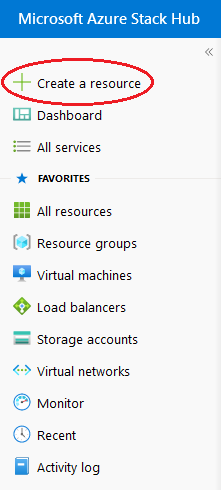
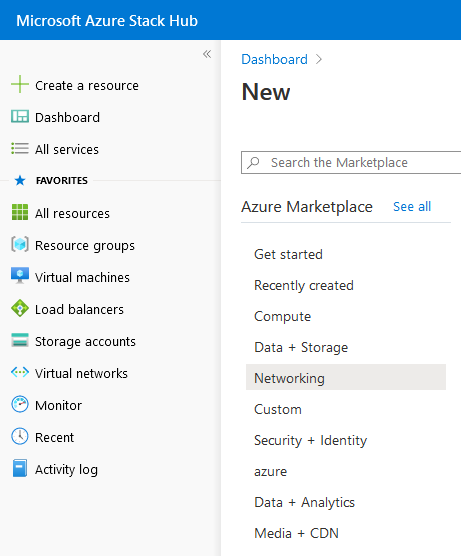
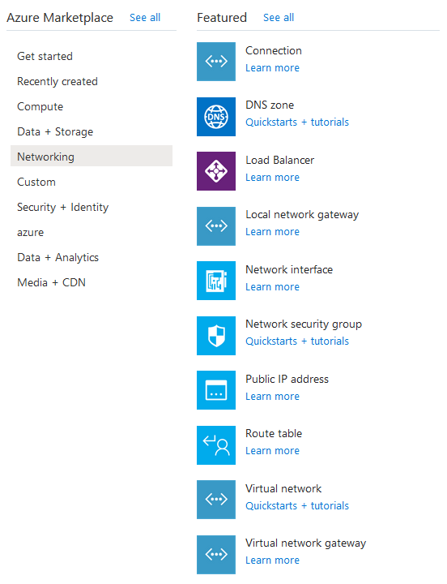
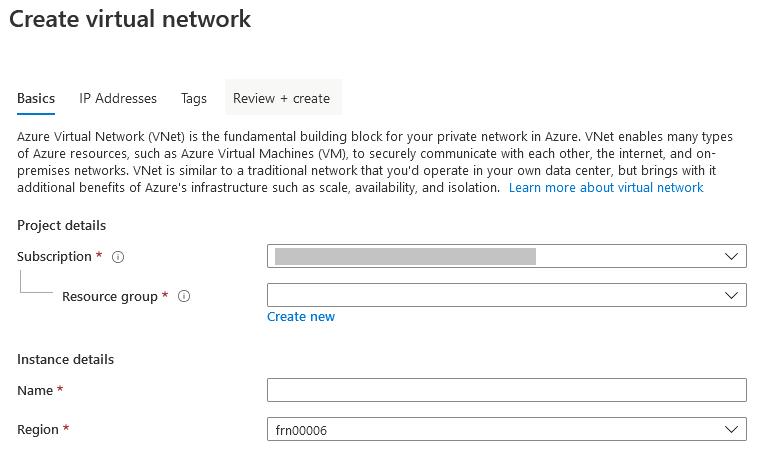
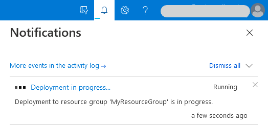
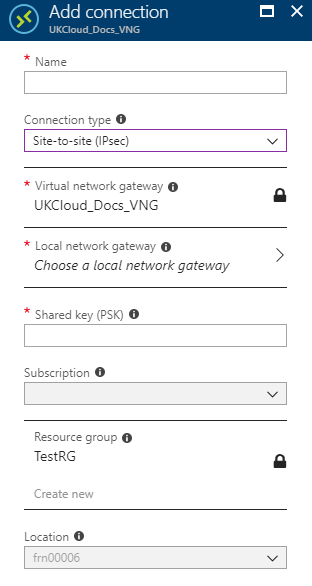

# How to create a site-to-site connection using the UKCloud Azure Stack portal

## Overview

This guide shows you how to use the Azure Stack portal to create a Site-to-Site VPN from your on-premises network to your UKCloud for Microsoft Azure environment.

### Intended audience

To complete the steps in this guide, you must have appropriate access to a subscription in the Azure Stack portal.

## Create a virtual network

First, you'll need to create a virtual network. This virtual network will be able to send and receive traffic through the virtual network gateway. You cannot associate a virtual network with more than one gateway.

1. Log in to the Azure Stack portal.

   For more detailed instructions, see the [*Getting Started Guide for UKCloud for Microsoft Azure*](azs-gs.md).

2. In the favourites panel, select **Create a resource**.

   

3. In the **New** blade, select **Networking**.

   

4. In the **Featured** section, select **Virtual network**.

   

5. In the **Create virtual network** blade, enter the following information:

   - **Name** - The name of the virtual network.

   - **Address Space** - The virtual network's address range in CIDR notation.

   - **Subscription** - This is your UKCloud for Microsoft Azure subscription.

   - **Resource Group** - Select an existing resource group, or create a new one by typing a name for your new resource group.

   - **Location** - This will be `frn00006`, which is the location of the Azure Stack.

   - **Subnet Name** - The name of the first subnet within the virtual network.

   - **Address Range** - The subnet's address range in CIDR notation (for example, 192.168.1.0). It must be contained by the address space of the virtual network. The address range of a subnet which is in use can't be edited.

     

6. Click **Create**.

7. You can monitor the progress of your virtual network's deployment by clicking the **Notifications** icon.

   

8. Click the deployment notification for the deployment to view details of the deployment of the virtual network.

9. When the deployment is finished, the notification will change to **Deployment succeeded**.

10. After your virtual network has deployed, you can view it by clicking **All services** in the favourites panel, then selecting **Virtual networks** under the networking section.

11. Select your virtual network from the list.

12. In the blade for your virtual network, you can view and monitor the virtual network, change its settings and perform diagnostics and troubleshooting.

## Create the gateway subnet

To associate a virtual network with a gateway, it must first contain a valid gateway subnet. The following steps outline how to create a gateway subnet.

1. In the portal, navigate to the virtual network that you created in the previous section.

2. In the **Settings** section of the virtual network blade, select **Subnets**.

3. On the **Subnets** page, click the **+ Gateway Subnet** button.

4. Fill in the **Address range** and add a route table if required, then click **OK**. The subnet should now have appeared.

## Create the VPN gateway

1. In the favourites panel, select **Create a resource**.

   

2. In the **New** blade, select **Networking**.

   

3. In the **Featured** section, select **Virtual network gateway**.

   

4. In the **Create virtual network gateway** blade, enter the following information:

   - **Name** - The name of the virtual network gateway.

   - **SKU** - Route-based VPN gateway types are offered in three SKUs: Basic, Standard, and High performance. You must select Standard or High performance if you are creating the network to coexist with an ExpressRoute gateway. You must select High performance SKU to enable active-active mode. You can find more information about SKUs here: [Azure Stack SKUs](https://docs.microsoft.com/en-gb/azure/vpn-gateway/vpn-gateway-about-skus-legacy).

   - **Virtual Network** - This is the virtual network that you created earlier.

   - **Public IP address** - The public IP address to assign to this virtual network gateway. Only dynamic public IP addresses are supported. To create a new public IP address:

      - Click **Public IP address** on the **Create virtual network gateway** blade.

      - Select **Create new** on the **Choose public IP address** blade.

      - Enter a name for the public IP address and click **OK**.

   - **Configure BGP ASN** - BGP is the standard routing protocol commonly used on the internet to exchange routing information between two or more networks. BGP enables the Azure VPN Gateways and your on-premises VPN devices, called BGP peers or neighbours, to exchange "routes" that will inform both gateways on the availability and reachability for those prefixes to go through the gateways or routers involved. You should also make sure your on-premises VPN devices support BGP before you enable this feature.

   - **Subscription** - This is your UKCloud for Microsoft Azure subscription.

   - **Resource Group** - The virtual network gateway will be created in the same resource group as the chosen virtual network.

   - **Location** - This will be `frn00006`, which is the location of the Azure Stack.

     

5. Click **Create**.

6. You can monitor the progress of your virtual network's deployment by clicking the **Notifications** icon.

   

## Create the local network gateway

The local network gateway refers to your on-premises network. The following steps outline how to create a local network gateway:

1. In the favourites panel, select **Create a resource**.

   

2. In the **New** blade, select **Networking**.

   

3. In the **Featured** section, select **Local network gateway**.

   

4. In the **Create local network gateway** blade, enter the following information:

   - **Name** - The name of the local network gateway.

   - **IP address** - This is the public IP address of the VPN device that you want Azure to connect to. Specify a valid public IP address.

   - **Address space** - One or more IP address ranges (in CIDR notation) that define your local network's address space. For example: 192.168.0.0/16. If you plan to use this local network gateway in a BGP-enabled connection, then the minimum prefix you need to declare is the host address of your BGP Peer IP address on your VPN device.

   - **Configure BGP settings** - Use only when configuring BGP.

   - **Subscription** - This is your UKCloud for Microsoft Azure subscription.

   - **Resource group** - Select an existing resource group, or create a new one by typing a name for your new resource group.

   - **Location** - This will be `frn00006`, which is the location of the Azure Stack.

     

5. Click **Create**.

## Create the VPN connection

Create the Site-to-Site VPN connection between your virtual network gateway and your on-premises VPN device:

1. Navigate to your virtual network gateway by clicking **All services** in the favourites panel, then selecting **Virtual network gateways** under the networking section.

2. Select your virtual network gateway from the list.

3. In the blade for your virtual network gateway, select **Connections** under the **Settings** section.

4. Click the **+Add** button.

5. In the **Add connection** blade, enter the following information:

   - **Name** - The name of the connection.

   - **Connection type** - Select **Site-to-site (IPSec)**.

   - **Virtual network gateway** - Select the virtual network gateway you created earlier.

   - **Local network gateway**- Select the local network gateway you created earlier.

   - **Shared Key** - A mixture of letters and numbers, used to establish encryption for the connection. You must use the same shared key in both the virtual network and local network gateways. If your gateway device doesn't provide one, you can make one up here and provide it to your device.

   - **Subscription** - This is your UKCloud for Microsoft Azure subscription.

   - **Resource Group** - When adding a connection for an existing peer, the resource group can't be changed.

   - **Location** - This will be `frn00006`, which is the location of the Azure Stack.

     

6. Click **OK**.

## Verify the VPN connection

After configuring the VPN device on your local network, you can verify the VPN connection with the following steps:

1. Navigate to your virtual network gateway by clicking **All services** in the favourites panel, then selecting **Virtual network gateways** under the networking section.

2. Select your virtual network gateway from the list.

3. In the blade for your virtual network gateway, select **Connections** under the **Settings** section.

4. Select your connection from the list.

5. In the blade that has opened, you can view more information about your connection. The connection status will be **Succeeded** or **Connected** if there is a successful connection.

## Feedback

If you find an issue with this article, click **Improve this Doc** to suggest a change. If you have an idea for how we could improve any of our services, visit [UKCloud Ideas](https://ideas.ukcloud.com). Alternatively, you can contact us at <products@ukcloud.com>.
