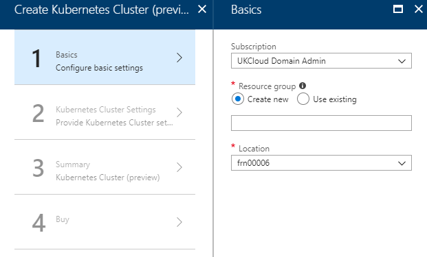

# How to create an Azure Kubernetes Service cluster using the UKCloud Azure Stack portal

## Overview

Azure Kubernetes Service (AKS) makes it simple to deploy a managed Kubernetes cluster in Azure Stack. AKS reduces the complexity and operational overhead of managing Kubernetes by offloading much of that responsibility to Azure Stack. As a hosted Kubernetes service, Azure Stack handles critical tasks like health monitoring and maintenance for you.

### Intended audience

To complete the steps in this guide, you must have appropriate access to a subscription in the Azure Stack portal.

## Creating an Azure Kubernetes Service cluster

1. Log in to the Azure Stack portal.

   For more detailed instructions, see the [*Getting Started Guide for UKCloud for Microsoft Azure*](azs-gs.md).

2. In the favourites panel, select **Create a resource**.

    

3. In the *New* blade, select **Compute**.

    

4. In the *Compute* blade, select **Kubernetes Cluster**.

    

5. In the *Create Kubernetes Cluster* blade, in the *Basics* step, enter the following information and click **OK**:

   **Subscription** - This is your UKCloud for Microsoft Azure subscription.

   **Resource group** - Select an existing resource group, or create a new one by typing a name for your new resource group.

   **Location** - This will be `frn00006`, which is the location of the Azure Stack.

   

6. In the *Kubernetes Cluster Settings* step, enter the following information and click **OK**:

   **Linux VM admin username** - The username for the Linux virtual machines that are part of the Kubernetes cluster.

   **SSH public key** - SSH public key used for authentication to all Linux machines created as part of the the Kubernetes cluster.

   **Master Profile DNS prefix** - This must be a region-unique name, for example k8s-12345. Try to choose the same name as the resource group as best practice.

   **Kubernetes master pool profile count** - The number of master nodes for the Kubernetes cluster. This value should be an odd number.

   **The VMSize of Kubernetes master VMs** - The VM size of each master node. For information about the different available VM sizes, see [here](https://docs.microsoft.com/en-gb/azure/azure-stack/user/azure-stack-vm-sizes).

   **Kubernetes node pool profile count** - The number of agents for the Kubernetes cluster.

   **The VMSize of Kubernetes node VMs** - The VM size of each agent node.

   **The Storage Profile** - The storage profile for the Kubernetes cluster.

   **Azure Stack identity system** - Azure Stack identity provider - defaults to AzureAD

   **Service principal clientId** - The Service Principal application ID (used by the Kubernetes Azure cloud provider). More help [here](https://github.com/Azure/acs-engine/blob/master/docs/serviceprincipal.md).

   **Service principal client secret** - The Service Principal Client secret.

   **Kubernetes version** - This is the Kubernetes version that is used for the cluster.

   

7. In the *Summary* step, check that the information is correct, then click **OK**.

8. Click **Create**.

9. You can monitor the progress of your cluster's deployment by clicking the **Notifications** icon.

    

10. After your cluster has been deployed, you can view it by clicking **Resource Groups** in the favourites panel, then selecting the resource group that contains the cluster.

## Feedback

If you have any comments on this article, or any other aspect of your UKCloud experience, send them to <products@ukcloud.com>.
