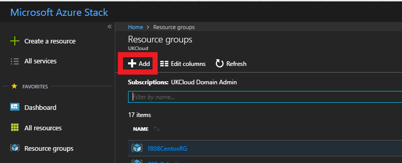
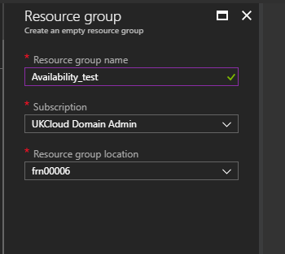
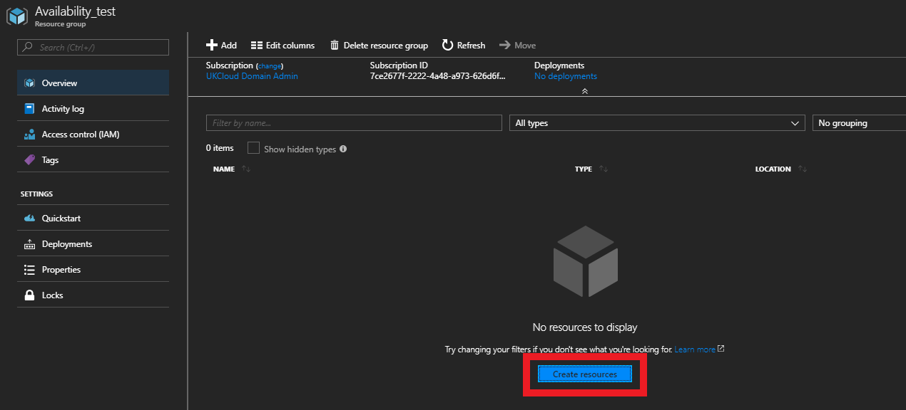
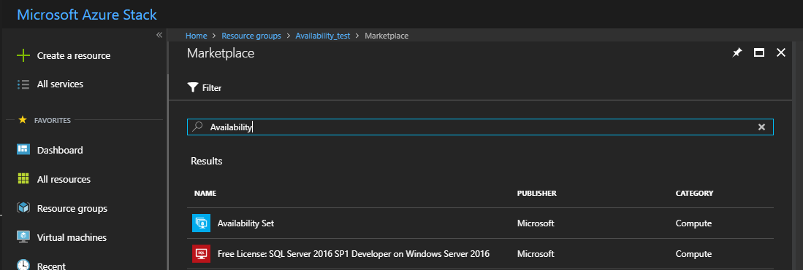
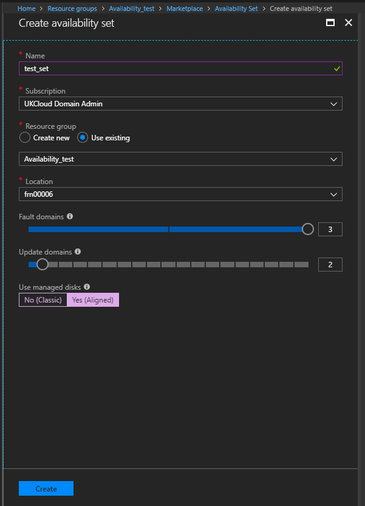
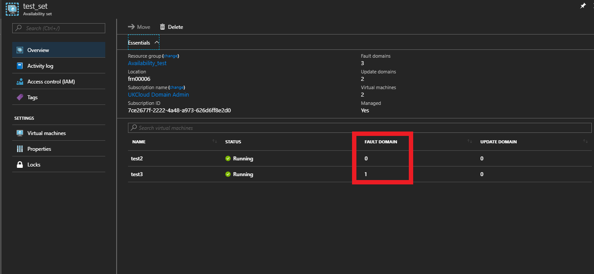

# Overview

This guide will cover how to increase the availability and reliability of your virtual machines on Azure Stack using **availability sets**. availability sets ensure that VMs you deploy on Azure Stack are evenly distributed across multiple physical nodes in a cluster. Doing this ensure that, if a hardware or software failure happens within Azure Stack, only a subset of your VMs are impacted and your overall solution remains available and operational.

## Availability sets

An availability set is a grouping capability for VMs that you can use in Azure Stack to ensure that the VM resources you place within it are isolated from each other when deployed. Azure Stack ensures that the VMs you place within an availability set run across multiple physical nodes. If a hardware or software failure occurs, only a subset of your VMs are impacted, and your overall application stays up and continues to be available to your customers. Availability sets are an essential capability when you want to build reliable cloud solutions that are protected against the unexpected.

An example of where availability sets would be used is a typical website where you might have four front-end web servers and 2 back-end VMs hosting databases. With Azure Stack, you’d want to define two availability sets before you deploy your VMs: one availability set for the web hosting VMs and one availability set for the database VMs. When you create a new VM you can then specify the availability set as a parameter and Azure Stack automatically ensures that the VMs you create within the available set are isolated across multiple physical nodes. If the physical hardware that one of your Web Server or back-end VMs is running on has a problem, you know that the other instances of your Web Server and back-end VMs remain running because they are on different nodes.

## Creating an availability set via the portal

1. When initially creating an availability set, you will need to create the resource group for the availability set.

    

2. Name the resource group.

    

3. When you've created the resource group, navigate into it, select **Overview** then **Create resources**.

    

4. In the Marketplace, search for and then click **availability set**.

    

5. In the **Create availability** set blade, you can set the name of the set and how many fault and update domains you want it to have. For the **Resource group**, select the resource group you created earlier and for **Use managed disks**, select the option that matches the VM disks you'll be adding to the set. When you're done, click **Create** to deploy the availability set.

    

6. When you are creating the VMs you want to be a part of the availability set, when you get to step 3, under **High Availability** select the availability set you want to use. Make sure to set the disk type of the VM first.

    

7. Once you've created the VMs, if you navigate to the availability set, in the **Overview** blade, you can see your VMs and the domains they're located on.

    

## Creating an availability set via PowerShell

The following PowerShell code example will create an empty resource group and then deploy an availability set to it.

```PowerShell
# Input Variables
$Resourcegroup = "myResourceGroupAvailability"
$Availabilityset = "myAvailabilitySet"

# Creates a resource group
New-AzureRmResourceGroup -Name $Resourcegroup -Location 'frn00006'

# Creates an availability set
New-AzureRmAvailabilitySet -Location "frn00006" -Name $Availabilityset -ResourceGroupName $Resourcegroup -Sku classic -PlatformFaultDomainCount 2   -PlatformUpdateDomainCount 2  
```

The following PowerShell code sample is a variation of the script required to create a VM. This code creates the VM and then adds it to the availability set that you created with the previous script.

```PowerShell
## Initialise environment and variables

 # Add environment
Add-AzureRMEnvironment -Name 'AzureStack' -ArmEndpoint 'https://management.frn00006.azure.ukcloud.com'

# Login
Login-AzureRmAccount -EnvironmentName 'AzureStack'

# Input Variables
$RGName = 'myResourceGroupAvailability'
$Availabilityset = 'myAvailabilitySet'
$SAName = 'mystorageaccount'
$Location = 'frn00006'
$SubnetName = 'mysubnet'
$SubnetRange = '192.168.1.0/24'
$VNetName = 'myvnetwork'
$VNetRange = '192.168.0.0/16'
$PublicIPName = 'mypublicip'
$NSGName = 'mynsg'
$NICName = 'mynic'
$VMName = 'myvm'
$VMSize = 'Standard_A2'
$ComputerName = 'mycomputer'
$VMImage = '*/CentOS/Skus/6.10'

## Create storage resources
# Create a new storage account
Write-Host "Creating storage account"
$StorageAccount = New-AzureRmStorageAccount -Location $Location -ResourceGroupName $RGName -Type 'Standard_LRS' -Name $SAName

## Create network resources
# Create a subnet configuration
Write-Host "Creating virtual network"
$SubnetConfig = New-AzureRmVirtualNetworkSubnetConfig -Name $SubnetName -AddressPrefix $SubnetRange

# Create a virtual network
$VirtualNetwork = New-AzureRmVirtualNetwork -ResourceGroupName $RGName -Location $Location -Name $VNetName -AddressPrefix $VNetRange -Subnet $SubnetConfig

# Create a public IP address
Write-Host "Creating public IP address"
$PublicIP = New-AzureRmPublicIpAddress -ResourceGroupName $RGName -Location $Location -AllocationMethod 'Dynamic' -Name $PublicIPName

# Create a network security group
Write-Host "Creating network security group"
$NetworkSG = New-AzureRmNetworkSecurityGroup -ResourceGroupName $RGName -Location $Location -Name $NSGName

# Create a virtual network card and associate it with the public IP address and NSG
Write-Host "Creating network interface card"
$NetworkInterface = New-AzureRmNetworkInterface -Name $NICName -ResourceGroupName $RGName -Location $Location -SubnetId $VirtualNetwork.Subnets[0].Id -PublicIpAddressId $PublicIP.Id -NetworkSecurityGroupId $NetworkSG.Id

## Create the virtual machine
# Define a credential object to store the username and password for the virtual machine
$UserName = 'myUser'
$Password = 'Password123!' | ConvertTo-SecureString -Force -AsPlainText
$Credential = New-Object PSCredential($UserName,$Password)

# Create the virtual machine configuration object
$AvailabilityID = (Get-AzureRmAvailabilitySet -ResourceGroupName $RGName -Name $Availabilityset).Id
$VirtualMachine = New-AzureRmVMConfig -VMName $VMName -VMSize $VMSize -AvailabilitySetID $AvailabilityID

# Set the VM Size and Type
$VirtualMachine = Set-AzureRmVMOperatingSystem -VM $VirtualMachine -Linux -ComputerName $ComputerName -Credential $Credential

# Get the VM Source Image
$Image = Get-AzureRMVMImagePublisher -Location $Location | Get-AzureRmVMImageOffer | Get-AzureRmVMImageSku | Where-Object {$_.Id -like $VMImage}

# Set the VM Source Image
$VirtualMachine =  Set-AzureRmVMSourceImage -VM $VirtualMachine -PublisherName $Image.PublisherName -Offer $Image.Offer -Skus $Image.Skus -Version 'latest'

# Add Network Interface Card
$VirtualMachine = Add-AzureRmVMNetworkInterface -Id $NetworkInterface.Id -VM $VirtualMachine

# Set the OS Disk properties
$OSDiskName = "OsDisk"
$OSDiskUri = '{0}vhds/{1}-{2}.vhd' -f $StorageAccount.PrimaryEndpoints.Blob.ToString(), $VMName.ToLower(), $OSDiskName

# Applies the OS disk properties
$VirtualMachine = Set-AzureRmVMOSDisk -VM $VirtualMachine -Name $OSDiskName -VhdUri $OSDiskUri -CreateOption FromImage

# Create the virtual machine.
Write-Host "Creating virtual machine"
$NewVM = New-AzureRmVM -ResourceGroupName $RGName -Location $Location -VM $VirtualMachine
$NewVM
Write-Host "Virtual machine created successfully"
```

## Feedback

 If you find an issue with this article, click **Improve this Doc** to suggest a change. If you have an idea for how we could improve any of our services, visit [*UKCloud Ideas*](https://ideas.ukcloud.com). Alternatively, you can contact us at <products@ukcloud.com>.
