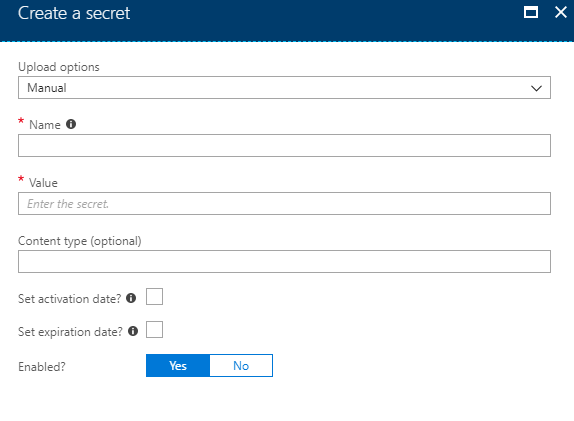

# How to Create a Key Vault using the Azure Stack Portal

## Overview

Key Vault in Azure Stack helps safeguard cryptographic keys and secrets that cloud applications and services use. By using Key Vault, you can encrypt keys and secrets.

The following process shows you how to setup a vault within Azure Stack's Key Vault, store a secret in the vault and how to view the secret using the Azure Stack Portal.

## Prerequisites

To complete the steps in this guide, you must have appropriate access to a subscription in the UKCloud Azure Stack portal.

## Creating a new Key Vault

1. Log in to the UKCloud Azure Stack portal.

    For more detailed instructions, see the [*Getting Started Guide for UKCloud for Microsoft Azure*](azs-gs.md).

2. In the favourites panel, select **Create a resource**.

    

3. In the *New* blade, select **Security + Identity**.

   

4. In the *New* blade, select **Key Vault**.

   

5. In the **Create key vault** blade, enter the following information:

   - **Name** - The name of the key vault.

   - **Subscription** - This is your UKCloud for Microsoft Azure subscription.

   - **Resource Group** - Select an existing resource group, or create a new one by typing a name for your new resource group.

   - **Location** - This will be `frn00006`, which is the location of the Azure Stack.

   - **Access policies** - Configure who can access the key vault and what permissions they have.

     

6. Click **Create**.

7. You can monitor the progress of your Key Vault's deployment by clicking the **Notifications** icon.

   

## Adding a secret to the Key Vault

1. Once the key vault has been deployed, navigate to it by clicking **All services** in the favourites panel, then selecting **Key Vaults** under the *Security + Identity* section.

2. Select your key vault from the list.

3. In the *Settings* section of the key vault blade, select **Secrets**.

4. On the *Secrets* page, click the **+ Generate/Import** button.

5. In the *Create a secret* blade, enter the following information:

   - **Upload Options** - Manually enter a secret or upload an x.509 certificate.

   - **Name** - The name of the secret.

   - **Value** - The value you are storing as a secret.

   - **Content Type** - The type of content contained in the secret (for example, Password). There are no pre-defined values for this field.

   - **Activation Date** - Specifies when the secret will become active.

   - **Expiration Date** - Specifies when the secret will become inactive.

   - **Enabled** - Indicates whether or not the secret data can be retrieved.

   

6. Click **Create**.

## Viewing the secret

1. Once you've created the secret, select it on the *Secrets* page.

2. On the secret's blade, select the current version.

3. On the current version's blade, click the **Show secret value** button.

## Feedback

If you have any comments on this document or any other aspect of your UKCloud experience, send them to <products@ukcloud.com>.
