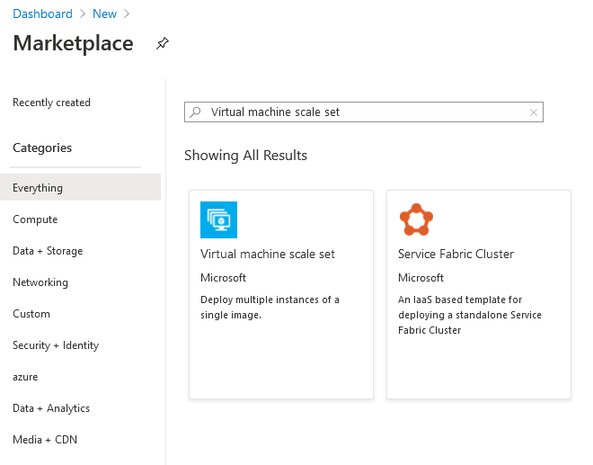
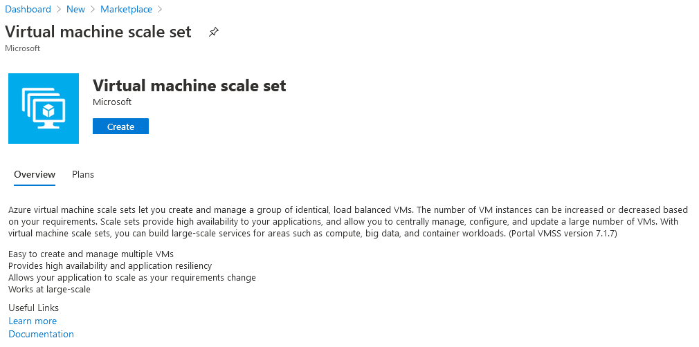
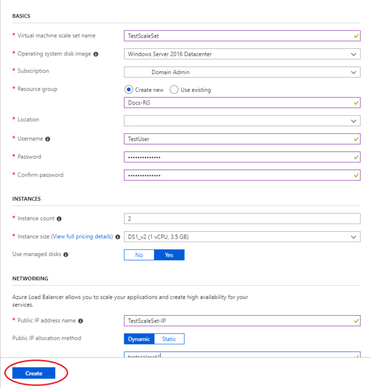
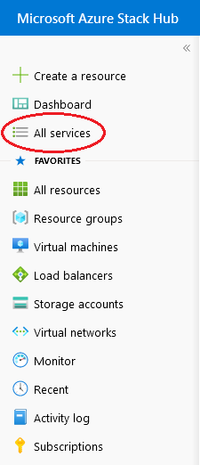
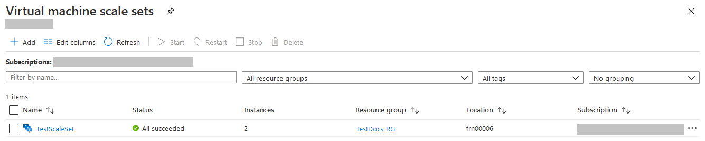
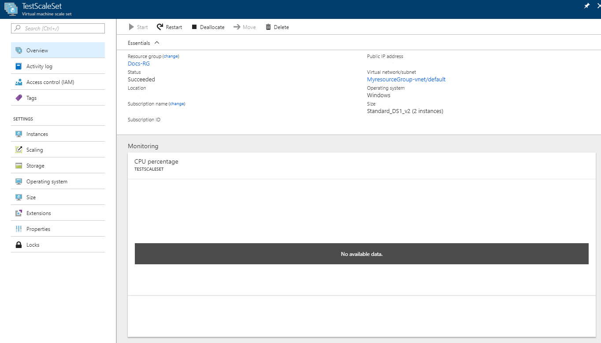
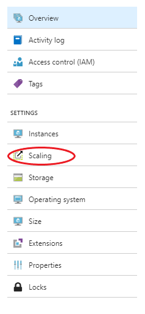
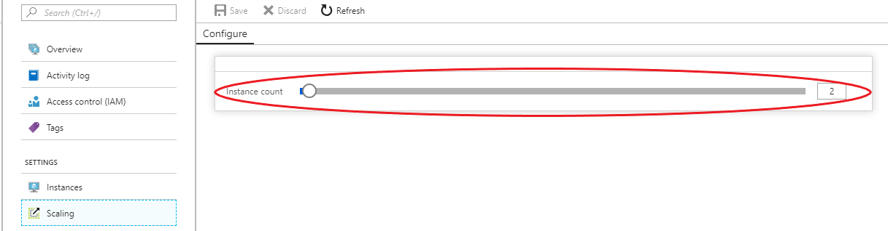
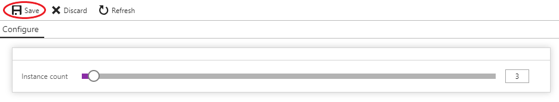

# How to create a Virtual Machine Scale Set using UKCloud Azure Stack portal

## Overview

Virtual Machine scale sets in Azure Stack are a compute resource that can be used to deploy and manage identical virtual machines. All virtual machine instances in a scale set are configured in the same way and do not require any provisioning beforehand.

## Prerequisites

To complete the steps in this guide, you must have appropriate access to a subscription in the Azure Stack portal.

## Creating a new virtual machine scale set

1. Log in to the Azure Stack portal.

    For more detailed instructions, see the [*Getting Started Guide for UKCloud for Microsoft Azure*](azs-gs.md).

2. In the favourites panel, select **Create a resource**.

    

3. In the *Everything* blade search **'Virtual machine scale set'**.

    

4. In the *virtual machine scale set* blade select **Create**.

    

5. In the *BASICS* page, enter the following information:

    - **Virtual machine scale set name** - The name of the scale set.

    - **Operating system disk image** – The operating system disk image for the virtual machines in the scale set.

    > [!Warning]
    > Scale sets currently do not support CentOS 7.2 on Azure Stack.

    - **Subscription** - This is your UKCloud for Microsoft Azure subscription.

    - **Resource group** - Select an existing resource group, or create a new one by typing a name for your new resource group.

    - **Location** - This will be frn00006, which is the Azure Stack region.

    - **Username** – Admin username for the virtual machines.

    - **Password** – Admin password for the virtual machines.

    - **Confirm password** – Confirm the password.

    - **Instance count** – The number of virtual machines in the scale set (0 - 100).

    - **Instance size** – The size of each virtual machine in the scale set. Some sizes may only be available using templates, PowerShell, or Azure CLI due to the recommended portal defaults.

    - **Use managed disks** – Managed disks is a feature that simplifies disk management for Azure laaS virtual machines by handling storage account management for you. For more information, see the [Managed Disks overview](https://docs.microsoft.com/en-us/azure/virtual-machines/windows/managed-disks-overview)

    - **Public IP address name** – The name of the public IP address for the load balancer in front of the scale sets.

    - **Public IP allocation method** – Select between Dynamic or Static IP addresses.

    - **Domain name label** – Domain name label for the load balancer in front of the scale set.

    - **Virtual network** – This is the virtual network you would like the scale set to be connected to.

    - **Public IP address per instance** – Add a public IP address to each instance in the scale set.

    

6. You can monitor the progress of your scale set's deployment by clicking the **Notifications** icon.

    

7. When the deployment is finished, the notification will change to *Deployment succeeded*.

    

8. After the scale set has deployed, you can view it by clicking **All Services** in the favourites panel, then select **Virtual machine scale sets** from the *compute* section.

    

9. Select your scale set from the list.

    

10. In the blade for your scale set, you can view and monitor the scale set, change its settings and perform diagnostics and troubleshooting.

    

## Modifying the instance count of your scale set

> [!Warning]
> Currently auto-scaling is not supported on Azure Stack.

1. In the blade for the scale set, select **Scaling** under *settings*.

    

2. Manually increase or decrease the number of instances within the scaling settings using the slide bar.

    

3. Once you have selected the desired number of instances select **Save** to commit the change.

    

> [!Note]
> A prompt will notify you once the configuration has been updated.

## Feedback

If you find an issue with this article, click **Improve this Doc** to suggest a change. If you have an idea for how we could improve any of our services, visit [UKCloud Ideas](https://ideas.ukcloud.com). Alternatively, you can contact us at <products@ukcloud.com>.