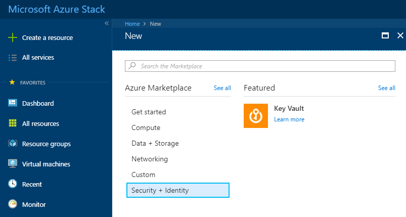
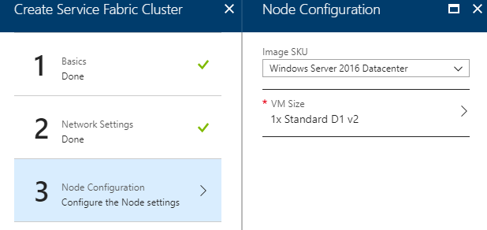
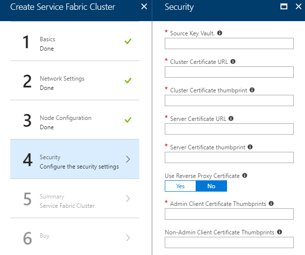

# How to create a Service Fabric cluster using the UKCloud Azure Stack Hub portal

## Overview

Azure Stack Hub Service Fabric is a distributed systems platform that makes it easy to package, deploy, and manage scalable and reliable microservices and containers. Service Fabric also addresses the significant challenges in developing and managing cloud native applications. Developers and administrators can avoid complex infrastructure problems and focus on implementing mission-critical, demanding workloads that are scalable, reliable, and manageable. Service Fabric represents the next-generation platform for building and managing these enterprise-class, tier-1, cloud-scale applications running in containers.

The following process shows you how to setup a Service Fabric cluster using the Azure Stack Hub portal.

## Prerequisites

To complete the steps in this guide, you must have appropriate access to a subscription in the Azure Stack Hub portal.

## Creating a new key vault

Before creating a Service Fabric cluster, it is necessary to create a key vault to store the certificates for the cluster. These certificates are used in Service Fabric to provide authentication and encryption to secure various aspects of a cluster and its applications. You can find more information about these certificates [here](https://docs.microsoft.com/en-us/azure/service-fabric/service-fabric-cluster-security#x509-certificates-and-service-fabric).

1. Log in to the Azure Stack Hub portal.

    For more detailed instructions, see the [*Getting Started Guide for UKCloud for Microsoft Azure*](azs-gs.md).

2. In the favourites panel, select **Create a resource**.

    

3. In the *New* blade, select **Security + Identity**.

   

4. In the *Security + Identity* blade, select **Key Vault**.

   

5. In the *Create key vault* blade, enter the following information:

   - **Name** - The name of the key vault.

   - **Subscription** - This is your UKCloud for Microsoft Azure subscription.

   - **Resource Group** - Select an existing resource group, or create a new one by clicking the **Create new** link and then typing a name for your new resource group in the pop-out window.

   - **Location** - This will be `frn00006`, which is the Azure Stack Hub region.

   - **Access policies** - Configure who can access the key vault and what permissions they have.

     

6. Click **Create**.

7. You can monitor the progress of your Key Vault's deployment by clicking the **Notifications** icon.

   

### Adding a certificate to the key vault

1. Once the key vault has been deployed, navigate to it by clicking **All services** in the favourites panel, then selecting **Key Vaults** under the *Security* section.

2. Select your key vault from the list.

3. In the *Settings* section of the key vault blade, select **Secrets**.

4. On the *Secrets* page, click the **+ Generate/Import** button.

5. In the *Create a secret* blade, enter the following information:

   - **Upload Options** - Select the **Certificate** option.

   - **Upload Certificate** - Select the .pfx certificate to upload.

   - **Name** - The name of the certificate to identify it within the Key Vault.

   - **Activation Date** - Specifies when the certificate will become active.

   - **Expiration Date** - Specifies when the certificate will become inactive.

   - **Enabled** - Indicates whether or not the secret data can be retrieved.

   

6. Click **Create**.

7. Repeat as necessary, depending on how many certificates you require.

### Gathering key vault and certificate information

During configuration of the Service Fabric cluster, you must provide several details relating to the key vault and certificates. You must also configure access to the key vault for virtual machines and the Azure Resource Manager.

1. Once you have deployed the key vault, navigate to it by clicking **All services** in the favourites panel, then selecting **Key Vaults** under the *Security* section.

2. Select your key vault from the list.

3. In the *Settings* section of the key vault's blade, select **Access policies**.

4. On the *Access policies* page, click **Click to show advanced access policies**.

5. Tick the top two check boxes, then click the **Save** button.

6. In the *Settings* section of the key vault blade, select **Properties**.

7. Copy the **Resource ID** and store it for later use.

8. Select **Secrets**.

9. On the *Secrets* page, select the certificate you added in the previous section.

10. On the certificate's blade, select the current version.

11. Copy the **Secret Identifier**.

12. Repeat for each certificate that you are going to use for the Service Fabric cluster.

You also need the thumbprint of the certificate(s). For information about how to find this information, see [here](https://docs.microsoft.com/en-us/dotnet/framework/wcf/feature-details/how-to-retrieve-the-thumbprint-of-a-certificate).

## Create a Service Fabric cluster

1. In the favourites panel, select **Create a resource**.

   

2. In the search bar, search for **Service Fabric Cluster**.

   

3. Select **Service Fabric Cluster** and click **Create**.

4. In the **Basics** blade, enter the following information and click **OK**:

   - **Service Fabric Cluster Name** - The name of your cluster.

   - **Node Type Prefix** - Prefix for the name of each node (VM).

   - **Primary Node Type Size** - Size of the VM scale set for the primary node type.

   - **Additional Node Type Sizes** - For every additional node type, add an array with a count of the nodes in each node type. For example, if you want two additional node types with three nodes in each, enter `3,3` (separating the amount of nodes for each node type with a comma).

   - **Admin Username** - The admin username for each node.

   - **Password** - The admin password for each node.

   - **DNS Service** - Select **Yes** to use DNS service, which is an optional system service that enables you to map DNS names to a service name and discover other services using the DNS protocol. If you have applications with existing URLs that you intend to use with Service Fabric, DNS service will help you use the standard DNS protocol (as an alternative to the Service Fabric Naming service) for resolving service names.

   - **Repair Manager** - Select **Yes** to use Repair Manager to enable patch orchestration on node types with a durability of bronze, which helps keep your VMs up to date.

   - **Diagnostic Data Age In Days** - Specify the days to keep the Service Fabric diagnostic log in the diagnostics store.

   - **Service Fabric deployment package URL** - Specify the URL to download the Service Fabric deployment package from. For disconnected scenarios, download the service fabric package from the URL specified and upload it to a blob and enable anonymous access and specify the URL here.

   - **Service Fabric runtime package URL** - Specify the URL to download the Service Fabric runtime package from. For disconnected scenarios, download the service fabric runtime from the URL specified and upload it to a blob and enable anonymous access and specify the URL here.

   - **Subscription** - This is your UKCloud for Microsoft Azure subscription.

   - **Resource Group** - Select an existing resource group, or create a new one by clicking the **Create new** link and then typing a name for your new resource group in the pop-out window. Note that to create a Service Fabric cluster, the resource group must contain no other resources.

   - **Location** - This will be `frn00006`, which is the Azure Stack Hub region.

   

5. In the *Network Settings* blade, enter the following information and click **OK**:

   - **Service Fabric TCP Port** - Service Fabric cluster TCP gateway port to use to connect using the Service Fabric client.

   - **Service Fabric HTTP Port** - Service Fabric cluster HTTP gateway port to use to connect using the Service Fabric Explorer.

   - **Service Fabric Reverse Proxy Port** - Service Fabric cluster reverse proxy port

   - **Custom Application Endpoints** - Custom endpoints to open for connections to applications running on this cluster. Enter endpoints separated by commas, for example, `80,8080,8081`.

   - **Custom ports to open in the Network Security Group** - Custom ports to open in the Network Security Group. Enter ports separated by commas, for example, `3389,80,8080,8081`.

   

6. In the *Node Configuration* blade, enter the following information and click **OK**:

   - **Image SKU** - The image template that each node is built from.

   - **VM Size** - The size of each node.

   

7. In the *Security* blade, enter the following information and click **OK**:

   - **Source Key Vault** - The resource ID of the key vault that you gathered in the previous section. This should be in the format of **`/subscriptions/<SubscriptionId>/resourceGroups/<ResourceGroupName>/providers/Microsoft.KeyVault/vaults/<VaultName>`**.

   - **Cluster Certificate URL** - The Secret Identifier of the cluster certificate that you gathered in the previous section. It should be in the format of **`https://<VaultEndpoint>/secrets/<SecretName>/<SecretVersion>`**.

   - **Cluster Certificate thumbprint** - Cluster certificate thumbprint that you gathered earlier. For example, **`1742635FBCC5F9A442582516A7292523686DE3D7`**.

   - **Server Certificate URL** - The Secret Identifier of the cluster certificate that you gathered in the previous section. It should be in the format of
    **`https://<VaultEndpoint>/secrets/<SecretName>/<SecretVersion>`**.

   - **Server Certificate thumbprint** - Server certificate thumbprint that you gathered earlier. For example, **`1742635FBCC5F9A442582516A7292523686DE3D7`**.

   - **Use Reverse Proxy Certificate** - You may specify an SSL certificate to be used by the reverse proxy you have enabled. Doing so will cause the reverse proxy to communicate using HTTPS. If no certificate is specified, then the reverse proxy will communicate using HTTP instead.

   - **Admin Client Certificate Thumbprints** - Comma separated list of admin client certificate thumbprints. For example, **`1742635FBCC5F9A442582516A7292523686DE3D7,0272251171BA32CEC7938A65B8A6A553AA2D3283`**.

   - **Non-Admin Client Certificate Thumbprints** - Comma separated list of non-admin client certificate thumbprints. For example, **`1742635FBCC5F9A442582516A7292523686DE3D7,0272251171BA32CEC7938A65B8A6A553AA2D3283`**.

   

8. Click **OK**, then **Create**.

9. You can monitor the progress of your Service Fabric cluster's deployment by clicking the **Notifications** icon.

   

## Feedback

If you find a problem with this article, click **Improve this Doc** to make the change yourself or raise an [issue](https://github.com/UKCloud/documentation/issues) in GitHub. If you have an idea for how we could improve any of our services, send an email to <feedback@ukcloud.com>.
