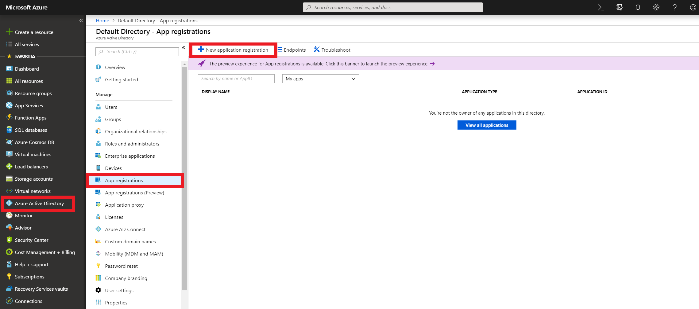
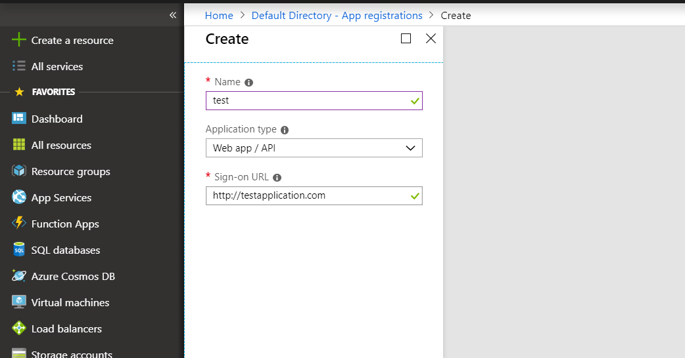
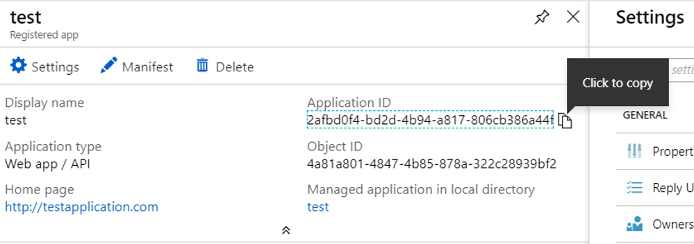
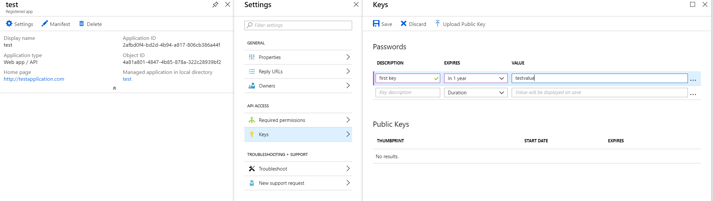
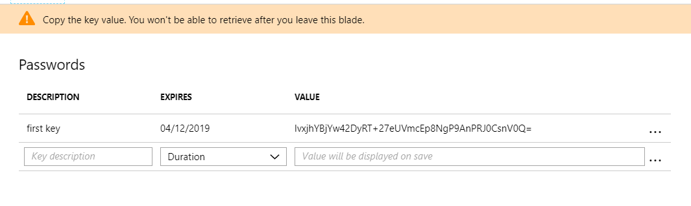
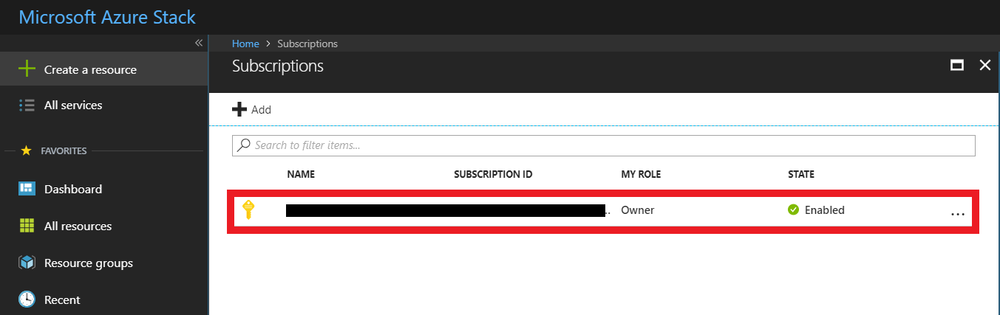
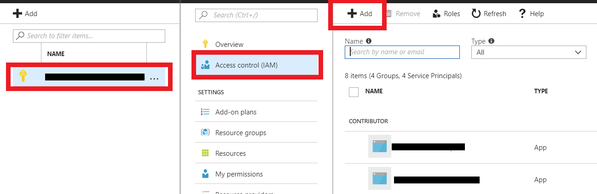
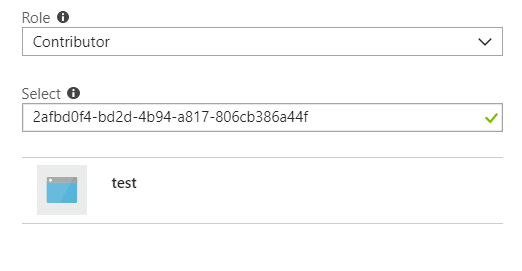

# How to create a service principal for Azure AD

## Overview

In Azure Stack you are able to grant an external application access to Azure Stack resources by creating a service principal that uses Azure Resource Manager. A service principal lets you delegate specific permissions using **role-based access control**. Service principals are preferable to running an application using your own credentials for the following reasons:

- You are able to assign specific permissions to the service principal that are different than your own account permissions. Typically, a service principal's permissions are restricted to exactly what the app needs to do which reduces the security risks involved with using external applications

- You do not have to change the application's credentials if your role or responsibilities change.

### Example

You have a configuration management application that needs to have access to inventory Azure resources using Azure Resource Manager. You can create a service principal and assign it to the Reader role. This role gives the app read-only access to Azure resources and ensures that the app can only read. This helps reduce the security risk as if it is breached the role can only read files, not edit them.

## Getting started

This guide will cover how to:

- Create a service principal for your application.

- Register your application and create an authentication key.

- Assign your application to a role.

## Creating a service principal for Azure AD

If your Azure Stack uses Azure AD as the identity store, you can create a service principal using the same steps as in Azure, using the Azure portal. Ensure that you have the required Azure AD permissions before trying to create a service principal.

### Creating a service principal

To create a service principal for your application:

1. Sign in to your Azure account through the public Azure portal.

2. Select **Azure Active Directory** > **App registrations** > **New application registration**.

    

3. Provide a name and URL for the application. Select either **Web app / API** or **Native** for the type of application you want to create. After setting the values, select **Create**.

    

### Getting Credentials

1. From App registrations in Active Directory, select your application.

2. Copy the Application ID and store it in your application code.

    

3. To generate an authentication key, select **Keys**.

    

4. Provide a description of the key, and a duration for the key. When done, select **Save**.

    

5. After you save the key, the key **Value** is displayed. Write down this value because you can't retrieve the key later. Store the key value where your application can retrieve it.

## Assigning the service principal to a role

To access resources in your subscription, you must assign the application to a role. Decide which role represents the right permissions for the application.

 > [!TIP]
 > You can set a role's scope at the level of a subscription, a resource group, or a resource. Permissions are inherited to lower levels of scope. For example, an app with the Reader role for a resource group means that the application can read any of the resources in the resource group.

Use the following steps as a guide for assigning a role to a service principal.

1. In the Azure Stack portal, navigate to the level of scope you want to assign the application to. For example, to assign a role at the subscription scope, select **Subscriptions**.

2. Select the subscription to assign the application to.

    

3. Select **Access Control (IAM)** for the subscription then click **Add**.

    

4. From the **Role** list, select the role you want to assign to the application and then from the **Select** list, find and select your application.

    

5. Click **OK** to finish assigning the role. You will now be able to see your application in the list of users assigned to a role for that scope.

## Feedback

  If you find an issue with this article, click **Improve this Doc** to suggest a change. If you have an idea for how we could improve any of our services, visit [*UKCloud Ideas*](https://ideas.ukcloud.com). Alternatively, you can contact us at <products@ukcloud.com>.
