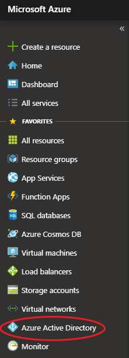
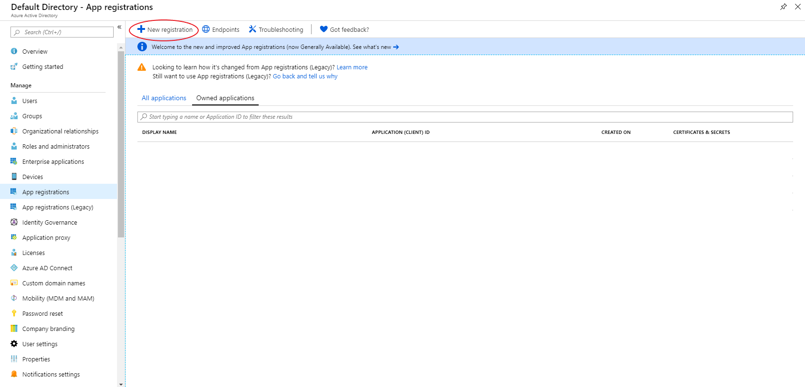
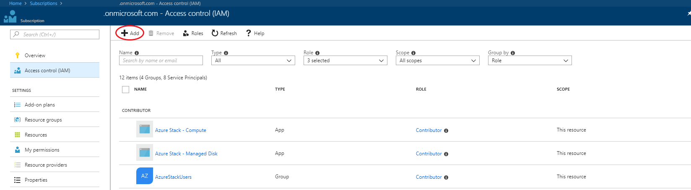
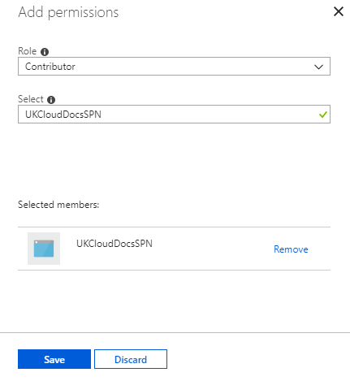

# How to create a service principal name for Azure Stack Hub using the Azure portal

This document explains how to create a service principal name to manage Azure and Azure Stack Hub using the Azure portal.

It will guide you through the creation of:

- An Azure application

- A service principal name

- Role assignment

- Permissions

## What is a service principal name?

An Azure service principal name (SPN) is a security identity used by user-created applications, services, and automation tools to access specific Azure resources. Think of it as a 'user identity' (username and password or certificate) with a specific role, and tightly controlled permissions. It only needs to be able to do specific things, unlike a general user identity. It improves security if you grant it only the minimum permissions level needed to perform its management tasks.

To log in and manage your resources via SPN you'll need to create an Azure application and then assign an SPN to it. Only then will you be able to perform tasks against your environment.

## Prerequisites

- 
An active Azure subscription

## Create an SPN

1. Log in to the [public Azure portal](https://portal.azure.com).

2. In the favourites panel, select **Azure Active Directory**.

    

3. In the *Azure Active Directory* blade, select **App registrations**.

4. On the *App registrations* page, click the **+ New registration** button.

    

5. In the *Register an application* blade, enter the following information:

   - **Name** - The name of the application. Should have a minimum of four characters.

   - **Supported account types** - Lets you decide who can use the service principal.

   - **Redirect URI (optional)** - The URL which the authentication response is sent to. In this instance, you can leave it blank.

    

6. Click **Register**.

## Gathering SPN credentials

1. On the blade that has now opened, copy the **Application ID** and store it somewhere secure. This value is sometimes referred to as the SPN Client ID.

    

2. On the blade menu, click the **Certificates & secrets** button.

3. Under *Client secrets*, click the **+ New client secret** button.

4. Enter a description for the key, select a expiry duration, then click **Add**.

5. Copy the displayed value for the key and store it somewhere secure. This value is referred to as the SPN Client Secret.

## Configure role-based access control for the SPN on Azure Stack Hub

1. Log in to the UKCloud Azure Stack Hub portal.

    For more detailed instructions, see the [*Getting Started Guide for UKCloud for Microsoft Azure*](azs-gs.md).

2. Navigate to the resource you want to give the SPN access to. In this example we are adding the SPN to the subscription resource to give it permission to all resources.

   1. View your subscription by clicking **All services** in the favourites panel, then selecting **Subscriptions** under the *General* section.

   2. Select your subscription.

   3. On your subscription's blade, select **Access Control (IAM)**.

3. On the *Access Control (IAM)* blade, click the **+ Add** button.

    

4. Select the role you want to add your SPN to.

5. Enter the name of the SPN in the **Select** field, select the SPN when it appears then click **Save**

    

The SPN will now have the appropriate permissions assigned to it and is ready for use.

## Feedback

If you find an issue with this article, click **Improve this Doc** to suggest a change. If you have an idea for how we could improve any of our services, visit the [Ideas](https://community.ukcloud.com/ideas) section of the [UKCloud Community](https://community.ukcloud.com).
