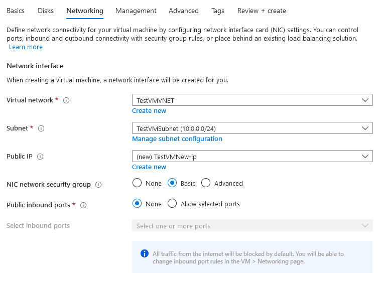
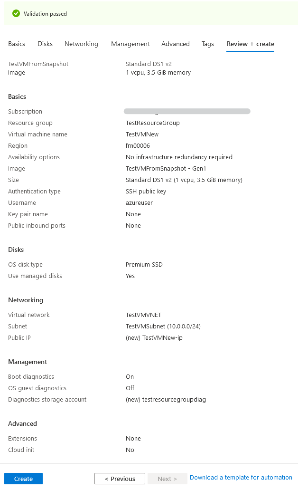

#### UKCloud Limited (“UKC”) and Virtual Infrastructure Group Limited (“VIG”) (together “the Companies”) – in Compulsory Liquidation

On 25 October 2022, the Companies were placed into Liquidation with the Official Receiver appointed as Liquidator and J Robinson and A M Hudson simultaneously appointed as Special Managers to manage the liquidation process on behalf of the Official Receiver.

Further information regarding the Liquidations can be found here: <https://www.gov.uk/government/news/virtual-infrastructure-group-limited-and-ukcloud-limited-information-for-creditors-and-interested-parties>

Contact details: 
For any general queries relating to the Liquidations please email <ukcloud@uk.ey.com> 
For customer related queries please email <ukcloudcustomers@uk.ey.com> 
For supplier related queries please email <ukcloudsuppliers@uk.ey.com>

# How to create a virtual machine from a disk snapshot using the UKCloud Azure Stack Hub portal

## Overview

A snapshot is a copy of a virtual disk at a specific point in time. Snapshots are often used as backups, as they enable you to quickly and easily restore a disk to its original state if something goes wrong. You can also export snapshots to a VHD file, which you can then use to externally troubleshoot potential issues with a virtual machine.

This article shows you how to use the UKCloud Azure Stack Hub portal to:

* Take a snapshot of a managed disk

* Create a new managed disk from the snapshot

* Create a virtual machine from the new managed disk

### Intended audience

To complete the steps in this article, you must have appropriate access to a subscription in the Azure Stack Hub portal.

## Creating a snapshot from a disk

1. Log in to the Azure Stack Hub portal.

    For more detailed instructions, see the [*Getting Started Guide for UKCloud for Microsoft Azure*](azs-gs.md).

2. In the favourites panel, select **All services**, then, in the *Compute* section, select **Disks**.

    

3. From the list, click the name of the disk that you want to create a snapshot from.

    

    > [!NOTE]
    > You can only create snapshots from managed disks.

4. In the new blade for the selected disk, click **Create snapshot**.

    

5. In the *Create snapshot* blade, enter the following information:

    - **Subscription** - This will be your UKCloud for Microsoft Azure subscription.

    - **Resource group** - Select an existing resource group, or create a new one by clicking the **Create new** link and then typing a name for your new resource group in the pop out window.

    - **Name** - The name of the snapshot.

    - **Region** - This will be the location of the Azure Stack Hub.

    - **Storage type** - Choose either Standard (HDD) or Premium (SSD) storage.

    

6. When you're done, click the **Review + create** button and then the **Create** button to create the snapshot.

7. You can monitor the progress of the snapshot creation by clicking the **Notifications** icon.

    

## Creating a new managed disk from a snapshot

1. In the favourites panel, select **All services**, then, in the *Compute* section, select **Disks**.

    

2. On the *Disks* blade, click **Add**.

    

3. In the *Create a managed disk* blade, enter the following information:

    - **Subscription** - This will be your UKCloud for Microsoft Azure subscription.

    - **Resource group** - Select an existing resource group, or create a new one by clicking the **Create new** link and then typing a name for your new resource group in the pop out window.

    - **Disk name** - The name of the disk.

    - **Region** - This will be the location of the Azure Stack Hub.

    - **Source type** - Select *Snapshot*.

        - **Source snapshot** - Select the previously created snapshot.

    - **Size** - This will be set to the size of the source disk that the snapshot was created from.

        > [!NOTE]
        > You can increase the size if necessary, but you cannot decrease it below the original size.

    

4. When you're done, click the **Review + create** button and then the **Create** button to create the disk.

5. You can monitor the progress of the disk creation by clicking the **Notifications** icon.

    

## Creating a virtual machine from a managed disk

1. In the favourites panel, select **All services**, then, in the *Compute* section, select **Disks**.

    

2. From the list, click the name of the disk that you want to create a virtual machine from. If you have been following this guide from the start, then this will be the disk that you just created from the snapshot.

    

3. In the new blade for the selected disk, under *Overview*, ensure that **Disk state** is listed as *Unattached*.

    > [!IMPORTANT]
    > If your disk is not in the *Unattached* state, you will have to delete the virtual machine object it is attached to.
    >
    > You can **only** detach data disks, **not** OS disks, from a virtual machine.

    

4. At the top of the blade, click **Create VM**.

5. In the *Create a virtual machine* blade, in the *Basics* step, enter general information about the VM, including a name, credentials and resource group.

    

6. Click **Change size** under the currently selected VM size to view all the available sizes. Select the appropriate size for your VM, depending on its purpose, then click **Select**.

    For information about the different available VM sizes, see [here](https://docs.microsoft.com/en-gb/azure/azure-stack/user/azure-stack-vm-sizes).

    

7. Change any of the optional settings located in the other tabs, then click **Review + create**.

    > [!IMPORTANT]
    > There will be no public inbound ports open on the network security group if left unchanged.

    

    > [!NOTE]
    > By default, boot diagnostics will be switched on for the virtual machine.

    

8. In the *Review + create* step, review the selections you've made and then click **Create** to start the deployment.

    

9. You can monitor the progress of your VM's deployment by clicking the **Notifications** icon.

    

## Feedback

If you find a problem with this article, click **Improve this Doc** to make the change yourself or raise an [issue](https://github.com/UKCloud/documentation/issues) in GitHub. If you have an idea for how we could improve any of our services, send an email to <feedback@ukcloud.com>.
