# How to create a virtual machine from a disk snapshot using PowerShell

## Overview

This article shows you how to use PowerShell to take a snapshot of a managed disk, use that to create a new managed disk, and finally create a virtual machine from the new disk.

### Prerequisites

Before you begin, ensure your PowerShell environment is set up as detailed in [Configure the Azure Stack Hub user's PowerShell environment](azs-how-configure-powershell-users.md).

## Creating a snapshot from a disk

1. Log in to the Azure Stack Hub portal.

    For more detailed instructions, see the [*Getting Started Guide for UKCloud for Microsoft Azure*](azs-gs.md).

2. Click **All services** in the favourites panel, then select **Disks** under the *Compute* section.

    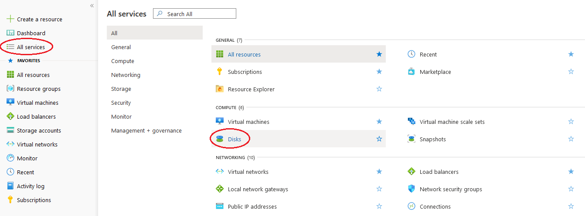

3. From the list, select the disk that you would like to create a snapshot from.

    

    > [!NOTE]
    > Snapshots can only be created from managed disks.

4. In the new blade for the selected disk, click **Create snapshot**.

    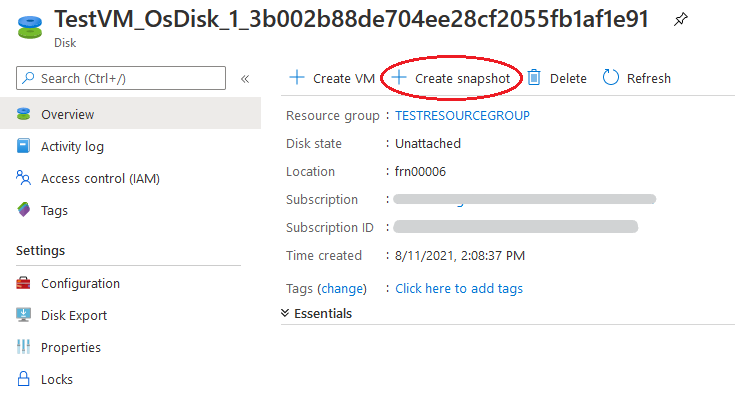

5. In the **Create snapshot** blade, enter the following information:

    - **Name** - The name of the snapshot.

    - **Subscription** - This will be your UKCloud for Microsoft Azure subscription.

    - **Resource group** - Select an existing resource group, or create a new one by typing a name for your new resource group.

    - **Location** - This will be the location of the Azure Stack Hub.

    - **Account type** - Choose either Standard (HDD) or Premium (SSD) storage.

    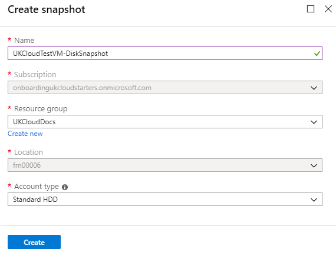

6. When you're done, click the **Create** button to create the snapshot.

7. You can monitor the progress of the snapshot creation by clicking the **Notifications** icon.

    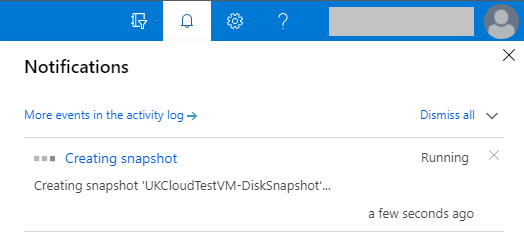

## Creating a new managed disk from a snapshot

1. Click **All services** in the favourites panel, then select **Disks** under the *Compute* section.

    

2. On the **Disks** blade, click **Add**.

    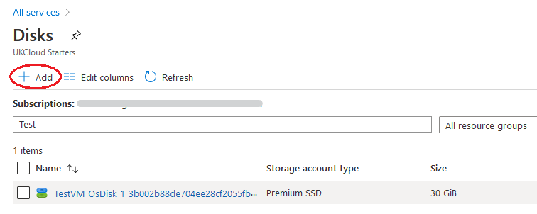

3. In the **Create managed disk** blade, enter the following information:

    - **Name** - The name of the disk.

    - **Subscription** - This will be your UKCloud for Microsoft Azure subscription.

    - **Resource group** - Select an existing resource group, or create a new one by typing a name for your new resource group.

    - **Location** - This will be the location of the Azure Stack Hub.

    - **Account type** - Choose either Standard (HDD) or Premium (SSD) storage.

    - **Source type** - Select *Snapshot* from the dropdown.
        - **Source snapshot** - Select the previously created snapshot.

    - **Size** - This will be set to the size of the source disk that the snapshot was created from.

        > [!NOTE]
        > You can increase the size if necessary, but you will not be allowed to decrease it below the original size.

    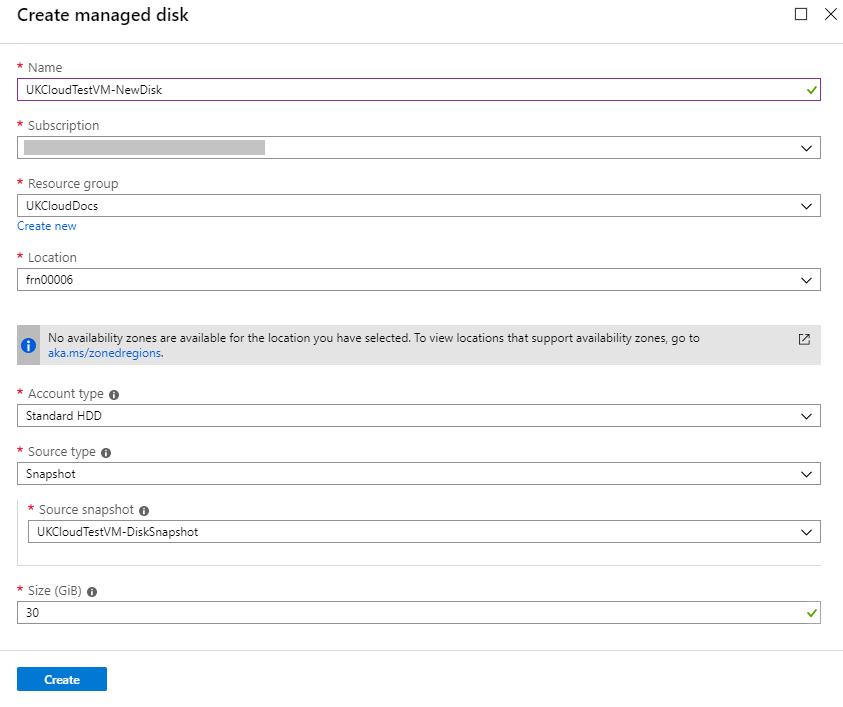

4. When you're done, click the **Create** button to create the disk.

5. You can monitor the progress of the disk creation by clicking the **Notifications** icon.

    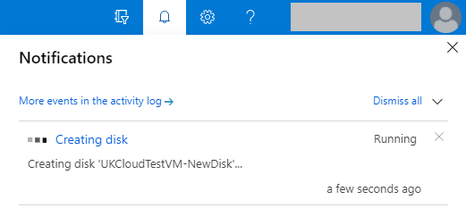

## Creating a virtual machine from a managed disk

1. Click **All services** in the favourites panel, then select **Disks** under the *Compute* section.

    

2. From the list, select the disk that you would like to create a virtual machine from.

    

3. In the new blade for the selected disk, under *Overview*, ensure that **Disk state** is listed as *Unattached*. If it isn't, you will need to detach the disk from the VM before you can use it.

    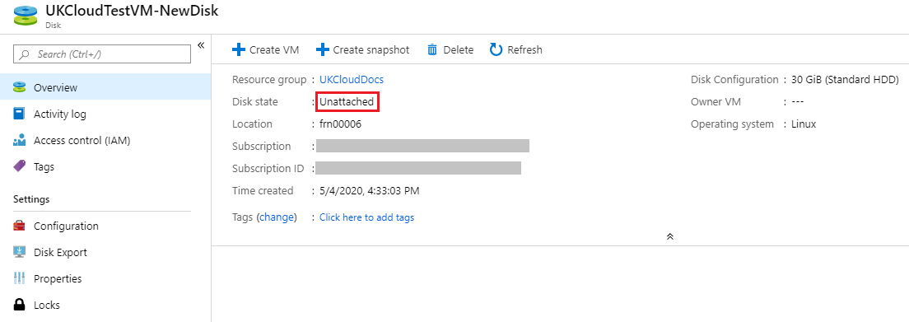

4. In the menu at the top of the blade, click **Create VM**.

5. In the **Create virtual machine** blade, in the *Basics* step, enter a Virtual machine name and either select an existing Resource group or create a new one, then click **OK**.

    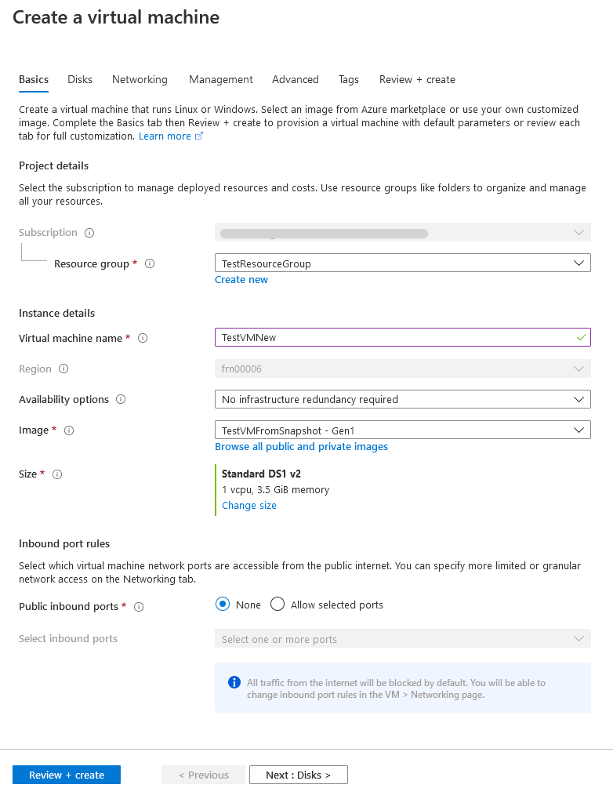

6. In the *Size* step, select the appropriate size for your VM, depending on its purpose, then click **Select**.

    For information about the different available VM sizes, see [https://docs.microsoft.com/en-gb/azure/azure-stack/user/azure-stack-vm-sizes](https://docs.microsoft.com/en-gb/azure/azure-stack/user/azure-stack-vm-sizes)

    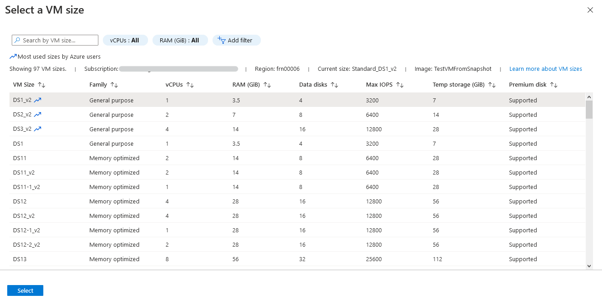

7. In the *Settings* step, change any of the optional settings as required for your VM, then click **OK**.

    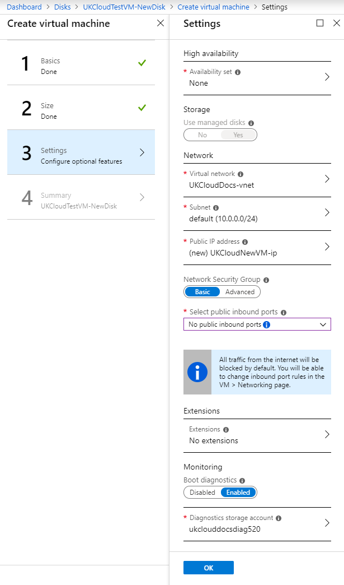

8. In the *Summary* step, review the selections you've made and then click **OK** to start the deployment.

    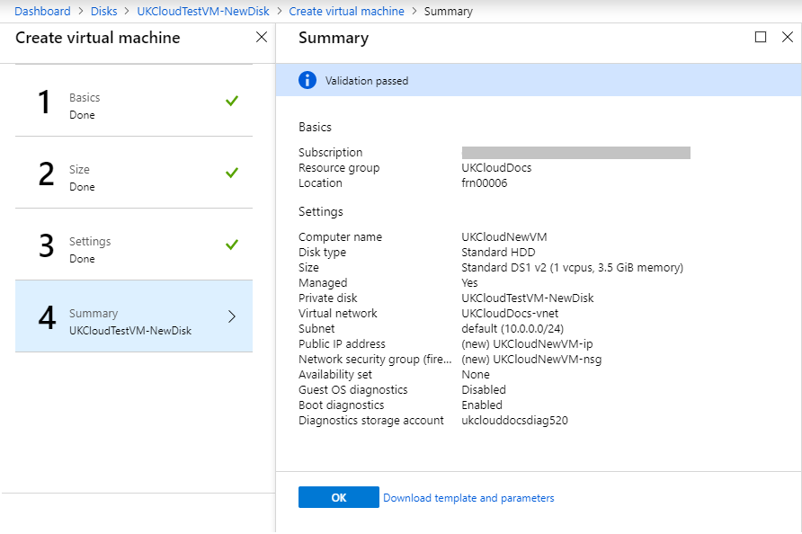

9. You can monitor the progress of your VM's deployment by clicking the **Notifications** icon.

    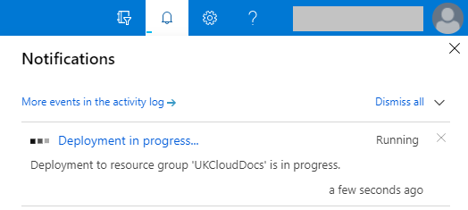

## Feedback

If you find a problem with this article, click **Improve this Doc** to make the change yourself or raise an [issue](https://github.com/UKCloud/documentation/issues) in GitHub. If you have an idea for how we could improve any of our services, send an email to <feedback@ukcloud.com>.
