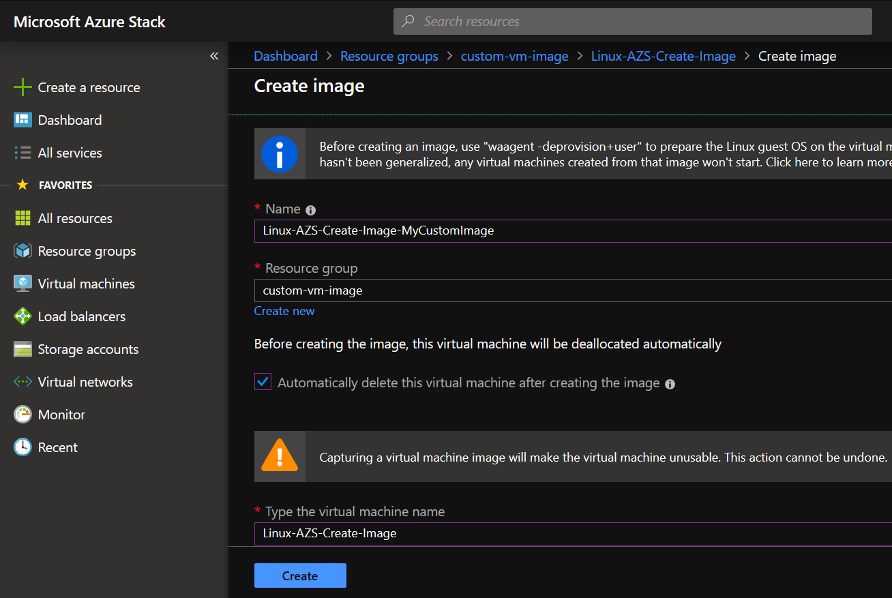
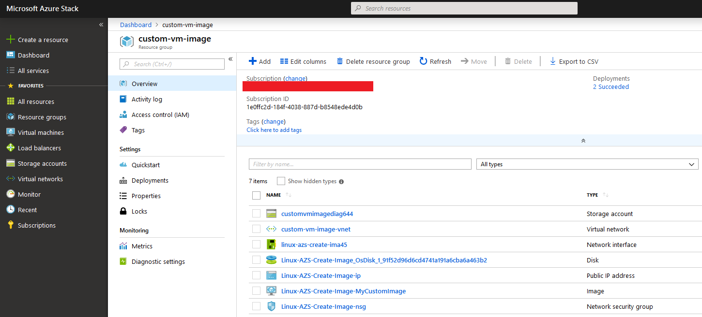
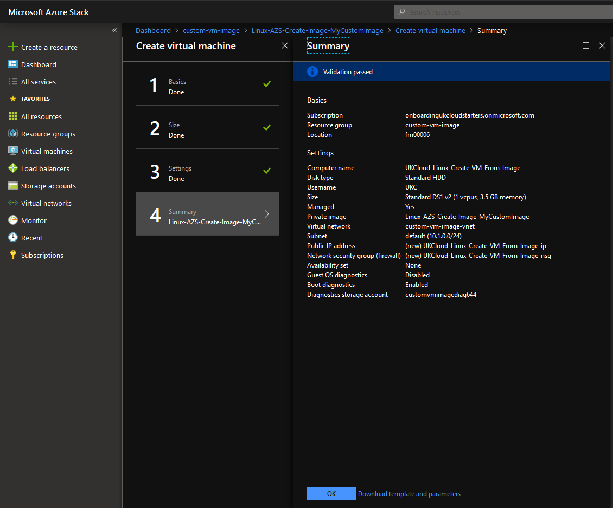

# How to create a custom image from a VM on Azure Stack Hub using the UKCloud Azure Stack Hub portal

## Overview

You can create an image resource from a generalised virtual machine (VM) that is stored as either a managed disk or an unmanaged disk in a storage account. You can then use the image to create multiple VMs.

This article explains how to create a custom image from a VM on Azure Stack Hub, which you can then use to deploy other VMs.

## Prerequisites

To complete the steps in this article, you must have appropriate access to a subscription in the Azure Stack Hub portal.

## [1. Generalise your VM](#tab/tabid-1)

> [!WARNING]
> Once you've generalised a VM, you **cannot** log back into it.

## [2. Creating the image](#tab/tabid-2)

> [!WARNING]
> Capturing a VM image will make it unusable and **cannot** be undone.

1. Log in to the [Azure Stack Hub portal](https://portal.frn00006.azure.ukcloud.com/).

    For more detailed instructions, see [Getting Started Guide for UKCloud for Microsoft Azure](azs-gs.md).

2. Click **Virtual Machines** on the left menu.

3. Click the VM that you want to capture.

4. At the top, click **Capture**.

    

5. In the new blade, provide a **Name** for the new image.

6. Select a **Resource group** from the dropdown menu or create a new one.

7. Select **Automatically delete this virtual machine after creating the image**.

8. Enter the VM name in the field **Type the virtual machine name**.

9. Click **Create**.

    

10. Wait for the image creation process to finish.

11. Once complete, your VM image will appear in the resource group you selected in step 6.

    

12. Click the VM image.

13. In the *new* page, click **Create VM**.

14. Enter a **Name**, **Username**, **Authentication type**, **Password** and **Resource group** for the new VM. Click **OK**.

15. Select a VM size. Click **Select**.

16. In *Configure optional features*, under *Select public inbound ports*, select the ports you want to open.

17. Click **OK**.

18. Review the *Summary* blade and click **OK**. The new VM will now begin deployment.

    

***

### [Windows](#tab/tabid-a/tabid-1)

1. Log in to your Windows VM using remote desktop protocol (RDP).

2. Open a PowerShell console or command prompt as administrator and run the following command: `C:\Windows\System32\Sysprep\sysprep.exe`

3. In the **System Preparation Tool**, under *System Cleanup Action*, select **Enter System Out-of-Box Experience (OOBE)** from the dropdown menu.

4. Ensure the **Generalize** tick box is selected.

5. Under *Shutdown Options*, select **Shutdown** from the dropdown menu.

    See the image below for an example:

    

6. Click **OK** and wait for the VM to shutdown. Your RDP session will be closed.

    > [!TIP]
    > The generalisation process is complete once your VM is in a stopped state.

### [Linux](#tab/tabid-b/tabid-1)

1. Log in to your Linux VM using secure shell (SSH).

2. Run the following command: `sudo su` and enter your user password.

3. Run the following command: `shutdown && waagent -deprovision+user -force`

4. Wait for the VM to shutdown. Your SSH session will be closed.

    > [!TIP]
    > The generalisation process is complete once your VM is in a stopped state.

***

## Feedback

If you find a problem with this article, click **Improve this Doc** to make the change yourself or raise an [issue](https://github.com/UKCloud/documentation/issues) in GitHub. If you have an idea for how we could improve any of our services, send an email to <feedback@ukcloud.com>.