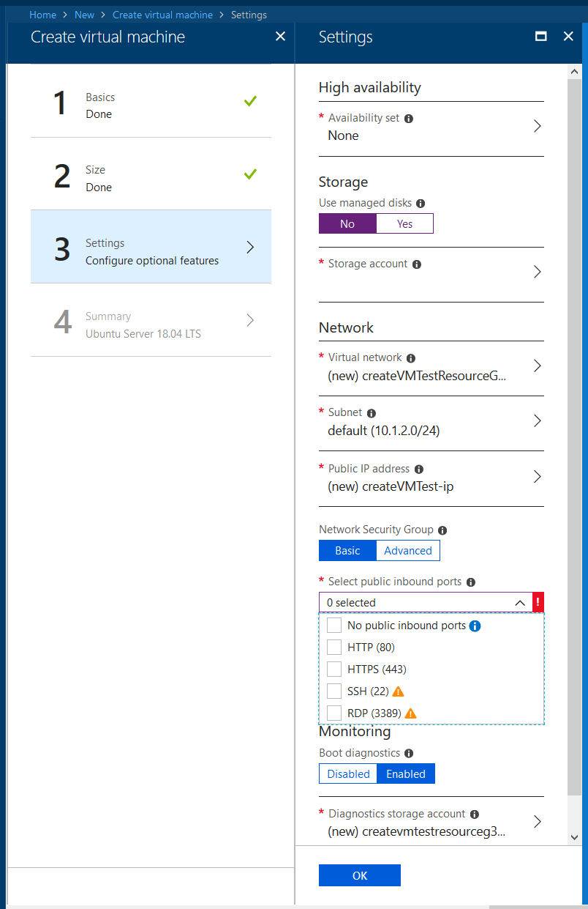
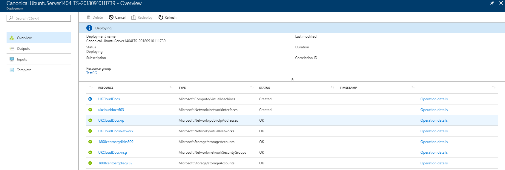
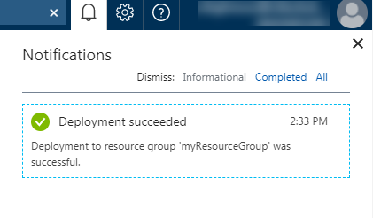
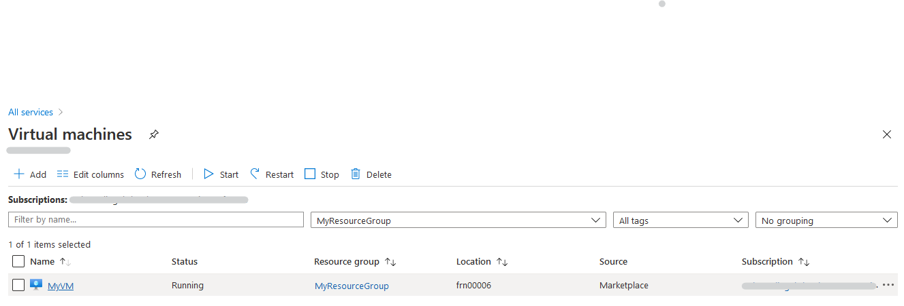
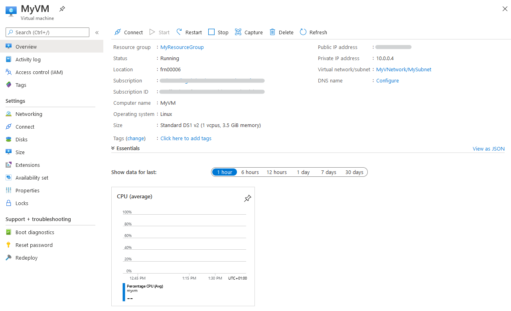

# How to create a virtual machine using the UKCloud Azure Stack Hub portal

## Overview

With UKCloud for Microsoft Azure, you can leverage the power of Microsoft Azure to create virtual machines (VMs) for your on-premises applications. As UKCloud for Microsoft Azure is built on UKCloud’s assured, UK-sovereign multi-cloud platform, those applications can work alongside other cloud platforms, such as Oracle, VMware and OpenStack, and benefit from native connectivity to non-cloud workloads in Crown Hosting and government community networks, including PSN, HSCN and RLI.

### Intended audience

To complete the steps in this guide, you must have appropriate access to a subscription in the Azure Stack Hub portal.

## Creating a virtual machine

VMs provide the basic compute building blocks in Azure Stack Hub. You can create VMs using the Azure Stack Hub Marketplace, which provides access to pre-created images to quickly deploy the VMs you need to build your applications. Microsoft makes Azure Marketplace images available for Azure Stack Hub once they have passed an accreditation process. If you cannot find the image you require in the Azure Stack Hub Marketplace please raise a support call via the UKCloud portal and if possible we will make your requested image available in Azure Stack Hub Marketplace.

**To create a VM from the Azure Marketplace:**

1. Log in to the Azure Stack Hub portal.

   For more detailed instructions, see the [*Getting Started Guide for UKCloud for Microsoft Azure*](azs-gs.md).

2. In the favourites panel, select **Create a resource**.

    

3. In the *New* blade, select **Compute**.

    

4. In the *Compute* blade, select the template that you want to use for your VM.

    

5. In the *Create virtual machine* blade, in the *Basics* step, enter general information about the VM, including a name, credentials and resource group, then click **OK**.

    

6. In the *Size* step, select the appropriate size for your VM, depending on its purpose, then click **Select**.

    For information about the different available VM sizes, see <https://docs.microsoft.com/en-gb/azure/azure-stack/user/azure-stack-vm-sizes>

    

7. In the *Settings* step, change any of the optional settings as required for your VM, then click **OK**.

    

>[!NOTE]
>As of version 1811 for storage "managed disks" are selected by default and you need to select the public inbound ports you want enabled.

8. In the *Summary* step, review the selections you've made and then click **OK** to start the deployment.

9. You can monitor the progress of your VM's deployment by clicking the **Notifications** icon.

    

10. Click the deployment notification for the deployment to view details of the deployment of the VM and its resources.

    

11. When the deployment is finished, the notification will change to **Deployment succeeded**.

    

12. After your VM has deployed, you can view it by clicking **Virtual machines** in the favourites panel.

    

13. Select your VM from the list.

    

14. In the blade for your VM, you can view and monitor the VM, change its settings and perform diagnostics and troubleshooting.

    

## Next steps

For more information about UKCloud for Microsoft Azure, see:

- [*Understanding UKCloud for Microsoft Azure*](azs-ref-overview.md)

- [*Getting Started Guide for UKCloud for Microsoft Azure*](azs-gs.md)

- [*UKCloud for Microsoft Azure FAQs*](azs-faq.md)

## Related videos

- [*UKCloud Azure Stack Hub portal overview video*](azs-vid-overview.md)

## Feedback

If you find an issue with this article, click **Improve this Doc** to suggest a change. If you have an idea for how we could improve any of our services, visit the [Ideas](https://community.ukcloud.com/ideas) section of the [UKCloud Community](https://community.ukcloud.com).
