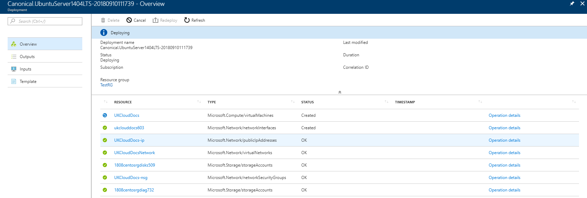

# How to create a virtual machine from the Azure Marketplace

## Introduction

With UKCloud's Sovereign Azure cloud, you can leverage the power of Microsoft Azure to create virtual machines (VMs) for your on-premises applications. As Sovereign Azure is built on UKCloud's assured, UK-sovereign multi-cloud platform, those applications can work alongside other cloud platforms, such as Oracle, VMware and OpenStack, and benefit from native connectivity to non-cloud workloads in Crown Hosting and government community networks, including PSN, HSCN and RLI.

### Intended audience

To complete the steps in this guide, you must have appropriate access to a subscription in the UKCloud Azure Stack portal.

## Creating a Sovereign Azure virtual machine

VMs provide the basic compute building blocks in Azure Stack. You can create VMs using the Azure Marketplace, which provides access to pre-created images to quickly deploy the VMs you need to build your applications.

**To create a VM from the Azure Marketplace:**

1. Log in to the UKCloud Azure Stack portal.

   For more detailed instructions, see the [Getting Started Guide for Sovereign Azure](https://portal.ukcloud.com/support/knowledge_centre/87af49fe-ce0f-475d-8d5f-dca53f256b64).

2. In the favourites panel, select **New**.

    

3. In the _New_ blade, select **Compute**.

    

4. In the *Compute* blade, select the image that you want to use for your VM, for example, **Ubuntu Server 17.0**.

    

   **_anything in particular we want to point out here?_**

5. In the *Deployment* blade, click **Create** to confirm your VM image selection.

    

6. In the *Create virtual machine* blade, in the *Basics* step, enter general information about the VM, including a name, credentials and resource group, then click **OK**.

    

7. In the *Size* step, select the appropriate size for your VM, depending on its purpose, then click **Select**.

Size | vCPU | Memory (GiB) | Temp storage (GiB)
-----|------|--------------|-------------------
Standard_D1_v2 | 1 | 3.5 | 50
Standard_D2_v2 | 2 | 7 | 100
Standard_D3_v2 | 4 | 14 | 200
Standard_D4_v2 | 8 | 28 | 400
Standard_A0 | 1 | 0.768 | 20
Standard_A1 | 1 | 1.75 | 70
Standard_A2 | 2 | 3.5 | 135
Standard_A3 | 4 | 7 | 285
Standard_A4 | 8 | 14 | 605
Standard_A5 | 2 | 14 | 135
Standard_A6 | 4 | 28 | 285
A0\Basic_A0 | 1 | 768 MB | 20 GB
A1\Basic_A1 | 1 | 1.74 GB | 40 GB
A2\Basic_A2 | 2 | 3.5 GB | 60 GB
A3\Basic_A3 | 4 | 7 GB | 120 GB
A4\Basic_A4 | 8 | 14 GB | 240 GB
Standard_DS11_v2 | 2 | 14 | 28
Standard_DS12_v2 | 4 | 28 | 56

**_need to confirm list above is correct and up to date_**

   > Tip! By default, the list shows a selection of recommended VM sizes. To see all available VM sizes, click **View all**.

    

8. In the *Settings* step, change any of the optional settings as required for your VM, then click **OK**.

   **_any recommendations or best practices we want to suggest here?_**

    

9. In the *Summary* step, review the selections you've made and then click **OK** to start the deployment.
10. You can monitor the progress of your VM's deployment by clicking the **Notifications** icon.

    

11. Click the deployment notification for the deployment to view details of the deployment of the VM and its resources.

    

12. When the deployment is finished, the notification wil change to **Deployment succeeded**.

    

13. After your VM has deployed, you can view it by clicking **Virtual machines** in the favourites panel.

    

14. Select your VM from the list.

    

15. In the blade for your VM, you can view and monitor the VM, change its settings and perform diagnostics and troubleshooting.

    

## Next steps

For more information about our Sovereign Azure cloud, see:

- [Getting Started Guide for Sovereign Azure](https://portal.ukcloud.com/support/knowledge_centre/87af49fe-ce0f-475d-8d5f-dca53f256b64)
- [Sovereign Azure BETA FAQs](https://portal.ukcloud.com/support/knowledge_centre/de19b410-f844-419b-afd0-bb3dbab0a217)

## Feedback

If you have any comments on this article, or any other aspect of your UKCloud experience, send them to feedback@ukcloud.com.

(c) UKCloud Ltd, 2018. All Rights Reserved.