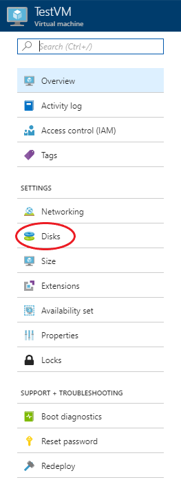

# How to create a virtual machine from a disk snapshot using the UKCloud Azure Stack Hub portal

## Overview

The UKCloud Azure Stack Hub portal allows you to create a snapshot of a managed disk. This article shows you how to create a virtual machine using the snapshot of a managed disk.

### Intended audience

To complete the steps in this article, you must have appropriate access to a subscription in the Azure Stack Hub portal.

## Resizing disks that are mounted to a VM

1. Log in to the Azure Stack Hub portal.

    For more detailed instructions, see the [*Getting Started Guide for UKCloud for Microsoft Azure*](azs-gs.md).

2. In the favourites panel, select **Virtual machines**.

    

3. In the *Virtual machines* blade, select the virtual machine that the disk is attached to.

4. In the virtual machine's blade, select **Disks**.

    

## Feedback

If you find a problem with this article, click **Improve this Doc** to make the change yourself or raise an [issue](https://github.com/UKCloud/documentation/issues) in GitHub. If you have an idea for how we could improve any of our services, send an email to <feedback@ukcloud.com>.
