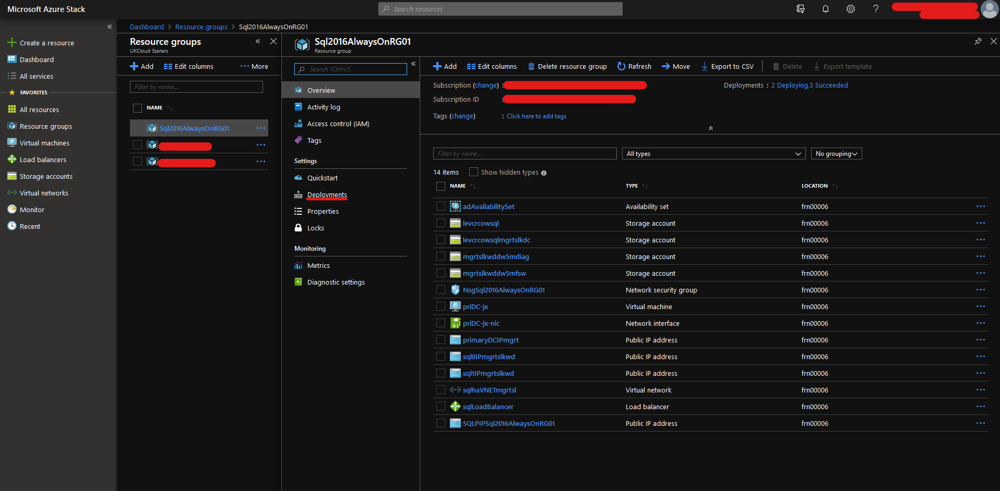
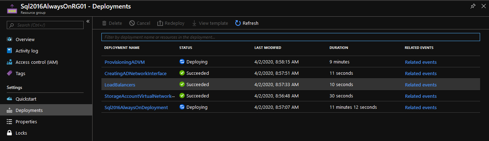

# How to deploy an SQL template to Azure Stack Hub using PowerShell

This article explains how to deploy an SQL Always On Cluster using an ARM Template to Azure Stack Hub using PowerShell.

It will guide you through the process of:

- Obtaining an ARM Template

- Deploying an [ARM Template for SQL Always On](https://github.com/Azure/AzureStack-QuickStart-Templates/tree/master/sql-2016-alwayson)

## What is an ARM Template?

You can use Azure Resource Manager (ARM) templates to deploy and provision all the resources for your application in a single, coordinated operation. You can also redeploy templates to make changes to the resources in a resource group.
These templates can be deployed via the Azure Stack Hub portal, PowerShell, Azure CLI, REST API and Visual Studio.
The following quick-start templates are available on [GitHub](https://aka.ms/AzureStackGitHub).

## Prerequisites

Prerequisites from a Windows-based external client are:

- PowerShell 5.1 and AzureStack PowerShell Module:

  - [Configure PowerShell Environment and Azure Stack Hub Module](azs-how-configure-powershell-users.md)

- An active Azure Stack Hub subscription. 

- An Azure Stack Hub [Service Principal Name (SPN)](azs-how-create-spn-portal.md).

## Official documentation

- [Azure Stack Hub ARM Templates Overview](https://docs.microsoft.com/en-us/azure/azure-stack/user/azure-stack-arm-templates)

- [Deploy a template to Azure Stack Hub using PowerShell](https://docs.microsoft.com/en-us/azure/azure-stack/user/azure-stack-deploy-template-powershell)

- [Understand the structure and syntax of Azure Resource Manager Templates](https://docs.microsoft.com/en-us/azure/azure-resource-manager/resource-group-authoring-templates)

- [GitHub Template Repository](https://github.com/Azure/AzureStack-QuickStart-Templates/tree/master)

## Download SQL Always On template from GitHub

SQL Always On Repository - [sql-2016-alwayson](https://github.com/Azure/AzureStack-QuickStart-Templates/tree/master/sql-2016-alwayson)

> [!NOTE]
> This will download just the sql-2016-alwayson folder from the repository instead of downloading all of it.
>
> Change **~/sql-2016-alwayson** below to the desired folder.

- From an elevated (run as administrator) PowerShell prompt run:

  ```powershell
  mkdir ~/sql-2016-alwayson
  cd ~/sql-2016-alwayson
  git init
  git config core.sparseCheckout true
  git remote add origin -f "https://github.com/Azure/AzureStack-QuickStart-Templates"
  "sql-2016-alwayson*" | Out-File -FilePath .git/info/sparse-checkout -Encoding ASCII
  cat .git/info/sparse-checkout
  git checkout master
  ```

## What does it deploy?

This template deploys two SQL Server 2016 SP1 or SP2 Enterprise / Standard / Developer instances in the Always On Availability Group using the PowerShell DSC extension. It creates the following resources:

- A network security group.

- A virtual network.

- Four storage accounts (One for AD, one for SQL, one for file share witness and one for VM diagnostics).

- Four public IP address (One for AD, one for each SQL VM and one for a public LB bound to SQL always on listener).

- One external load balancer for SQL VMs with a public IP bound to the SQL always on listener.

- One VM (WS2016) configured as a domain controller for a new forest with a single domain.

- Two VMs (WS2016) configured as SQL Server 2016 SP1 or SP2 Enterprise/Standard/Developer.

- One VM (WS2016) configured as a file share witness for the cluster.

- Two availability sets, one containing the SQL and FSW 2016 VMs, the other containing the domain controller VM.

### Notes

The images used to create this deployment are:

- Active Directory (AD) and File Share Witness (FSW) - Windows Server 2016 Datacenter image.

- SQL Server - SQL Server 2016 SP1 or SP2 on Windows Server 2016 image (Enterprise, Standard or Developer).

- SQL IAAS Extension 1.2.30.

- Latest DSC Extension (2.76.0 or higher).

- Latest custom script extension for Windows (1.9.1, or higher).

> [!WARNING]
> If you deploy SQL STANDARD, your Availability Group will have limitations as per [Basic Availability Groups](https://docs.microsoft.com/en-us/sql/database-engine/availability-groups/windows/basic-availability-groups-always-on-availability-groups?view=sql-server-2017):
>
> ## Basic Availability Group Limitations
> Basic availability groups use a subset of features compared to those normally found in advanced availability groups on SQL Server 2016 Enterprise Edition. Basic availability groups include the following limitations:
>
> - Limit of two replicas (primary and secondary).
>  
> - No read access on secondary replica.
>
> - No backups on secondary replica.
>
> - No integrity checks on secondary replicas.
>
> - No support for replicas hosted on servers running a version of SQL Server prior to SQL Server > 2016 Community Technology Preview 3 (CTP3).
>
> - Support for one availability database.
>
> - Basic availability groups cannot be upgraded to advanced availability groups. The group must be dropped and re-added to a group that contains servers running only SQL Server 2016 Enterprise Edition.
>
> - Basic availability groups are only supported for Standard Edition servers.
>
> - Basic availability groups can not be part of a distributed availability group.

### Configuration

- Each SQL VM will have the number and size of data disks specified, of up to 1TiB each. The SQL extension will configure these into a single volume using storage spaces.

- The template configures the SQL instances with contained database authentication set to **true**.

- The SQL VMs and the file share witness will be configured in an availability set:

    - Integrated systems (fault domains:3, update domains:5)

- The DNS suffix for public IP addresses.

## Overview of the ARM Template deployment process for Azure Stack Hub using Service Principal Name (SPN) authentication

1. Declare your variables accordingly.

2. Create your Azure Stack Hub environment.

3. Log in to your Azure Stack Hub subscription with the SPN.

4. Check if the resource group exists and create one if it does not.

5. Validate the JSON ARM template to ensure it is a valid deployment.

6. Deploy resources from ARM Template.

## List of parameters you can define in the template

| Name                            | Description                                                                   | AllowedValues                                                         | DefaultValue                                                                         |
| ------------------------------- | ----------------------------------------------------------------------------- | --------------------------------------------------------------------- |------------------------------------------------------------------------------------ |
| _artifactsLocation                   | The blob store where all deployment artifacts are stored          |                                                                       | https<!-- -->://raw.githubusercontent.com/Azure/AzureStack-QuickStart-Templates/master/sql-2016-alwayson
| AdminPassword                   | The password for the administrator account of the new VMs and domain          |                                                                       |                                                                                     |
| AdminUsername                   | The name of the administrator of the new VMs and domain                       |                                                                       | localadmin                                                                                     |
| AdPDCNICIPAddress               | The IP address of the new AD VM                                               |                                                                       | 10.0.0.250                                                                             |
| AdVMSize                        | The size of the AD VM created                                                | {Standard_D1_v2, Standard_D2_v2}                            | Standard_D2_v2                                                                         |
| AutoPatchingDay                 | The day of the week for auto patching                                           | {Never, Everyday, Sunday, Monday...}                                  | Sunday                                                                                |
| AutoPatchingStartHour           | The start hour of the day for auto patching                                     | {0, 1, 2, 3... 23}                                                       | 2                                                                                    |
| DeploymentPrefix                | The DNS Prefix for the public IP address for the always on cluster            |                                                                       | aodns                                                                                |
| DnsSuffix                       | The DNS Suffix for reverse lookup of public IP addresses                  | azure.ukcloud.com                                                     |                                                                  |
| DomainName                      | The FQDN of the AD domain created                                             |                                                                       | fabrikam.local                                                                        |
| SqlAOAGName                     | The SQL AlwaysOn group name                                                   |                                                                       | sqlaa-ag                                                                          |
| SqlAOListenerName               | The SQL AG listener name                                                      |                                                                       |[tolower(concat('ao-listen-' , resourceGroup().name))]                          |
| SqlAOListenerPort               | The SQL AG listener port                                                      |                                                                       | 1433                                                                                 |
| SqlAuthPassword                 | The SQL server auth account password                                          |                                                                       |                                                                                      |
| SqlAuthUserName                 | The SQL server auth account name                                              |                                                                       | sqlsa                                                                               |
| SqlServerServiceAccountPassword | The SQL server service account password                                       |                                                                       |                                                                                      |
| SqlServerServiceAccountUserName | The SQL server service account name                                           |                                                                       | sqlservice                                                                           |
| SqlServerOffer                | The SQL server version                                                        | {SQL2016SP1-WS2016, SQL2016SP2-WS2016} | SQL2016SP2-WS2016              |
| SqlServerSku                | The name of the SQL server SKU                                                        | {Enterprise, Standard, SQLDEV}              | Enterprise
| SqlStorageAccountName           | The name of the SQL server storage account                                        |                                                                       |[tolower(concat(take(uniqueString(resourceGroup().id),8),'sql'))]
| SqlStorageAccountType           | The type of the SQL server storage account created                            | {Premium_LRS, Standard_LRS}                                         | Premium_LRS                                                                        |
| SqlSubnet                       | The address range of the SQL subnet created in the new VNET                   |                                                                       | 10.0.1.0/26                                                                          |
| SqlVMSize                       | The size of the SQL VMs created                                               | {Standard_DS2_v2, Standard_DS3_v2, Standard_DS4_v2, Standard_DS5_v2, Standard_DS11_v2, Standard_DS12_v2, Standard_DS13_v2}                            | Standard_DS2_v2                                                                         |
| NumberOfSqlVMDisks                       | The number of data disks for each SQL VM                                               | {1...32}                            | 2                             |
| StaticSubnet                    | The address range of the subnet static IPs which are allocated from within the new VNET |                                                                       | 10.0.0.0/24                                                                          |
| VirtualNetworkAddressRange      | The address range of the new VNET in CIDR format                              |                                                                       | 10.0.0.0/16                                                                          |
| VirtualNetworkName              | Name of virtual network to be created                                         |                                                                       | sqlhaVNET                                                                         |
| VMDiskSize                      | The size of the SQL VMs' data disk(s) in GB.                                          | {128, 256, 512, 1023}                                                 | 128                                                                                  |
| WitnessVMSize                   | The size of the witness VM created                                            | {Standard_D1_v2, Standard_D2_v2}                           | Standard_D1_v2                                                                         |
| WorkloadType                    | The SQL VM work load type                        | {GENERAL, OLTP, DW}                                                               | GENERAL        |
| SampleDatabaseName              | Sample HA database                              | | AutoHa-sample |

## Deploy ARM template code

### Declare variables

> [!IMPORTANT]
> Credential variables to change:
>
> `$AppGUID`, `$AppPassword`
>
> **Required Variables** for SQL template:
>
> `$AdminPassword`, `$SqlServerServiceAccountPassword`, `$SqlAuthPassword`
>
> Additional variables that you **should** change:
>
> `$DomainName`, `$AdminUsername`, `$SqlServerServiceAccountUserName`
>
> In the example below it has been already set accordingly.
>
> To change the SQL server version that is deployed, set **$SqlServerOffer** accordingly: **`SQL2016SP1-WS2016`**, **`SQL2016SP2-WS2016`**.
> The current default is set to **`SQL2016SP2-WS2016`**.
>
> To change the SQL server SKU that is deployed, set **SqlServerSKU** accordingly: **`Enterprise`** or **`Standard`** or **`SQLDEV`**.
> The current default is set to **`Enterprise`**.

Enter details below to provide values for the variables in the following scripts in this article:

| Variable name   | Variable description                                               | Input            |
|-----------------|--------------------------------------------------------------------|------------------|
| \$ArmEndpoint    | The Azure Resource Manager endpoint for Azure Stack Hub                 | <form oninput="result.value=armendpoint.value" id="armendpoint" style="display: inline;"><input type="text" id="armendpoint" name="armendpoint" style="display: inline;" placeholder="https://management.frn00006.azure.ukcloud.com"/></form> |
| \$ClientID    | The client ID of your Azure Stack Hub SPN                 | <form oninput="result.value=clientid.value" id="clientid" style="display: inline;"><input type="text" id="clientid" name="clientid" style="display: inline;" placeholder="00000000-0000-0000-0000-000000000000"/></form> |
| \$ClientSecret    | The client secret of your Azure Stack Hub SPN                 | <form oninput="result.value=clientsecret.value" id="clientsecret" style="display: inline;"><input type="text" id="clientsecret" name="clientsecret" style="display: inline;" placeholder="ftE2u]iVLs_J4+i-:q^Ltf4!&{!w3-%=3%4+}F2jk]="/></form> |
| \$TenantID    | The Tenant/Directory ID of your AAD domain                 | <form oninput="result.value=tenantid.value" id="tenantid" style="display: inline;"><input type="text" id="tenantid" name="tenantid" style="display: inline;" placeholder="contoso.onmicrosoft.com"/></form> |
| \$AdminPassword    | The password for the administrator account of the new VMs and domain                | <form oninput="result.value=adminpassword.value" id="adminpassword" style="display: inline;"><input type="text" id="adminpassword" name="adminpassword" style="display: inline;" placeholder="Password123!"/></form> |
| \$SqlServerServiceAccountPassword    | The SQL server service account password             | <form oninput="result.value=sqlserviceaccountpw.value" id="sqlserviceaccountpw" style="display: inline;"><input type="text" id="sqlserviceaccountpw" name="sqlserviceaccountpw" style="display: inline;" placeholder="Password123!"/></form> |
| \$SqlAuthPassword    | The SQL server auth account password            | <form oninput="result.value=sqlauthpassword.value" id="sqlauthpassword" style="display: inline;"><input type="text" id="sqlauthpassword" name="sqlauthpassword" style="display: inline;" placeholder="Password123!"/></form> |
| \$DomainName    | The FQDN of the AD domain created            | <form oninput="result.value=domainname.value" id="domainname" style="display: inline;"><input type="text" id="domainname" name="domainname" style="display: inline;" placeholder="fabrikam.local"/></form> |
| \$AdminUsername    | The name of the administrator of the new VMs and domain            | <form oninput="result.value=adminusername.value" id="adminusername" style="display: inline;"><input type="text" id="adminusername" name="adminusername" style="display: inline;" placeholder="localadmin"/></form> |
| \$SqlServerServiceAccountUserName    | The SQL server service account name            | <form oninput="result.value=sqlserversausername.value" id="sqlserversausername" style="display: inline;"><input type="text" id="sqlserversausername" name="sqlserversausername" style="display: inline;" placeholder="sqlservice"/></form> |
| \$CustomTemplateJSON    | The full path to the directory containing the azuredeploy.json file             | <form oninput="result.value=customtemplatejson.value" id="customtemplatejson" style="display: inline;"><input type="text" id="customtemplatejson" name="customtemplatejson" style="display: inline;" placeholder="~\sql-2016-alwayson\sql-2016-alwayson\azuredeploy.json"/></form> |
| \$DNSSuffix    | The DNS Suffix for reverse lookup of public IP addresses             | <form oninput="result.value=dnssuffix.value" id="dnssuffix" style="display: inline;"><input type="text" id="dnssuffix" name="dnssuffix" style="display: inline;" placeholder="azure.ukcloud.com"/></form> |
| \$ResourceGroupName    | The name of the resource group to deploy the template within             | <form oninput="result.value=resourcegroupname.value" id="resourcegroupname" style="display: inline;"><input type="text" id="resourcegroupname" name="resourcegroupname" style="display: inline;" placeholder="Sql2016AlwaysOnRG01"/></form> |
| \$SqlServerOffer    | The SQL server version             | <form oninput="result.value=sqlserveroffer.value" id="sqlserveroffer" style="display: inline;"><input type="text" id="sqlserveroffer" name="sqlserveroffer" style="display: inline;" placeholder="SQL2016SP2-WS2016"/></form> |
| \$SqlServerSKU    | The name of the SQL server SKU             | <form oninput="result.value=sqlserversku.value" id="sqlserversku" style="display: inline;"><input type="text" id="sqlserversku" name="sqlserversku" style="display: inline;" placeholder="Enterprise"/></form> |
| \$ArmDeploymentName    | The name of the template deploment in Azure Resource Manager (ARM)             | <form oninput="result.value=armdeploymentname.value" id="armdeploymentname" style="display: inline;"><input type="text" id="armdeploymentname" name="armdeploymentname" style="display: inline;" placeholder="Sql2016AlwaysOnDeployment"/></form> |


<pre><code class="language-PowerShell"># Declare login variables
$ClientID = "<output form="clientid" name="result" style="display: inline;">00000000-0000-0000-0000-000000000000</output>"
$ClientSecret = "<output form="clientsecret" name="result" style="display: inline;">ftE2u]iVLs_J4+i-:q^Ltf4!&{!w3-%=3%4+}F2jk]=</output>"

$TenantID = "<output form="tenantid" name="result" style="display: inline;">contoso.onmicrosoft.com</output>"
$ArmEndpoint = "<output form="armendpoint" name="result" style="display: inline;">https://management.frn00006.azure.ukcloud.com</output>"
$AzureStackEnvironment = "AzureStackUser"

# Declare variables for the template
$AdminPassword = "<output form="adminpassword" name="result" style="display: inline;">Password123!</output>"
$AdminPasswordCred = ConvertTo-SecureString -String $AdminPassword -AsPlainText -Force

$SqlServerServiceAccountPassword = "<output form="sqlserviceaccountpw" name="result" style="display: inline;">Password123!</output>"
$SqlServerServiceAccountPasswordCred = ConvertTo-SecureString -String $SqlServerServiceAccountPassword -AsPlainText -Force

$SqlAuthPassword = "<output form="sqlauthpassword" name="result" style="display: inline;">Password123!</output>"
$SqlAuthPasswordCred = ConvertTo-SecureString -String $SqlAuthPassword -AsPlainText -Force

$DomainName = "<output form="domainname" name="result" style="display: inline;">fabrikam.local</output>"
$AdminUsername = "<output form="adminusername" name="result" style="display: inline;">localadmin</output>"
$SqlServerServiceAccountUserName = "<output form="sqlserversausername" name="result" style="display: inline;">sqlservice</output>"

$CustomTemplateJSON = "<output form="customtemplatejson" name="result" style="display: inline;">~\sql-2016-alwayson\sql-2016-alwayson\azuredeploy.json</output>"

$DNSSuffix = "<output form="dnssuffix" name="result" style="display: inline;">azure.ukcloud.com</output>"
$ResourceGroupName = "<output form="resourcegroupname" name="result" style="display: inline;">Sql2016AlwaysOnRG01</output>"
$Location = (Get-AzureRmLocation).Location

$SqlServerOffer = "<output form="sqlserveroffer" name="result" style="display: inline;">SQL2016SP2-WS2016</output>"
$SqlServerSKU = "<output form="sqlserversku" name="result" style="display: inline;">Enterprise</output>"
$ArmDeploymentName = "<output form="armdeploymentname" name="result" style="display: inline;">Sql2016AlwaysOnDeployment</output>"

# Create Azure Stack Hub environment so that you can log in to it
Add-AzureRmEnvironment -Name $AzureStackEnvironment -ArmEndpoint $ArmEndpoint

# Create your SPN credentials for log in
$AzsUsername = $ClientID
$AzsUserPassword = ConvertTo-SecureString -String $ClientSecret -AsPlainText -Force
$AzsCred = New-Object -TypeName System.Management.Automation.PSCredential -ArgumentList $AzsUsername, $AzsUserPassword

# Log in to Azure Stack Hub using SPN account
Connect-AzureRmAccount -EnvironmentName $AzureStackEnvironment -Credential $AzsCred -ServicePrincipal -TenantId $TenantID

# Create a new resource group if it does not exist
try {
    $RG = Get-AzureRmResourceGroup -Name $ResourceGroupName -Location $Location -ErrorAction 'SilentlyContinue'
    if (-not $RG) {
        Write-Output -InputObject "Could not find the resource group, creating now..."
        New-AzureRmResourceGroup -Name $ResourceGroupName -Location $Location -Verbose
    }
    else {
        Write-Output -InputObject "The resource group: $ResourceGroupName exists."
    }
}
catch {
    Write-Output -InputObject "Could not query the resource group: $ResourceGroupName"
    Write-Error -Message "$($_.Exception.Message)"
    exit
}

# Test deployment
Test-AzureRmResourceGroupDeployment -ResourceGroupName $ResourceGroupName -TemplateFile $CustomTemplateJSON -DnsSuffix $DNSSuffix -AdminPassword $AdminPasswordCred -SqlServerServiceAccountPassword $SqlServerServiceAccountPasswordCred -SqlAuthPassword $SqlAuthPasswordCred -DomainName $DomainName -AdminUsername $AdminUsername -SqlServerServiceAccountUserName $SqlServerServiceAccountUserName -SqlServerOffer $SqlServerOffer -SqlServerSku $SqlServerSKU -Verbose

# Start deployment
New-AzureRmResourceGroupDeployment -Name $ArmDeploymentName -ResourceGroupName $ResourceGroupName -TemplateFile $CustomTemplateJSON -DnsSuffix $DNSSuffix -AdminPassword $AdminPasswordCred -SqlServerServiceAccountPassword $SqlServerServiceAccountPasswordCred -SqlAuthPassword $SqlAuthPasswordCred -DomainName $DomainName -AdminUsername $AdminUsername -SqlServerServiceAccountUserName $SqlServerServiceAccountUserName -SqlServerOffer $SqlServerOffer -SqlServerSku $SqlServerSKU -Verbose

# Verify deployment
## Note: $ArmDeploymentName can be changed to query each deployment in your resource group
Get-AzureRmResourceGroupDeployment -Name $ARMDeploymentName -ResourceGroupName $ResourceGroupName
</code></pre>

In the Azure Stack Hub portal, you will see the deployment progressing and resources being created:

  

Under *Settings*, click **Deployments** and you can see the stages of the ARM template deployment:

  

> [!TIP]
> Every parameter in the [parameter list](#list-of-the-parameters-you-can-define) can be defined in the **`New-AzureRmResourceGroupDeployment`** by simply adding *`-<ParameterName>`*
>
> For example:
> `-WitnessVMSize "Standard_D1_v2"`

> [!NOTE]
> If the template fails validation, PowerShell will output the reason for the failure (see below):
>
> ```powershell
>Test-AzureRmResourceGroupDeployment -ResourceGroupName $ResourceGroupName -TemplateFile $CustomTemplateJSON -dnsSuffix $DnsSuffix -AdminPassword $AdminPasswordCred -SqlServerServiceAccountPassword $SqlServerServiceAccountPasswordCred -SqlAuthPassword $SqlAuthPasswordCred -DomainName $DomainName -AdminUsername $AdminUsername -SqlServerServiceAccountUserName $SqlServerServiceAccountUserName -SqlServerOffer $SqlServerOffer -SqlServerSku $SqlServerSKU -WitnessVMSize "Standard_232" -Verbose
>
> Code    : InvalidTemplate
> Message : Deployment template validation failed: 'The provided value 'Standard_232' for the template parameter 'witnessVMSize' at line '39' and column '26' is not valid. The parameter value is not part of the allowed value(s): 'Standard_D1_v2,Standard_D2_v2'.'.
> Details :
> ```

## Known issues

- Sometimes the Domain Account does not get correctly created and you will get the following error:

  ```powershell
  "statusMessage":
  "{\"status\":\"Failed\",\"error\":{\"code\":\"ResourceDeploymentFailure\",\"message\":\"The
  resource operation completed with terminal provisioning state 'Failed'.\",\"details\":{\"code\":\"VMExtensionProvisioningError\",\"message\":\"VM
  has reported a failure when processing extension 'sqlAOPrepare'. Error
  message: DSC Configuration 'PrepareAlwaysOnSqlServer' completed with error(s). Following are the first few: FindDomainForAccount: Call to DsGetDcNameWithAccountW failed with return value0x0000054B Could not find account SQL-AYQE0\\r\\n The PowerShell DSC resource '[xSqlServerConfigureSqlServerWithAlwaysOn' with SourceInfo'C:\\\\Packages\\\\Plugins\\\\Microsoft.Powershell.DSC\\\\2.76.00\\\\DSCWork\\\\PrepareAlwaysOnSqlServer.ps1.0\\\\PrepareAlwaysOnSqlServerps1::205::9::xSqlServer'
  threw one or more non-terminating errors while running the Set-TargetResource functionality.These errors are logged to the ETW channel called Microsoft-Windows-DSC/Operational. Refer to this channel for more details.\"}]}}"
  ```

  If that happens, you can just **redeploy** and it should be fine.

## Troubleshooting DSC extensions

- [PowerShell DSC Extension](https://docs.microsoft.com/en-us/azure/virtual-machines/extensions/dsc-overview)

  - `C:\WindowsAzure\Logs\Plugins\Microsoft.Powershell.DSC\<version number>`

- [DSC Configuration](https://powershell.org/2017/10/10/using-azure-desired-state-configuration-part-iv/) and [cmdlets](https://docs.microsoft.com/en-us/powershell/module/azurerm.compute/get-azurermvmdscextensionstatus?view=azurermps-6.5.0)

  - To view the status of the DSC deployment run:

    ```powershell
    Get-AzureRmVMDscExtension -ResourceGroupName "<ResourceGroupName>" -VMName "<VMName>" -Name "<ExtensionName>"
    Get-AzureRmVMDscExtensionStatus -ResourceGroupName "<ResourceGroupName>" -VMName "<VMName>" -Name "<ExtensionName>" | Select-Object -ExpandProperty DscConfigurationLog
    ```

- [Event Viewer Logs](http://www.codewrecks.com/blog/index.php/2014/06/15/deploying-web-site-with-powershell-dsc-part-3/)

  - Errors are located in: `Application And Service Logs / Microsoft / Windows / Desired State Configuration`
  
## Feedback

If you find a problem with this article, click **Improve this Doc** to make the change yourself or raise an [issue](https://github.com/UKCloud/documentation/issues) in GitHub. If you have an idea for how we could improve any of our services, send an email to <feedback@ukcloud.com>.
