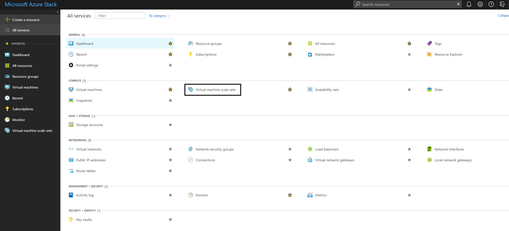
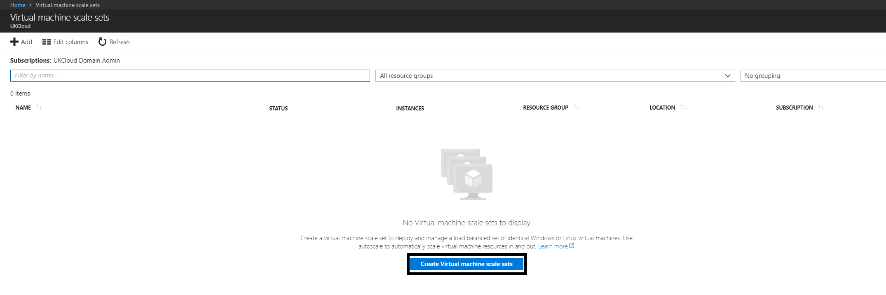
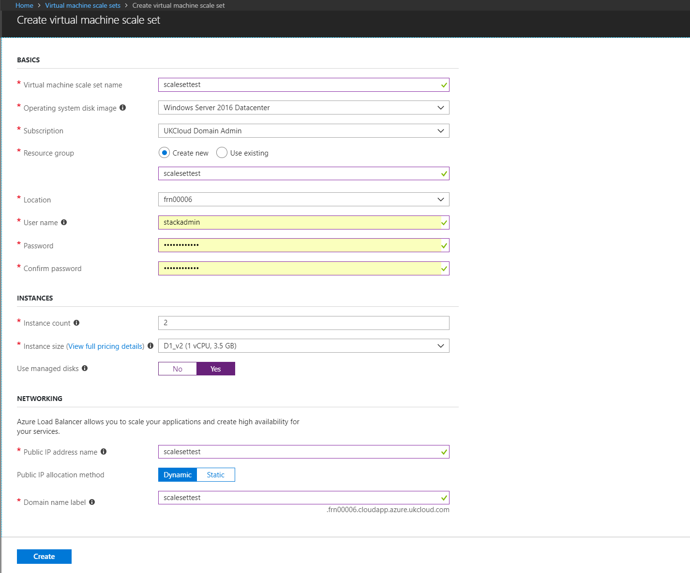

# Virtual Machine Scale Sets

Virtual machine scale sets are an Azure Stack compute resource that you can use to manage and deploy a set of identical virtual machines. With all the virtual machines being configured in an identical fashion, scale sets do not require pre-provisioning of virtual machines. They are an easy way to build large-scale services that target big compute, big data and containerized workloads.

As of currently on Azure Stack, virtual machine scale sets do not support auto-scale. You can add more instances to a scale set using Resource Manager templates, CLI, or PowerShell.

## Deploying scale sets from portal

1. After signing into Azure Stack navigate to **All services** > **Virtual machine scale sets**
    
2. Select **Create Virtual machine scale sets**
    
3. Fill in the empty fields, choose from the dropdowns for **Operating system disk image**, **Subscription**, and **Instance size**. Select **Yes** for Use managed disks. Then, click Create.
    
    * Not using managed disks will result in the scale set using five storage accounts
4. To see your new virtual machine scale set, go to All resources, search for the virtual machine scale set name, and then select its name in the search.

## Scaling a virtual machine scale set

## Connecting to a virtual machine scale set

## Creating a virtual machine scale set with PowerShell

## Feedback

 If you find an issue with this article, click **Improve this Doc** to suggest a change. If you have an idea for how we could improve any of our services, visit [*UKCloud Ideas*](https://ideas.ukcloud.com). Alternatively, you can contact us at <products@ukcloud.com>.
