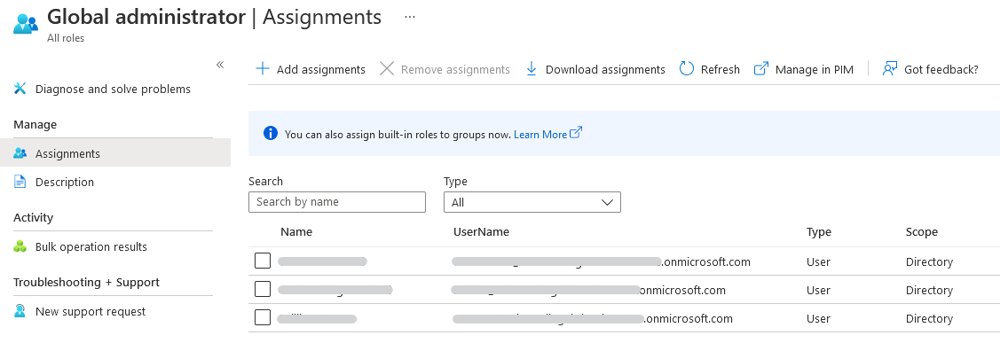

 **UKCloud Limited (“UKC”) and Virtual Infrastructure Group Limited (“VIG”) (together “the Companies”) – in Compulsory Liquidation**

On 25 October 2022, the Companies were placed into Liquidation with the Official Receiver appointed as Liquidator and J Robinson and A M Hudson simultaneously appointed as Special Managers to manage the liquidation process on behalf of the Official Receiver.

Further information regarding the Liquidations can be found here: <https://www.gov.uk/government/news/virtual-infrastructure-group-limited-and-ukcloud-limited-information-for-creditors-and-interested-parties>

Contact details: 
For any general queries relating to the Liquidations please email <ukcloud@uk.ey.com> 
For customer related queries please email <ukcloudcustomers@uk.ey.com> 
For supplier related queries please email <ukcloudsuppliers@uk.ey.com>

# How to identify your Microsoft Azure global administrators

## Overview

The global administrator has access to all administrative features. By default, the person who signs up for an Azure subscription is assigned the global administrator role for the directory. Only global administrators can assign other administrator roles.

### Intended audience

To complete the steps in this guide, you must have appropriate access to the public Azure portal.

## Identifying the global administrators

1. Log in to the [public Azure portal](https://portal.azure.com).

2. In the left hand side portal menu select **Azure Active Directory**.

    

3. In the *Manage* section, select **Roles and Administrators**.

    

4. In the *Roles and administrators* blade, scroll down and select **Global administrator**.

    

5. The *Global administrator | Assignments* blade will be displayed listing the members of that role.

    

## Next steps

For more information about UKCloud for Microsoft Azure, see:

- [*Understanding UKCloud for Microsoft Azure*](azs-ref-overview.md)

- [*Getting Started Guide for UKCloud for Microsoft Azure*](azs-gs.md)

- [*UKCloud for Microsoft Azure FAQs*](azs-faq.md)

## Feedback

If you find a problem with this article, click **Improve this Doc** to make the change yourself or raise an [issue](https://github.com/UKCloud/documentation/issues) in GitHub. If you have an idea for how we could improve any of our services, send an email to <feedback@ukcloud.com>.
