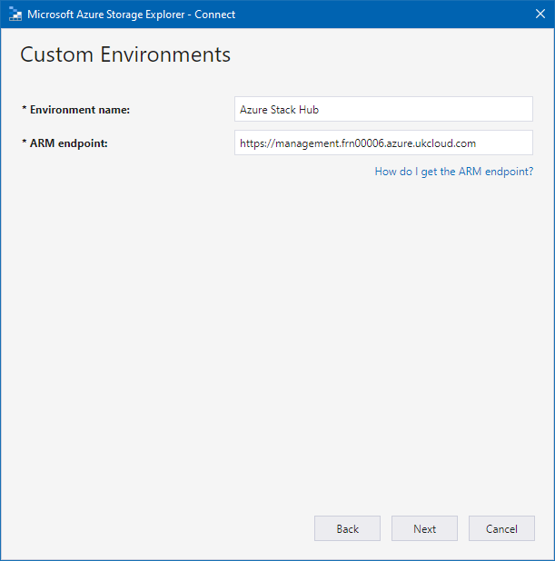

# How to link Azure Storage Explorer to Azure Stack

In this guide, you will learn how to link Azure Stack subscriptions to the Azure storage explorer. Azure storage explorer is a standalone application that allows you to easily work with Azure Stack storage data on Windows, macOS and Linux. This tool allows for easy downloading and uploading to Azure Stack which makes tasks such as downloading and uploading data disks to VM's very easy.

If you need to install the storage explorer, please find the link [here](https://azure.microsoft.com/en-us/features/storage-explorer/) and install it.

## Installation and setup

1. Download and install storage explorer.

    

2. Once launched navigate to accounts.

     

3. Select **Add an account...**

    

4. Select **Add an Azure Account** > **Use Custom Environment**.

    

5. Name the enviroment **Azure Stack** and for the ARM endpoint use **[https://management.frn00006.azure.ukcloud.com]()**.

    

6. Sign in with your Azure Stack acount when prompted.

    

7. Click **Apply**

    

8. Finally select **Edit** > **Target Default Azure API's** and then resetart.

    

Now the storage tool is linked to Azure Stack. As stated before you can now access all of your VM's storage acccounts.

## Feedback

 If you find an issue with this article, click **Improve this Doc** to suggest a change. If you have an idea for how we could improve any of our services, visit [*UKCloud Ideas*](https://ideas.ukcloud.com). Alternatively, you can contact us at <products@ukcloud.com>.