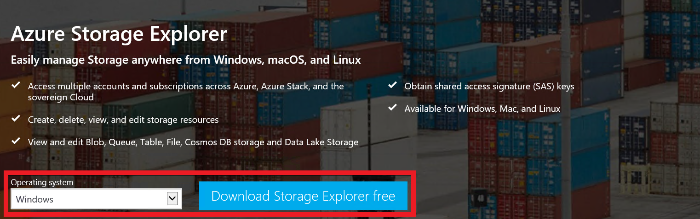

# How to link Azure Storage Explorer to Azure Stack

## Overview

In this article, you will learn how to link Azure Stack subscriptions to the Azure Storage Explorer. Azure Storage Explorer is a standalone application that allows you to easily work with Azure Stack storage data on Windows, macOS and Linux. With this application, you can easily download and upload objects to Azure Stack, which makes tasks such as downloading and uploading data disks to VMs very easy.

If you need to install the Storage Explorer, please find the link [here](https://azure.microsoft.com/en-us/features/storage-explorer/) and install it.

## Installation and setup

1. Download and install storage explorer.

    

2. Once launched navigate to accounts.

     

3. Select **Add an account...**

    

4. Select **Add an Azure Account** > **Use Custom Environment**.

    

5. Name the environment **Azure Stack** and for the ARM endpoint use **`https://management.frn00006.azure.ukcloud.com`**.

    

6. Sign in with your Azure Stack credentials when prompted.

    

7. Click **Apply**.

    

8. From the **Edit** menu, select **Target Azure Stack APIs** then restart Storage Explorer.

    

Now that you've linked Storage Explorer to Azure Stack, you can access all of your VMs storage accounts.

## Feedback

 If you find an issue with this article, click **Improve this Doc** to suggest a change. If you have an idea for how we could improve any of our services, visit [*UKCloud Ideas*](https://ideas.ukcloud.com). Alternatively, you can contact us at <products@ukcloud.com>.