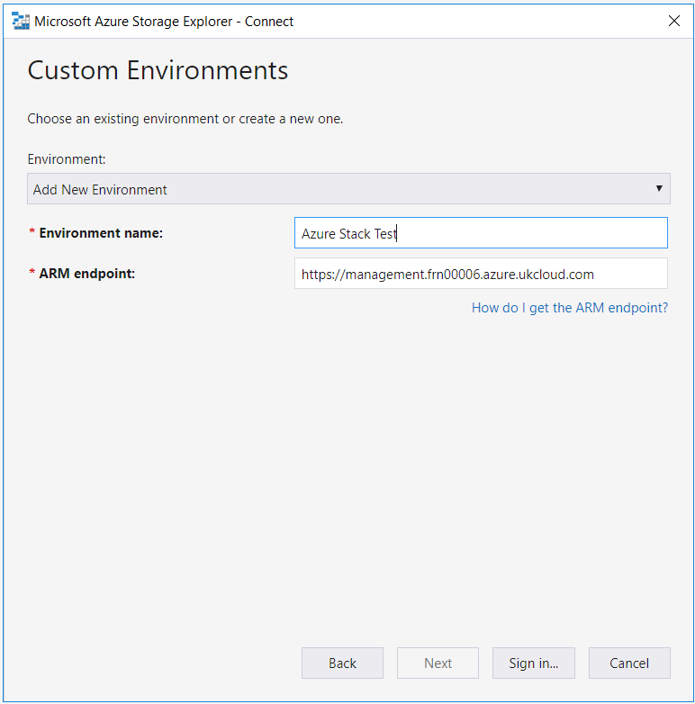

# How to link Azure Storage Explorer to Azure Stack

## Overview

In this article, you will learn how to link Azure Stack subscriptions to the Azure Storage Explorer. Azure Storage Explorer is a standalone application that allows you to easily work with Azure Stack storage data on Windows, macOS and Linux. With this application, you can easily download and upload objects to Azure Stack, which makes tasks such as downloading and uploading data disks to VMs very easy.

If you need to install Azure Storage Explorer, please click [here](https://azure.microsoft.com/en-us/features/storage-explorer/) and install it.

## Installation and setup

1. Download and install Storage Explorer.

    

2. From the **Edit** menu, select **Target Azure Stack APIs** then restart Storage Explorer.

    

3. Once re-launched navigate to accounts.

    

4. Select **Add an account...**

    

5. Select **Add an Azure Account** \> **Use Custom Environment**.

    

6. Name the environment **Azure Stack** and use `https://management.frn00006.azure.ukcloud.com` for the **ARM endpoint**.

    

7. Sign in with your Azure Stack credentials when prompted.

    

8. Click **Apply**.

    

Now that you've linked Storage Explorer to Azure Stack, you can access all of your storage accounts.

## Feedback

 If you find an issue with this article, click **Improve this Doc** to suggest a change. If you have an idea for how we could improve any of our services, visit [*UKCloud Ideas*](https://ideas.ukcloud.com). Alternatively, you can contact us at <products@ukcloud.com>.
