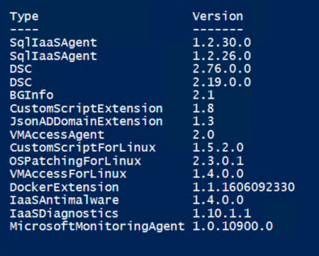

# How to list VM extensions in Azure Stack using PowerShell

This document explains how to list VM extensions in Azure Stack with PowerShell.

## Prerequisites

Ensure your PowerShell environment is setup as detailed in [Configure the Azure Stack user's PowerShell environment](azs-how-configure-powershell-users.md).

## Declare variables

Enter details below to provide values for the variables in the scripts in this article:

| Variable name  | Variable description                                | Input            |
|----------------|-----------------------------------------------------|------------------|
| -ArmEndpoint   | The Azure Resource Manager endpoint for Azure Stack | <form oninput="result.value=armendpoint.value" id="armendpoint" style="display: inline;"><input type="text" id="armendpoint" name="armendpoint" style="display: inline;" placeholder="https://management.frn00006.azure.ukcloud.com"/></form> |

## Instructions

From your Powershell window run:

<pre><code class="language-PowerShell"># Declare endpoint
$ArmEndpoint = "<output form="armendpoint" name="result" style="display: inline;">https://management.frn00006.azure.ukcloud.com</output>"

# Register an AzureRM environment that targets your Azure Stack instance
$AzureStackEnvironment = Add-AzureRmEnvironment -Name "AzureStackUser" -ArmEndpoint $ArmEndpoint

# Sign in to your environment
Connect-AzureRmAccount -EnvironmentName "AzureStackUser"

# Pull location from environment
$Location = $AzureStackEnvironment.StorageEndpointSuffix.split(".")[0]

# Retrieve VM extension list
Get-AzureRmVmImagePublisher -Location $Location | `
  Get-AzureRmVMExtensionImageType | `
  Get-AzureRmVMExtensionImage | `
  Format-Table -Property Type, Version -AutoSize
</code></pre>

This will produce a table similar to the following:

## Feedback

If you find an issue with this article, click **Improve this Doc** to suggest a change. If you have an idea for how we could improve any of our services, visit [UKCloud Ideas](https://ideas.ukcloud.com). Alternatively, you can contact us at <products@ukcloud.com>.
