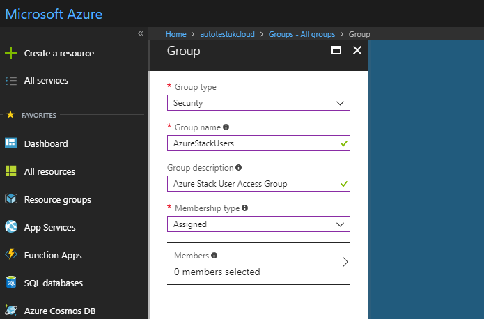
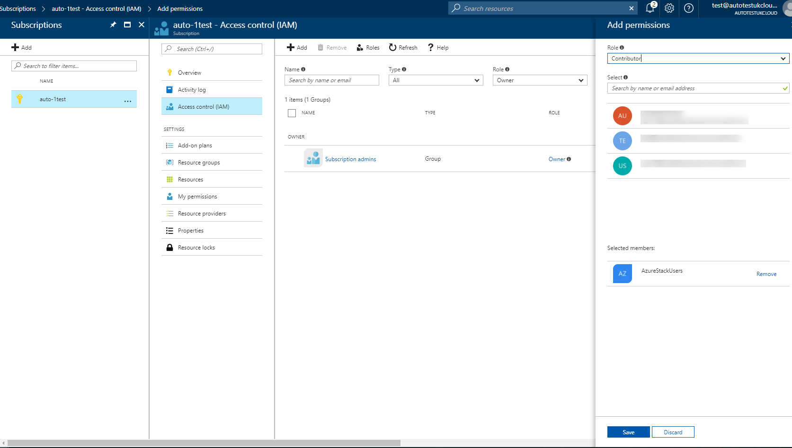

# How to manage Azure user groups and permissions

## Overview

UKCloud for Microsoft Azure provides you with three default user groups to get you started:

- **AzureStackOperators** - Members of this group have Owner permissions and have full access to all resources and can manage access to resources

- **AzureStackUsers** - Members of this group have Contributor permissions and can create and manage all resources but cannot manage access to resources

- **AzureStackReadOnly** - Members of this group have Reader permissions and can view everything but cannot make changes

If these default groups do not meet your requirements, for example, if you've created a custom role and want to grant users the permissions specified by that role, you can create new groups and assign roles and permissions to them.

### Intended audience

To complete the steps in this guide you must have global administrator access to the Azure portal and Owner access to the UKCloud Azure Stack portal.

## Creating a group for Azure users

Rather than granting permissions to individual users, we recommend that you first create a group and add your Azure users to that group.

To create a group in the Azure portal:

1. Log in to the [public Azure portal](https://portal.azure.com) as a global administrator.

    For help with identifying your Azure global administrators, see [here](azs-how-identify-global-admins.md)

2. Navigate to the **Azure Active Directory**.

    > [!TIP]
    > You can find the Azure Active Directory by selecting **All services** and scrolling down to the *Security + Identity* section.

3. Select **Groups** and then **All groups**.

4. Click the **New group** option.

5. From the **Group type** list, select **Security**.

6. In the **Group name** field, enter a name for the group, for example, `AzureStackGroup`.

7. In the **Group description** field, enter a brief, but meaningful description for the group.

8. From the **Membership type** list, select **Assigned**.

    

9. Click **Create**.

10. To add users to the group, open the group, select **Members** then click **Add members**.

## Granting Azure permissions

After setting up the user group in Azure, you need to go to the UKCloud Azure Stack portal to grant the appropriate permissions to the group.

To grant Azure permissions to a group:

1. Log in to the [UKCloud Azure Stack portal](https://portal.frn00006.azure.ukcloud.com).

2. Navigate to **Subscriptions**.

    > [!TIP]
    > If you can't see Subscriptions in your favourites panel, click **More services** and then **Subscriptions**. You can add Subscriptions to your favourites panel by clicking the star icon.

3. Select your subscription for UKCloud for Microsoft Azure.

4. Select **Access control (IAM)**.

5. Click the **Add** option.

6. From the **Role** list, select the appropriate role that you want to assign to the group.

7. In the **Select** field, enter the name of the group you created in [Creating a group for UKCloud for Microsoft Azure users](#creating-a-group-for-azure-users).

    

8. Click **Save**.

## Next steps

For more information about Azure Stack, see the following Microsoft resources:

- [*Get started with Azure*](https://azure.microsoft.com/en-gb/get-started/)

- [*Azure Stack User Documentation*](https://docs.microsoft.com/en-us/azure/azure-stack/user/)

For more information about UKCloud for Microsoft Azure, see:

- [*Getting Started Guide for UKCloud for Microsoft Azure*](azs-gs.md)

- [*UKCloud for Microsoft Azure FAQs*](azs-faq.md)

## Feedback

If you find an issue with this article, click **Improve this Doc** to suggest a change. If you have an idea for how we could improve any of our services, visit [UKCloud Ideas](https://ideas.ukcloud.com). Alternatively, you can contact us at <products@ukcloud.com>.
