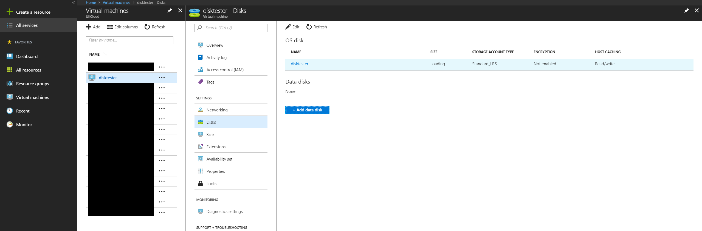
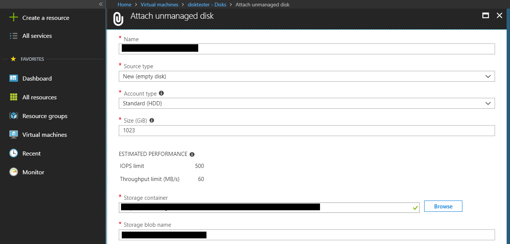
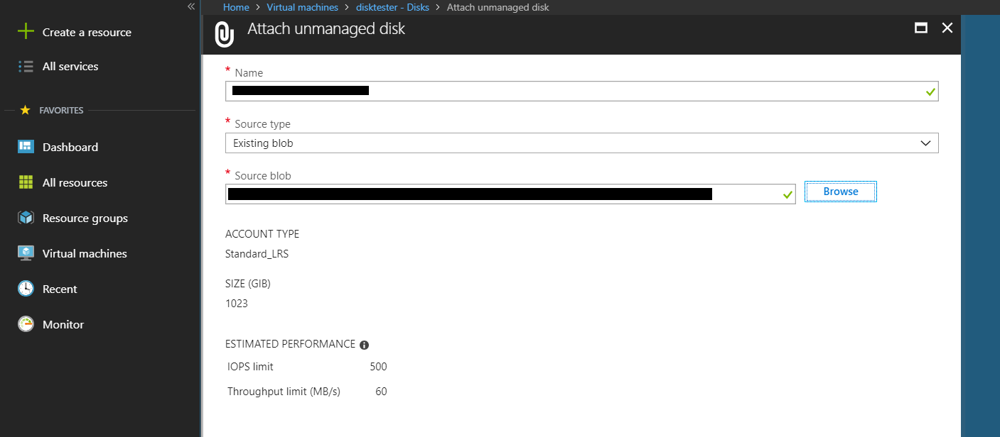

# Managing disks on Azure Stack

## Overview

In Azure Stack there are two types of disks, **Managed** and **Unmanaged** both these disks can be used on VM's as both OS and data disks.

### Managed disks

These disks simplify disk management for Azure IaaS VMs by managing the storage accounts associated with the VM disks. You only have to specify the size of disk you need, and Azure Stack creates and manages the disk for you.

### Unmanaged disks

These disks require that you create a storage account to store the disks. The disks you create are referred to as VM disks and are stored in containers in the storage account.

## Using the portal to add new disks to VM's

1. In the portal choose **Virtual machines**.
2. Select the VM you wish to add disks too.
3. Navigate to **Disks** > **+Add data disk**.
    
4. Edit the options for your new Disk.
    * **Name**: This is what the disk will be called
    * **Source type**: Leave this as **New(empty disk)** as we are creating a new disk
    * **Account type**: This is where you choose between SSD and HDD.
    * **Size**: This is where you specify the size of the new disk.
    * **Storage container**: This is where you specify the storage container for the disk. Find the storage account where you VM's OS disk is located and then create a new **Container**. Select this container as the location for the new disk
    * **Storage blob name**: This is the blob where the disk will be stored.
    
5. Select Ok and the new disk will be added to the VM.

## Using the portal to add existing VM's

1. Ensure the existing disk you want to add to your VM is on you local machine as a .vhd file. Upload this .vhd to a new Container in your VM's storage account.
2. After the .vhd file is uploaded, you are ready to attach the VHD to a VM. In the menu on the left, select **Virtual machines**.
3. Chose the VM you wish to add the disk to.
4. In **Source type** select **Existing blob**.
5. In **Source blob** select **Browse**.
6. Navigate to the storage account you uploaded the .vhd file to > select the container you uploaded the .vhd file to and click **Select**.
    
7. Finally click **OK** then **Save**.

## Adding a disk to a VM that is already attached to another VM on Azure Stack

Please ensure the disk is has been detached from its original VM.

1. In the menu on the left, select **Virtual machines**.
2. Chose the VM you wish to add the disk to.
3. In **Source type** select **Existing blob**.
4. In **Source blob** select **Browse**.
5. Navigate to the storage container which contains the disk you wish to add to the VM, then navigate to the container where the dis resides.
6. Finally click **Select** > **OK** > **Save**

## Using PowerShell to add disks to a new VM

## Using PowerShell to add disks to an existing VM

## Feedback

 If you find an issue with this article, click **Improve this Doc** to suggest a change. If you have an idea for how we could improve any of our services, visit [*UKCloud Ideas*](https://ideas.ukcloud.com). Alternatively, you can contact us at <products@ukcloud.com>.