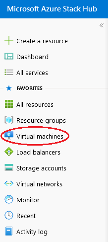
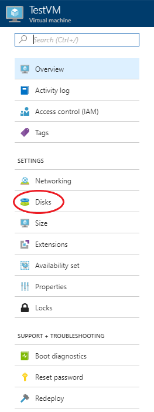
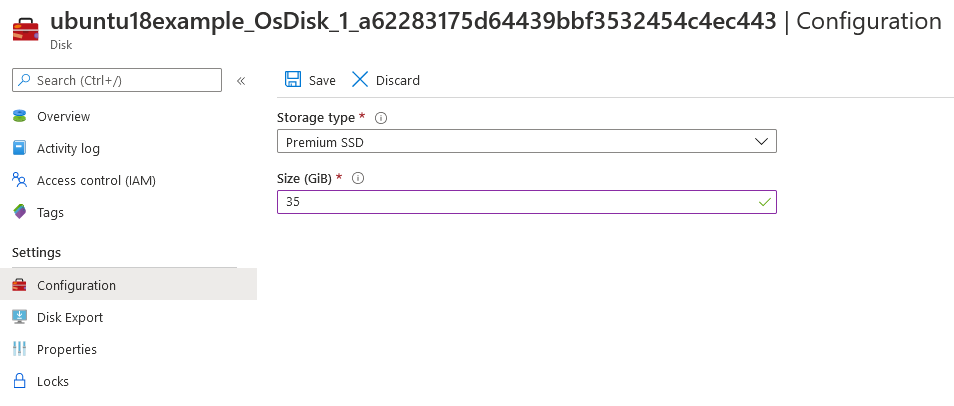
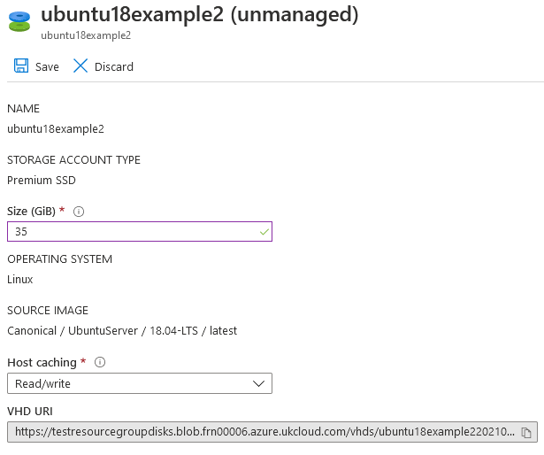
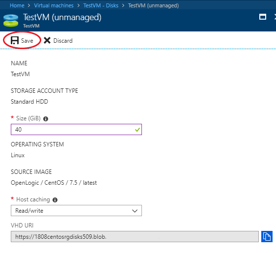

# How to resize a disk using the UKCloud Azure Stack portal

## Overview

The UKCloud Azure Stack portal allows you to resize virtual machine (VM) disks. This article shows you how to resize disks that are mounted to a VM, and will work for both managed and unmanaged disks.

### Intended audience

To complete the steps in this article, you must have appropriate access to a subscription in the Azure Stack portal.

## Resizing disks that are mounted to a VM

1. Log in to the Azure Stack portal.

    For more detailed instructions, see the [*Getting Started Guide for UKCloud for Microsoft Azure*](azs-gs.md).

2. In the favourites panel, select **Virtual machines**.

    

3. In the *Virtual machines* blade, select the virtual machine that the disk is attached to.

4. In the virtual machine's blade, select **Disks**.

    

5. In the *Disks* blade, select the disk you would like to resize.

    > [!Note]
    > Disks can only be resized when they are unattached from the VM or the virtual machine is deallocated.

6. In the disk's blade, enter the desired size of the disk in GiB in the **Size** field.

    > [!Note]
    > - Disks can only be resized to a larger size.
    > - Although the process is the same for both managed and unmanaged disks, the two blades look slightly different. Examples for both are provided below.

# [Resizing managed disks](#tab/tabid-1)

# [Resizing unmanaged disks](#tab/tabid-2)

***

7. When you're done, click **Save**.

    

8. You can monitor the progress of the disk resizing by clicking the **Notifications** icon.

   

## Expanding the volume

After expanding the disk, you may need to go into the OS and expand the volume to actually use the newly allocated space. To do so, follow the steps below:

# [Windows VM](#tab/tabid-a)

1. Open an RDP connection to your VM.

2. Open a command prompt and type `diskpart`.

3. At the `DISKPART` prompt, type `list volume`.

    Take note of the volume you want to extend.

4. At the `DISKPART` prompt, type `select volume <volumenumber>`.

    This selects the volume that you want to extend into unpartitioned empty space on the same disk.

5. At the `DISKPART` prompt, type `extend`.

    This extends the selected volume to fill the added space on the disk.

# [Linux VM](#tab/tabid-b)

No further action is required.

***

## Feedback

If you find an issue with this article, click **Improve this Doc** to suggest a change. If you have an idea for how we could improve any of our services, visit the [Ideas](https://community.ukcloud.com/ideas) section of the [UKCloud Community](https://community.ukcloud.com).
