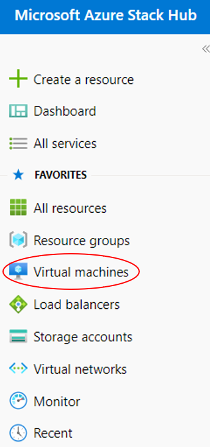

#### UKCloud Limited (“UKC”) and Virtual Infrastructure Group Limited (“VIG”) (together “the Companies”) – in Compulsory Liquidation

On 25 October 2022, the Companies were placed into Liquidation with the Official Receiver appointed as Liquidator and J Robinson and A M Hudson simultaneously appointed as Special Managers to manage the liquidation process on behalf of the Official Receiver.

Further information regarding the Liquidations can be found here: <https://www.gov.uk/government/news/virtual-infrastructure-group-limited-and-ukcloud-limited-information-for-creditors-and-interested-parties>

Contact details: 
For any general queries relating to the Liquidations please email <ukcloud@uk.ey.com> 
For customer related queries please email <ukcloudcustomers@uk.ey.com> 
For supplier related queries please email <ukcloudsuppliers@uk.ey.com>

# How to resize a disk using the UKCloud Azure Stack Hub portal

## Overview

The UKCloud Azure Stack Hub portal enables you to resize virtual machine (VM) disks. This article shows you how to resize disks that are mounted to a VM, and will work for both managed and unmanaged disks.

### Intended audience

To complete the steps in this article, you must have appropriate access to a subscription in the Azure Stack Hub portal.

## Resizing disks that are mounted to a VM

1. Log in to the Azure Stack Hub portal.

    For more detailed instructions, see the [*Getting Started Guide for UKCloud for Microsoft Azure*](azs-gs.md).

2. In the favourites panel, select **Virtual machines**.

    

3. In the *Virtual machines* blade, select the virtual machine that the disk is attached to.

4. In the *Overview* blade, click **Stop** and then **OK**. Wait for the virtual machine to successfully shutdown before continuing.

    > [!NOTE]
    > - You can only resize a disk when it is unattached from the virtual machine, or the virtual machine is deallocated.
    >
    > - You can skip this step if the virtual machine is already in the *Stopped (deallocated)* state, as seen below.
    >
    >   

    

5. In the virtual machine's blade, select **Disks**.

6. In the *Disks* blade, select the disk you want to resize.

    

    > [!NOTE]
    > - You can only resize a disk to a larger size.
    >
    > - Although the process is the same for both managed and unmanaged disks, the two blades look slightly different. Examples for both are provided below.

# [Resizing managed disks](#tab/tabid-1)

1. In the disk's blade, select **Configuration**.

2. In the **Size** field, enter the desired size of the disk in GiB.

    

3. When you're done, click **Save**.

# [Resizing unmanaged disks](#tab/tabid-2)

1.  In the **Size** field, enter the desired size of the disk in GiB.

    

2. When you're done, click **Save**.

***

7. You can monitor the progress of the disk resizing by clicking the **Notifications** icon.

   

## Expanding the volume

After expanding the disk, you may need to go into the OS and expand the volume to actually use the newly allocated space.

# [Windows VM](#tab/tabid-a)

1. Open an RDP connection to your VM.

2. Open a command prompt and type `diskpart`.

3. At the `DISKPART` prompt, type `list volume`.

    Take note of the volume you want to extend.

4. At the `DISKPART` prompt, type `select volume <volumenumber>`.

    This selects the volume that you want to extend into unpartitioned empty space on the same disk.

5. At the `DISKPART` prompt, type `extend`.

    This extends the selected volume to fill the added space on the disk.

# [Linux VM](#tab/tabid-b)

No further action is required.

***

## Feedback

If you find a problem with this article, click **Improve this Doc** to make the change yourself or raise an [issue](https://github.com/UKCloud/documentation/issues) in GitHub. If you have an idea for how we could improve any of our services, send an email to <feedback@ukcloud.com>.
