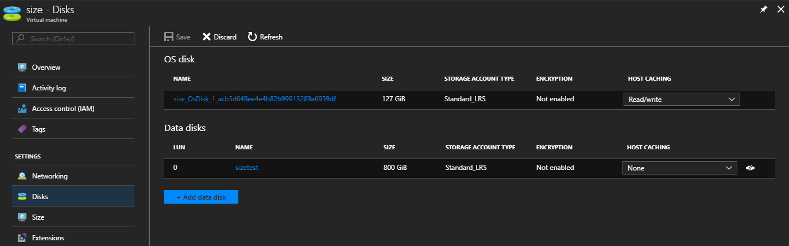
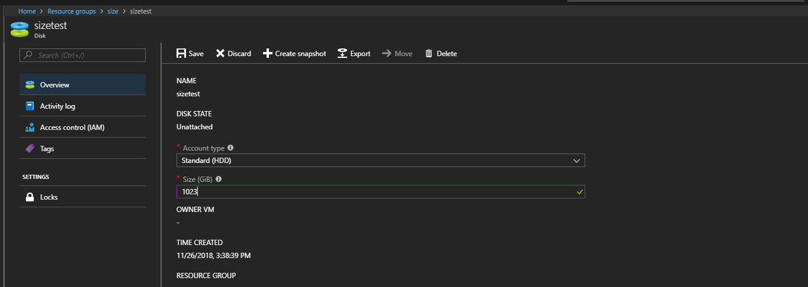
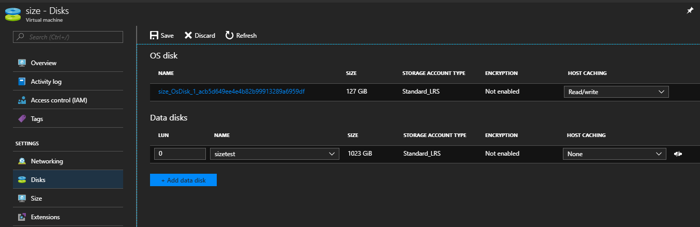

# How to resize virtual machine disks

In this article we will cover the process of resizing disks in the Azure portal. If your VM requires more storage space, you can increase the current disk capacity, rather than adding more disks. You can do this in the Azure portal.

## Resizing disk size via the portal

These steps will work for both unmanaged and managed VMs.

1. Power down or detach the disk from the VM.

    
  
2. Navigate to the resource group.

3. Select the disk that you want to resize.

4. In the **Size** field, enter the new size for the disk.

    
  
5. Save your changes.

6. Power back on the VM or reattach the disk.

    

> [!NOTE]
> The maximum size for a single disk is 4TB.

## Feedback

  If you find an issue with this article, click **Improve this Doc** to suggest a change. If you have an idea for how we could improve any of our services, visit [*UKCloud Ideas*](https://ideas.ukcloud.com). Alternatively, you can contact us at <products@ukcloud.com>.
