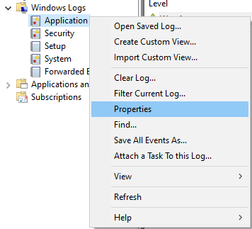
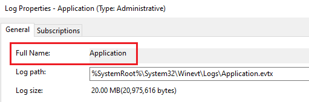
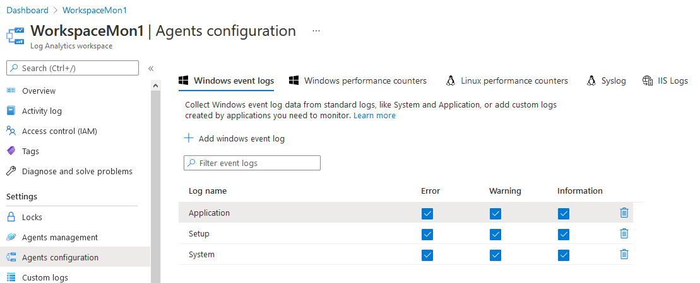
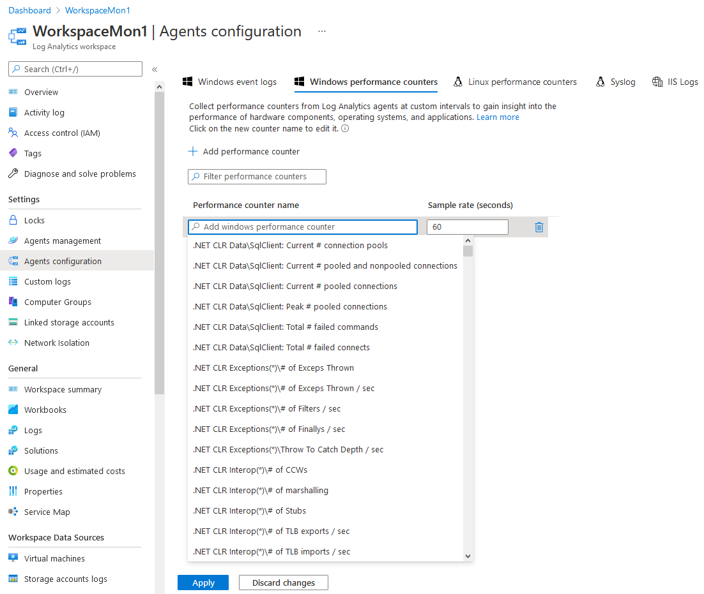
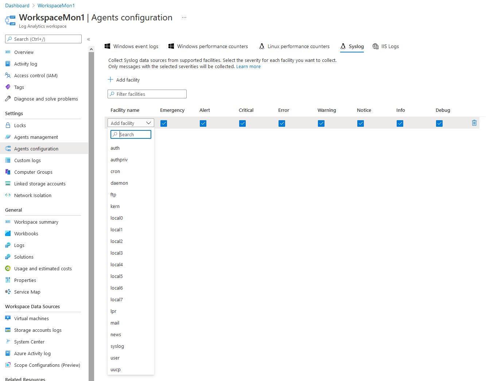
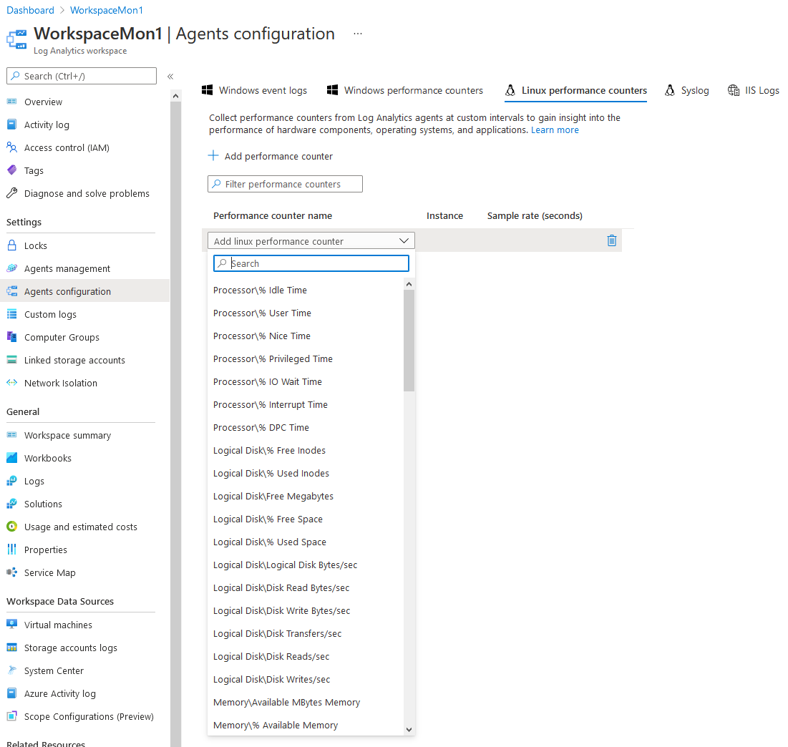

# How to configure Azure Monitor for VMs on Azure Stack Hub

> [!TIP]
> Azure Stack Hub has built-in Azure Monitor capabilities; however, they are limited. Therefore, if you are looking for a more feature rich solution, you should use public Azure Monitor.
>
> You can find out more about Azure Stack Hub's built-in Azure Monitor capabilities in the following article [Use Azure Monitor on Azure Stack Hub](https://docs.microsoft.com/en-us/azure-stack/user/azure-stack-metrics-azure-data).

## Overview

This article will explain how to utilise public Azure Monitor with Azure Stack Hub and **not** the built-in Azure Monitor.

Azure Monitor is the platform service that provides a single source for monitoring Azure resources. With Azure Monitor, you can visualise, query, route, archive, and otherwise take action on the metrics and logs coming from resources in Azure.

In this article we will enable the following solutions for Azure Stack Hub VMs:

- [Azure Monitor for VMs](https://docs.microsoft.com/en-us/azure/azure-monitor/insights/vminsights-overview)

## Prerequisites

To complete the steps in this article, you must have appropriate access to a subscription in the Azure and Azure Stack Hub portal.

## Enabling Azure Monitor for VMs

> [!WARNING]
> Before proceeding, check [here](https://docs.microsoft.com/en-gb/azure/azure-monitor/insights/vminsights-enable-overview#supported-operating-systems) that your VMs' OS version is supported.

### Creating the Log Analytics Workspace

# [Portal](#tab/tabid-a)

1. Log in to the [public Azure portal](https://portal.azure.com).

2. Create a Log Analytics Workspace in your Azure subscription:

    - Click **Create a resource**

    - In the search bar, search for `log analytics`

    - Click **Log Analytics Workspace**

    - Click **Create**

        

    - Provide the following:

        - A **Subscription** to link the workspace to

        - A **Resource group** to host the workspace in

        - A **unique** name for the **Log Analytics Workspace**

        - A **Region** to host the workspace in

            > [!NOTE]
            > Azure Monitor for VMs supports a Log Analytics Workspace in the following [regions](https://docs.microsoft.com/en-us/azure/azure-monitor/vm/vminsights-configure-workspace?tabs=PowerShell#supported-regions).

            

    - Click **Review + Create** once finished, then click **Create**. The Log Analytics Workspace will now begin deploying. A notification will appear in the top right of the portal.

3. Once deployment is complete, navigate to the resource group you placed the Log Analytics Workspace in.

    - Click the newly created workspace. On the new blade, under *Settings*, select **Agents management**.
    Note down the **Workspace ID** and **Primary Key** values.

       

4. (Optional) Configure additional data sources

    - Under *Settings*, select **Agents configuration**.

    ### [Windows](#tab/tabid-c)

    #### Windows event logs

    - Click **Add windows event log**

    - Select an event log from the dropdown and use the checkboxes to determine the severities that you want to collect for this log type.

      > [!NOTE]
      > If the log type you want to add does not appear in the list, you can still add it by typing in the full name. You can find the full name of the log type in Event Viewer. Open the *Properties* page for the log type and copy the string from the **Full Name** field.
      >
      > 
      >
      > 

    - Repeat for each event log you require, then click **Apply**

      

    #### Windows performance counters

    - Click **Add performance counter**

    - Select a counter from the dropdown. The sample rate can be adjusted to increase or decrease the amount of data collected for this counter.

    - Repeat for each performance counter you require, then click **Apply**

      

    ### [Linux](#tab/tabid-d)

    #### Syslog

    - Click **Add facility**

    - Select a facility from the dropdown and use the checkboxes to determine the severities that you want to collect for this facility.

    - Repeat for each facility you require, then click **Apply**

      

    #### Linux performance counters

    - Click **Add performance counter**

    - Select a counter from the dropdown. The sample rate can be adjusted to increase or decrease the amount of data collected for this counter.

    - Repeat for each performance counter you require, then click **Apply**

      

    ***

# [PowerShell](#tab/tabid-b)

1. Execute the following PowerShell script to create the log analytics workspace.

    | Variable name   | Variable description                                               | Input            |
    |-----------------|--------------------------------------------------------------------|------------------|
    | \$WorkspaceName    | The name of the log analytics workspace                 | <form oninput="result.value=workspacename.value" id="workspacename" style="display: inline;"><input type="text" id="workspacename" name="workspacename" style="display: inline;" placeholder="MyWorkspace"/></form> |
    | \$WorkspaceResourceGroupName        | Name of the resource group which the log analytics workspace resides in                           | <form oninput="result.value=workspaceresourcegroup.value;result1.value=workspaceresourcegroup.value" id="workspaceresourcegroup" style="display: inline;"><input type="text" id="workspaceresourcegroup" name="workspaceresourcegroup" style="display: inline;" placeholder="MyResourceGroup"/></form> |
    | \$WorkspaceLocation        | The region to deploy the log analytics workspace and resource group in                          | <form oninput="result.value=workspacelocation.value" id="workspacelocation" style="display: inline;"><input type="text" id="workspacelocation" name="workspacelocation" style="display: inline;" placeholder="UKSouth"/></form> |

    <pre>
    <code class="language-PowerShell"># Install module
    Install-Module -Name "Az.OperationalInsights" -Scope AllUsers -Verbose -Force

    # Initialise environment and variables

    ## Login to public Azure
    Connect-AzAccount -Environment "AzureCloud"

    ## Create workspace analytics specific resources

    # Input variables
    $LogAnalyticsWorkspaceName = "<output form="workspacename" name="result" style="display: inline;">MyWorkspace</output>"
    $LogAnalyticsWorkspaceResourceGroupName = "<output form="workspaceresourcegroup" name="result" style="display: inline;">MyResourceGroup</output>"
    $LogAnalyticsWorkspaceLocation = "<output form="workspacelocation" name="result" style="display: inline;">UKSouth</output>"

    # Check if the Log Analytics resource group exists, if it doesn't exist then create it
    try {
        $LogAnalyticsWorkspaceResourceGroup = Get-AzResourceGroup -Name $LogAnalyticsWorkspaceResourceGroupName -Location $LogAnalyticsWorkspaceLocation -Verbose -ErrorAction Stop
    }
    catch {
        Write-Warning -Message "Log Analytics Workspace resource group ""$($LogAnalyticsWorkspaceResourceGroupName)"" in location ""$($LogAnalyticsWorkspaceLocation)"" doesn't exist. Creating now..."
        try {
            $LogAnalyticsWorkspaceResourceGroup = New-AzResourceGroup -Name $LogAnalyticsWorkspaceResourceGroupName -Location $LogAnalyticsWorkspaceLocation -Verbose -ErrorAction Stop
        }
        catch {
            Write-Error -Message "Failed to create Log Analytics Workspace resource group ""$($LogAnalyticsWorkspaceResourceGroupName)"" in location ""$($LogAnalyticsWorkspaceLocation)"":`n$($_.Exception.Message)"
            throw
        }
    }
    # Check if the Log Analytics Workspace exists, if it doesn't exist then create it
    try {
        Write-Verbose "Attempting to retrieve Log Analytics Workspace ""$($LogAnalyticsWorkspaceName)"" in resource group ""$($LogAnalyticsWorkspaceResourceGroupName)"" and location ""$($LogAnalyticsWorkspaceLocation)""."
        $LogAnalyticsWorkspace = Get-AzOperationalInsightsWorkspace -ResourceGroupName $LogAnalyticsWorkspaceResourceGroup.ResourceGroupName -Name $LogAnalyticsWorkspaceName -Verbose -ErrorAction Stop
    }
    catch {
        try {
            Write-Warning -Message "Log Analytics Workspace ""$($LogAnalyticsWorkspaceName)"" in location ""$($LogAnalyticsWorkspaceLocation)"" doesn't exist. Creating now..."
            $LogAnalyticsWorkspace = New-AzOperationalInsightsWorkspace -ResourceGroupName $LogAnalyticsWorkspaceResourceGroup.ResourceGroupName -Name $LogAnalyticsWorkspaceName -Location $LogAnalyticsWorkspaceLocation -Verbose -ErrorAction Stop
        }
        catch {
            Write-Error -Message "Failed to create Log Analytics Workspace ""$($LogAnalyticsWorkspaceName)"" in resource group ""$($LogAnalyticsWorkspaceResourceGroupName)"" and location ""$($LogAnalyticsWorkspaceLocation)"":`n$($_.Exception.Message)"
            throw
        }
    }
    try {
        # Get Log Analytics Workspace GUID and primary key
        Write-Verbose -Message "Attempting to retrieve Log Analytics Workspace ""$($LogAnalyticsWorkspace.Name)"" GUID, primary key and base64 encode them."
        $EncodedWorkspaceGuid = [System.Convert]::ToBase64String([System.Text.Encoding]::UNICODE.GetBytes(($LogAnalyticsWorkspace.CustomerId).GUID))
        $WorkspaceKey = (Get-AzOperationalInsightsWorkspaceSharedKey -ResourceGroupName $LogAnalyticsWorkspace.ResourceGroupName -Name $LogAnalyticsWorkspace.Name -Verbose -ErrorAction Stop).PrimarySharedKey
        $EncodedWorkspaceKey = [System.Convert]::ToBase64String([System.Text.Encoding]::UNICODE.GetBytes($WorkspaceKey))
    }
    catch {
        Write-Error -Message "Failed to obtain Log Analytics Workspace ""$($LogAnalyticsWorkspace.Name)"" GUID or primary key:`n$($_.Exception.Message)"
        throw
    }</code></pre>

2. (Optional) Configure data sources for additional logs

    ### [Windows](#tab/tabid-c)

    ```powershell
    # Windows event logs
    ## The below example will create data sources for the event logs "System", "Application" and "Setup", with all severities being collected
    $EventLogNames = @("System", "Application", "Setup")
    foreach ($EventLogName in $EventLogNames) {
        New-AzOperationalInsightsWindowsEventDataSource `
            -ResourceGroupName $LogAnalyticsWorkspaceResourceGroupName `
            -WorkspaceName $LogAnalyticsWorkspaceName `
            -Name "$($EventLogName) Event Log" `
            -EventLogName $EventLogName `
            -CollectErrors `
            -CollectWarnings `
            -CollectInformation
    }

    <# ---- Performance counter format ----
     To select all instances of a counter, add (*) after the object name:
        Object name(*)\Counter name

     To select a specific instance of a counter, add (Instance name) after the object name:
        Object name(Instance name)\Counter name
    #>

    # Windows performance counters
    ## The below example will create the counter "Memory(*)\Available MBytes"
    New-AzOperationalInsightsWindowsPerformanceCounterDataSource -ResourceGroupName $LogAnalyticsWorkspaceResourceGroupName -WorkspaceName $LogAnalyticsWorkspaceName -ObjectName "Memory" -InstanceName "*" -CounterName "Available MBytes" -IntervalSeconds 20 -Name "Example Windows Performance Counter"

    # Enable IIS Log Collection using agent
    Enable-AzOperationalInsightsIISLogCollection -ResourceGroupName $LogAnalyticsWorkspaceResourceGroupName -WorkspaceName $LogAnalyticsWorkspaceName
    ```

    ### [Linux](#tab/tabid-d)

    ```powershell
    # Linux performance counters
    ## The below example will create multiple counters "% Used Inodes", "Free Megabytes", "% Used Space", "Disk Transfers/sec", "Disk Reads/sec" and "Disk Writes/sec", all under the parent counter "Logical Disk"
    New-AzOperationalInsightsLinuxPerformanceObjectDataSource -ResourceGroupName $LogAnalyticsWorkspaceResourceGroupName -WorkspaceName $LogAnalyticsWorkspaceName -ObjectName "Logical Disk" -InstanceName "*" -CounterNames @("% Used Inodes", "Free Megabytes", "% Used Space", "Disk Transfers/sec", "Disk Reads/sec", "Disk Writes/sec") -IntervalSeconds 20 -Name "Example Linux Disk Performance Counters"
    ## Enable the collection of performance counters from Linux computers
    Enable-AzOperationalInsightsLinuxPerformanceCollection -ResourceGroupName $LogAnalyticsWorkspaceResourceGroupName -WorkspaceName $LogAnalyticsWorkspaceName

    # Linux Syslog
    ## The below example will create a data source for the "kern" facility, with all severities being collected
    New-AzOperationalInsightsLinuxSyslogDataSource -ResourceGroupName $LogAnalyticsWorkspaceResourceGroupName -WorkspaceName $LogAnalyticsWorkspaceName -Facility "kern" -CollectEmergency -CollectAlert -CollectCritical -CollectError -CollectWarning -CollectNotice -CollectInfo -CollectDebug -Name "Example kernel Syslog collection"
    ## Enable the collection of Syslog data from Linux computers
    Enable-AzOperationalInsightsLinuxSyslogCollection -ResourceGroupName $LogAnalyticsWorkspaceResourceGroupName -WorkspaceName $LogAnalyticsWorkspaceName
    ```

    ***

***

### Installing the extensions

# [Portal](#tab/tabid-a)

1. Log in to the [Azure Stack Hub portal](https://portal.frn00006.azure.ukcloud.com).

2. Navigate to the VM that you want to enable Azure Monitor on and under *Settings*, select the *Extensions* blade.

    > [!WARNING]
    > For any monitoring to work correctly, the VM **must** have HTTPS (Port 443) enabled in the **Network Security Group** rules.

3. Click **Add** at the top, select the extension **Azure Monitor Dependency Agent**, click **Create** and then **OK**.

    > [!WARNING]
    > Wait for the deployment to finish before continuing.

4. Click **Add** at the top, select the extension **Azure Monitor, Update and Configuration Management** and then click **Create**.

    - Provide the extension with the **Workspace ID** and **Primary Key** values (noted down previously), then click **OK**.

        

# [PowerShell](#tab/tabid-b)

1. Execute the following PowerShell script to setup the **Azure Monitor Dependency Agent** and **Azure Monitor, Update and Configuration Management** extensions.

    ### Declare variables

    Enter details below to provide values for the variables in the following script in this article:

    | Variable name   | Variable description                                               | Input            |
    |-----------------|--------------------------------------------------------------------|------------------|
    | \$VMName    | The name of the virtual machine                 | <form oninput="result.value=vmname.value" id="vmname" style="display: inline;"><input type="text" id="vmname" name="vmname" style="display: inline;" placeholder="AzureStackHubVM"/></form> |
    | \$ResourceGroupName        | Name of the resource group which the VM resides in                           | <form oninput="result.value=resourcegroup.value;result1.value=resourcegroup.value" id="resourcegroup" style="display: inline;"><input type="text" id="resourcegroup" name="resourcegroup" style="display: inline;" placeholder="MyResourceGroup"/></form> |
    | \$WorkspaceKey        | The log analytics workspace primary key                           | <form oninput="result.value=workspacekey.value" id="workspacekey" style="display: inline;"><input type="text" id="workspacekey" name="workspacekey" style="display: inline;" placeholder="2Fzno02qWtiyVWbyvxelAFbjyMGsAgRDpolEmaf8ndiIbi4g8Uht+TNU/aTLEzkVw5/eA9K65+W3pKfiP7GYRQ=="/></form> |
    | \$WorkspaceId        | The log analytics workspace ID                           | <form oninput="result.value=workspaceid.value" id="workspaceid" style="display: inline;"><input type="text" id="workspaceid" name="workspaceid" style="display: inline;" placeholder="a40470ff-d8a0-4d37-ba13-274d4649a674"/></form> |
    | \$NetworkSecurityGroupName        | The name of the network security group to apply the inbound port 443 rule to                           | <form oninput="result.value=networksecuritygroupname.value" id="networksecuritygroupname" style="display: inline;"><input type="text" id="networksecuritygroupname" name="networksecuritygroupname" style="display: inline;" placeholder="AzureStackHubVMNSG"/></form> |

    <pre>
    <code class="language-PowerShell"># Declare variables
    $ResourceGroupName = "<output form="resourcegroup" name="result" style="display: inline;">MyResourceGroup</output>"
    $VMName = "<output form="vmname" name="result" style="display: inline;">AzureStackHubVM</output>"
    $WorkspaceKey = "<output form="workspacekey" name="result" style="display: inline;">2Fzno00qWtiyVWbyvxelAFbjyMGsAgRDpolEmaf8ndiIbi4g8Uht+TNU/aTLEzkVw5/eA9K65+W3pKfiP7GYRQ==</output>"
    $PublicSettings = "{'workspaceId': '<output form="workspaceid" name="result" style="display: inline;">a40470ef-d8a0-4d37-ba13-274d4649a674</output>'}"
    $ProtectedSettings = "{'workspaceKey': `'$WorkspaceKey`'}"
    $Location = (Get-AzLocation).Location

    # Get the virtual machine to apply the custom script extensions to
    $VM = Get-AzVM -ResourceGroupName $ResourceGroupName -VMName $VMName

    # Obtain network security group, create the port 443 inbound network security group rule and apply the rule to it
    Get-AzNetworkSecurityGroup -Name "<output form="networksecuritygroupname" name="result" style="display: inline;">AzureStackHubVMNSG</output>" -ResourceGroupName "<output form="resourcegroup" name="result1" style="display: inline;">MyResourceGroup</output>" | New-AzNetworkSecurityRuleConfig -Name "Port443-Rule" -Description "Allow port 443" -Access "Allow" -Protocol "TCP" -Direction "Inbound" -Priority 100 -DestinationPortRange 443 -SourceAddressPrefix "*" -SourcePortRange "*" -DestinationAddressPrefix "*" | Set-AzNetworkSecurityGroup

    # Determine if VM is Windows or Linux based
    if ($VM.OsProfile.WindowsConfiguration) {
        $DependencyAgentType = "DependencyAgentWindows"
        $DependencyAgentVersion = "9.10"
        $MonitoringAgentType = "MicrosoftMonitoringAgent"
        $MonitoringAgentVersion = "1.0"
    }
    else {
        $DependencyAgentType = "DependencyAgentLinux"
        $DependencyAgentVersion = "9.10"
        $MonitoringAgentType = "OmsAgentForLinux"
        $MonitoringAgentVersion = "1.13"
    }

    # Deploy DependencyAgent extension
    Set-AzVMExtension -ExtensionName "DependencyAgent" `
                      -ResourceGroupName $VM.ResourceGroupName `
                      -VMName $VM.Name `
                      -Location $Location `
                      -Publisher "Microsoft.Azure.Monitoring.DependencyAgent" `
                      -ExtensionType $DependencyAgentType `
                      -TypeHandlerVersion $DependencyAgentVersion `
                      -Verbose

    # Deploy Microsoft.EnterpriseCloud.Monitoring extension
    Set-AzVMExtension -ExtensionName "Microsoft.EnterpriseCloud.Monitoring" `
                      -ResourceGroupName $VM.ResourceGroupName `
                      -VMName $VM.Name `
                      -Location $Location `
                      -Publisher "Microsoft.EnterpriseCloud.Monitoring" `
                      -ExtensionType $MonitoringAgentType `
                      -TypeHandlerVersion $MonitoringAgentVersion `
                      -SettingString $PublicSettings `
                      -ProtectedSettingString $ProtectedSettings `
                      -Verbose</code></pre>

***

# [Portal](#tab/tabid-1)

1. In public Azure, select **Monitor** from the favourites menu on the left.

    

2. In the new blade under *Insights*, click **Virtual Machines**.

3. You will see three usage analytics tabs (**Get Started**, **Performance** and **Map**) for the VMs you have enabled **Azure Monitor for VMs** on.

    > [!CAUTION]
    > The **Get Started** tab does **not** show Azure Stack Hub VMs.

    

4. At the top, click the *Performance* tab, then on the right, move the switch from **Azure** to **Hybrid**:

    

5. A prompt will appear to upgrade the workspace, click **Upgrade**. In the new blade, click **Upgrade** again.

6. Upon refreshing the page, the prompt will disappear and the workspace will begin showing usage analytics for the VMs you have enabled **Azure Monitor for VMs** on.

    > [!NOTE]
    > It can take between 30 minutes and 6 hours for the dashboard to display updated data from Azure Monitor enabled VMs.

    

    

***

## Feedback

If you find a problem with this article, click **Improve this Doc** to make the change yourself or raise an [issue](https://github.com/UKCloud/documentation/issues) in GitHub. If you have an idea for how we could improve any of our services, send an email to <feedback@ukcloud.com>.
