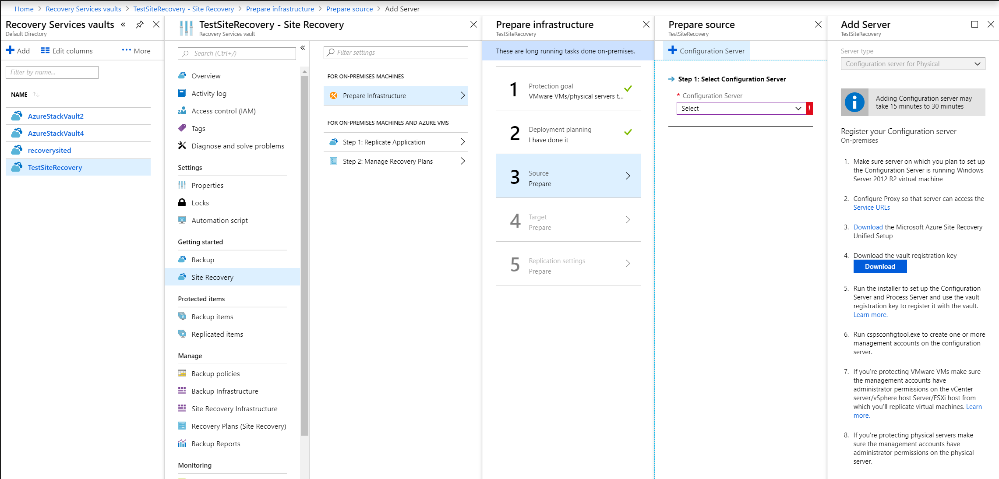
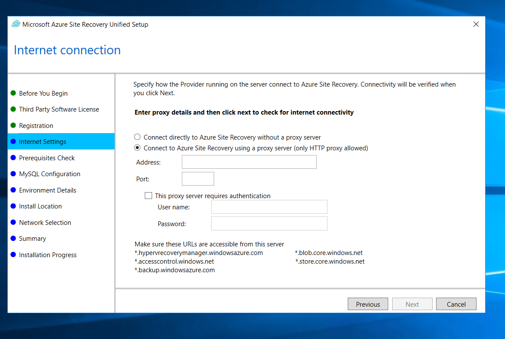
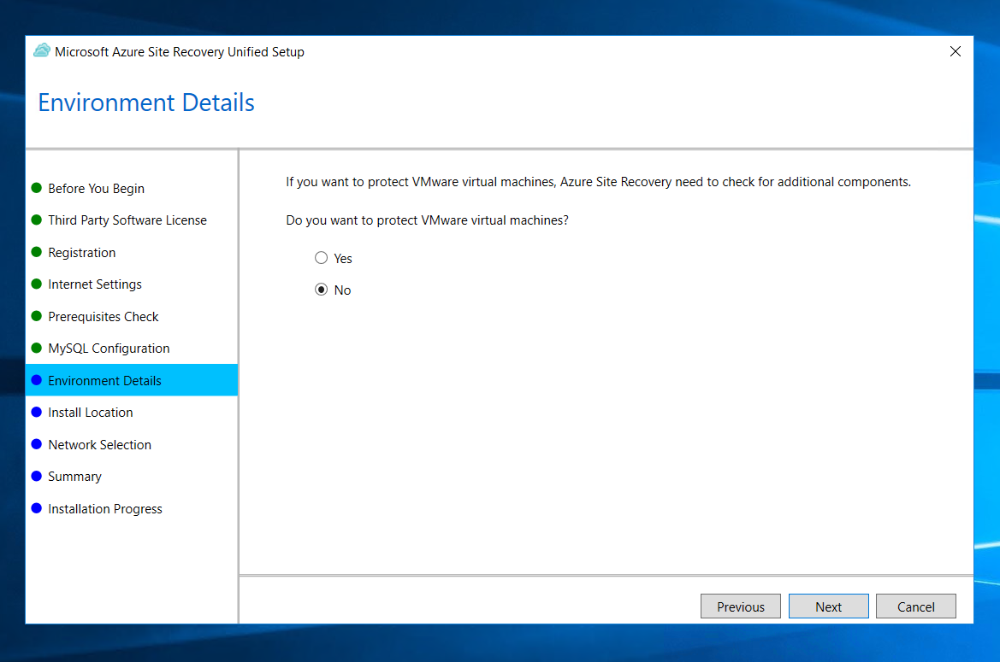
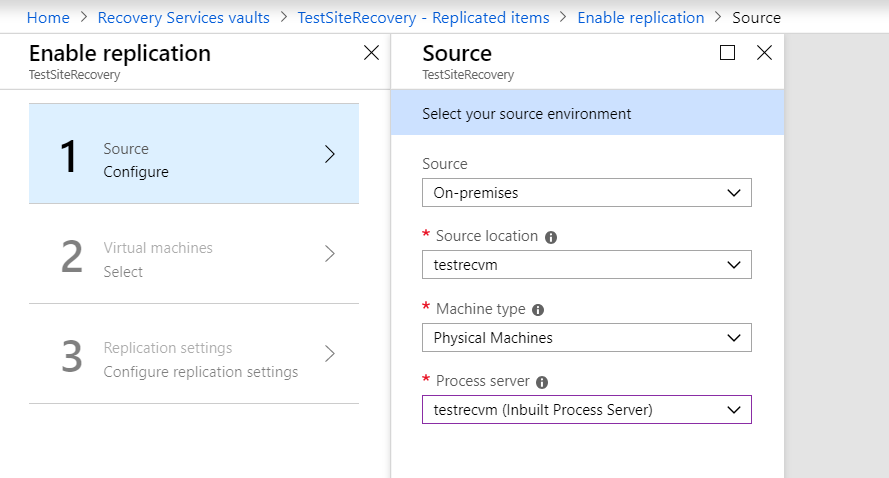
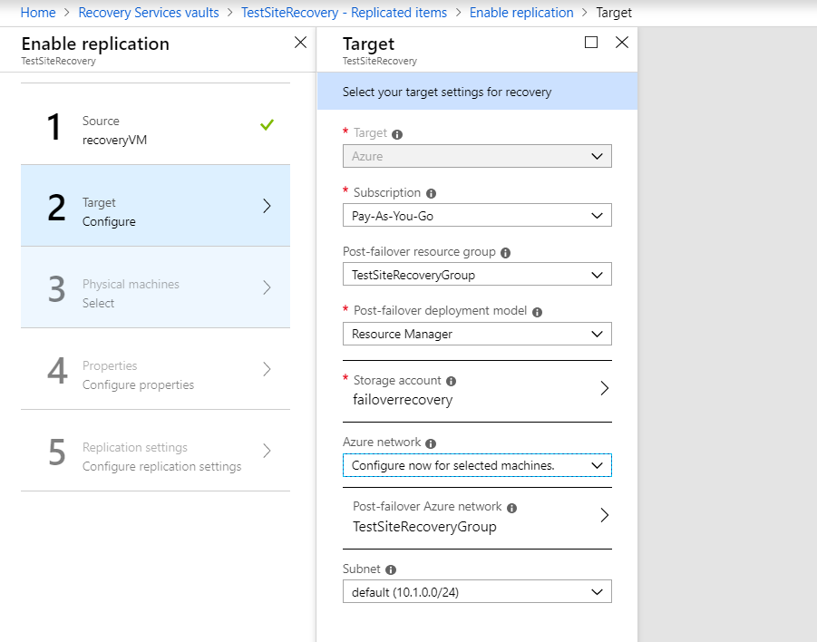
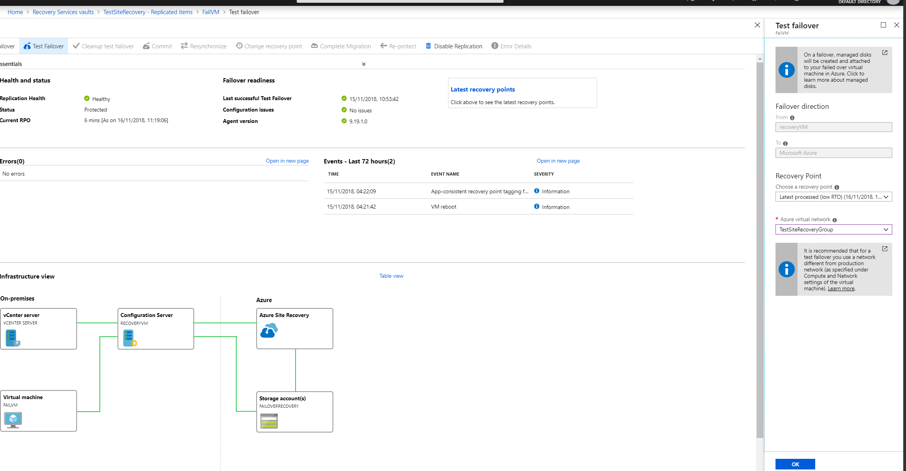

# Setting up disaster recovery for Azure Stack VMs to Azure via the portal

## Overview

The purpose of this article is to help with the setting up of the **Azure Stack** disaster recovery to **Public Azure** using the **Azure Site Recovery Service**.

Site Recovery once set up helps contribute to your business continuity. The service ensures that VM workloads you have protected will remain available when expected and unexpected outages occur, by failing them over to **Public Azure**. You are able to then import the VM's back to **Azure Stack** once platform issues have been resolved.

* Site Recovery manages replication of VMs to Public Azure.

* When an outage occurs in your primary site, you are use Site Recovery to fail over to Public Azure.

* On failover, Azure VMs are created from the stored VM data which is transferred over to Public Azure during failover, and users can continue accessing workloads running on those Azure VMs.

## What is covered in this article

1. **Preparation of VM's for replication** Firstly we will check that VMs comply with Site Recovery requirements, and we will prepare for installation of the Site Recovery Mobility service. This service is installed on each VM you want to replicate.

2. **Creating a new vault and setting a replication goal** Set up a vault for Site Recovery, and specify what you want to replicate. Site Recovery components and actions are configured and managed in the vault.

3. **Set up the source environment** Set up a Site Recovery configuration server. The configuration server is a single Azure Stack VM that runs all the components needed by Site Recovery. After you've set up the configuration server, you will register it in the vault.

4. **Set up target environment** Select your Azure account, Azure storage account and network that you want to use. During replication, VM data is copied to Azure storage. After failover, Azure VMs are joined to the specified network.

5. **Enable replication** Configure replication settings, and enable replication for VMs. The Mobility service will be installed on a VM when replication is enabled. Site Recovery performs an initial replication of the VM, and then ongoing replication begins.

6. **Run a disaster recovery drill** After replication is up and running, you verify that failover will work as expected by running a drill. To initiate the drill, you run a test failover in Site Recovery. The test failover doesn't impact your production environment.

## Account Prerequisites

For Azure site recovery to work you will need a Public Azure subscription as you will be deploying VM's onto this environment and isn't provided by UKCloud.

## Configuration server prerequisites

When setting up the Configuration server VM, it will need the following requirements for physical server replication.

### Hardware Settings

|Device                                    |Details               |
|---------                                 |---------             |
|CPU                                       | > 8 cores            |
|RAM                                       | > 16GB               |
|No of Disks                               | 3 Including OS disk  |
|OS Disk space                             | > 200gb              |
|Free Disk Space for process server cache  | > 600gb              |
|Free Disk Space for retention disk        | > 600gb              |

### Software Settings

|Software                                  |Details               |
|---------                                 |---------             |
|OS                                        | Windows Server 2012 R2 / 2016 |
|OS system locale                          | English (en-us)      |
|IP address type                           | Static               |

**Failure to have a static IP can cause issues during failover.**

### Network access settings for configuration server

* Firewall Ports - Allow ports 443 and 9443, both inbound and outbound (these are used during failover). It may be useful to set up a single **Network Security Group** for all the VMs in the resource group.

* In the Windows Firewall on the configuration server, allow **File and Printer Sharing**, and **WMI**.

    1. To do this, run wf.msc to open the Windows Firewall console.

    2. Right select **Inbound Rules** > **New Rule**. Select Predefined, and choose File and Printer sharing from the list.

    3. Complete the wizard, select to allow the connection > Finish.

    4. Find the firewall rules related to WMI (**Windows Management Instrumentation**) and enable them.

    5. For domain computers, you can use a GPO to do this.

## Step 1. Preparation of VM's for replication

The following set of requirements must be followed to ensure the VM is able to successfully install the Mobility service, which allows the VM to failover.

### OS Support

Please make sure the VMs you want to protect are running one of the following operating systems.

|OS                 |Details                 |
|---------          |---------               |
|64-bit Windows     | Windows Server 2016, Windows Server 2012 R2, Windows Server 2012                                         |
|CentOS | 6.9, 7.3                           |
|Ubuntu | 14.04 LTS server, 16.04 LTS server |

#### Windows Machines

* You need network connectivity between the VM on which you want to enable replication, and the machine running the configuration server. You can test this by pinging the configuration server.

* You need an account with admin rights (domain or local) on the machine for which you enable replication.

  * You specify this account when you set up site recovery on Public Azure. The process server uses this account to install the Mobility service when replication is enabled.

  * This account will only be used by Site Recovery for the installation and updating of the mobility service.

  * If you're not using a domain account, you need to disable **Remote User Access** control on the VM:

    * To do this at the command prompt, type the following: `REG ADD HKEY_LOCAL_MACHINE\SOFTWARE\Microsoft\Windows\CurrentVersion\Policies\System /v LocalAccountTokenFilterPolicy /t REG_DWORD /d 1.`

* In the Windows Firewall on the VM you want to replicate, allow **File and Printer Sharing**, and **WMI**.

    1. To do this, run wf.msc to open the Windows Firewall console.

    2. Right select **Inbound Rules** > **New Rule**. Select Predefined, and choose File and Printer sharing from the list.

    3. Complete the wizard, select to allow the connection > Finish.

    4. Find the firewall rules related to WMI (**Windows Management Instrumentation**) and enable them.

    5. For domain computers, you can use a GPO to do this.

#### Linux Machines

* Ensure that there’s network connectivity between the Linux computer and the process server. This can be tested by ping the configuration server from the Linux machine

* On the machine for which you enable replication, you need an account that's a root user on the source Linux server:

  * You specify this account when you set up Site Recovery. Then the process server uses this account to install the Mobility service when replication is enabled.

  * This account will only be used by Site Recovery for the push installation, and to update the Mobility service.

* Check that the /etc/hosts file on the source Linux server has entries that map the local hostname to IP addresses associated with all network adapters.

* Install the latest openssh, openssh-server, and openssl packages on the computer that you want to replicate.

* Ensure that Secure Shell (SSH) is enabled and running on port 22.

* Enable SFTP subsystem and password authentication in the sshd_config file:
  1. To do this, sign in as root.

  2. Find the line that begins with PasswordAuthentication, in the /etc/ssh/sshd_config file. Uncomment the line and change the value to yes.

  3. Find the line that begins with Subsystem and uncomment the line.

  4. Restart the sshd service.

### Note down the VM's private IP address

For every machine you want to replicate you will need to find and note down the IP address of the machine:

1. In the Azure Stack Portal, find the VM you wish to replicate.

2. On the Resource menu, select **Networking**.

3. Note down the private IP address.

    

## Step 2. Creating a new vault and setting a replication goal

1. In the Public Azure portal navigate to **Create a resource** > **Management Tools** > **Backup and Site Recovery (OMS)**.

2. In **Name** enter the name you wish to call the vault.

3. In **Resource group**, create or select a resource group.

4. In **Location** choose a region.

5. Select **OK** and the vault will be deployed

    

### Creating a replication goal

1. On the **Recovery Services vaults** tab on Public Azure, select the vault you have created.

2. Select the **Site Recovery** tab under **Getting Started**.

3. Select **Prepare Infrastructure**.

4. In Protection goal > **Where are your machines located**, select **On-premises**.

5. In **Where do you want to replicate your machines**, select **To Azure**.

6. In **Are your machines virtualized**, select **Not virtualized / Other**. Then select OK.

    

7. In **Deployment Planning** select the **Yes, I have done it option**.

## 3. Set up the source environment

1. On the **Source Prepare** Tab Select **Configuration Server**.

    

2. Download the Microsoft Azure Site Recovery Unified Setup.

3. Download the vault registration key and transfer it to the configuration server.

4. Transfer these files to the configuration server on Azure Stack.

5. Run the Unified Setup on the configuration server.

### Running Azure Site Recovery Unified Setup

Before you continue, make sure that the server clock is synchronized with a time server on the VM before you start. Installation fails if the time is more than five minutes off local time. A link on how to do this is here: [*Windows Time Service*](https://technet.microsoft.com/windows-server-docs/identity/ad-ds/get-started/windows-time-service/windows-time-service)

Once this is complete install the Azure Site Recovery Unified Setup:

1. Run the Unified Setup installation.

2. In **Before You Begin**, select **Install the configuration server and process server**.

    

3. In **Third Party Software License**, select **I accept the third party license agreement**. this will install MySQL.

    

4. In **Registration**, select the registration key you downloaded from the vault which you transferred.

    

5. In **Internet Settings**, specify how the Provider running on the configuration server connects to Azure Site Recovery over the Internet.

    * If you want the Provider to connect directly, select **Connect directly to Azure Site Recovery without a proxy server**.

    

    * If the existing proxy requires authentication, or if you want to use a custom proxy for the Provider connection, select **Connect to Azure Site Recovery using a proxy server**, and specify the address, port, and credentials.

    

6. In **Prerequisites Check**, The setup runs a check to make sure that installation can run. If a warning appears about the Global time sync check, verify that the time on the system clock (Date and Time settings) is the same as the time zone. This step will ensure the configurations hardware meets minimum requirements.

    

7. In **MySQL Configuration**, create credentials for logging on to the MySQL server instance that is being installed.

    

8. In **Environment Details**, select **No**.

    

9. In **Install Location**, select where you want to install the binaries and store the cache. It is recommended to install the unified setup into the cache drive you created earlier as it has at least 600gb.

    

10. In **Network Selection**, specify the listener (network adapter and SSL port) on which the configuration server sends and receives replication data. Port 9443 is the default port used for sending and receiving replication traffic and this is the port we opened up on the NSG earlier, so in this example this is what we are using. **Do not use port 443 for this.**

    

11. In **Summary**, review the information and select Install.

    

    

After registration finishes, the server should become option when selecting **Configuration Server**.

## Step 4. Set up target environment

In Public Azure, select and verify target resources.

1. In **Prepare infrastructure** > **Target**, select the Azure subscription you want to use.

2. Specify the target deployment model.

3. Site Recovery will check to see if you have a compatible Public Azure Storage account and network. If you don't you will need to create them. This can be done with the Storage **Account** and **Network** buttons under Target.

4. Select **OK**.

    

## Step 5: Enable replication

1. Select the final tab **Replication Settings**.

2. Select **Create and Associate** and specify a policy name.

3. In **RPO threshold**, specify the recovery point objective (RPO) limit.

    * This setting does not affect replication, which is continuous. It simply issues an alert if the threshold limit is reached without a recovery point being created.

4. In **Recovery point retention**, Specify how long each recovery point is kept. Replicated VMs can be recovered to any point in the specified time window.

5. In **App-consistent snapshot frequency**, specify how often application-consistent snapshots are created.

    * A app-consistent snapshot is a point-in-time snapshot of the app data inside the VM.

    * Volume Shadow Copy Service (VSS) ensures that apps on the VM are in a consistent state when the snapshot is taken.

6. Select **OK** to create the policy.

    

### Adding admin account

After the setup has complete if you navigate to the configuration servers desktop you will find a tool called **Cspconfigtool**, run this tool and navigate to the **Manage Accounts** tab, select **Add Account** and then fill out the details matching the admin accounts details on the VM you wish to replicate. It may take a while for the configuration server to sync with Public Azure

### Enable replication

Make sure you've completed all the tasks in **Step 1: Preparation of VMs**. On Public Azure then enable replication as follows:

1. Under **Protected items** in the vault select **Replicated items**.

2. Select **Replicate**.

3. In Source, select **On-premises**.

4. In **Source location** select the configuration server you set up.

5. In Machine type, select Physical machines.

6. Select the process server (configuration server).

    

7. In Target, select the **subscription** and the **Post-failover resource group** in which you want to create the VMs after failover. Choose the **Post-failover deployment model** that you want to use for the failed-over VMs.

8. Select the Public Azure storage account in which you want to store replicated data or create a new storage account.

9. Select **Configure now** for selected machines to apply the network setting to all machines you select for protection. Select **Configure later** if you want to select the Azure network separately for each machine.

10. Select or create a new Azure network and subnet to which Azure VMs connect when they're created after failover.

    

11. In Physical Machines, select **Physical machine**. Specify the name, IP address and the operating system of each machine you want to replicate, you should have noted these down from when you set up the machine prerequisites.

    * Use the internal IP address of the machine.

    **If you specify the public IP address replication might not work.**

    

12. In Properties > Configure properties, select the account that the process server will use to automatically install Mobility Service on the machine. If the configuration server has yet to sync with Public Azure, no account will appear here.

    

13. In Replication settings > Configure replication settings, check that the correct replication policy is selected.

    

14. Select **Enable Replication**.

15. Track progress of the Enable Protection job in Settings > Jobs > Site Recovery Jobs. After the Finalize Protection job runs, the machine is ready for failover.

    * The VM will need to synchronize before a failover can take place. You can see synchronization progress of the VM in the vault.

## Step 6: Run a disaster recovery drill

You can run a test failover to Azure to make sure that everything's working as expected. This failover won't affect your production environment.

### Verify machine properties

Before you run a test failover, verify the machine properties, and make sure that they comply with Azure requirements. You can view and modify properties as follows:

1. In Protected Items, select Replicated Items > VM.

2. In the Replicated item pane, there's a summary of VM information, health status, and the latest available recovery points. Select Properties to view more details.

3. In Compute and Network, modify settings as needed.

    * You can modify the Azure VM name, resource group, target size, availability set, and managed disk settings.

    * You can also view and modify network settings. These include the network/subnet to which the Azure VM is joined after failover, and the IP address that will be assigned to the VM.

4. In Disks, view information about the operating system and data disks on the VM.

### Run a test failover

When you run a test failover, the following happens:

1. A prerequisites check runs to make sure all of the conditions required for failover are in place.

2. Failover processes the data using the specified recovery point:

    * Latest processed: The machine fails over to the latest recovery point processed by Site Recovery. The time stamp is shown. With this option, no time is spent processing data, so it provides a low RTO (recovery time objective).

    * Latest app-consistent.The machine fails over to the latest app-consistent recovery point.

    * Custom. Select the recovery point used for failover.

3. An Azure VM is created using the processed data.

4. Test failover can automatically clean up Azure VMs created during the drill.

### Run a test failover for a VM

1. In **Protected items** > **Replicated Items**, select **VM** then **Test Failover**.

2. For this walkthrough, we'll select to use the Latest processed recovery point.

3. In Test Failover, select the target Azure network.

4. Select OK to begin the failover.

    

5. Track progress by selecting the VM to open its properties. Or, select the **Test Failover Job** in vault name > Settings > Jobs >Site Recovery jobs.

    

6. After the failover finishes, the replica Azure VM appears in the Azure portal > Virtual Machines. Check that the VM is the appropriate size, connected to the right network, and running.

7. You should now be able to connect to the replicated VM in Azure.

    1. To connect to the VM via RDP you will need to assign a public IP to the VM.

    2. Navigate to the VMs **Network interface**.

    3. Under settings select **IP configurations**, then select the config.

    4. Enable **Public IP address**.

    5. Configure **IP address** and create a new IP and select **OK**.

    6. Select save to create the public IP for the VM.

8. To delete Azure VMs created during the test failover, select **Cleanup test failover** on the VM. In Notes, save any observations associated with the test failover.

## Fail Over and Fail Back

After you have finished setting up replication, and ran a test failover to make sure everything's working as expected, you can fail machines over to Public Azure as needed.

Run a failover as follows:

1. In Settings navigate to **Replicated Items**, select the machine then **Failover**.

2. Select the recovery point that you wish to use for the failover.

3. Select **OK** to begin the failover. You can follow the failover progress on the Jobs page.

4. After the failover finishes, the replica Azure VM appears in the Azure portal in the Virtual Machines tab. If you prepared to connect after failover, check that the VM is the appropriate size, connected to the right network, and running.

    * Remember to add a public IP to the VM if it needs one, without a public IP you will be unable to RDP to the VM.

5. After verifying the VM has correctly failed over, select Commit to finish the failover. This deletes all available recovery points for the VM.

> [!CAUTION]
> Don't cancel a failover in progress: Before failover is started, VM replication is stopped. If you cancel a failover in progress, failover stops, but the VM won't replicate again.

### Fail back to Azure Stack

When you primary site is up and running again, you can fail back from Azure to Azure Stack. To do this, you need to download the Azure VM VHD, and upload it to Azure Stack.

1. Shut down the Azure VM, so that the VHD can be downloaded.

2. Navigate to your disks on the VM

3. Select a **Disk**

4. Navigate to **Disk Export**

5. Select **Export** > **Download VHD**

6. Upload the VHD to Azure Stack with these [*steps*](azs-how-manage-disks.md).

7. In the existing VM or new VM, attach the uploaded VHDs.

8. Check that the OS Disk is correct, and start the VM.

At this stage failback is complete.

## Conclusion

In this article we replicated Azure Stack VMs to Azure. With replication in place, we ran a disaster recovery drill to make sure failover to Azure worked as expected. The article also included steps for running a full failover to Azure, and failing back to Azure Stack.

## Next steps

After failing back, you can re-protect the VM and start replicating it to Azure again To do this, repeat the steps in this article.

## Feedback

 If you find an issue with this article, click **Improve this Doc** to suggest a change. If you have an idea for how we could improve any of our services, visit [*UKCloud Ideas*](https://ideas.ukcloud.com). Alternatively, you can contact us at <products@ukcloud.com>.