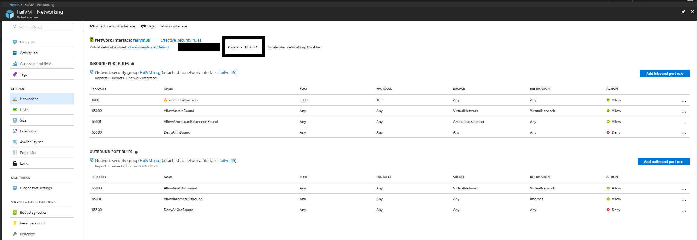
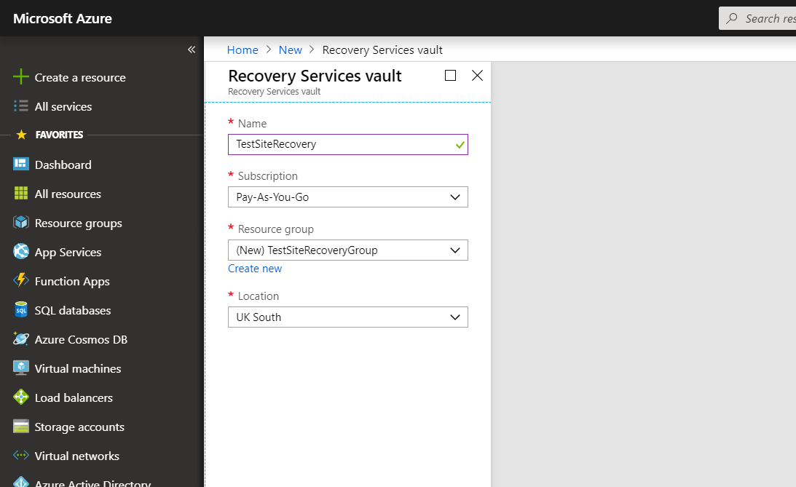
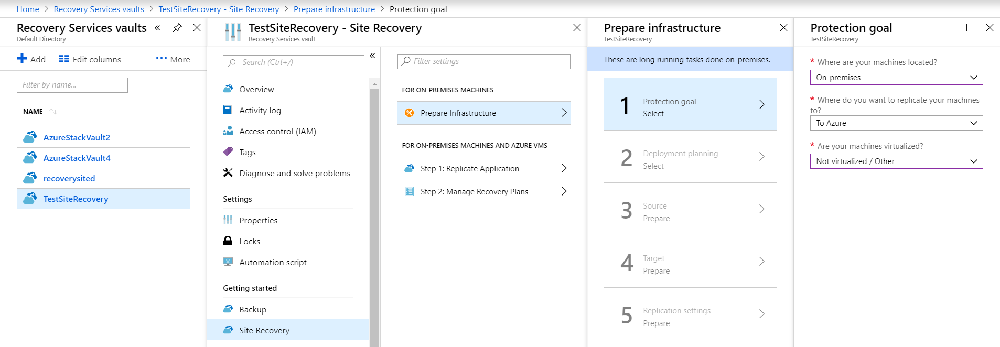

# Setting up disaster recovery for Azure Stack VMs to Azure
The purpose of this guide is to help the setting up of the Azure Stack disaster recovery to Azure using the Azure Site Recovery Service.

Site Recovery contributes to your business continuity and disaster recovery strategy. The service ensures that your VM workloads remain available when expected and unexpected outages occur.

* Site Recovery orchestrates and manages replication of VMs to Azure storage.
* When an outage occurs in your primary site, you use Site Recovery to fail over to Azure.
* On failover, Azure VMs are created from the stored VM data, and users can continue accessing workloads running on those Azure VMs.
* When everything's up and running again, you can fail back Azure VMs to your primary site, and start replicating to Azure storage again.

## Overview Of this Article

1. **Prepare Azure stack VMs for replication.** Check that VMs comply with Site Recovery requirements, and prepare for installation of the Site Recovery Mobility service. This service is installed on each VM you want to replicate.

2. **Set up a Recovery Services vault.** Set up a vault for Site Recovery, and specify what you want to replicate. Site Recovery components and actions are configured and managed in the vault.

3. **Set up the source replication environment.** Set up a Site Recovery configuration server. The configuration server is a single Azure Stack VM that runs all the components needed by Site Recovery. After you've set up the configuration server, you register it in the vault.

4. **Set up the target replication environment.** Select your Azure acccount, and the Azure storage account and network that you want to use. During replication, VM data is copied to Azure storage. After failover, Azure VMs are joined to the specified network.

5. **Enable replication.** Configure replication settings, and enable replication for VMs. The Mobility service will be installed on a VM when replication is enabled. Site Recovery performs an initial replication of the VM, and then ongoing replication begins.

6. **Run a disaster recovery drill.** After replication is up and running, you verify that failover will work as expected by running a drill. To initiate the drill, you run a test failover in Site Recovery. The test failover doesn't impact your production environment.

## Account Prerequisites

* Azure subscription account
* Azure acount permissions
* Azure Stack VM for site recovery configuration server

## Configuration server prerequisites

Configuration server requirements for physical server replication

**Hardware Settings**

|Device                                    |Details               |
|---------                                 |---------             |
|CPU                                       |  >= 8 cores          |
|RAM                                       | >= 16GB              |
|No of Disks                               |  3 Including OS disk |
|Free Disk Space for process server cache  | >= 600gb             |
|Free Disk Space for retention disk        | >= 600gb             |

**Software Settings**

|Software                                  |Details               |
|---------                                 |---------             |
|OS                                        | Windows Server 2012 R2 / 2016 |
|OS system locale                          | English (en-us)      |
|IP address type                           | Static               |

**Access Settings**

* MySQL should be installed on configuration server, this can be installed manually however site recovery can install it during deployment
* Ports - Allow ports 443 and 9443

## 1. Preperation of VM's

**OS Support**

Please make sure the VM's you want to protect are running one of the following operating systems.

|OS                                  |Details               |
|---------                                 |---------             |
|64-bit Windows | Windows Server 2016, Windows Server 2012 R2, Windows Server 2012, Windows Server 2008 R2 (from SP1) |
|CentOS         | 5.2 to 5.11, 6.1 to 6.9, 7.0 to 7.3 |
|Ubuntu         | 14.04 LTS server, 16.04 LTS server |

Review Supported kernals at: 

https://docs.microsoft.com/en-us/azure/site-recovery/vmware-physical-azure-support-matrix#ubuntu-kernel-versions

**Preperation for Mobiliity service installation**

Every VM you want to replicate must have the Mobility service installed. In order for the process server to install the service automatically on the VM when replication is enabled, verify the VM settings.

**Windows Machines**

* You need network connectivity between the VM on which you want to enable replication,   and the machine running the process server (by default this is the configuration server VM).
* You need an account with admin rights (domain or local) on the machine for which you enable replication.
    * You specify this account when you set up Site Recovery. Then the process server uses this account to install the Mobility service when replication is enabled.
    * This account will only be used by Site Recovery for the push installation, and to update the Mobility service.
    * If you're not using a domain account, you need to disable Remote User Access control on the VM:
        * In the registry, create DWORD value LocalAccountTokenFilterPolicy under HKEY_LOCAL_MACHINE\SOFTWARE\Microsoft\Windows\CurrentVersion\Policies\System.
        * Set the value to 1.
        * To do this at the command prompt, type the following: REG ADD HKEY_LOCAL_MACHINE\SOFTWARE\Microsoft\Windows\CurrentVersion\Policies\System /v LocalAccountTokenFilterPolicy /t REG_DWORD /d 1.
* In the Windows Firewall on the VM you want to replicate, allow File and Printer Sharing, and WMI.
    * To do this, run wf.msc to open the Windows Firewall console. Right click Inbound Rules > New Rule. Select Predefined, and choose File and Printer sharing from the list. Complete the wizard, select to allow the connection > Finish.
    * For domain computers, you can use a GPO to do this.

**Linux Machines**

* Ensure that there’s network connectivity between the Linux computer and the process server.
* On the machine for which you enable replication, you need an account that's a root user on the source Linux server:
    * You specify this account when you set up Site Recovery. Then the process server uses this account to install the Mobility service when replication is enabled.
    * This account will only be used by Site Recovery for the push installation, and to update the Mobility service.
* Check that the /etc/hosts file on the source Linux server has entries that map the local hostname to IP addresses associated with all network adapters.
* Install the latest openssh, openssh-server, and openssl packages on the computer that you want to replicate.
* Ensure that Secure Shell (SSH) is enabled and running on port 22.
* Enable SFTP subsystem and password authentication in the sshd_config file:
    1. To do this, sign in as root.
    2. Find the line that begins with PasswordAuthentication, in the /etc/ssh/sshd_config file. Uncomment the line and change the value to yes.
    3. Find the line that begins with Subsystem and uncomment the line.
    4. Restart the sshd service.

**Note the VM private IP address**

For every machine you want to replicate you will need to find and note down the IP address of the machine:

1. In the Azure Stack Portal, click on the VM.
2. On the Resource menu, click Networking.
3. Note down the private IP address.

## 2. Create a new vault and setting a replication goal.

1. In the Azure portal navigate to **Create a resource** > **Management Tools** > **Backup and Site Recovery (OMS)** 
2. In **Name** enter the name you wish to call the vault
3. In Resource group, create or select a resource group
4. In Location choose one of the UK South
5. To quickly access the vault simply right click and select **Pin to dashboard**

### Selecting a replication goal

1. On the **Recovery Services vaults** select the vault you have created.
2. Select the **Site Recovery** tab under **Getting Started**.
3. Select **Prepare Infrastructure**.
4. In Protection goal > Where are your machines located, select **On-premises**.
5. In Where do you want to replicate your machines, select **To Azure**.
6. In Are your machines virtualized, select **Not virtualized/Other**. Then select OK.

7. On Deployment Planning select the **Yes, I have done it option**

## 3. Set up the souce enviroment

