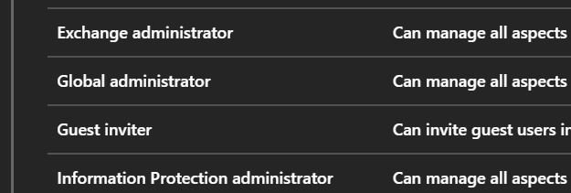

# How to identify your Microsoft Azure Global Admins

## Overview

The global administrator has access to all administrative features. By default, the person who signs up for an Azure subscription is assigned the global administrator role for the directory. Only global administrators can assign other administrator roles.

### Intended audience

To complete the steps in this guide, you must have appropriate access to your Microsoft Azure Portal.

**Indentifying the Global administrators**

1. Log in to your Microsoft Azure portal at http://portal.azure.com.

2. In the left hand side portal menu select **Azure Active Directory**.

    

3. In the *New* blade, select **Roles and Administrators**.

    

4. In the *Role* blade, scroll down and select **Global administrator**.

    

5. The *Global administrator - members* blade will be displayed listing the members of that group.

## Next steps

For more information about UKCloud for Microsoft Azure, see:

- [*Understanding UKCloud for Microsoft Azure*](azs-ref-overview.md)
- [*Getting Started Guide for UKCloud for Microsoft Azure*](azs-gs.md)
- [*UKCloud for Microsoft Azure FAQs*](azs-faq.md)

## Feedback

If you have any comments on this article, or any other aspect of your UKCloud experience, send them to <products@ukcloud.com>.