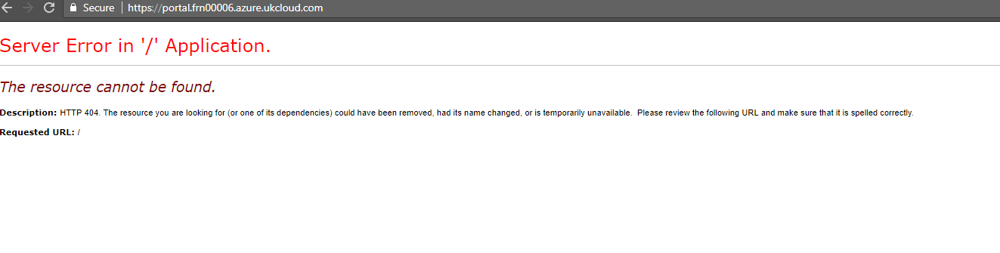
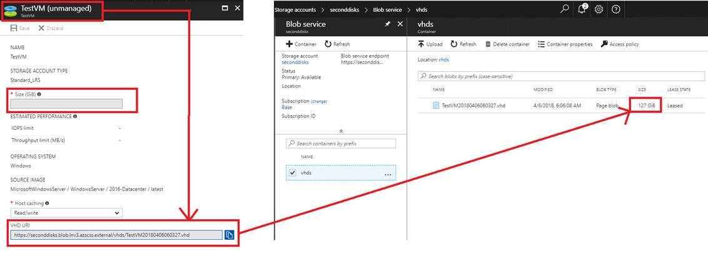

# UKCloud for Microsoft Azure troubleshooting

## Overview

This guide describes some of the issues you may encounter when using UKCloud for Microsoft Azure:

## Login results in server error

### Cause

When first logging in to the Azure Stack portal, you may see the following error:

`Server Error in '/' Application.`

### Solution

Refresh the page and the login should work.

## Diagnostics do not work for Linux VMs

### Cause

If you enable Microsoft Insights for your subscription (**Subscriptions > Resource providers > Microsoft.Insights** and then click subscribe), you'll have access to Azure Monitoring for Windows VMs only. This feature is not yet available for Linux VMs as documented [here](https://docs.microsoft.com/en-us/azure/azure-stack/user/azure-stack-metrics-azure-data#application---diagnostics-logs-application-logs-and-metrics).

### Solution

There is currently no workaround for this issue.

## Virtual machine disk size is not showing in the GUI or CLI

### Cause

You cannot see the virtual machine disk size in the GUI or CLI.

### Solution

To view your disk size, navigate to **Storage accounts > \<Storage Account Name\> > Blob service > vhds** and find your disk there:

## Feedback

If you find an issue with this article, click **Improve this Doc** to suggest a change. If you have an idea for how we could improve any of our services, visit [UKCloud Ideas](https://ideas.ukcloud.com). Alternatively, you can contact us at <products@ukcloud.com>.
