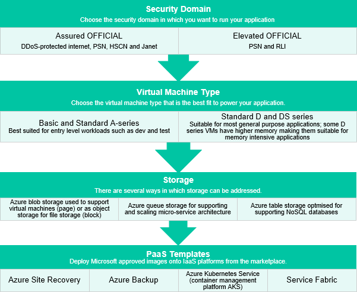

# UKCloud for Microsoft Azure Service Definition

## What is UKCloud for Microsoft Azure?

UKCloud for Microsoft Azure harnesses the innovation of Microsoft's Azure Stack Hub platform. The service is delivered from within our award-winning government-grade multi-cloud environment – addressing the service, connectivity and diversity requirements of UK public sector organisations and their industry partners. UKCloud can also support your deployments on Azure public, giving you one partner for all your Microsoft Azure environments.

## What the service can help you achieve

- Utilise existing Azure skills and developer productivity through consistent application development, enabling you to standardise on skills and tooling and start modernising your applications by increasing operational efficiency

- Use UKCloud as your partner for your Azure public deployments, allowing for a seamless hybrid cloud experience

- Meet your compliance requirements – your data never leaves the UK when at rest on our platform, which is capable of supporting data classified up to above OFFICIAL

- Ensure that your application is always available – build sovereign, disaster-tolerant solutions on Azure utilising our multiple UK sites, or combine a UKCloud region with the UK region of Azure

- Leverage low latency connections to Crown Hosting, enabling you to build hybrid, private or public cloud solutions that span both of our UK sovereign data centres

- Add operational resilience to existing facilities or extend your estate to cope with growing workloads with hybrid cloud solutions

## Product options

The service is designed to be flexible and enables you to mix and match from a range of pre-defined options for each virtual machine.

### Private Cloud deployment

IaaS and PaaS on a dedicated infrastructure. Service options include:

- Azure Infrastructure services. Dedicated virtual machines.

- Platform services:

  - Azure App Service. Create applications for any platform or device. Automate business processes and host cloud APIs.

  - Azure Functions. Serverless computing technology that enables you to build applications faster.

  - Database services for SQL and MYSQL. Enables simple consumption of databases for cloud-native applications, websites and workloads.

- Deployment options:

  - Location. Deploy and manage from a variety of locations: UKCloud hosted, Crown Hosting or your own data centres.

  - Flexible purchase options. Based on CapEx, OpEx or bring your own infrastructure.

### Additional deployment options

#### Microsoft Azure's public cloud services

UKCloud can support with your licensing, management and utilisation of tenancies on the Microsoft public cloud. Get in touch to find out more.

## Pricing and packaging

UKCloud for Microsoft Azure VM pricing can be as low as 3p per hour. Full pricing with all options, including public Azure, licensing and connectivity, is available in the [UKCloud Pricing Guide](https://ukcloud.com/pricing-guide).

## Accreditation and information assurance

The security of our platform is our number one priority. We've always been committed to adhering to exacting standards, frameworks and best practice. Everything we do is subject to regular independent validation by government accreditors, sector auditors and management system assessors. Details are available on the [UKCloud website](https://ukcloud.com/governance/).

## Connectivity options

UKCloud provides one of the best-connected cloud platforms for the UK Public Sector. We enable access to our secure platform by DDoS-protected internet, PSN, Janet, HSCN, RLI and your own leased lines via our HybridConnect or CrownConnect services. The full range of flexible connectivity options is detailed in the [UKCloud Pricing Guide](https://ukcloud.com/pricing-guide).

## An SLA you can trust

We understand your workloads need a dependable service that underpins the reliability of the application to users and other systems, which is why we offer one of the best SLAs on G-Cloud. For full details on the service SLA, including measurements and service credits, see the [*SLA definition*](../other/other-ref-sla-definition.md).

## The small print

For full terms and conditions, including onboarding and responsibilities, refer to the [*Terms and conditions documents*](../other/other-ref-terms-and-conditions.md).

For more information about this service, see the [*Service Scope*](azs-sco.md) and [*FAQs*](azs-faq.md).

## Why UKCloud?

UKCloud is dedicated to the digital transformation of our nation's public services through our flexible, secure and cost-effective multi-cloud platform and the expertise of our people and partners. We believe that diversity of technology drives value and innovation and so we bring together different cloud technologies, with different deployment models spanning on-premises (private cloud), on-campus (Government's Crown Campus) and off-campus global public cloud services. This enables you to choose the right cloud for creating new workloads or migrating or replacing existing applications to the cloud with specialist SaaS solutions.

We recognise the importance of public services to UK citizens and businesses, which is why we include the highest level of support to all our customers at no extra cost. This includes dedicated 24/7 UK support, a Network Operations Centre (NOC), utilising protective and proactive monitoring tools, and access to UKCloud's experts. UKCloud can also provide outcome-based professional services or managed services to help you with digital transformation.

## Feedback

If you find a problem with this article, click **Improve this Doc** to make the change yourself or raise an [issue](https://github.com/UKCloud/documentation/issues) in GitHub. If you have an idea for how we could improve any of our services, send an email to <feedback@ukcloud.com>.
