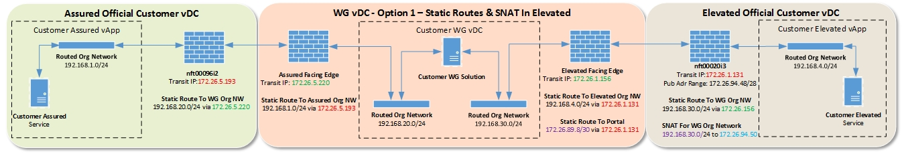
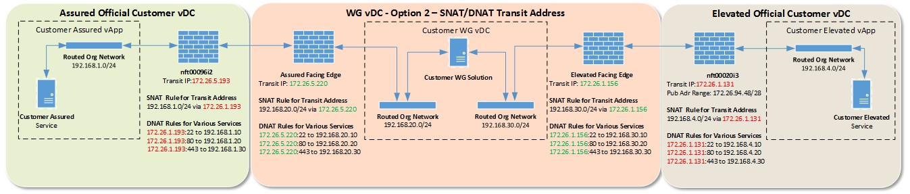

# Getting Started Guide for the Cross Domain Security Zone Walled Garden

## Introduction

The UKCloud Walled Garden provides self-service access to the Cross Domain Security Zone (CDSZ) so that you can design, implement and manage your own cross‑domain solution, using technology and application services of your choice. UKCloud provides an assurance wrap by managing firewalls between the security domains and ensuring you use appropriate risk management to understand and mitigate identified risks.

The Walled Garden is ideal if you require more control and flexibility over what is passed between security domains, to support a wider range of use cases.

This guide covers the steps you need to follow to get your Walled Garden up and running.

### Intended audience

This guide is intended for customers who have:

- Completed the CDSZ Walled Garden assurance wrap
- Been approved to have a Base Implementation of the Walled Garden to allow data to pass between the Assured and Elevated security domains on the UKCloud platform

## Before you begin

Before you can start to implement a walled garden, you must have completed and passed the appropriate assurance wrap. For more information, see the [*UKCloud Walled Garden assurance wrap and application form*](https://portal.ukcloud.com/support/knowledge_centre/ecc6d8fd-ef63-44f6-bb33-b2b9b0af41f3).

After your Walled Garden assurance wrap has been approved, a service request is raised to implement the Walled Garden virtual data centre (VDC) and, if necessary, Elevated and Assured VDCs.

> [!NOTE]
> If a service request for this implementation already exists, the existing request is used and a new one is not raised.

You can track the progress of the service request in the [My Calls](https://portal.ukcloud.com/support/my_calls) section of the UKCloud Portal.

During the provisioning of the Walled Garden service, we'll ask you for some additional information via the service request:

- The customer account in which you would like the Walled Garden VDC to be provisioned, if different from the customer completing the Walled Garden application form.
- Whether you plan to have a single or dual site solution.
- How many VDCs you need to be set up in each security domain.
- If you're connecting new or existing VDCs to the Walled Garden VDC.
  - If you're connecting to existing VDCs, we'll need to know information such as NFT details, customer account, and so on.
- The external source IP addresses from which you'd like to access the Assured VDC (up to a maximum of 50).

    These IP addresses are the locations from which you can build and test the environment (for example, offices or end user premises).

The build phase of the Walled Garden environment can take up to 10 working days depending on the complexity of the deployment. When the environment has been fully provisioned, your Customer Success Manager (CSM) will send you the information you need to access it.

## Building your Walled Garden service

As soon as you have access to your environment, you can start to build your Walled Garden services. You then have 42 calendar days to:

- Complete the provisioning of the virtual machines (VMs) and networking
- Complete an IT Health Check
- Present your evidence pack to the customer and UKCloud SIROs

It is important to remember that while the UKCloud Portal for the Assured security domain is accessible from the internet, the Portal for the Elevated security domain and Walled Garden services is accessible only through the PSN Protected network or through UKCloud's Secure
Remote Access service.

### Setting up your networking

First, you need to replicate the networking that you set out in your Walled Garden application form diagrams. This involves the creation of external and internal networking, as well as the creation of rules on the virtual firewall within your environment. For information about
creating networks and firewall rules, see the [*How to build a virtual machines with UKCloud for VMware*](https://portal.ukcloud.com/support/knowledge_centre/eb14aec9-5248-4cd4-a714-511389ec186e)
and [*Getting Started Guide for UKCloud for VMware*](https://portal.ukcloud.com/support/knowledge_centre/e9e2a0a4-70ba-4ace-a8bf-913d052d7003).

You also need to create the rules that allow connectivity between the different VDCs through the Walled Garden. This involves the creation of firewall rules, static routes and/or NAT rules.

#### Networking examples

There are two options for networking between the VDCs in the Walled Garden service:

- **Option 1:** Create static routes between the VDCs; this is the simplest option for connecting VDCs
- **Option 2:** Use NAT rules on top of the static routes; this option may be appropriate if you want to abstract the static routes

The diagrams below provide examples for both options.

> [!NOTE]
> For both options:
> - You cannot route public IP addresses to the vCNS Edges in the Walled Garden
> - The Org VDC networks 192.168.XXX.XX in the examples below are illustrative and you should replace these with your own details
> - You must have one VM in the Walled Garden VDC connecting to both vCNS Edges
> - Each of the examples below assumes that the appropriate firewall rules are in place
> - You must apply an SNAT rule in the Elevated security domain to enable connectivity to UKCloud services

### Building your virtual machines

The next step is to build the VMs that you outlined in the Walled Garden application form. This involves deploying the VMs from either the vCloud Director catalog or from template VMs as OVF files. The VMs must be able to access UKCloud services, such as OS repositories, the network time
server, the Key Management Server (KMS), and so on. You may also need to access external services, such as antivirus repositories. You must configure this access in your VDC networking. For more information about creating VMs and accessing UKCloud services, see the [*Getting Started Guide for UKCloud for VMware*](https://portal.ukcloud.com/support/knowledge_centre/e9e2a0a4-70ba-4ace-a8bf-913d052d7003).

### Testing your environment

When you've built your VMs and networking, you can start to test the environment. If you've configured the networking correctly, your VMs should be able to talk to each other across the Walled Garden. If you have any issues, check your network rules.

### Performing the IT Health Check

As part of the Base Implementation, you're required to conduct an IT Health Check (ITHC) of the environment. The ITHC must be conducted by an independent CHECK Service Provider, approved and classified as Green Light by the National Cyber Security Centre (NSCS). You can search for appropriate providers on the [NSCS web site](https://www.ncsc.gov.uk/index/professional-service?f%5B0%5D=field_assurance_status%3AAssured&f%5B1%5D=field_assurance_scheme%3A213).

Before beginning the ITHC, notify UKCloud by raising a service request in My Calls and completing the [*External Security Review Test (ESRT) application form*](https://portal.ukcloud.com/support/knowledge_centre/4f052cee-0400-4e12-9e90-827a768ea7ad).
Ideally, we require five working days' notice before the work is due to be carried out.

The ITHC scope should be relevant to the environment. For example, if you're using the Walled Garden to pull application and antivirus updates from the internet, then security controls relevant to facilitate this should be in scope. Bear in mind that the end customer accreditor may
dictate the scope of the ITHC.

### Presenting your results

When you've conducted your ITHC, with no results higher than Medium, present your evidence pack to the UKCloud SIRO. The evidence pack comprises the Walled Garden assurance wrap form and the following, as detailed in sections (a) to (c) in section 3.7 of the Walled Garden assurance wrap form:

(a) Evidence of protective monitoring aligning with the 12 Protective Monitoring Controls (PMCs) in Good Practice Guide 13 (GPG13). The protective monitoring will need to span both sides of the Walled Garden as well as the Walled Garden itself. You can provide this by explaining how each of the PMCs is met by the protective monitoring solution in place.

(b) The ITHC results, with no risks higher than a Medium. If you do have results higher than a Medium but you have put a remediation plan in place that has been accepted by the end customer accreditor, then we may accept this depending on the issues raised.

(c) An approval statement confirming that the end customer accreditor is satisfied with the overall security regime and is happy for the solution to be live.

If the information provided in the Walled Garden evidence pack is acceptable, the UKCloud SIRO signs off the Live Implementation and any restrictions that have been imposed on the environment by UKCloud Customer Service are lifted.

## Glossary

This section provides a glossary of terms specific to the Cross Domain Security Zone Walled
Garden.

**assurance wrap**&nbsp;&nbsp;A process for ensuring that customers understand, have identified and can mitigate potential risks when using a customer-defined solution within the UKCloud platform.

**Assured OFFICIAL**&nbsp;&nbsp;A security domain on the UKCloud platform that provides access to public networks, such as PSN Assured or the internet.

**Base Implementation**&nbsp;&nbsp;A limited instantiation of a service for the purpose of building, testing and providing evidence of appropriate security checks for a customer-defined solution on the UKCloud platform.

**Cross Domain Security Zone (CDSZ)**&nbsp;&nbsp;A UKCloud IaaS service that provides the ability to securely transfer data between our Assured OFFICIAL and Elevated OFFICIAL security domains using CESG-approved cross-domain security patterns and our Secure Remote Access service.

**Elevated OFFICIAL**&nbsp;&nbsp;A security domain on the UKCloud platform that provides secure access to restricted networks such as PSN Protected, N3 or Janet.

**evidence pack**&nbsp;&nbsp;A collection of evidence to prove that a customer-defined solution on the UKCloud platform aligns with all appropriate security measures and risk mitigation, including the 12 PMCs of GPG13.

**Good Practice Guide 13 (GPG13)**&nbsp;&nbsp;A set of controls covering protective monitoring, such as event log management and intrusion detection and prevention systems, required to prevent accidental or malicious data loss. Also referred to as Protective Monitoring Controls (PMCs).

**IT Health Check (ITHC)**&nbsp;&nbsp;An IT security assessment, performed by an independent security organisation, to confirm that a service provides the appropriate level of security required by the UK government.

**Live Implementation**&nbsp;&nbsp;A full instantiation of a service after it has passed all stages of the assurance wrap and been approved by the UKCloud SIRO.

**National Cyber Security Centre (NCSC)**&nbsp;&nbsp;A department of GCHQ that acts as a bridge between industry and government to help reduce the cyber security risk to the UK by providing
cyber security advice and cyber incident management.

**Protective Monitoring Controls (PMC)**&nbsp;&nbsp;*See* GPG13.

**Senior Information Risk Owner (SIRO)**&nbsp;&nbsp;The person within an organisation who owns the organisation's information risk policy.

**Walled Garden**&nbsp;&nbsp;A Cross Domain Security Zone (CDSZ) service option that provides you
with self-service access to the CSDZ so that you can design, implement and manage your own cross-domain solution, using technology and application services of your choice.

## Feedback

If you have any comments on this document or any other aspect of your UKCloud experience, send them to <products@ukcloud.com>.

&copy; [UKCloud Ltd](http://ukcloud.com), 2018. All Rights Reserved. UKC-GEN-484