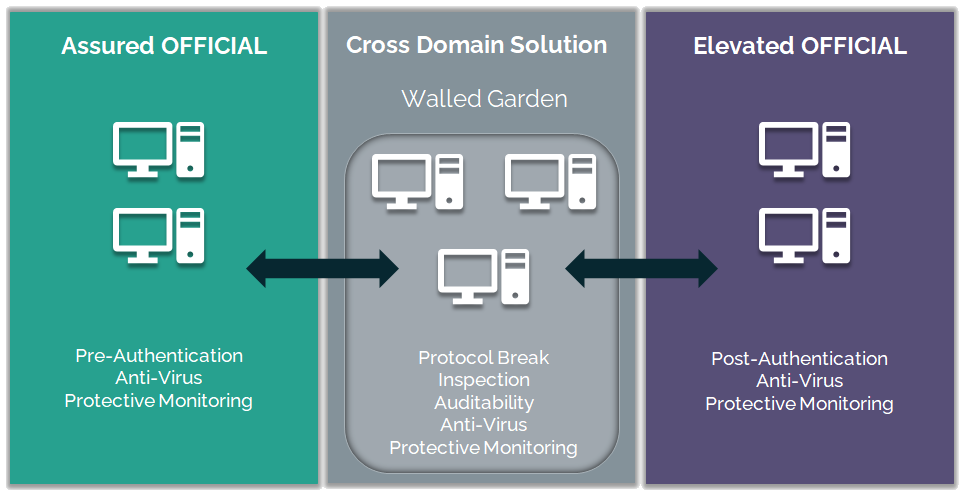
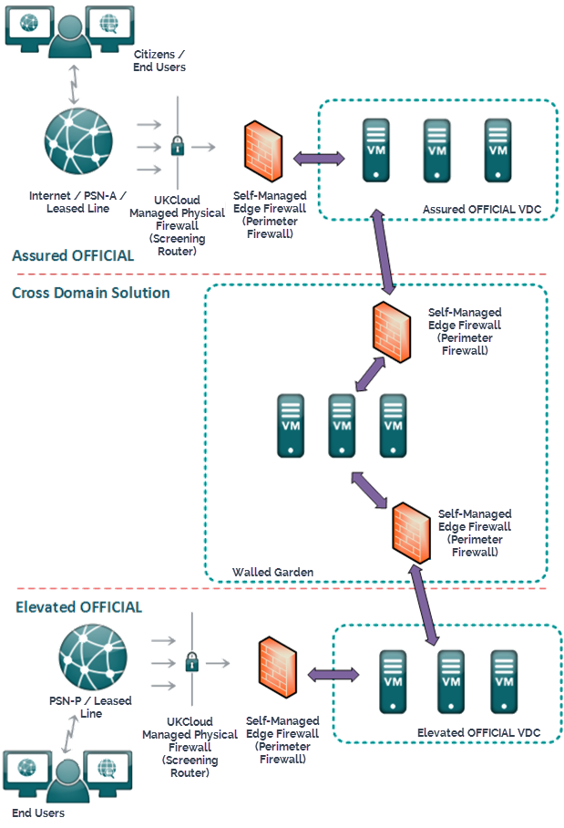
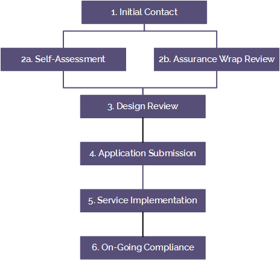

# Cross Domain Security Zone Blueprint

## Overview

Our customers' requirements range from relatively low-security solutions that are natively accessible on the internet, to solutions that must be more restricted and accessible only over government community networks such as the PSN, JANET or HSCN.

To meet these varying needs, we've implemented two security domains on our platform, both of which are accredited for hosting systems and data classified at OFFICIAL:

- Assured OFFICIAL security domain ― directly connected to our DDoS-protected internet, PSN, JANET and HSCN networks

- Elevated OFFICIAL security domain — natively connected only to the PSN and RLI, it benefits from increased security as all users and devices that can access this security domain are known and trusted

The Government Digital Service (GDS) strategy of "internet is okay" is dividing opinion across government. On one hand, many applications that were initially PSN connected and only accessible by a closed community are now being connected to the internet, pushing security from the physical network layer to the services themselves, reducing cost and time to delivery. On the other hand, a lot of data is considered too sensitive to be stored in a directly internet-connected environment, where the attack vector of an internet connection creates too much risk.

Where customers choose to host their sensitive data in a non-internet connected environment, but still require internet connectivity for some aspects of their service, they can connect their application components which are on Assured OFFICIAL to application components that on Elevated OFFICIAL.

To connect these components, a customer must use a Cross Domain Security Zone (CDSZ), which provides a controlled interconnection between the lower-security domain (Assured OFFICIAL) and the higher-security domain (Elevated OFFICIAL).

This Blueprint draws on our experience of working with government customers and NCSC to help architect cross-domain solutions.

## Key principles

### The role of the customer's accreditor

We provide our Assured OFFICIAL and Elevated OFFICIAL security domains. Our customers are responsible for the accreditation of the applications they run on either security domain, including any specific use of the UKCloud Cross Domain Security Zone.

The customer's accreditor is responsible for identifying, assessing and mitigating the specific risks to their individual solution that are created by the use of the UKCloud Cross Domain Security Zone. As part of the customer's own assurance activities, we recommend engaging a CLAS or CCP Security Professional and have an IT Security Health Check carried out by a CHECK test provider.

### Effective risk mitigation

When reviewing a UKCloud Cross Domain Security Zone application document set, submitted for approval by a customer, UKCloud will expect to see a number of controls included in the solution to adequately mitigate the risks of exposing an application that uses particularly sensitive data to the internet.

It isn't necessarily the case that all of these controls will be needed for a solution to be approved, but aiming to include as many of them as possible will help to ensure that the approval process requires less scrutiny, and that the solution can move to the implementation phase much more quickly.

Listed below are the controls we believe UKCloud and customer SIROs will expect to see in place when they review a solution that requires the UKCloud Cross Domain Security Zone capability.

#### Controls

- Protective Monitoring and possibly a Security Operations Centre (SOC)

- Information Assurance Standard (IS) 1 and IS2 Technical Risk Assessment

  - IS1 is a government standard for risk assessment

  - IS2 is a government standard for risk management and accreditation

- Risk Management and Accreditation Documentation Set (RMADS)

- Host-based intrusion detection (HIDS)

  - Agents installed within virtual machines (VMs) that collect log data and alert on unusual behaviour or potentially forward to a SOC

- IT Security Health Check (CHECK) test

  - Penetration test performed by an NCSC CHECK-approved tester

- Content type checking

  - Security policy defining which content types are permitted (binary/xml/json etc)

- Deep content inspection

  - Inspection of an HTTP request/response body, including, for example, things such as XML Schema validation or field length checking

- Data loss prevention

  - Software that prevents data leaving an organisation without permission

- Anti-virus

  - Consider how definitions are downloaded and made available to VMs

## Cross Domain Security Zone service options

The UKCloud Cross Domain Security Zone enables customers to securely transfer data between the UKCloud Assured OFFICIAL security domain and the UKCloud Elevated OFFICIAL security domain using NCSC-approved cross-domain security patterns.

There were three options available within the Cross Domain Security Zone product set, however the UKCloud Guard is due to be retired from sale so there are now two service options available:

- Secure Remote Access. We provide a self-service remote access solution so that customers who do not have a PSN or RLI connection to their business premises may have a method of managing their environments within Elevated OFFICIAL. Note that this is for management purposes only, and not for end-user access to the Elevated security domain. This service is not covered within this Blueprint.

- Walled Garden. Self-service management of a Cross Domain Security Zone Walled Garden, enabling customers to implement security applications of their choice. We provide an assurance wrap by ensuring customers use appropriate risk management to understand and mitigate identified risks.

## How the Walled Garden works

UKCloud Walled Garden is a single-tenant walled garden architecture, within a separate zone of the UKCloud platform that customers can populate with VMs to allow communication between applications on the Assured OFFICIAL and Elevated OFFICIAL security domains.

Customers have full control of the services within their walled garden, enabling them to transmit communications between security domains using any protocols required. Protocols and traffic include RDP, SSH, binaries, and management protocols such as SNMP and NMI.

When a customer implements a walled garden, they need to take precautions to ensure the integrity and availability of data across both security domains. These precautions must be documented in the Cross Domain Security Zone submission. Traffic through the walled garden can originate from either Assured or Elevated OFFICIAL.

The walled garden can be a target for single or multiple application servers in either platform, and can contain as many virtual machines as are needed to service application requests across the walled garden. The figure below shows an example of a possible setup, but it should be used as a starting point only; customers may want to populate their walled garden with more services to meet their needs.

It's important to highlight that there is no pre-defined architectural pattern that a solution must fit into. To help, UKCloud can make recommendations about the architectures that are likely to be approved by the customer accreditors. However, this will be guidance only — each solution will be approved by the end-customer data owner before UKCloud will allow the customer to build.

### Assured OFFICIAL security domain

The Assured OFFICIAL security domain should have:

- Firewall rules to tightly control traffic to the applications which will talk across the walled garden

- Anti-virus

- Protective monitoring

Additional techniques to further secure the solution should be used if possible:

- OS and application hardening to reduce services running on the server, decreasing the surface of vulnerability

- Logging of events on the server for auditing purposes, with logs included in the protective monitoring solution

- Content checking to ensure the integrity of data and provide a defence against content attacks

It is recommended that it should have an anti-virus product that differs from other anti-virus products used in the overall solution.

### Walled Garden

The Walled Garden consists of a single-tenant walled garden architecture which should include:

- A protocol break and re-creation, for example by using a reverse proxy

- Inspection of the data to validate the message structure or message content, to ensure the messages used to convey the application data are correctly encoded, and to confirm that the content within the messages are as expected

- IDS and logging of events on the VMs for auditing purposes, and alert generation for messages that fail the validation process as part of a protective monitoring solution

- Anti-virus

Other considerations for the Walled Garden include:

- OS and application hardening to reduce services running on the server, decreasing the surface of vulnerability

- Implementation of release controls to enforce a whitelist of the data types and content permitted for release through the Walled Garden

- Direction control for data moving from either high-to-low or low-to-high domains; for example, best practice is to prevent 'pull' requests from the application in the low domain

It's good practice to run non-SSL traffic so the Walled Garden doesn't need to decrypt and re-encrypt to inspect the messages.

Customers can have different VMs within a single walled garden instance servicing different requests to span the two domains. For example, a customer could have software updates and protective monitoring traffic being serviced by the same VMs within the walled garden.

### Elevated OFFICIAL security domain

The Elevated OFFICIAL security domain should have:

- Firewall rules to tightly control traffic to the applications that will talk across the Walled Garden

- Post-authentication to enable access control and auditing

- Anti-virus

- Protective monitoring with IDS

Additional techniques to further secure the solution should be used if possible:

- OS and application hardening to reduce services running on the server, decreasing the surface of vulnerability

- Logging of events on the VMs for auditing purposes, with logs included in the protective monitoring solution

- Content checking to ensure the integrity of data and provide a defence against content attacks

It should also be configured with an anti-virus product that differs from other anti-virus products used in the overall solution.

### Networking

Applications that communicate across the Walled Garden should be placed on a dedicated network segment that can be securely segregated from other segments using firewall rules, managed through the cloud technology's virtual firewalls such as NSX edges, or customers' own virtual firewalls.

The inter-environment connections between the firewalls, from Assured OFFICIAL to the Walled Garden, and from the Walled Garden to Elevated OFFICIAL are all controlled by UKCloud to ensure that correct connectivity is maintained.

The networking within the customer's environments, within Assured, Walled Garden and Elevated are the customer's responsibility.

Customers can choose between two ways of routing traffic to the walled garden, and must state their choice before implementation:

- To terminate the connection to the walled garden at the edge, and then NAT the traffic into the walled garden

- To route the traffic directly into the walled garden

The figure below shows the network topography for a typical walled garden.

## High availability

The UKCloud Cross Domain Security Zone is highly available within a single site. If site-level resilience is required, customers must buy a second Cross Domain Security Zone, which will be configured with the same policy as the primary site.

The two instances can then be used:

- Active/passive via application configuration updates (for example change Walled Garden target in the event of a failure)

- In active/active configuration, which is perhaps more useful

If Cross Domain Security Zone instances will be used in an active/active configuration, the customer needs to implement a load balancer in the Assured or Elevated tier (depending on the direction of the traffic flow) to send requests to both Cross Domain Security Zones.

## The approval process

Every UKCloud Cross Domain Security Zone implementation requires customer Data Owner and UKCloud approval before the customer can carry out any implementation work.

The approval process is shown below. More information is available in the [*UKCloud Cross Domain Security Zone application process*](cdsz-ref-application-process.md).

Step | Description
-----|------------
1 Initial Contact | Customer contacts UKCloud to register interest in the CDSZ service. This can be through [My Calls](https://portal.skyscapecloud.com/support/ivanti) or direct contact with a Sales representative, Technical Account Manager (TAM) or Cloud Architect.
2a Self-Assessment | Customer creates the document pack to illustrate the solution design and provide evidence that all necessary sign-offs and compliance have been obtained.
2b Assurance Wrap Review | Customer creates the document pack with assistance from the UKCloud compliance team and Cloud Architect.
3 Design Review | Customer presents the technical solution to the Cloud Architect for advice and feedback.
4 Application Submission | Customer raises a Service Request and submits the document pack.
5 Service Implementation | UKCloud provisions the service and the customer implements their solution.
6 On-Going Compliance | Once the implementation is in operation, the customer is responsible for ensuring continuing compliance with Security Operating procedures (SyOps) and other security obligations. UKCloud annually prompts customers to review the existing document pack and provide updated information for any changes to design or approvals.

### Required documents

When you apply for a Cross Domain Security Zone service, you must provide the following documents to show that you have identified and mitigated for any risks:

- Details of your proposed implementation that covers the intended design in the CDSZ, the Assured and Elevated VDCs you are connecting to and data flows.

- Evidence (for example, email or signed document) of acceptance of risk from the data owning organisation. This should also indicate if this acceptance is a Tell Us Once agreement that will also apply to future CDSZ implementations by the customer on behalf of the data owner.

    If a Tell Us Once agreement is already in place between the customer and the data owner, this evidence is not required, but the customer should indicate that such an agreement is in place so that UKCloud can confirm against our list of trusted partners for the data owner.

- An explicit statement, as part of the Service Request, that the solution has been reviewed by a named UKCloud Cloud Architect or that you do not require a review. The named Cloud Architect must provide review notes as evidence that the review took place.

- If you're connecting to a PSN Protected enabled VDC, proof of PSN compliance (a copy of PSN CoCo or PSN CoP).

## Feedback

If you find an issue with this article, click **Improve this Doc** to suggest a change. If you have an idea for how we could improve any of our services, visit the [Ideas](https://community.ukcloud.com/ideas) section of the [UKCloud Community](https://community.ukcloud.com).
