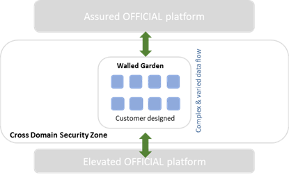

# Cross Domain Security Zone Service Scope

## About this document

This document describes the boundaries of the Cross Domain Security Zone (CDSZ) service, along with the division of responsibilities between UKCloud and the customer, to facilitate the provisioning and ongoing use of the service.

## About Cross Domain Security Zone

The CDSZ service provides a secure and flexible way to transfer data between your workloads hosted on the UKCloud Assured OFFICIAL security domain and the UKCloud non-internet connected Elevated OFFICIAL security domain.

You can create your own VMs and data flows across the CDSZ in order to satisfy the requirements of your applications.

## Application process

Customers wanting to use the CDSZ need to go through the CDSZ Application Process. This is documented in [*UKCloud Cross Domain Security Zone application process*](cdsz-ref-application-process.md).

## Service options

CDSZ includes a Walled Garden option that provides self-service access to the CDSZ so that customers can create and manage virtual machines to fulfil their requirements using the technology and application services of their choice.

> [!NOTE]
> UKCloud Guard is no longer available as an option for CDSZ. All new CDSZ deployments must follow the Walled Garden design. We will continue to provide support to customers who previously added UKCloud Guard to their environment, although we would encourage using Walled Garden instead.

## Service architecture

The CDSZ Walled Garden is a VMware-only environment, utilizing VMware vCloud Director as the management orchestrator for the service. A CDSZ is a virtual datacenter (VDC) in which you can build virtual machines and virtual networks in order to inspect and protect data moving between Assured and Elevated cloud environments. You can find more information about architecting a CDSZ environment in the [*Getting Started Guide for the Cross Domain Security Zone Walled Garden*](cdsz-gs-walled-garden.md).

A CDSZ Walled Garden is a VMware only environment, however you can connect it to non-VMware cloud environments within UKCloud, such as Oracle or OpenStack.

## Storage options

All workloads (except Micro) include 60GiB of Tier 2 storage for free. All storage is persistent and resilient to local hardware failures.

You can purchase additional storage to support your application. You can use multiple storage options to support different aspects of the application.

- **Tier 1.** Our most performant storage for workloads requiring consistently higher disk throughput

- **Tier 2.** Persistent block storage with typical performance characteristics for use by production applications or storage

## Storage policies

We provide you with access to two storage policies: Tier 1 and Tier 2. Both policies have a 1TiB soft-quota of storage.

- We do not guarantee storage performance, as it can be affected by many factors

- We do not provide IOPs figures for our storage offerings

- Workloads can use multiple storage profiles

## Protection

Customers have a range of automated, on-platform protection options to choose from for their environments:

- **Catalogue and template-based recovery.** All customers have access to catalogue and template-based recovery as standard. This is a configuration management solution that can re-provision stateless servers to a new VM when required, using standard, and catalogue-based VM templates.

- **Snapshot Protection.** 14-day or 28-day snapshot policies available. Data protected by the snapshot has an RPO of 24 hours, with RTO determined by the time taken to restore the VM after the service request is raised. See the [*Snapshot Protection Service Scope*](../vmware/vmw-sco-snapshot-protection.md) for full details.

## Service availability

The service level agreement (SLA) for CDSZ workloads guarantees 99.90% availability.

You're entitled to claim Service Credits for outages to services that take you out of SLA. For more about how we calculate SLAs, see the [*SLA Definition*](../other/other-ref-sla-definition.md).

## Service background

- We maintain the standard VM template sizes that control allocation of CPU and resources.

- VMs are fully provisioned.

- The system is configured to automatically balance resources, so your VMs may vMotion between physical hosts.

- To maintain performance across the platform, UKCloud can perform movements/migrations of VMs, vApps or storage within the infrastructure assigned to a service.

- We actively capacity-manage the cloud platform to ensure you have access to the resources you request.

- We control the deployed versions of technology on the platform. This covers internal platform-supporting technologies, and any technology versions available to you.

  - Internally this includes, but isn’t limited to, the vSphere and ESX versions, and the hardware version of the platform.

  - Externally this includes the available versions of the edge gateway and vCloud Director.

- Promiscuous mode is disabled.

    You can make additional configurations inside a VM (such as acting as a secondary hypervisor or implementing third-party software technologies). We do not support customer implementations inside a VM.

## Service resilience

- You can specify Farnborough or Corsham as the site where you'd like to have your CDSZ service provisioned. We'll try to accommodate requests and will advise you if we are unable do so.

- You can set affinity or anti-affinity rules through vCloud Director so that VMs do, or do not, run on the same physical host.

## Operating systems

### Licensing

We can provide:

- OS licensing through the SPLA and academic frameworks for Microsoft

- Red Hat Enterprise Linux licensing

For the latest available licences, see the [*UKCloud Pricing Guide*](https://ukcloud.com/wp-content/uploads/2019/07/ukcloud-pricing-guide-11.0-4.pdf).

You can bring your own licensing for Red Hat and certain Microsoft application licensing under Microsoft Mobility using software assurance. You should inform UKCloud via a Service Request if you’re providing your own licensing for a retrospective discount.

For non-UKCloud issued software, you must obey the licensing requirements of the software provider. This includes being aware of any constraints around using the software in a virtualised environment.

### VM server images

We provide base VM images for the operating systems for which we provide licensing. You can access these from vCloud Director.

You can use your own images for non-Windows and RHEL services, where licensing stipulates that to use the VM on our platform it must be licensed (and reported back to the software vendor) by UKCloud.

### Update services

We make update repositories available for all software for which we provide licensing. We don’t provide software update facilities for non-UKCloud licensed software.

### Anti-virus

We do not provide anti-virus software as part of the service.

## Networks

From a customer management experience, you manage all your connectivity rules, such as firewall, IPsec VPN and NAT functionality, through your edge gateway, using either the vCloud Director tenant portal or vCloud API.

You can find more information about networking within the CDSZ in the [*Getting Started Guide for the Cross Domain Security Zone Walled Garden*](cdsz-gs-walled-garden.md).

## Edge gateway

- By default, we assign two edge gateways per Walled Garden VDC: one facing Assured and one facing Elevated.

- You can have up to nine Org VDC networks per edge gateway.

### vApp edge

vApp networks enable you to create smaller networks within individual vApps that have a vApp edge, similar to the edge gateway on your VDC. Although a vApp edge isn't as feature rich as an edge gateway, it lets you create firewall and NAT rules to separate your VDC networks from your vApp VMs. See [*How to create a vApp network*](../vmware/vmw-how-create-vapp-network.md) for configuration details.

### Site-to-site IPsec VPN

You can create IPsec VPN tunnels to connect from CDSZ edges to virtual firewalls in Assured or Elevated. There is a limit of 64 tunnels per edge gateway.

### Load balancing

The edge gateway acts as a basic layer 3 load balancer, including features such as session persistence and health checks. If you need more advanced load balancing, you should consider a third-party product.

## Protective monitoring

We have implemented GPG 13-aligned Protective Monitoring across the Assured and Elevated security domains at the hypervisor level and below.

We don't provide Protective Monitoring services above the hypervisor (for example, for your VM); it is your responsibility to act at this level.

In line with UKCloud's SISP, we provide notification of customer-impacting security incidents. It is your responsibility to report similar incidents to us.

## Platform management

Users can access, manage and view the CDSZ service, accessing only those features allowed by their role, in any of the following ways:

- **vCloud Director API.** Enables the programmatic creation and management of VMs inside the CDSZ.

- **vCloud Director tenant portal.** Provides a graphical interface to access the vCloud Director environment (depending on assigned permissions).

- **UKCloud Portal.** Enables the creation of compute services and subsequently VDCs and edge gateways. The Portal also includes an overview of actual and estimated spend, along with service configuration information. Access to service reporting and incident and request management is also possible through the Portal.

You cannot access the underlying infrastructure. This includes (but isn’t limited to) the hardware and the vSphere environment.

## Service reporting

### Visibility

We provide a monthly service report via the UKCloud Portal. This includes a summary of platform availability and a retrospective of the interactions with UKCloud support during the previous month. Maintenance notifications and Service Status reports are also delivered through the Portal.

### Reporting

All service reporting is done via the UKCloud Portal.

### Billing

We provide you with monthly bills covering your monthly spend.

## Customer service

### Customer Success Manager

For the first 90 days of the service, you have access to a UKCloud Customer Success Manager (CSM), who will help you with your adoption of the CDSZ service, including finding relevant systems and using UKCloud tools and processes.

### Cloud Architects

UKCloud Cloud Architects support you during the design of solutions for the cloud platform. UKCloud Cloud Architects are ideally placed to help reconcile your requirements with the UKCloud platform. We recommend engagement with a Cloud Architect when implementing a CDSZ Walled Garden.

### Technical Account Managers

You'll be allocated with a Technical Account Manager (TAM) as an assigned point of contact who will provide ongoing assistance with reporting and incident escalation.

### Support

After the initial on-boarding and design phase, you can utilise the standard UKCloud support entitlement, which is documented in the [Customer Engagement Factsheet](https://ukcloud.com/wp-content/uploads/2018/08/ukcloud-factsheet-customer-care.pdf).

## Customer responsibilities

You are responsible for:

- Assessing whether the UKCloud platform can support the various requirements of your application.

- Completing and submitting a CDSZ application form in order to be granted access to a CDSZ Walled Garden.

- The control and management of access and responsibilities for end users including appropriate connectivity, security and accreditation if required.

- If access is required over government secure networks (HSCN, Janet, RLI or PSN), you are responsible for adhering to the relevant Code of Connection (CoCo) and for providing evidence of your CoCo to UKCloud upon request. UKCloud is unable to provide access to secure networks where such evidence has not been provided by the customer.

- Management and administration of layers above the hypervisor (OS patching, application performance monitoring, user administration).

- Ensuring only lawful data that supports the UK Public Sector is stored and processed by applications on this environment, and that you fully comply with the UKCloud Security Operating Procedures (SyOPs) and other information assurance requirements as specified in the UKCloud System Interconnect and Security Policy (SISP) and associated accreditation documentation sets.

## Service provisioning

Within 4 hours of accepting an order (shorter deployment times are typically achieved and can be prioritised upon request), UKCloud will create the customer’s Primary Administrator account and send a Welcome Pack, which includes the URL for the UKCloud Customer Portal, and the Getting Started Guide.

Customers will have two options when purchasing a CDSZ service.

- A light-touch design review/self-assessment route for customers with simple implementations, or those who are experienced at designing secure solutions.

- An assurance-wrap style approach with UKCloud’s experienced professionals for more complex implementations or those customers who would like support and guidance when developing their solutions.

Both options require the same submission documentation to enable UKCloud to provision the service.

Deployment time following validation of the assurance document set is 5 days. This includes the setup and configuration of customer specific firewall requirements.

UKCloud has created several videos, help guides, manuals and FAQs to help train and instruct users so that they are up and running quickly and easily. These are available within the Knowledge Centre.

In addition, you will be assigned a Customer Success Manager (CSM) to provide any assistance required during the first 90 days of the service.

UKCloud also has a large ecosystem of partners who can deliver additional services, such as support and professional services. UKCloud would be pleased to introduce you to the right partner to suit your needs.

## Service constraints

UKCloud will adhere to the following in terms of maintenance windows:

- *Planned Maintenance* means any pre-planned disruptive maintenance to any of the infrastructure relating to the service. Planned Maintenance activity may result in periods of degradation or loss of availability depending on the nature of the activity required. In such cases, UKCloud shall provide affected customers with at least fourteen (14) days’ notice of the Planned Maintenance.

    If during Planned Maintenance there is a loss of availability outside the scope described in the planned maintenance notification to the service, an SLA event will be triggered.

- *Emergency Maintenance* means any urgent maintenance required to prevent or mitigate against any event compromising the infrastructure relating to the service. Whenever possible, UKCloud shall:

    a) provide affected customers with at least six (6) hours’ advance notice and

    b) carry out the emergency maintenance between the hours of 00:00 and 06:00 (UK local time) Monday to Friday or between the hours of Saturday 00:00 to 06:00 (UK local time) on Monday, (including bank holidays) unless there is an identified and demonstrable immediate risk to customer environment(s). Emergency Maintenance may result in periods of degradation or loss of availability depending on the nature of the activity required.

    If during Emergency Maintenance there is a loss of availability to the service, an SLA event will be triggered. This time will be excluded from the availability calculation but will be included in monthly service reporting related to the service.

## Supporting documents and resources

The following documents contain more information about the CDSZ and the service options:

- [*Getting Started Guide for the Cross Domain Security Zone Walled Garden*](cdsz-gs-walled-garden.md)

- [*Cross Domain Security Zone FAQs*](cdsz-faq.md)

- [*UKCloud Cross Domain Security Zone application process*](cdsz-ref-application-process.md)

- [*Cross Domain Security Zone Blueprint*](cdsz-ref-bp-overview.md)

## Feedback

If you find an issue with this article, click **Improve this Doc** to suggest a change. If you have an idea for how we could improve any of our services, visit the [Ideas](https://community.ukcloud.com/ideas) section of the [UKCloud Community](https://community.ukcloud.com).
