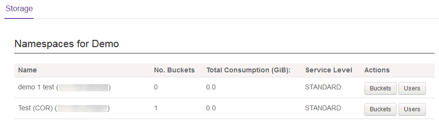

# Getting Started Guide for Cloud Storage

## Introduction

UKCloud's Cloud Storage service is an object storage solution based on Dell EMC Elastic Cloud Storage (ECS). Access is via a RESTful application programming interface (API), which also provides support for
Amazon's S3 API.

This Getting Started Guide covers the tasks you need to perform to get Cloud Storage up and running in your environment. It also looks at common use cases for API‑based object storage within web applications
and provides information about some command-line tools that you can use to interact with the storage APIs.

### Intended audience

This guide is intended for users who want to learn more about UKCloud's Cloud Storage service.

## Cloud Storage overview

Cloud Storage:

- Is a secure and highly adaptable storage platform designed to address a wide variety of use cases

- Is based on object storage technology that is natively optimised for cloud storage in terms of scale, resilience and accessibility

- Removes the complexity of capacity management by utilising a pay‑as‑you‑go model, so you pay for what you use, when you use it, scaling indefinitely and on demand

- Natively enables application deduplication and redundancy to ensure the highest level of data availability, while reducing the cost and management of on-premises storage solutions

- Provides easy access to storage anywhere, any time, to any device, using HTTP(S) to simplify the integration of object storage systems into cloud‑based solutions by removing the need to rely on the availability of web, file or FTP servers

- Offloads objects (files, media, images) from compute resources, reducing the load on server resources

- Automatically replicates and distributes objects to give high levels of data durability and availability, eliminating the need for cloud backup and recovery

ECS provides two APIs that you can use to manage your cloud storage: the S3‑compatible API and the EMC ECS Atmos API.

> [!NOTE]
> If you write content to cloud storage using one of the APIs, you cannot subsequently access that content using the other API. Choose carefully which API you want to use before beginning a project, as it will be difficult to move between them.

The key differences between the two APIs are:

- The ECS S3-compatible API enables you to easily migrate applications between Atmos, S3 and other S3‑compatible storage; but not all functionality available in S3 is available on ECS as shown in the *S3 Supported Features* chapter of the [*Elastic Cloud Storage (ECS) Data Access Guide*](https://www.emc.com/collateral/TechnicalDocument/docu79368.pdf)).

- The ECS Atmos API provides backward compatibility with the EMC Atmos platform. It offers access to the majority of the features of the platform with certain exceptions as listed in the *Atmos Supported Features* chapter of the [*Elastic Cloud Storage (ECS) Data Access Guide*](https://www.emc.com/collateral/TechnicalDocument/docu79368.pdf).

### Cloud Storage use cases

The low cost of cloud storage per GB, as well as its almost unlimited scalability, means there\'s a large variety of use cases for it. For example, it\'s ideal for data archives, backups, log files, and media repositories.

We anticipate that most web applications can make good use of cloud storage for static content, such as images and downloadable binaries. Storing these items in cloud storage&mdash;rather than in primary storage attached to web servers, inside the database or on a traditional file share&mdash;can provide significant benefits in terms of cost savings, agility and performance.

For example, with an internet-facing application that enables users to download forms and guides in PDF, these items are often stored in primary storage attached to the web servers, which creates several challenges:

- Whenever a PDF is updated, the updated copy must be replicated to all web servers

- When an item is downloaded, the bandwidth usage of the web server in question increases

- Multiple simultaneous downloads could overload the web servers or other components of the network infrastructure

- Each object is stored multiple times in primary storage, increasing the overall cost of storage

On the other hand, storing this content in cloud storage overcomes these challenges because:

- Only one copy of each item is stored, so updates only need to be made in one place

- End users connect directly to cloud storage to download PDFs, bypassing the web servers and associated network infrastructure

- Objects are stored only once, and at a much lower price per GB, which substantially reduces the overall cost of storage

The same principles apply to other static content, such as images and (especially) videos. The more workload you can offload onto an external system such as cloud storage, the leaner your application infrastructure
can become.

There are often questions around how best to implement this. Ultimately, it's up to the application developers, but a popular approach is as follows:

1. Handle content uploads and creation on the web servers.
2. Perform any required modifications or transformations using on-demand processing servers (usually from a message queue).
3. Write the content into cloud storage, storing the resulting object IDs, external URLs and any other relevant metadata in the application database.

This process provides a relatively simple transition to cloud storage. The application still knows about all the objects, but rather than retrieving, for example, a relative path for an item from the database, its entire URL is retrieved, pointing to cloud storage.

## Before you begin

When you request your Cloud Storage service, UKCloud Support creates a namespace in the specified account. If you have requested an Atmos subtenant, this is also created.

To create S3 buckets, use any S3-compliant tool. To create additional namespaces or Atmos subtenants, you must raise a service request. You can have S3 buckets and Atmos subtentants in the same namespace.

Cloud Storage provides different API endpoints to access your storage, depending on the UKCloud site and connectivity type you are using. Make sure you use the correct endpoint to ensure the best possible
performance for your solution.

&nbsp;| S3 API endpoint | Atmos API endpoint
------|-----------------|-------------------
**Corsham (Assured)** | |
Internet | `cas.cor00005.ukcloud.com` | `atmos.cas.cor00005.ukcloud.com`
PSN Assured | `cas.cor00005.psnassured.ukcloud.com` | `atmos.cas.cor00005.psnassured.ukcloud.com`
HSCN | `cas.cor00005.ukcloud.thirdparty.nhs.uk/` | `atmos.cas.cor00005.ukcloud.thirdparty.nhs.uk/`
**Farnborough (Assured)** | |
Internet | `cas.frn00006.ukcloud.com` | `atmos.cas.frn00006.ukcloud.com`
PSN Assured | `cas.frn00006.psnassured.ukcloud.com` | `atmos.cas.frn00006.psnassured.ukcloud.com`
HSCN | `cas.frn00006.ukcloud.thirdparty.nhs.uk/` | `atmos.cas.frn00006.ukcloud.thirdparty.nhs.uk/`

Contact UKCloud support if you are unsure which endpoint to use.

## Using the ECS S3-compatible API

The S3-compatible API is at:

`https://<api_endpoint>`

Check which `api_endpoint` to use in [Before you begin](#before-you-begin), for example:

`https://cas.cor00005.ukcloud.com`

To help get you started, you can find developer resources on the Amazon web site at:

<https://aws.amazon.com/documentation/s3/>

For details of the supported and unsupported S3 operations on ECS, see:

<https://www.emc.com/techpubs/ecs/ecs_s3_supported_features-1.htm>

You may also find the *Elastic Cloud Storage (ECS) Data Access Guide* useful:

<https://www.emc.com/collateral/TechnicalDocument/docu79368.pdf>

> [!NOTE]
> Currently the HSCN DNS service does not allow UKCloud to create wildcard DNS entries for our services. This means that S3 URLs that feature the bucket as part of the domain do not work (for example, `bucket01.cas.frn00006.ukcloud.thirdparty.nhs.uk`). With most S3 tools, you can choose whether to use prefix buckets or suffix buckets. If you are using the service via HSCN you'll need to make sure your client tools support suffix buckets.

### Amazon S3 Authentication Tool for Curl

The Amazon S3 Authentication Tool for Curl (S3Curl) is a very useful Perl script, developed by Amazon. It's a wrapper for Curl that calculates the required authentication signature automatically for each request. As the authentication signature changes for every request, this allows Curl to interact with the API outside of code, enabling you to validate that your commands are working correctly and view the raw HTML response from the API, which can be useful when troubleshooting.

For more information about S3Curl, see <http://aws.amazon.com/code/128>.

To use S3Curl:

1. Download S3Curl from the following location:

    <https://github.com/UKCloud/s3curl>

2. Install the following required dependency:

    ```
    sudo apt-get install libdigest-hmac-perl
    yum install perl-Digest-HMAC
    ```

3. Create a file named .s3curl in the home directory containing your credentials. For example:

    ```
    %awsSecretAccessKeys = (
        UKCloud => {
            id => '<user_id>',
            key => '<secret_key>',
        },
    );
    ```

    Where:

    - `user_id` is your User ID (you can find this in the Storage section of the UKCloud Portal)

    - `secret_key` is your secret key (If you've forgotten or don't know your secret key, you can reset it in the Storage section of the UKCloud Portal)

4. Change the permissions, otherwise the Perl script will refuse to run.

    ```
    chmod 600 .s3curl
    ```

5. Make the following small modification to the script itself so that it will work correctly with ECS:

    - Open the `s3curl.pl` file in your preferred editor (for example, vim or nano).

    - Scroll down until you find the following comment:

        ```
        # begin customizing here
        ```

    - The S3 endpoints are defined below this line, so add your Cloud Storage host name to this list as follows:

        ```
        my @endpoints = ('<api_endpoint>', 's3.amazonaws.com', ...
        ```

        For example:

        ```
        #begin customizing here
        my @endpoints = ('cas.cor00005.ukcloud.com',
        's3.amazonaws.com', ...
        ```

    - Save the file.

6. S3Curl is now ready to use, so you can call it as follows:

    ```
    perl s3curl.pl --id UKCloud -- <curl_arguments>
    ```

    The `curl_arguments` need to contain the host name and port number. For example, to list your buckets, you could use:

    ```
    perl s3curl.pl --id UKCloud -- https://cas.cor00005.ukcloud.com/
    ```

    Or to delete a file named `Lighthouse.jpg` in `/bucket2`:

    ```
    perl s3curl.pl --id UKCloud -- -X DELETE https://cas.cor00005.ukcloud.com/bucket2/Lighthouse.jpg
    ```

## Using the ECS Atmos API

The Atmos API is at:

`https://<api_endpoint>`

Check which `api_endpoint` to use in [Before you begin](#before-you-begin), for example:

`https://atmos.cas.cor00005.ukcloud.com`

To help get you started, download the appropriate *Atmos SDK* from the following location:

<https://community.emc.com/docs/DOC-27910>

The SDK provides bindings for all popular languages, as well as some quick start guides.

You can find the full API reference in the *EMC Atmos Programmer's Guide*, which you can download from the following location (or the UKCloud Knowledge Centre):

<https://www.emc.com/collateral/TechnicalDocument/docu68370.pdf>

For details of the supported and unsupported Atmos operations on ECS, see:

<https://www.emc.com/techpubs/ecs/ecs_atmos_supported_features-1.htm>

You may also find the *Elastic Cloud Storage (ECS)* *Data Access Guide* useful:

<https://www.emc.com/collateral/TechnicalDocument/docu79368.pdf>

## Using a command-line interface

Interacting with Cloud Storage via the API directly is ideal for web-based applications, but having access from the command line can help developers with testing and provide scripting access to Cloud Storage.

Command‑line interface (CLI) tools enable access from the command line by translating commands into the relevant API calls. There are lots of CLI tools to choose from --- this guide examines two for the S3 API: one each for Linux and Windows. Remember that the APIs are not interchangeable, so if you use the Atmos API in your application, you won't be able to see the data using the S3 CLI.

### Using S3cmd --- a Linux CLI for the S3 API

S3cmd is an open-source tool for Linux, written in Python.

To use S3cmd:

1. Download and extract the S3cmd files from the following location:

    <http://s3tools.org/download>

2. Create the required configuration files by running the following command:

    ```
    s3cmd ---configure
    ```

3. When prompted, provide the following information:

    - Access Key --- your User ID (you can find this in the Storage section of the UKCloud Portal)

    - Secret Key --- your secret key (If you've forgotten or don't know your secret key, you can reset it in the Storage section of the UKCloud Portal)

    - Encryption password --- create a secure password

    - Path to GPG program --- as appropriate for your system

    - Use HTTPS protocol --- Yes

4. You'll be prompted to test the connection. After the test, even if it fails, save the configuration, which will be written to `~/.s3cfg`.

5. Edit the `~/.s3cfg` file and confirm that the `host_base` and `host_bucket` lines look like the following:

    `host_base` = `<api_endpoint>`

    `host_bucket` = `%(bucket)s.<api_endpoint>`

    > [!NOTE]
    > Ensure that you use the appropriate `api_endpoint`, as shown in [Before you begin](#before-you-begin), for example:</br>
    > `host_base` = `cas.cor00005.ukcloud.com`</br>
    > `host_bucket` = `%(bucket)s.cas.cor00005.ukcloud.com`

6. Save the file.

7. The S3cmd tool is now ready to use. To list your buckets, run the following command:

    ```
    s3cmd ls
    ```

8.  You can find detailed instructions for using the tool in the accompanying README file.

### Using S3Express--- a Windows CLI for the S3 API

S3Express is a lightweight command-line tool for Windows that is self-contained in a single executable. It's a licensed product, with free trials also available.

To use S3Express:

1. Download and install the S3Express files from the following location:

    <http://www.s3express.com/>

2. Use the following commands to configure the tool to access Cloud Storage:

    `saveauth <user_id> <secret_key> UKCloud`

    `setopt --endpoint:<api_endpoint>`

    Where:

    - `user_id` is your User ID (you can find this in the Storage section of the UKCloud Portal)

    - `secret_key` is your secret key (if you've forgotten or don't know your secret key, you can reset it in the Storage section of the UKCloud Portal)

    - `api_endpoint` is the appropriate endpoint, as shown in [Before you begin](#before-you-begin), for example:

        `setopt --endpoint:cas.cor00005.ukcloud.com`

3. The S3Express tool is now ready to use. To list your buckets, run the following command:

    ```
    ls
    ```

4. For detailed instructions, refer to the Windows help file, which is installed along with the tool.

## Working with Cloud Storage in the UKCloud Portal

Although you will mostly interact with your Cloud Storage service through the API, the UKCloud Portal provides access to some information about your service. Within the UKCloud Portal, you can:

- View information about the namespaces within your Cloud Storage environment, including:

  - How many buckets are in each namespace

  - Storage consumed by each namespace

- View a list of users with access to the namespace

- Reset the secret key for a user

- View information about the buckets within a namespace, including:

  - API Type: Atmos or S3

  - Storage consumed by the bucket

  - Number of objects in the bucket

- View a graphical representation of the storage consumed by a bucket over the last 30 days

**More information!** [*How to view Cloud Storage information in the UKCloud Portal*](cs-how-view-info-portal.md)

To access your Cloud Storage service in the UKCloud Portal:

1. Log in to the UKCloud Portal and select your account.

    For more detailed instructions, see the [*Getting Started Guide for the UKCloud Portal*](../portal/ptl-gs.md).

2. In the Portal navigation panel, expand the **Cloud Storage** option and select **ECS**.

3. You can now browse the namespaces, buckets and users in your Cloud Storage service.

    

## Next steps

In this Getting Started Guide, you've learned the basics about the Cloud Storage service. For more detailed information, see the following articles in the Knowledge Centre:

- [*How to view Cloud Storage information in the UKCloud Portal*](cs-how-view-info-portal.md)

- [*How to create a new Cloud Storage user in the UKCloud Portal*](cs-how-create-user.md)

- [*How to use file browsers with Cloud Storage*](cs-how-use-file-browsers.md)

- Cloud Storage Gateways

  - [*How to install the GeoDrive Client 2.0*](cs-how-install-geodrive2-client.md)

  - [*How to install CloudArray*](cs-how-install-cloudarray.md)

## Related videos

- [*GeoDrive 2.0 overview video*](cs-vid-geodrive2-client-overview.md)

## Glossary

This section provides a glossary of terms specific to Cloud Storage.

**Atmos**&nbsp;&nbsp;An object-based cloud storage platform developed by EMC.

**bucket**&nbsp;&nbsp;A container for objects within a namespace.

**Cloud Storage**&nbsp;&nbsp;UKCloud's secure and highly adaptable storage platform designed to
address a wide variety of use cases. Cloud Storage is based on object storage technology that is natively optimised for cloud storage in terms of scale, resilience and accessibility.

**Elastic Cloud Storage (ECS)**&nbsp;&nbsp;A next-generation object-based storage platform developed by EMC.

**namespace**&nbsp;&nbsp;A construct used to ensure that objects are uniquely named in a
multi-tenant environment.

**object storage**&nbsp;&nbsp;A method of storing unstructured data as objects (file + metadata) in non-hierarchical containers or buckets. Each object has a unique identifier to enable the object to be easily retrieved without knowing its exact location.

**S3**&nbsp;&nbsp;The de-facto API standard for object storage.

**secret key**&nbsp;&nbsp;A method of providing authenticated access to objects in Cloud Storage.

**subtenant**&nbsp;&nbsp;A construct used to create a multi-tenant environment within Cloud
Storage.

## Feedback

If you find an issue with this article, click **Improve this Doc** to suggest a change. If you have an idea for how we could improve any of our services, visit the [Ideas](https://community.ukcloud.com/ideas) section of the [UKCloud Community](https://community.ukcloud.com).
