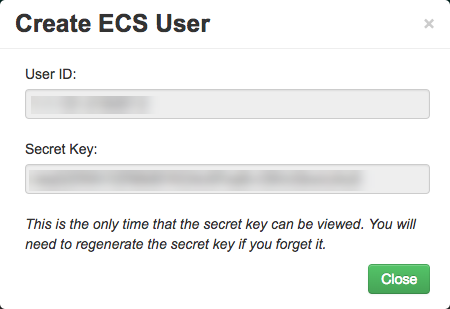

# How to create a new Cloud Storage user in the UKCloud Portal

## Overview

Cloud Storage is UKCloud's object storage solution based on Dell EMC Elastic Cloud Storage (ECS). Although you'll mostly interact with Cloud Storage through the API, you can create new Cloud Storage users in the UKCloud Portal.

### Intended audience

To complete the steps in this guide you must have been granted access to the relevant namespace.

## Creating a new Cloud Storage user

To create a new Cloud Storage user:

1. In the Portal navigation panel, expand the **Cloud Storage** option and select **ECS**.

2. On the *Storage* tab, click the **Users** button for the namespace in which you want to create the new user:

    

3. The **Users** tab lists the different user IDs associated with the namespace.

    

4. Click the **Add new user** button.

5. In the *Create ECS User* dialog box, make a note of the **User ID** and **Secret Key** and then click **Close**.

    > [!NOTE]
    > After you close this dialog box, you will not be able to see the secret key again in the UKCloud Portal. If you do not make a note of the secret key or if you forget or lose it, you will need to reset it again. For information about how to do this, see [*How to reset your Cloud Storage secret key*](cs-how-reset-secret-key.md).

    

## Next steps

This guide has shown you how to create a new Cloud Storage user. For more information about how to use the service, see the following articles:

- [*Getting Started Guide for Cloud Storage*](cs-gs.md)

- [*How to view Cloud Storage information in the UKCloud Portal*](cs-how-view-info-portal.md)

- Cloud Storage Gateways

    - [*How to install the GeoDrive Client 2.0*](cs-how-install-geodrive2-client.md)

- [*How to use file browsers with Cloud Storage*](cs-how-use-file-browsers.md)

## Feedback

If you find an issue with this article, click **Improve this Doc** to suggest a change. If you have an idea for how we could improve any of our services, visit the [Ideas](https://community.ukcloud.com/ideas) section of the [UKCloud Community](https://community.ukcloud.com).
