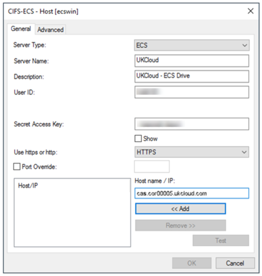

# How to install CIFS-ECS

## What is CIFS-ECS?

CIFS-ECS is a free application that runs on Windows and Windows Server, exposing UKCloud Cloud Storage as file systems. It’s designed as an easy way to use object storage by enabling Windows applications to interface with Cloud Storage servers using the popular S3 REST API.

If you require a fully-integrated cloud gateway appliance with features like advanced deduplication and location caching, you may want to consider [CloudArrary](cs-how-install-cloudarray.md) as an alternative. 

    > [!NOTE]
    > Unlike CIFS-ECS, CloudArray is not a free application like CIFS-ECS.

## Use cases

You can use CIFS-ECS to:

- Expose UKCloud Cloud Storage for native access on Windows through a centralised server With CIFS-ECS installed on a centralised Windows Server installation.

- Present Cloud Storage as storage for applications, without additional development.

- Use Cloud Storage as a target for backups or long-term file retention.

## Before you begin

CIFS-ECS offers a single caching option:

**Stub**: files are initially stored locally and replaced with a stub, or shortcut, after a period of time. When you access a file that has been stubbed, it will be retrieved from the cloud. This offers the best scalability, as you can use a virtually unlimited amount of cloud storage.

## Installing CIFS-ECS

1. Navigate to the following Portal page to download the ZIP file that contains the CIFS-ECS installer: [CIFS-ECS Tool](https://portal.ukcloud.com/support/knowledge_centre/85dc54ff-7d21-43ac-9cfa-88e87de7ba27).

    To download CIFS-ECS you'll need your UKCloud Portal log in details.

2. Extract and run the setup launcher from the ZIP file.

3. Step through the wizard, adjusting values to suit your environment.

    > [!NOTE]
    > The Data Directory is used as a local cache for any content you place in the CIFS-ECS drive, so you may want to put this on a non-system volume.

4. When the installation is complete, click **Add CIFS-ECS Drive** to open the *Drive Parameters* page.

5. On the *Drive Parameters* page, select any available drive letter from the drop down menu to use as the CIFS-ECS drive then click **Next**.

    Optional: give your ECS drive a description.

    

6. On the *Settings* page, click the **Hosts** button to configure the connection to the Cloud Storage service.

7. On the **General** tab, click the **Add** button and configure the settings as shown in the following example:

    - You can find the **User ID** in the *Storage* section of the UKCloud Portal.

    - If you’ve forgotten or don’t know your **Secret Access Key**, you can reset it in the *Storage* section of the Portal.

        > [!NOTE]
        > The **Server Name** and **Description** can be anything, but must not be blank. In the example it is shown as `UKCloud` and `UKCloud - ECS Drive`.

8. From the **Use https or http list**, select **HTTPS**.

    

9. In the **Host name / IP** field input one of the following:

S3 API endpoints:

- **Corsham (Assured)**

  - Internet: `cas.cor00005.ukcloud.com`
  - PSN Assured: `cas.cor00005.psnassured.ukcloud.com`
  - N3: `cas.cor00005.ukcloud.thirdparty.nhs.uk/`
  
- **Farnborough (Assured)**

  - Internet: `cas.frn00006.ukcloud.com`
  - PSN Assured: `cas.frn00006.psnassured.ukcloud.com`
  - N3: `cas.frn00006.ukcloud.thirdparty.nhs.uk/`

9. Deselect the **Port Override** check box.

10. Click **OK** to return to the *Settings* page.

10. The rest of the fields on the *Settings* page enable you to configure the root directory, encryption and compression settings.

    > [!TIP]
    > Configure these fields appropriately for your environment, or accept the defaults. We suggest you give the root directory a friendlier name, so that you can more easily identify it.

    

11. Click the **Advanced** button to configure various thresholds, such as how long a local file will be retained before being replaced with a stub.

12. Click **Next**  to get to the *Logging* page.

13. Change the settings on the *Logging* page to meet your requirements.

14.	Click **Finish** to complete the wizard. CIFS-ECS connects to Cloud Storage and starts synchronising any content you put on the drive letter you assigned to it.

    

15. You can share the CIFS-ECS drive, or a folder within it, so that other machines on the network can access it.

    &nbsp;| |
    ------|-----------------|
     |

    > [!TIP]
    > See Microsoft's How-To guide on how to share a a drive on the network from Windows: https://support.microsoft.com/en-gb/help/4092694/windows-10-changes-to-file-sharing-over-a-network

## Feedback

If you have any comments on this document or any other aspect of your UKCloud experience, send them to <products@ukcloud.com>.
