# How to install CloudArray

## Overview

CloudArray is a fully integrated appliance which uses object storage (raw unorganised storage on a disk) and exposes it as a network share. It presents itself as file storage to users but uses a mix of object storage and metadata behind the scenes.

## How does CloudArray work

As CloudArray is a fully integrated appliance, you don't have to spend money and resources managing operating systems for the solutions. It uses a combination of object storage and a local cache reserve to provide unlimited storage with near local storage performance, using the cache to store frequently used files locally, while asynchronously replicating data to UKCloud's Cloud Storage platform. CloudArray also supports Amazon's REST S3 API to expand on-premises SANs and NAS solutions with on-demand elastic cloud capacity.

> [!TIP]
> If you do not need the features of CloudArray such as deduplication and location caching, or do not require a fully-integrated cloud gateway appliance, you may want to consider the [GeoDrive Client 2.0](cs-how-install-geodrive2-client.md) as an alternative.

## Use cases

Potential use cases for CloudArray include:

- Storage on mass using UKCloud Cloud Storage

- Move infrequently accessed data to low-cost cloud tiers (typically object storage is much slower compared to block or file storage as it functions on a request basis)

- Assurance that data synchronised to the cloud is encrypted both in transit and at rest

## System requirements

### Supported hypervisors

CloudArray supports the following hypervisors:

- VMware vSphere 5.5 (ESXi) or higher

- Microsoft Windows Server 2012 R2 with Hyper-V

> [!NOTE]
> The hypervisor must support 64 bit Linux OS guest operating systems.

### RAM, CPU and disk requirements

To run CloudArray Virtual Edition you must have the following minimum resources:

- 60 GB of disk space

- 1 virtual processor assigned to the CloudArray VE (two virtual processors is recommended)

- 8 GB of RAM for the 3 TB base model

For specific details about memory requirements, see [EMC CloudArray Best Practices](https://uk.emc.com/collateral/TechnicalDocument/docu60787.pdf).

### Supported host operating systems

CloudArray supports the following operating systems:

- Mac OS X

- OpenSolaris 2009.06

- Red Hat Linux: 4.0 and higher

- SUSE Linux: 10, 11

- VMware ESX or ESXi

- Windows: XP, Vista, 7, 8, Server 2003, 2008, 2012

### Supported web browsers

CloudArray supports the browsers:

- Google Chrome v49 or higher

- Microsoft Edge v25 or higher

- Internet Explorer v11 or higher

- Mozilla Firefox v45 or higher

- Safari for Mac v6.1.6 or higher

### Network port requirements

CloudArray allows network traffic on the following TCP/IP ports:

- 80 (HTTP)

- 111 (NFS Portmapper TCP/UDP)

- 137, 138, 139 (CIFS)

- 443 (HTTPS)

- 445 (CIFS)

System requirements:

- 662 (NFS Status TCP/UDP)

- 875 (NFS rquotad TCP/UDP)

- 892 (NFS mountd TCP/UDP)

- 2049 (NFS nfsd TCP/UDP)

- 3260 (iSCSI)

- 8080 (HTTP)

- 32803 (NFS nlockmgr TCP)

- 41022 (EMC Support)

### Memory sharing

Memory for a CloudArray virtual machine must be provisioned for its exclusive use.

CloudArray is a memory-intensive application. Substantial performance degradation is likely if other virtual machines share the memory allocated to CloudArray.

## Obtaining a CloudArray license

If you require a CloudArray license key, UKCloud will contact Dell EMC on your behalf. Contact your Technical Account Manager (TAM) for further details.

## Installing CloudArray Virtual Edition

The steps for installing CloudArray depend on your hypervisor:

- [VMware vSphere](#installing-cloudarray-on-vmware-vsphere)

- [Microsoft Hyper-V](#installing-cloudarray-on-microsoft-hyper-v)

### Installing CloudArray on VMware vSphere

To install CloudArray on VMware:

1. Login to the [EMC CloudArray portal](http://www.cloudarray.com).

2. Click **Downloads & Documents**.

3. From the list in *My Downloads*, select *download*, and extract the CloudArray package.

4. Import the OVF file into your hypervisor.

    > [!NOTE]
    > The VM is configured for two networks but only one is required. However, we strongly recommend that you connect two interfaces. Use one interface for cloud traffic and the second for iSCSI/CIFS/NFS and management traffic.

5. For VMware ESX or ESXi complete the following steps, otherwise proceed to the next numbered step.

    a. Open the *vSphere Client* and log in using your credentials.

    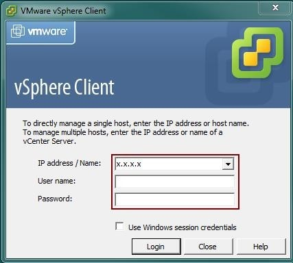

    b. Once the client opens, select **File > Import OVF Template**

    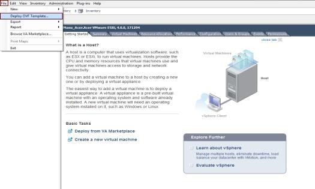

    c. Browse to the folder where you extracted the contents of the downloaded CloudArray zip file and choose the `.ovf` file. Then click **Next**.

    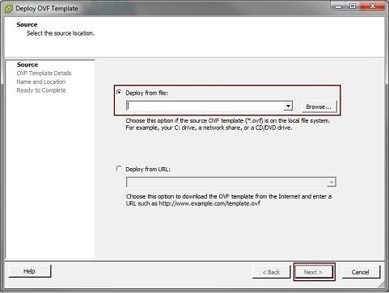

    d. Enter a name for the virtual machine or leave it unchanged, then click **Next**.

    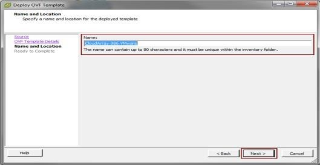

    e. Review the summary screen and click **Finish** to begin the importing process.

    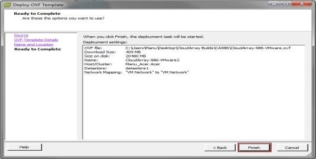

    f. A success message displays upon completion.

6. Power on the CloudArray virtual machine.

7. Go to [*Configuring CloudArray*](#configuring-cloudarray).

### Installing CloudArray on Microsoft Hyper-V

To install CloudArray on Microsoft Hyper-V:

1. Log in to the [EMC CloudArray portal](http://www.cloudarray.com).

2. Click **Downloads & Documents**.

3. From the list in *My Downloads*, select **download**, and extract the *CloudArray* package.

4. Download and extract the `CloudArray.zip` file to a location of your choice.

    > [!NOTE]
    > We recommend that you extract the file to the machine running the graphical user interface for the hypervisor on which you'll be installing CloudArray as this will minimize the VM import time.

5. Import the VM into your hypervisor.

    > [!NOTE]
    > The VM is configured for two networks but only one is required. However, we strongly recommend that you connect two interfaces. Use one interface for cloud traffic and the second for iSCSI/CIFS/NFS and management traffic.

6. Open *Hyper-V Manager* on the windows host where you plan to deploy the CloudArray VM.

7. Select **Action > Import Virtual Machine**.

8. Complete the following fields.

    a. Browse to the root folder where you extracted the VM files.

    b. Select the **"Copy the virtual machine"** radio button.

    c. Check the **"Duplicate all files"** check box if you plan to deploy this VM to multiple hypervisors.

9. Click **Import**.

    The import process begins and might take some time to complete. A status bar indicates the progress.

10. After the VM is imported, start the virtual machine.

11. Go to [*Configuring CloudArray*](#configuring-cloudarray).

## Configuring CloudArray

You have two options to configure CloudArray:

- [Using the CloudArray Appliance console](#configuring-cloudarray-using-the-cloudarray-appliance-console)

- [Using the web browser interface](#configuring-cloudarray-using-the-web-browser-interface)

### Configuring CloudArray using the CloudArray Appliance console

#### Starting the console

To start the CloudArray Appliance console:

1. You can use Hypervisor to access the CloudArray Appliance console.

    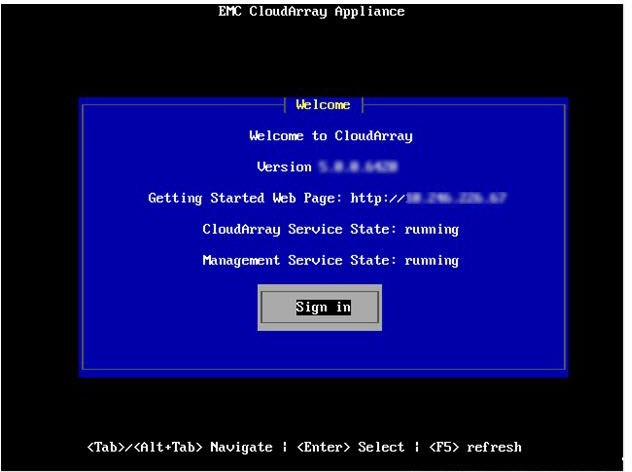

2. Click **Sign in** and enter the following credentials:

    - Username: admin

    - Password: <admin_password>

    Upon first login, you are prompted to change the password.

    > [!NOTE]
    > CloudArray attempts to find a DHCP server the first time it boots. If not successful, you'll see **Getting Started Web Page: http://No IP assigned.** In that case, refer to [*Configuring the network*](#configuring-the-network) to set an initial IP address. You can then use the *Network Tools* feature in the CloudArray GUI to finish configuring the adapters.

3. Choose the desired operation from the CloudArray Appliance console display. The CloudArray Appliance console enables you to set the network configuration, manage CloudArray services, restart the appliance and perform diagnostic tests.

    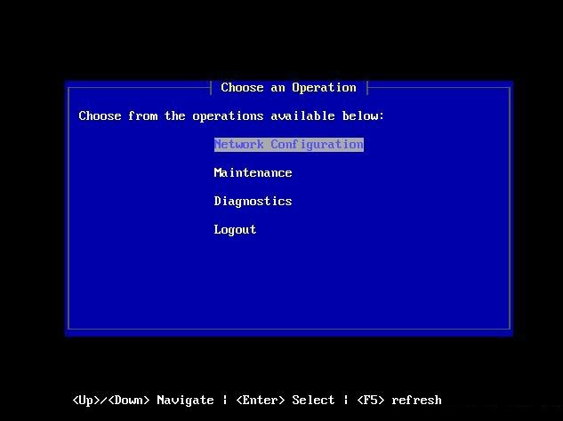

    > [!NOTE]
    > You only need to configure one Ethernet adapter in this console. Use the more flexible *Network Tools* feature in the CloudArray web GUI to finish configuring your network adapters, including bonding if desired. See the network tools section in the [*EMC CloudArray Administrator Guide*](https://uk.emc.com/collateral/TechnicalDocument/docu60786.pdf) for more information.

#### Configuring the network

To set network related information for CloudArray:

1. From the CloudArray Appliance console main menu, select **Network Configuration**. The *Configure Networking* panel displays.

    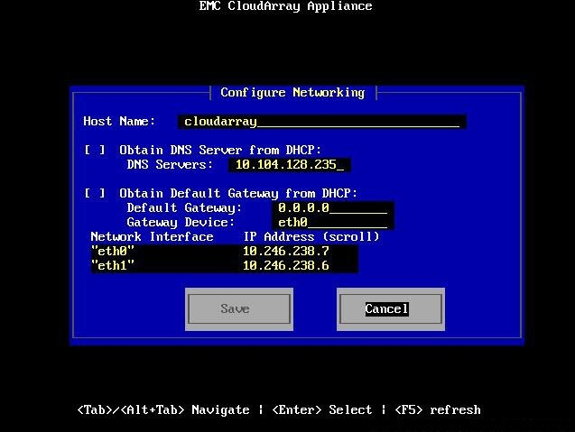

2. If desired, change the host name.

3. If you plan to use static IP addresses with CloudArray, provide the IP address and related information for eth0:

    a. DNS Servers

    b. Default Gateway.

    c. Gateway Device: Enter a device name, for example, eth0.

    > [!NOTE]
    > In Microsoft Hyper-V, the entries in the device names list may appear as `seth0` and `seth1`, instead of `eth0` and `eth1`. If that is the case, please enter the device name as `eth0`.

    d. To set the IP address and subnet mask of a device, tab to the list of devices, use the arrow keys to highlight the desired device (pink) and press **Enter**. Choose **Save**.

4. From the CloudArray Appliance console main menu, select **Diagnostics**. The *Diagnostics* panel displays.

    

5. Choose **Save again** from the main menu.

    You will see the *Restarting Network* pop-up. This operation can take a few minutes to complete.

    > [!NOTE]
    > If you changed the host name, you'll be prompted to reboot the VM for the change to take effect. You can avoid rebooting the appliance by changing the host name using the *Network Tools* feature of the Web GUI.

#### Configuring maintenance operations

To perform maintenance operations:

1. From the CloudArray Appliance console main menu, select **Maintenance**. The *Maintenance* panel displays.

    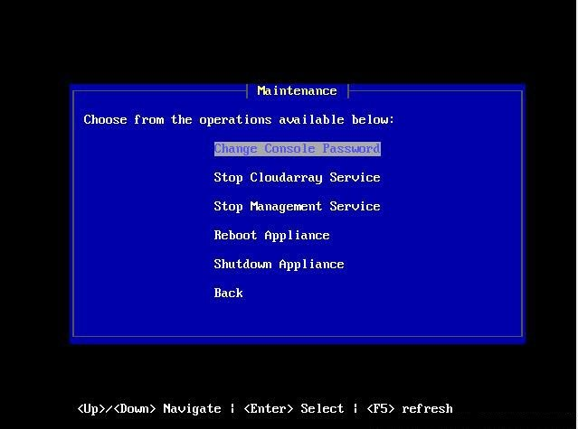

    > [!NOTE]
    > The **Cloudarray Service** and **Management Service** menu items toggle what they display: **Stop** or **Start**, depending on whether that service is currently running.

2. Choose from the following operations:

    a. **Change Console Password:** Enables you to reset your password.

    b. **Stop CloudArray Service** or **Start CloudArray Service:** Enables you to stop or start the CloudArray service.

    c. **Stop Management Service** or **Start Management Service:** Enables you to stop or start the management service.

    d. **Reboot Appliance:** Enables you to reboot the CloudArray.

    e. **Shutdown Appliance:** Enables you to shut down the CloudArray.

#### Verifying network connectivity

To verify network connectivity:

1. From the CloudArray Appliance console main menu, select **Diagnostics**. The *Diagnostics* panel displays.

    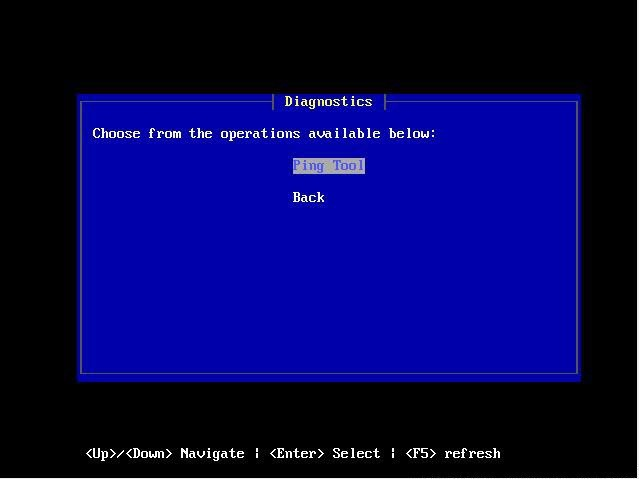

2. Select **Ping Tool** to verify network connectivity.

### Configuring CloudArray using the web browser interface

#### Connecting to the web browser interface

CloudArray is configurable using a browser. To access this interface, in your browser, enter the IP address of the console shown on the start page of your management console.

> [!NOTE]
> Newer versions (v7.X.X.X.X) require a secure connection to the CloudArray interface when accessed through a web browser. To do this, connect to the IP address with an HTTPS login.

If your browser shows an error, follow the steps below to connect to the CloudArray web interface:

1. The following image shows an example of the error message as seen in a Microsoft Edge browser but will be very similar in every browser.

    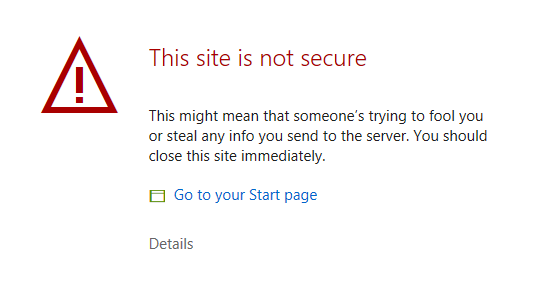

2. Click **Details**.

    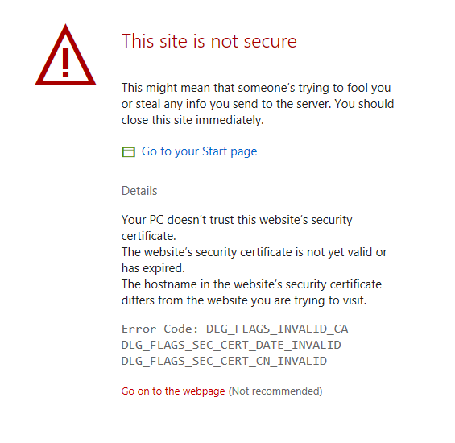

3. Click **Go on to the webpage (Not recommended)**.

#### Configuring CloudArray using the web browser

To configure CloudArray:

1. Once connected to CloudArray using a web browser, you have two options:

    - **Setup** - to setup and configure a new installation of CloudArray.

    - **Restore** - to restore a backup configuration of a previous CloudArray Installation.

    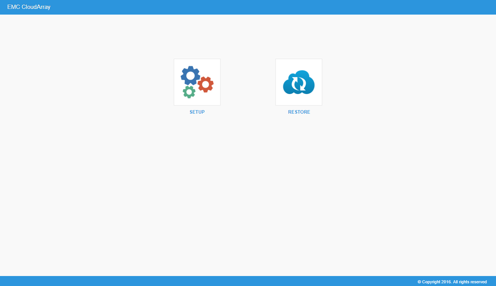

    This article shows you how to configure a new installation of CloudArray through a web browser, so click **Setup**.

    You'll be presented with a wizard to set up EMC CloudArray.

    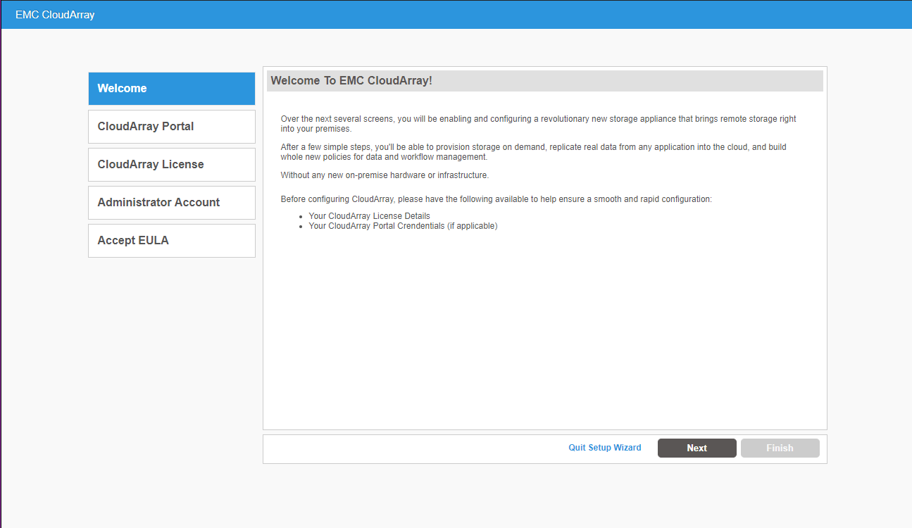

2. Click **Next**.

3. Ensure **Enable CloudArray Portal** is selected and click **Next**

    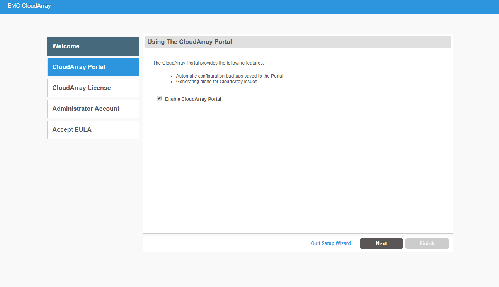

4. Enter your login credentials, which will be the same email address and password you used to log in to the CloudArray portal to obtain the `.ova` file for installation.

    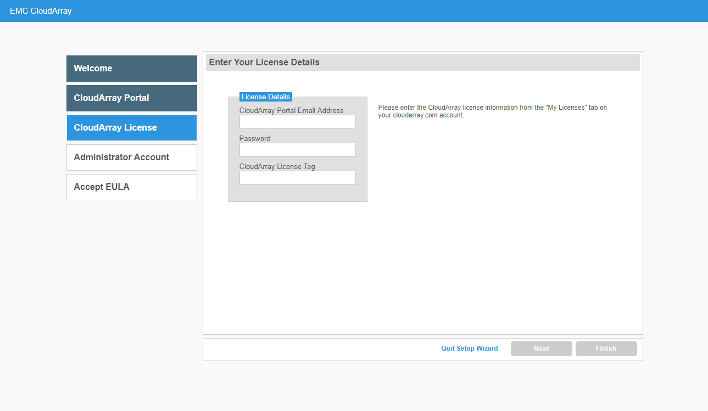

    > [!TIP]
    > To obtain the **CloudArray License Tag**, log into the CloudArray portal by going to the link `https://www.cloudarray.com` and entering in your login credentials. The CloudArray license tag will be shown in the *Recently added Licenses* section.

    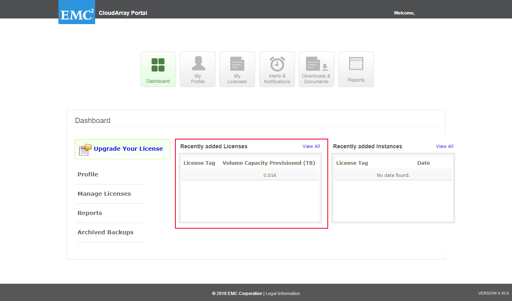

5. When you've entered your login credentials and **CloudArray License Tag**, click **Next**.

6. Create an administrator account to use for configuring the settings in CloudArray.

    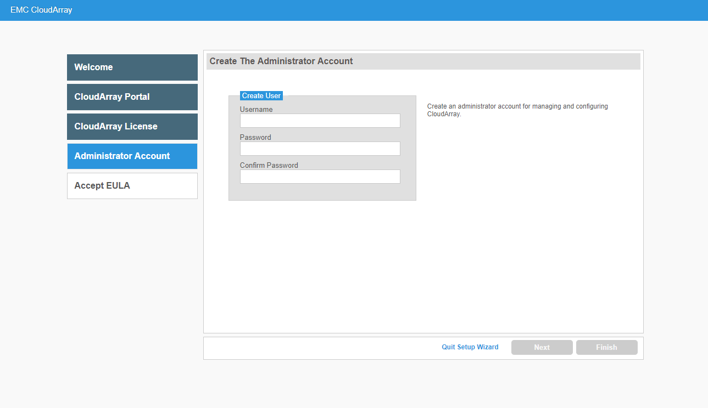

    Enter in your desired username and password with the password confirmation and then click **Next**.

7. Read the End-User License Agreement by scrolling to the bottom of the document (required), tick the box to accept the EULA and click **Finish**.

    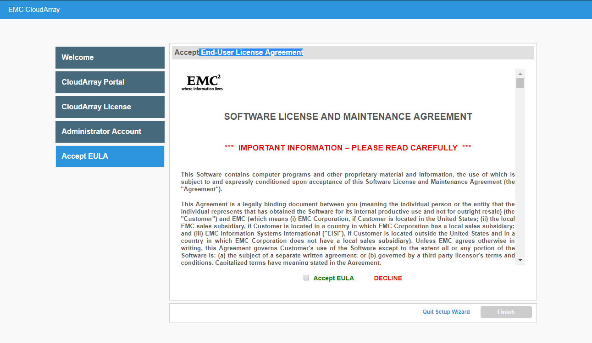

8. When you click **Finish**, you'll be taken to the login page.

    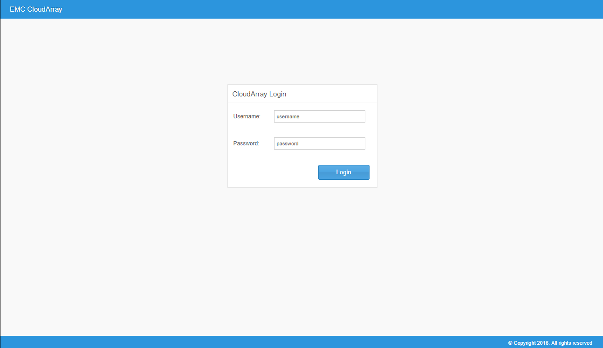

    Enter the administrator log in credentials you created earlier in step 6 and click **Login**.

9. You'll be presented with the initial dashboard of CloudArray, you have two options:

    - **Configuration Wizard**

    - **User Interface**

    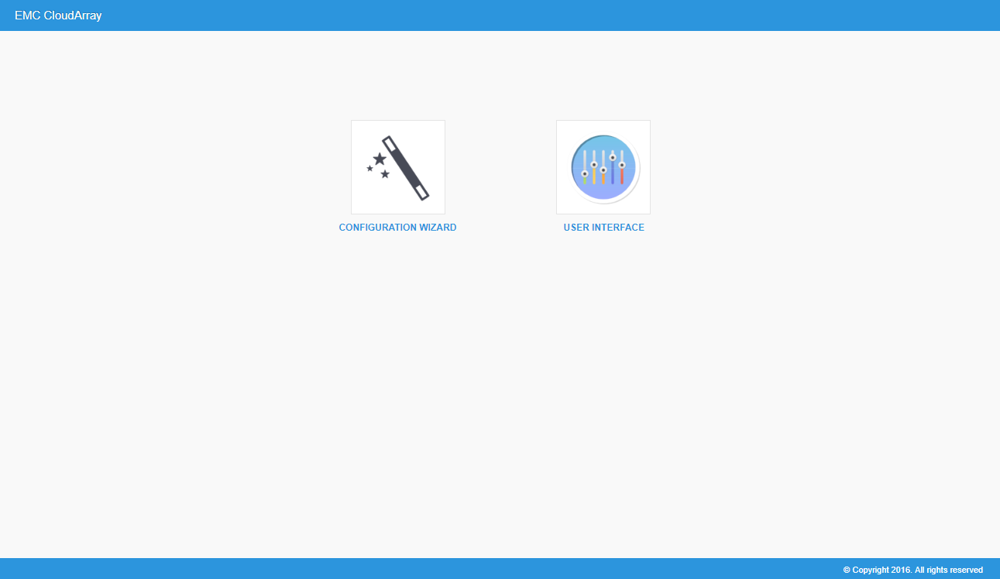

10. In this article we'll be going through a new configuration using the configuration wizard, so click **Configuration Wizard**.

11. Select your cloud provider:

    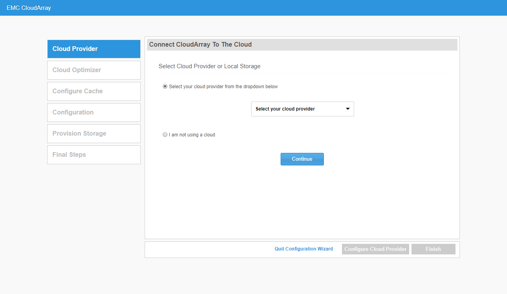

    And local storage cache:

    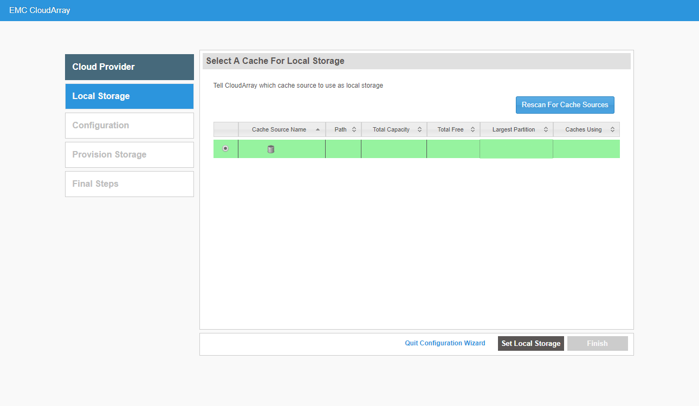

12. On the *Configuration* page, from the dropdown menu, select **ECS**.

    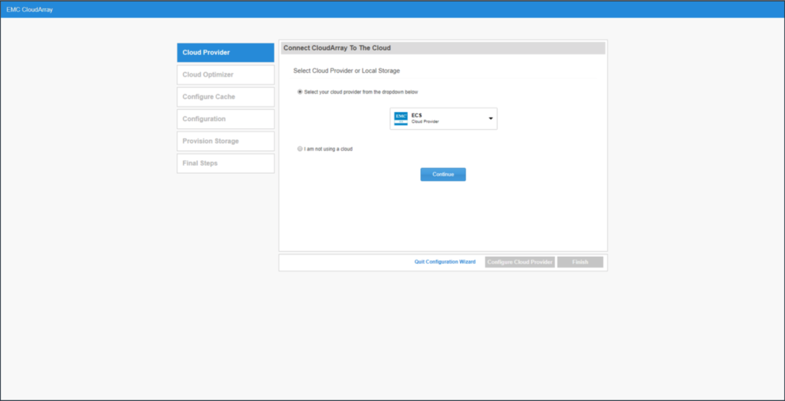

13. On the *Accept EULA* page, select **Accept EULA** to accept the end-user license agreement, then click **Finish**.

14. Click **Configuration Wizard** to configure your connection to Cloud Storage.

15. Fill in your Cloud Storage credentials. You can get these from the *Storage* section of the UKCloud Portal. The **Token** value is a combination of the subtenant ID (bucket name) and the user ID values from the Portal, joined by a forward slash (`*`/`*`): `subtenant_id / user_id`.

16. On the *Cloud Optimizer* page, configure at least one provisioning policy and then click **Next**.

    A provisioning policy connects a cloud provider and a cache.

    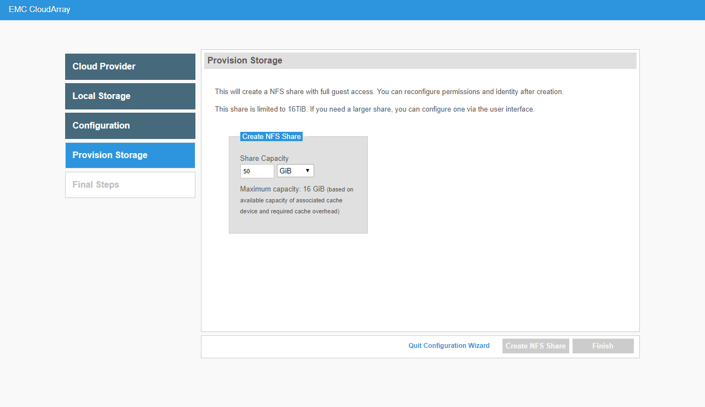

17. On the *Configure Cache* page, configure the cache and connection speed.

    

18. Click **Create CIFS Share**.

19. On the *Final Steps* page, click **Finish**.

    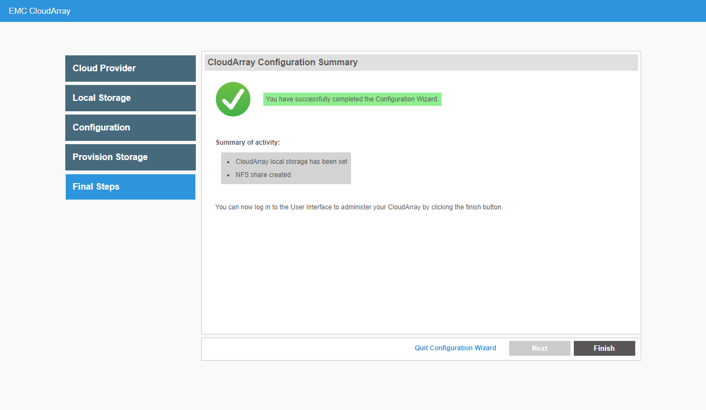

#### About the Dashboard

The CloudArray interface is comprised of the following major elements:

- Main menu

    The EMC CloudArray main menu is on the left side of the screen. Click menu items to move directly to the corresponding top-level panel and view related sub-menu items.

    > [!NOTE]
    > If you reduce the window size, the main menu moves to the top of the screen.

- Status indicators

    The status indicators at the top of the screen report the status of CloudArray components. Hover over the green or red indicator light to see more information about the status. Click the status indicators to move directly to the corresponding top-level panel for each item.

    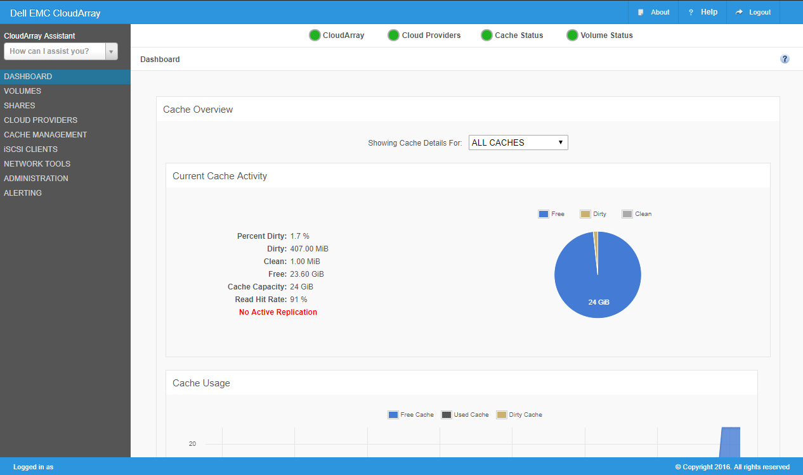

## Troubleshooting

### Verifying Cloud Storage credentials and connectivity

Complete the following steps to verify your Cloud Storage credentials and connectivity using S3 Browser:

1. Open [S3 Browser v4.8.7 (or higher)](http://s3browser.com).

2. From the **Tools > Options > Connection** tab:

    a. Select the appropriate HTTPS setting.

    b. Do not use the proxy settings.

    > [!NOTE]
    > Refer to [How to use file browsers with Cloud Storage](cs-how-use-file-browsers.md) for connectivity details.

3. Add a new account or modify an existing one.

    a. Verify the **AccessKey** and **Shared Secret**.

    b. Set storage type to **S3 Compatible Storage**.

    c. Enter the **REST Endpoint IP Address** with **Port**.

4. If there are no buckets in the bucket list page they may not have been created yet. Create a bucket as follows:

    a. Make sure there are no errors in the log details.

    b. Create a bucket.

    c. Upload a file to the bucket.

    d. Delete the file and the bucket.

If you are successful at this point, then CloudArray should be able to connect.

## Next steps

This guide has shown you how to install and configure CloudArray for use with Cloud Storage. For more information about how to use the service, see the following articles:

- [*Getting Started Guide for Cloud Storage*](cs-gs.md)

- [*How to view Cloud Storage information in the UKCloud Portal*](cs-how-view-info-portal.md)

- [*How to create a new Cloud Storage user in the UKCloud Portal*](cs-how-create-user.md)

- Cloud Storage Gateways

    - [*How to install the GeoDrive Client 2.0*](cs-how-install-geodrive2-client.md)

- [*How to use file browsers with Cloud Storage*](cs-how-use-file-browsers.md)

## Feedback

If you find an issue with this article, click **Improve this Doc** to suggest a change. If you have an idea for how we could improve any of our services, visit [UKCloud Ideas](https://ideas.ukcloud.com). Alternatively, you can contact us at <products@ukcloud.com>.
