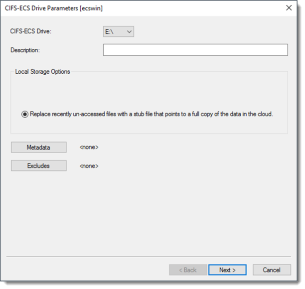
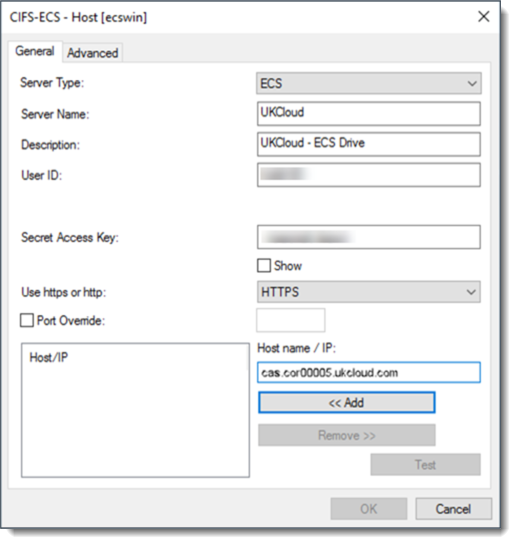
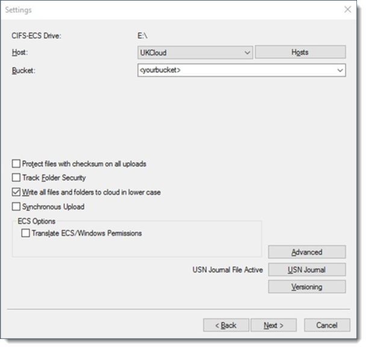
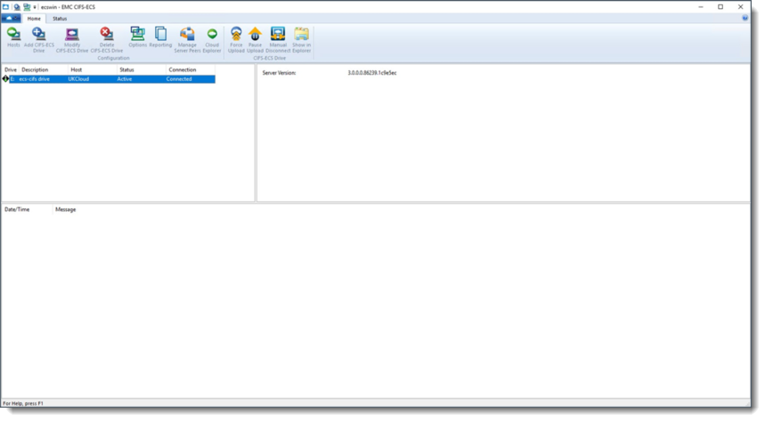
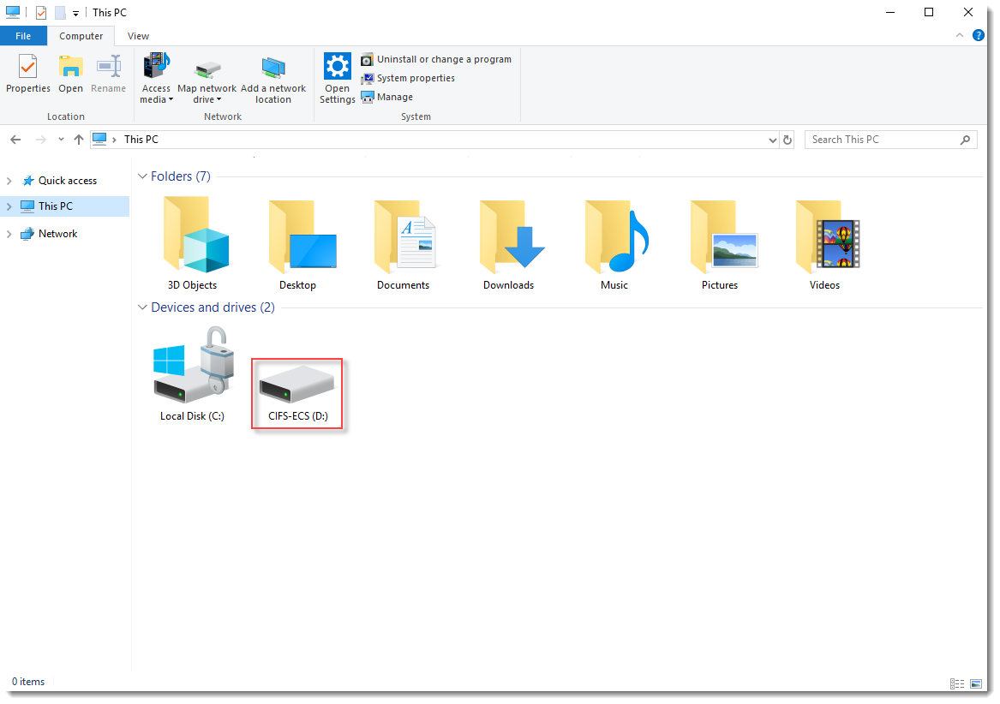
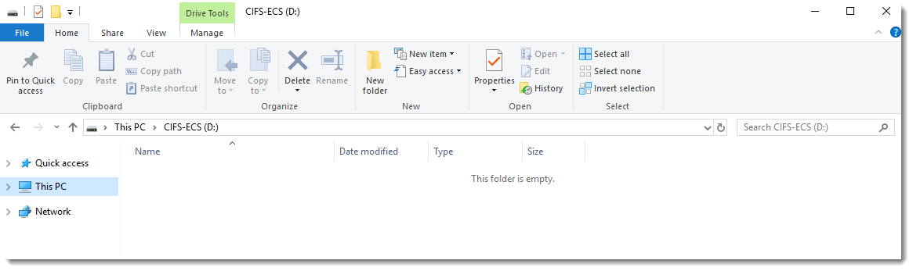

#### UKCloud Limited (“UKC”) and Virtual Infrastructure Group Limited (“VIG”) (together “the Companies”) – in Compulsory Liquidation

On 25 October 2022, the Companies were placed into Liquidation with the Official Receiver appointed as Liquidator and J Robinson and A M Hudson simultaneously appointed as Special Managers to manage the liquidation process on behalf of the Official Receiver.

Further information regarding the Liquidations can be found here: <https://www.gov.uk/government/news/virtual-infrastructure-group-limited-and-ukcloud-limited-information-for-creditors-and-interested-parties>

Contact details: 
For any general queries relating to the Liquidations please email <ukcloud@uk.ey.com> 
For customer related queries please email <ukcloudcustomers@uk.ey.com> 
For supplier related queries please email <ukcloudsuppliers@uk.ey.com>

# How to install Dell EMC GeoDrive

## Overview

Dell EMC GeoDrive (GeoDrive) is a free application that runs on Windows and Windows Server, exposing UKCloud Cloud Storage as file systems. It's designed as an easy way to use object storage by enabling Windows applications to interface with Cloud Storage servers using the popular S3 REST API.

## Use cases

You can use GeoDrive to:

- Expose UKCloud Cloud Storage for native access on Windows through a centralised server with GeoDrive installed on a centralised Windows Server installation

- Present Cloud Storage as storage for applications, without additional development

- Use Cloud Storage as a target for backups or long-term file retention

## Before you begin

GeoDrive offers a single caching option:

**Stub**: files are initially stored locally and replaced with a stub, or shortcut, after a period of time. When you access a file that has been stubbed, it will be retrieved from the cloud. This offers the best scalability, as you can use a virtually unlimited amount of cloud storage.

## Installing GeoDrive

1. Raise a Service Request, using the **Other Service Request** template, to access the GeoDrive installer.

   For more detailed instructions, see [*How to use My Calls to raise and monitor support tickets*](../portal/ptl-how-use-my-calls.md).

2. Extract and run the setup launcher from the ZIP file.

3. Step through the wizard, adjusting values to suit your environment.

   > [!NOTE]
   > The Data Directory is used as a local cache for any content you place in the GeoDrive drive, so you may want to put this on a non-system volume.

4. When the installation is complete, click **Add GeoDrive Drive** to open the *Drive Parameters* page.

5. On the *Drive Parameters* page, select any available drive letter from the drop down menu to use as the GeoDrive drive then click **Next**.

   Optional: give your ECS drive a description.

   

6. On the *Settings* page, click the **Hosts** button to configure the connection to the Cloud Storage service.

7. On the **General** tab, click the **Add** button and configure the settings as shown in the following example:

   - You can find the **User ID** in the *Storage* section of the UKCloud Portal.

   - If you've forgotten or don't know your **Secret Access Key**, you can reset it in the *Storage* section of the Portal.

     > [!NOTE]
     > The **Server Name** and **Description** can be anything, but must not be blank. In the example it is shown as `UKCloud` and `UKCloud - ECS Drive`.

8. From the **Use https or http list**, select **HTTPS**.

   

9. In the **Host name / IP** field input one of the following S3 API endpoints:

   - **Corsham (Assured)**

     - Internet: `cas.cor00005.ukcloud.com`

     - PSN Assured: `cas.cor00005.psnassured.ukcloud.com`

     - HSCN: `cas.cor00005.ukcloud.thirdparty.nhs.uk/`
  
   - **Farnborough (Assured)**

     - Internet: `cas.frn00006.ukcloud.com`

     - PSN Assured: `cas.frn00006.psnassured.ukcloud.com`

     - HSCN: `cas.frn00006.ukcloud.thirdparty.nhs.uk/`

10. Deselect the **Port Override** check box.

11. Click **OK** to return to the *Settings* page.

12. The rest of the fields on the *Settings* page enable you to configure the root directory, encryption and compression settings.

    If not already selected, make sure to select the **Write all files and folders in lower case** check box.

    > [!TIP]
    > Configure the remaining fields appropriately for your environment, or accept the defaults. We suggest you give the root directory a friendlier name, so that you can more easily identify it.

    

13. Click the **Advanced** button to configure various thresholds, such as how long a local file will be retained before being replaced with a stub.

14. Click **Next**  to get to the *Logging* page.

15. Change the settings on the *Logging* page to meet your requirements.

16. Click **Finish** to complete the wizard. GeoDrive connects to Cloud Storage and starts synchronising any content you put on the drive letter you assigned to it.

    

17. You can share the GeoDrive drive, or a folder within it, so that other machines on the network can access it.

    

    

    > [!TIP]
    > See Microsoft's How-To guide on [how to share a a drive on the network from Windows](https://support.microsoft.com/en-gb/help/4092694/windows-10-changes-to-file-sharing-over-a-network).

## Next steps

This guide has shown you how to install and configure GeoDrive for use with Cloud Storage. For more information about how to use the service, see the following articles:

- [*Getting Started Guide for Cloud Storage*](cs-gs.md)

- [*How to view Cloud Storage information in the UKCloud Portal*](cs-how-view-info-portal.md)

- [*How to create a new Cloud Storage user in the UKCloud Portal*](cs-how-create-user.md)

- [*How to use file browsers with Cloud Storage*](cs-how-use-file-browsers.md)

## Related videos

- [*Dell EMC GeoDrive overview video*](cs-vid-geodrive2-client-overview.md)

## Feedback

If you find a problem with this article, click **Improve this Doc** to make the change yourself or raise an [issue](https://github.com/UKCloud/documentation/issues) in GitHub. If you have an idea for how we could improve any of our services, send an email to <feedback@ukcloud.com>.
