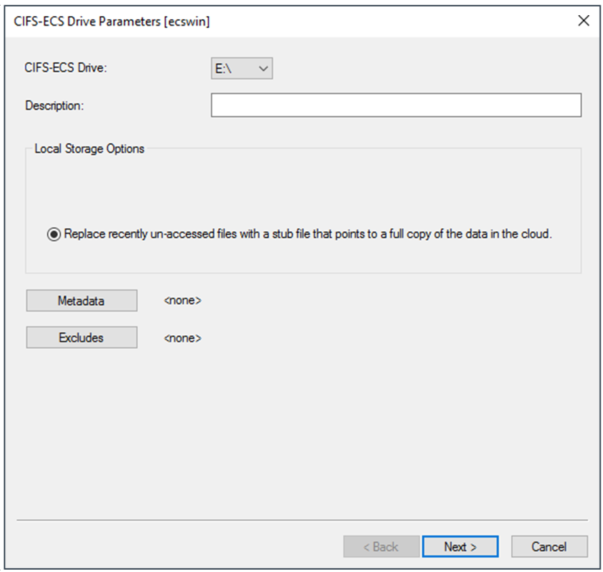
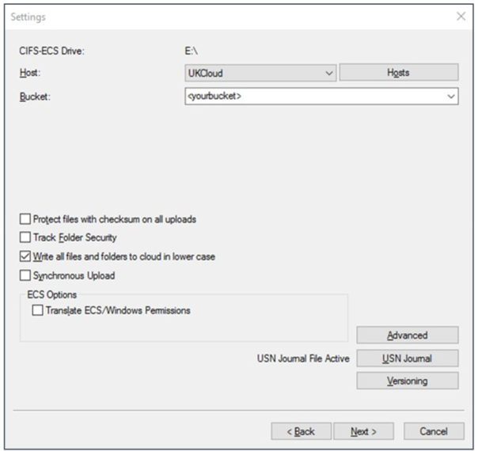

# How to install the GeoDrive Client 2.0

## What is the GeoDrive 2.0 Client?

The GeoDrive 2.0 Client is a free application that runs on Windows and Windows Server, exposing UKCloud Cloud Storage as file systems. It’s designed as an easy way to use object storage by enabling Windows applications to interface with Cloud Storage servers using the popular S3 REST API.

## Use cases

You can use the GeoDrive 2.0 Client to:

- Expose UKCloud Cloud Storage for native access on Windows through a centralised server With the GeoDrive 2.0 Client installed on a centralised Windows Server installation.

- Present Cloud Storage as storage for applications, without additional development.

- Use Cloud Storage as a target for backups or long-term file retention.

## Before you begin

The GeoDrive 2.0 Client offers a single caching option:

**Stub**: files are initially stored locally and replaced with a stub, or shortcut, after a period of time. When you access a file that has been stubbed, it will be retrieved from the cloud. This offers the best scalability, as you can use a virtually unlimited amount of cloud storage.

## Installing the GeoDrive 2.0 Client

1. Navigate to the following URL to download the ZIP file that contains the [The GeoDrive 2.0 Client installer](https://cas.frn00006.ukcloud.com/Docs/Cloud_Storage/GeoDrive.2_x64.zip?AWSAccessKeyId=438-1048-5-aefff7-1&Expires=1598978627&Signature=%2Bz9yC%2F2ZdRVrT7IOH6QG35%2Fm2H8%3D).

2. Extract and run the setup launcher from the ZIP file.

3. Step through the wizard, adjusting values to suit your environment.

    > [!NOTE]
    > The Data Directory is used as a local cache for any content you place in the GeoDrive 2.0 drive, so you may want to put this on a non-system volume.

4. When the installation is complete, click **Add GeoDrive 2.0 Drive** to open the *Drive Parameters* page.

5. On the *Drive Parameters* page, select any available drive letter from the drop down menu to use as the GeoDrive 2.0 drive then click **Next**.

    Optional: give your ECS drive a description.

    

6. On the *Settings* page, click the **Hosts** button to configure the connection to the Cloud Storage service.

7. On the **General** tab, click the **Add** button and configure the settings as shown in the following example:

    - You can find the **User ID** in the *Storage* section of the UKCloud Portal.

    - If you’ve forgotten or don’t know your **Secret Access Key**, you can reset it in the *Storage* section of the Portal.

        > [!NOTE]
        > The **Server Name** and **Description** can be anything, but must not be blank. In the example it is shown as `UKCloud` and `UKCloud - ECS Drive`.

8. From the **Use https or http list**, select **HTTPS**.

    

9. In the **Host name / IP** field input one of the following S3 API endpoints:

    - **Corsham (Assured)**

        - Internet: `cas.cor00005.ukcloud.com`

        - PSN Assured: `cas.cor00005.psnassured.ukcloud.com`

        - HSCN: `cas.cor00005.ukcloud.thirdparty.nhs.uk/`
  

    - **Farnborough (Assured)**

        - Internet: `cas.frn00006.ukcloud.com`

        - PSN Assured: `cas.frn00006.psnassured.ukcloud.com`

        - HSCN: `cas.frn00006.ukcloud.thirdparty.nhs.uk/`

10. Deselect the **Port Override** check box.

11. Click **OK** to return to the *Settings* page.

12. The rest of the fields on the *Settings* page enable you to configure the root directory, encryption and compression settings.

    If not already selected, make sure to select the **Write all files and folders in lower case** check box.

    > [!TIP]
    > Configure the remaining fields appropriately for your environment, or accept the defaults. We suggest you give the root directory a friendlier name, so that you can more easily identify it.

    

13. Click the **Advanced** button to configure various thresholds, such as how long a local file will be retained before being replaced with a stub.

14. Click **Next**  to get to the *Logging* page.

15. Change the settings on the *Logging* page to meet your requirements.

16. Click **Finish** to complete the wizard. The GeoDrive 2.0 connects to Cloud Storage and starts synchronising any content you put on the drive letter you assigned to it.

    

17. You can share the GeoDrive 2.0 drive, or a folder within it, so that other machines on the network can access it.

    &nbsp;| |
    ------|-----------------|
     |

    > [!TIP]
    > See Microsoft's How-To guide on [how to share a a drive on the network from Windows](https://support.microsoft.com/en-gb/help/4092694/windows-10-changes-to-file-sharing-over-a-network).

## Next steps

This guide has shown you how to install and configure the GeoDrive Client 2.0 for use with Cloud Storage. For more information about how to use the service, see the following articles:

- [*Getting Started Guide for Cloud Storage*](cs-gs.md)

- [*How to view Cloud Storage information in the UKCloud Portal*](cs-how-view-info-portal.md)

- [*How to create a new Cloud Storage user in the UKCloud Portal*](cs-how-create-user.md)

- [*How to use file browsers with Cloud Storage*](cs-how-use-file-browsers.md)

## Related videos

- [*GeoDrive 2.0 overview video*](cs-vid-geodrive2-client-overview.md)

## Feedback

If you find an issue with this article, click **Improve this Doc** to suggest a change. If you have an idea for how we could improve any of our services, visit the [Ideas](https://community.ukcloud.com/ideas) section of the [UKCloud Community](https://community.ukcloud.com).
